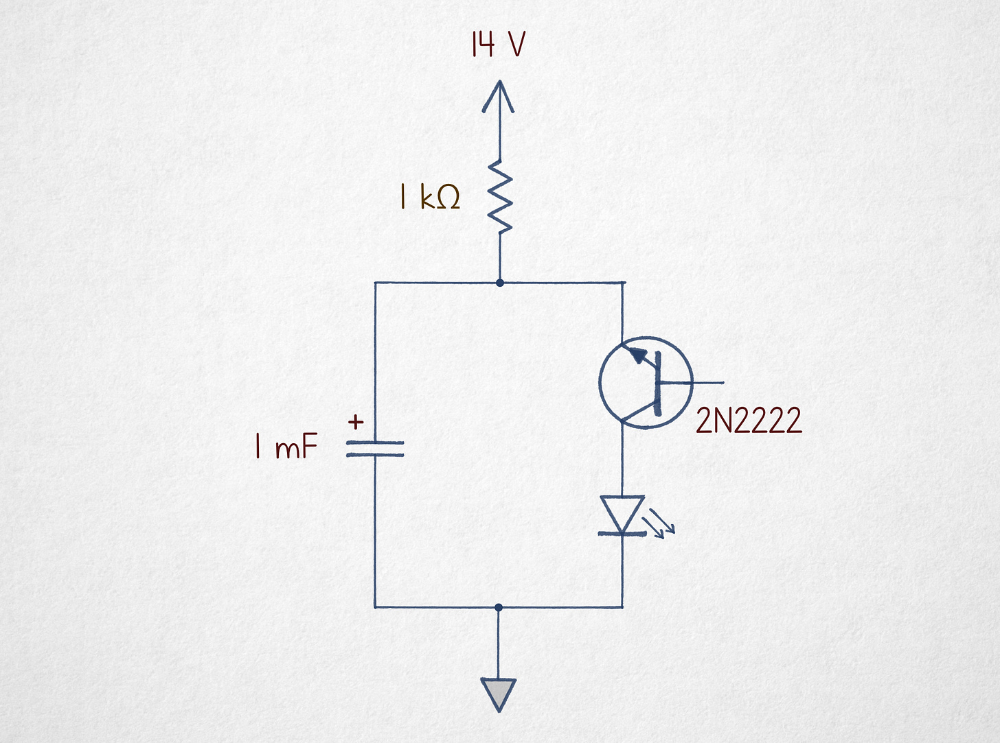
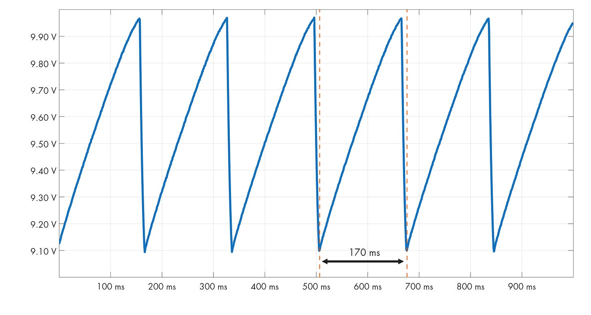
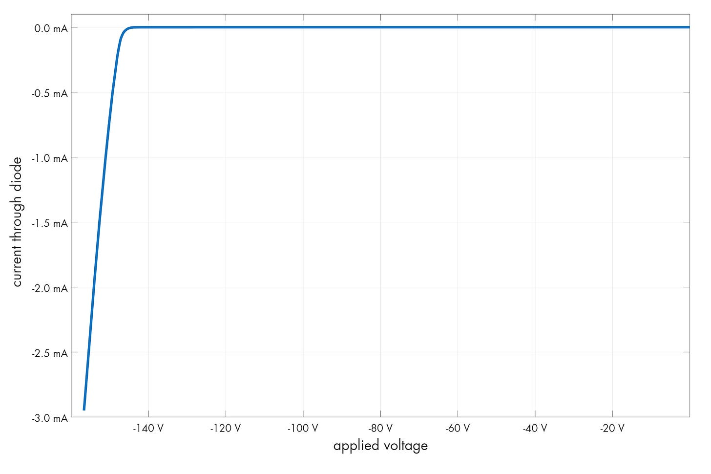
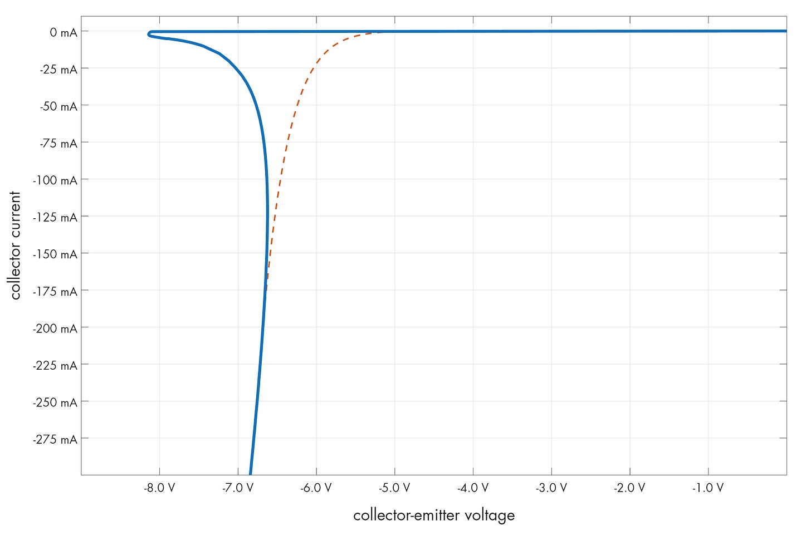

---
authors:
- aitoboxrobot
categories:
- 工具教程
date: 2026-08-21
hide:
- navigation
tags:
- 硬件设计
- 模拟电路
- 晶体管
- 负阻现象
title: '被诅咒的电路 #6：反向雪崩振荡器'
---
### 文章背景与核心概要
本文探讨了一种违背标准设计常规的反直觉振荡器电路。通过将 NPN 晶体管置于“上下颠倒”的配置中并使基极悬空，该电路巧妙地利用了发射结的**雪崩击穿**（avalanche breakdown）现象。尽管它效率低下且极其不稳定，但它却生动展示了半导体在标准教科书通常忽略的区域中的物理行为。

通过本文，读者将了解反向雪崩振荡器的工作原理、半导体结的击穿物理学，以及晶体管在特定反向配置下表现出的负电阻特性。这种电路虽然在实际工程中很少应用，但它为理解半导体器件的深层特性提供了一个绝佳的趣味实验视角。

---

### 令人困惑的电路 (The Puzzling Circuit)

乍一看，这个电路似乎无法工作：晶体管是倒置的，且基极处于断开状态。然而，当向其提供 14–20 V 的电压时，它成功驱动了一个 LED 闪烁。

> At first glance, this circuit appears non-functional: the transistor is inverted, and the base terminal is left disconnected. Yet, when supplied with 14–20 V, it successfully drives an LED to blink.

当你监测电容器时，会观察到它充电至大约 10 V，然后迅速将电荷释放降至 9.1 V，从而产生有规律的振荡。

> When monitoring the capacitor, you will observe it charging to approximately 10 V before rapidly dumping its charge down to 9.1 V, creating a rhythmic oscillation.

---

### 击穿物理学 (The Physics of Breakdown)

要理解为什么这个电路能工作，我们必须研究半导体PN结。在标准的的反向偏置二极管中，耗尽层可以阻止电流流动。然而，如果电压足够高，静电场就会变得足够强大，从而将电子撞击到导带中——这就是“雪崩”效应。

> To understand why this works, we must look at semiconductor junctions. In a standard reverse-biased diode, the depletion layer prevents current flow. However, if the voltage is high enough, the electrostatic field becomes strong enough to knock electrons into the conduction band—an "avalanche" effect.

在 NPN 晶体管中，发射极的掺杂浓度 ($n++$) 比集电极更高。这使得发射结的耗尽区更薄、更容易被击穿。虽然 2N2222 晶体管的集电极-基极击穿电压约为 50 V，但当晶体管反向连接时，发射极-集电极的击穿电压略高于 8 V。

> In an NPN transistor, the emitter is more heavily doped ($n++$) than the collector. This makes the emitter-base junction's depletion region thinner and easier to disrupt. While a 2N2222 transistor has a collector-base breakdown of ~50 V, the emitter-collector breakdown occurs at just over 8 V when the transistor is inverted.

---

### 为什么它会振荡 (Why It Oscillates)

该电路之所以能够振荡，是因为晶体管在这种配置下具有独特的伏安（V-I）曲线。与标准二极管不同，一旦跨越雪崩阈值，该晶体管就会表现出“负电阻”特性。

> The circuit oscillates because of the unique V-I curve of the transistor in this configuration. Unlike a standard diode, the transistor exhibits a "negative resistance" characteristic once the avalanche threshold is crossed.

1. **充电 (Charging)：** 电容器通过 1 kΩ 的电阻充电。
2. **雪崩 (Avalanche)：** 一旦电压达到“峰值”（约 8.2 V），PN结就会导通。
3. **放电 (Discharge)：** 电流急剧飙升，将电容器的能量倾倒到 LED 中。
4. **截止 (Cut-off)：** 随着电容器电压下降，它最终到达一个无法维持雪崩电流的点，导致晶体管瞬间恢复到非导通状态。

> 1. **Charging:** The capacitor charges through the 1 kΩ resistor.
> 2. **Avalanche:** Once the voltage hits the "hump" (approx. 8.2 V), the junction becomes conductive.
> 3. **Discharge:** The current skyrockets, dumping the capacitor's energy into the LED.
> 4. **Cut-off:** As the capacitor voltage drops, it eventually reaches a point where it can no longer sustain the avalanche current, causing the transistor to snap back into a non-conductive state.

这种行为与经典的**氖灯振荡器**非常相似，后者同样需要“触发”电压来电离气体，然后才能在较低的电压下保持导通。

> This behavior is remarkably similar to the classic **neon lamp oscillator**, which also requires a "striking" voltage to ionize gas before maintaining conduction at a lower voltage.

---

### 结论 (Conclusion)

尽管这个电路由于效率低下、高电压需求和较差的稳定性，客观上来说是一个“糟糕”的电路，但它是一个极好的提醒，表明半导体是极其复杂的器件。它利用了标准电子学文献中很少讨论的 V-I 曲线区段。

> While this circuit is objectively "terrible" due to its inefficiency, high voltage requirements, and poor stability, it is a brilliant reminder that semiconductors are complex devices. It utilizes a portion of the V-I curve that is rarely discussed in standard electronics literature.

***

*系列中的其他文章：*

> *Some other articles in the series:*

*我经常撰写关于电子学、[数学基础](https://lcamtuf.substack.com/p/monkeys-typewriters-and-busy-beavers)、[技术史](https://lcamtuf.substack.com/p/a-brief-history-of-counting-stuff)以及其他极客兴趣的文章。如果你喜欢，请订阅。*

> *I write about electronics, [the foundations of mathematics](https://lcamtuf.substack.com/p/monkeys-typewriters-and-busy-beavers), [the history of technology](https://lcamtuf.substack.com/p/a-brief-history-of-counting-stuff), and other geek interests. If you like it, please subscribe.*

[立即订阅 (Subscribe now)](https://blog.coredump.cx/subscribe?)