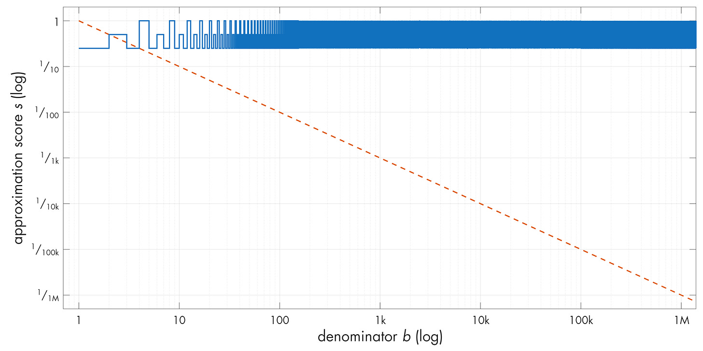
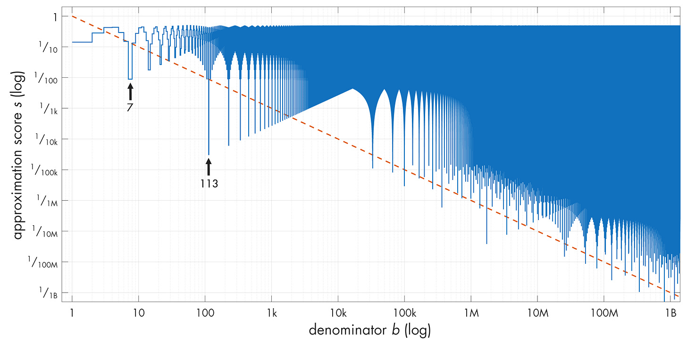
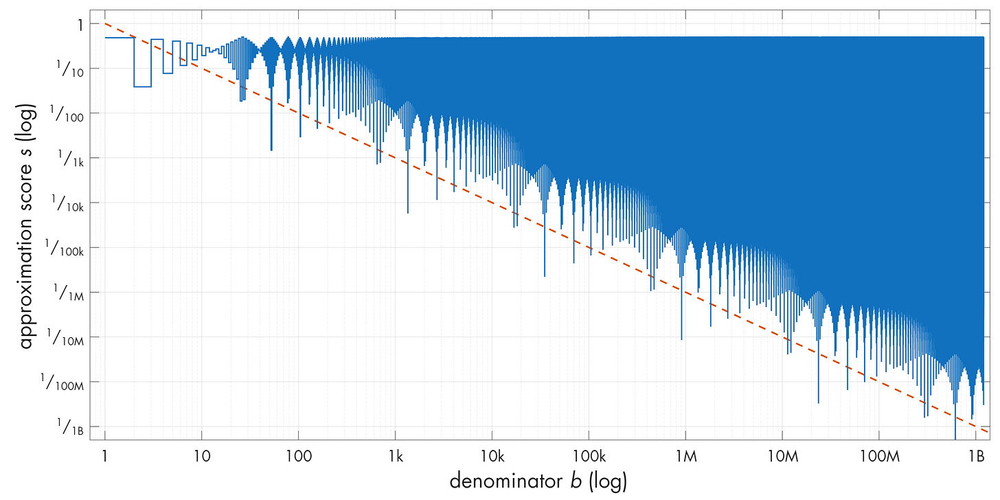

---
authors:
- aitoboxrobot
categories:
- 研究解读
date: 2026-08-21
hide:
- navigation
tags:
- 数学
- 数论
- 有理数
- 无理数
- 丢番图逼近
title: 逼近游戏：有理数与无理数
---
### 文章背景与核心概要
本文探讨了使用有理分数 ($a/b$) 逼近实数的反直觉数学现象。通过数值实验和直观的证明，文章研究了有理数和无理数究竟哪一个更容易被逼近。研究结果揭示了一个令人惊叹的悖论：有理数（如分数）反而出人意料地难以用其他有理数进行良好逼近，而无理数（如 $\pi$ 或 $\sqrt{42}$）却能产生源源不断、意想不到的精确逼近。

这一现象为我们理解数轴上有理数与无理数之间深层的结构差异提供了一个窗口，这也是数论中“丢番图逼近”（Diophantine approximations）领域的核心主题。文章深入浅出地介绍了狄利克雷逼近定理（Dirichlet's approximation theorem）及鸽笼原理的应用，剖析了这种数学行为背后的深层原因。

---

## 引言

在早期关于实数的本质和无穷大含义的讨论中，底层理论往往显得异常抽象——仿佛是与现实没有任何明显联系的虚构世界。

今天的文章将探讨一个酷炫的反例：一个由简单证明支持的数值实验，只有当你考虑到实数和有理数的根本构造时，它才变得合乎逻辑。

这个游戏很简单：
1. 选择一个实数 $r$（我们将坚持使用正数 $r$ 和正分母 $b$）。
2. 你的任务是使用具有合理小分母的有理分数 $a/b$ 尽可能接近地逼近 $r$。
3. 逼近值不能精确等于 $r$。

如果 $r$ 是有理数或无理数，这项任务会更容易吗？猜一猜，让我们深入探讨。

> In earlier discussions on the nature of real numbers and the meanings of infinity, the underlying theories often felt hopelessly abstract—like make-bye worlds with no discernible connection to reality. 
> 
> Today’s post examines a cool counterexample: a numerical experiment backed up by simple proofs that only makes sense when you consider the fundamental construction of real and rational numbers.
> 
> The game is simple:
> 1. Pick a real number $r$ (we will stick to positive $r$ and positive denominators $b$).
> 2. Your job is to approximate $r$ as closely as possible using a rational fraction $a/b$ with a reasonably small denominator.
> 3. The approximation cannot be exactly equal to $r$.
> 
> Is this task easier if $r$ is rational or irrational? Make a guess, and let's dive in.

---

## 定义“好的”逼近

对于所选的分母 $b$，我们可以通过寻找最大的“偏小”分数 ($a/b < r$) 和最小的“偏大”分数 ($a/b > r$) 来找到最接近 $r$ 的 $a$ 值。

如果我们想要精确匹配，我们可以尝试 $a_{\text{ideal}} = r \cdot b$。然而，由于规则禁止精确匹配，我们调整了公式：
* **最优偏小逼近 ($a/b < r$)：**
  $$a_{\text{low}} = \lceil r \cdot b \rceil - 1$$
* **最优偏大逼近 ($a/b > r$)：**
  $$a_{\text{high}} = \lfloor r \cdot b \rfloor + 1$$

任何 $a/b$ 关联的误差 ($\varepsilon$) 计算如下：
$$\varepsilon = \left| r - \frac{a}{b} \right|$$

对于最优的偏小或偏大估计，误差不能超过 $\pm 1/b$。我们将满足 $\varepsilon < 1/b$ 的任何逼近定义为 **1-good**（1-良好）。为了使结果与分母无关并保持归一化，我们使用逼近得分 $s$：
$$s = \varepsilon \cdot b$$
一个 1-good 的逼近对应于 $s < 1$。

> For a chosen denominator $b$, we can find the value of $a$ closest to $r$ by looking at the largest "low-side" fraction ($a/b < r$) and the smallest "high-side" fraction ($a/b > r$). 
> 
> If we wanted an exact match, we could try $a_{\text{ideal}} = r \cdot b$. However, since exact matches are forbidden by the rules, we adjust our formulas:
> * **Optimal low-side approximation ($a/b < r$):**
>   $$a_{\text{low}} = \lceil r \cdot b \rceil - 1$$
> * **Optimal high-side approximation ($a/b > r$):**
>   $$a_{\text{high}} = \lfloor r \cdot b \rfloor + 1$$
> 
> The error ($\varepsilon$) associated with any $a/b$ is calculated as:
> $$\varepsilon = \left| r - \frac{a}{b} \right|$$
> 
> For optimal low or high estimations, the error cannot exceed $\pm 1/b$. We define any approximation satisfying $\varepsilon < 1/b$ as **1-good**. To keep things normalized regardless of the denominator, we use an approximation score $s$:
> $$s = \varepsilon \cdot b$$
> A 1-good approximation corresponds to $s < 1$.

---

## 有理数测试用例

让我们在各种初始 $b$ 值下测试 $r = 1/4$。虽然许多逼近是 1-good 的（$s < 1$），但结果通常并不令人兴奋：这些值以重复的模式在 $1/b$ 的基准线附近徘徊。

如果我们绘制随分母的**平方**递减的误差值（$1/b^2$），我们可以将低于此线的解标记为 **2-good**（2-良好）。

对于有理数 $r = p/q$，我们可以从数学上证明 2-good 的逼近不可能持续。通过对 2-good 标准（$\varepsilon < 1/b^2$）进行代数运算，除非 $b < q$，否则我们会得出矛盾。

**底线：** 有理数很难用其他有理数来逼近。数字越简单，我们得到的优质逼近就越少。

> Let’s test $r = 1/4$ across various initial values of $b$. While many approximations are 1-good ($s < 1$), the results are generally underwhelming: the values hover around the $1/b$ baseline in repeating patterns. 
> 
> 
> 
> If we plot error values decreasing with the *square* of the denominator ($1/b^2$), we can label solutions dipping below this line as **2-good**. 
> 
> For a rational number $r = p/q$, we can mathematically prove that 2-good approximations cannot last. Through algebraic manipulation of the 2-goodness criteria ($\varepsilon < 1/b^2$), we arrive at a contradiction unless $b < q$. 
> 
> **The Bottom Line:** Rational numbers are difficult to approximate using other rationals. The simpler the number, the fewer good approximations we get.

---

## 逼近无理数

鉴于有理数对逼近的顽强抵抗，你可能会期望无理数表现得更差。然而，看看 $r = \pi$ 的逼近图：

注意到图表如何反复跌落到 2-good 线以下，呈现出诸如 $22/7 \approx 3.143$（$s \approx 0.009$）和 $355/113 \approx 3.141593$（$s \approx 0.00003$）这样极佳的逼近。这种行为并非 $\pi$ 所独有；它也出现在其他无理数中，例如 $\sqrt{42}$：

### 狄利克雷逼近定理

为了理解为什么会发生这种情况，我们可以使用**鸽巢原理**（抽屉原理）：
1. 将数字 $r$ 拆分为整数部分 $v$ 和小数余数 $x \in [0, 1)$。
2. 计算 $0$ 到 $K$ 之间的 $k \cdot r$，产生一系列小数部分。
3. 将区间 $[0, 1)$ 分割为 $K$ 个相等的“桶”。
4. 因为我们在 $K$ 个桶中分布了 $K+1$ 个小数值，所以至少有两个小数值（$x_g$ 和 $x_h$）必须落在同一个桶中，从而使它们的距离在 $1/K$ 以内。

通过替换并定义新的整数 $a = v_h - v_g$ 和 $b = h - g$，这种关系证明了对于*任何*实数 $r$，都存在一个满足以下条件的分数 $a/b$：
$$\varepsilon < \frac{1}{b^2}$$

这就是著名的**狄利克雷逼近定理**。对于无理数，由于 $r \cdot b$ 永远不可能等于一个整洁的分数，因此用更大的 $K$ 值重复此过程会产生**源源不断**的、越来越好的 2-good 逼近。然而，对于有理数，一旦达到精确匹配，该过程就会触及硬底限，从而限制了有效的非精确逼近的数量。

> Given how resistant rationals are to approximations, you might expect irrationals to be even worse. Yet, look at the approximation plot for $r = \pi$:
> 
> 
> 
> Notice how the plot repeatedly dips below the 2-good line, featuring stellar approximations like $22/7 \approx 3.143$ ($s \approx 0.009$) and $355/113 \approx 3.141593$ ($s \approx 0.00003$). This behavior is not unique to $\pi$; it appears across other irrationals, such as $\sqrt{42}$:
> 
> 
> 
> ### Dirichlet’s Approximation Theorem
> 
> To understand why this happens, we can use the **pigeonhole principle**:
> 1. Split a number $r$ into an integer part $v$ and a fractional remainder $x \in [0, 1)$.
> 2. Calculate $k \cdot r$ for $k$ between $0$ and $K$, generating a sequence of fractional parts.
> 3. Divide the interval $[0, 1)$ into $K$ equal "buckets."
> 4. Because we have $K+1$ fractional values distributed across $K$ buckets, at least two fractional values ($x_g$ and $x_h$) must land in the same bucket, placing them within $1/K$ of each other.
> 
> By substituting and defining new integers $a = v_h - v_g$ and $b = h - g$, this relationship proves that for *any* real number $r$, there exists a rational fraction $a/b$ satisfying:
> $$\varepsilon < \frac{1}{b^2}$$
> 
> This is known as **Dirichlet’s approximation theorem**. For irrational numbers, because $r \cdot b$ can never equal a neat fraction, repeating this process with larger values of $K$ yields an **infinite supply** of increasingly better 2-good approximations. For rationals, however, the process hits a hard floor once it reaches exact matches, limiting the number of valid inexact approximations.

---

## 为什么会这样？

证明告诉我们*发生了什么*，但直觉归结为实数和有理数的构造方式。

有理数在任何给定的放大级别（$b$）下将连续统划分为统一的区间。因为它们是均匀间隔的，所以它们也是尽可能*相距最远*的；放置在数轴上的任何新值都不可避免地会靠近现有的有理数。有理数之间的“间隙”由无理数填补，在其附近为我们提供了取之不尽、用之不竭的意想不到的准确有理逼近源泉。

虽然这个游戏看起来很简单，但对这些结构的研究——被称为**丢番图逼近**——变得非常复杂。数学家们继续探索不同类别的数字可以被逼近的极限，这一追求在历史上一直伴随着数学最高水平的突破性洞见。

> Why Does This Happen?
> 
> Proofs tell us *what* happens, but the intuition comes down to how real and rational numbers are constructed. 
> 
> Rational numbers divide the continuum into uniform intervals at any given magnification level ($b$). Because they are uniformly spaced, they are also as *far apart* as they can be; any new value placed on the number line will inevitably sit close to an existing rational. The "gaps" between rational numbers are filled by irrationals, providing an inexhaustible supply of unexpectedly accurate rational approximations in their vicinity.
> 
> While this game might seem simple, the study of these structures—known as **Diophantine approximations**—gets complex very quickly. Mathematicians continue to explore the limits of how well different classes of numbers can be approximated, a pursuit that has historically rewarded breakthrough insights at the highest levels of mathematics.

---

*如果你喜欢这篇关于数学和算法的文章，请考虑浏览更多关于极客文化和电子设计的深度好文，并[订阅博客](https://blog.coredump.cx/subscribe?)。*

> *If you enjoyed this article on math and algorithms, consider exploring more well-researched pieces on geek culture and electronic design, and [subscribe to the blog](https://blog.coredump.cx/subscribe?).*