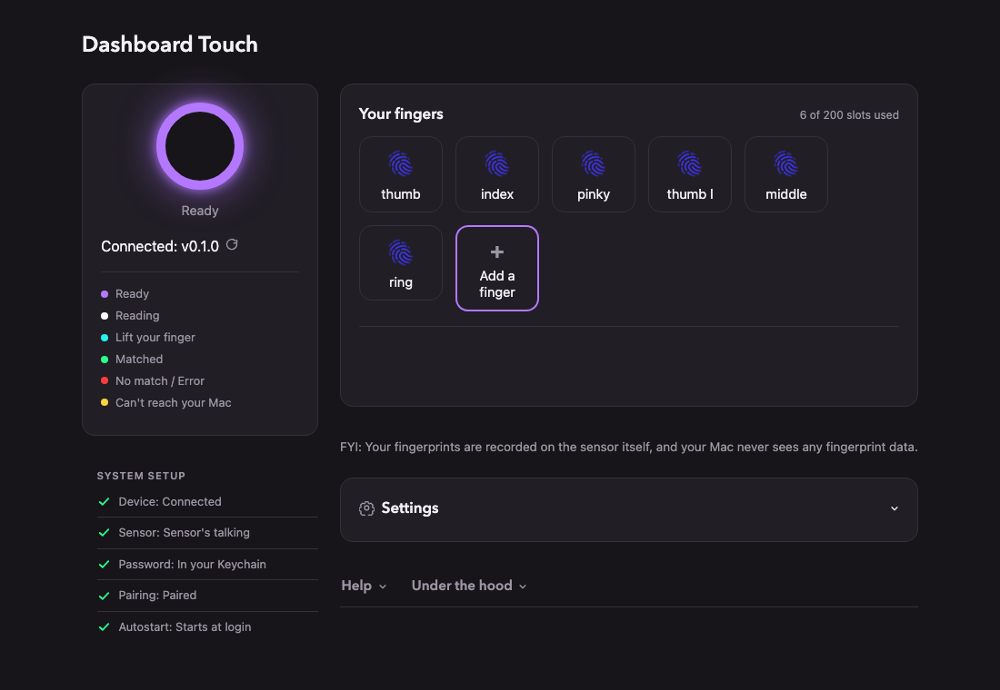

---
authors:
- aitoboxrobot
categories:
- 工具教程
date: 2026-08-22
hide:
- navigation
tags:
- Touch ID
- 机械键盘
- 开源硬件
- macOS
- DIY
title: 介绍 Dashboard Touch：打造你自己的 Touch ID 替代方案
---
### 文章背景与核心概要
长期以来，许多机械键盘爱好者一直在寻找一种既能保留心仪键盘手感、又能享受 Mac Touch ID 指纹解锁便利的方案，但苹果官方生态的封闭性让这一需求难以实现。为此，开源项目 Dashboard Touch 应运而生。它基于 Zimeng Xiong 的优秀项目 tinyTouch 进行了深度重构，允许用户使用低成本的现成硬件，自行组装一个专属于 Mac 的独立指纹传感器。

该项目不仅具备友好的本地网页管理界面，支持自定义呼吸灯颜色及指纹录入，还在技术实现上巧妙地将指纹验证转化为安全的键盘输入模拟。文章记录了作者从硬件焊接、固件配置到木工外壳制作的完整 DIY 历程，旨在通过这个充满极客乐趣的开源项目，重燃独立制作与分享技术玩物的极客精神。

---

# 介绍 Dashboard Touch：打造你自己的 Touch ID 替代方案

> **摘要：** 厌倦了为了在喜爱的机械键盘上使用 Touch ID 而被束缚在苹果的专有键盘里吗？**Dashboard Touch** 是一个全新的开源项目，它允许你使用现成的零件为你的 Mac 构建自己的定制、低成本指纹传感器，并配有友好的本地网页界面以及令人满意的触觉工作流程。

> **Dashboard Touch:** Tired of being locked into Apple’s proprietary keyboards just to use Touch ID with your favorite mechanical keyboard? **Dashboard Touch** is a new open-source project that lets you build your own custom, low-cost fingerprint sensor for your Mac using off-the-shelf parts, complete with a friendly local web interface and a satisfying tactile workflow.

---

多年来，我一直渴望为我的 Mac 提供一个独立版本的苹果 Touch ID 身份验证功能，同时又不必使用苹果的键盘。（我通常挺喜欢他们的键盘，但我如今日常主力使用的是一把声音清脆的大型机械键盘。）我曾尝试过各种替代方案，甚至关注过那些拆解昂贵的苹果键盘以回收其 Touch ID 传感器的做法，但没有一种能完美解决问题。

> For years, I’ve wanted to have a standalone version of Apple’s Touch ID authentication feature for my Mac, but without having to use an Apple keyboard. (I generally like their keyboards, but my daily driver keyboard these days is a big clicky mechanical beast.) I’d gone down various dead ends of trying to find substitutes, and even checked out the efforts where people had ripped apart expensive Apple keyboards just to scavenge the Touch ID sensors out of them. None of them quite solved the problem.

<iframe src="https://www.youtube-nocookie.com/embed/8zXN-JzjkgY" frameborder="0" allowfullscreen="" sandbox="allow-scripts allow-same-origin allow-popups allow-popups-to-escape-sandbox" loading="lazy" referrerpolicy="strict-origin-when-cross-origin"></iframe>

因此，今天我分享一个名为 [Dashboard Touch](https://anildash.com/projects/dashboard-touch/) 的开源项目，它能让你使用低成本的现成零件，为你的 Mac 制作专属的 Touch ID 风格传感器。它基于对 Zimeng Xiong 优秀的 [tinyTouch](https://github.com/ZimengXiong/tinyTouch) 项目的大规模重构。Zimeng Xiong 最近刚刚攻克了如何打造一个既实用、又对普通 Mac 用户而言具备合理安全性的指纹扫描系统。（如果你对这类东西感兴趣，绝对应该去看看他的项目并支持他的新硬件构建。）

> So today, I’m sharing an open source project called [Dashboard Touch](https://anildash.com/projects/dashboard-touch/), which lets you make your own Touch ID-style sensor for your Mac, using low-cost off-the-shelf part. It’s based on an extensive refactoring of the excellent [tinyTouch](https://github.com/ZimengXiong/tinyTouch) project by Zimeng Xiong, who recently cracked the code on how to make a useful fingerprint scanner system that’s also reasonably secure for regular Mac users. (You should definitely check out his project and support his new hardware build if you’re interested in this stuff.)

我采用了自己的方法来实现这项工作，因为我想专注于提供一个友好的网页界面，以便精确配置指纹传感器系统在计算机上的工作方式。当你设置好 Dashboard Touch 后，它会提供一个直接在你的 Mac 上运行的漂亮网页界面，让你能够执行诸如设置指纹传感器环形灯颜色、或者录入指纹并将其记录到系统中的操作。

> I took my own approach to this work because I wanted to focus a lot on having a friendly web interface for configuring exactly how the fingerprint sensor system works on your computer. When you get Dashboard Touch set up, it presents you with a nice web interface that runs right on your own Mac, letting you do things like set the color of the ring light on the fingerprint sensor, or capture your fingerprints so they’re recorded in the system.

## 工作原理 (How It Works)

在幕后，该系统的工作原理极其简单。你购买一个小型的指纹传感器和一个小型微控制器，将它们连线（重新拾起焊接的活儿其实挺有意思的！），然后用一根普通的 USB 线将它们插到你的电脑上。运行安装脚本后，你只需访问网页界面并将你的手指添加到系统中即可。

> Behind the scenes, the way the system works couldn’t be simpler. You buy a little fingerprint sensor, and a small microcontroller, wire them together (it was actually fun to get back to soldering stuff!), and then plug them into your computer with a regular USB cable. After you run the setup script, you just go to the web interface and add your finger(s) to the system.

> 

一旦运行起来，你的 Mac 就会像往常一样工作，唯一的区别是：每当系统提示你输入密码时，你只需在传感器上刷一下指纹，Dashboard Touch 就会为你键入密码。在技术层面上，该设备实际上在字面意义上伪装成了一个键盘。（你可以浏览 [GitHub 上的代码](https://github.com/anildash/dashtouch)，很快就能领会这种方法。）

> Once you’re running, your Mac runs as normal, except any time the system prompts you to type in your password, you can just swipe your fingertip on the sensor and Dashboard Touch will type your password in for you. At a technical level, the device is actually literally pretending to be a keyboard. (You can look over the [code on GitHub](https://github.com/anildash/dashtouch) and get a feel for the approach pretty quickly.)

安装完成后，它基本上是一个“设置后即可忘掉”的东西。你不需要做任何其他事情就能让它“直接运行”。你的密码仅安全存储在你的 Mac 上，而你的指纹仅安全存储在你的传感器上。你可以随时擦除它们，并且除了一个手动更新检查器外，没有任何东西会连接到互联网——只有当你故意点击按钮请求它时，它才会检查是否有新版本的 Dashboard Touch。

> After it’s installed, it’s basically a set-it-and-forget-it kind of thing. You don’t need to do anything else for it to Just Work. Your password is only ever stored securely on your Mac, and your fingerprints are only ever stored securely on your sensor. You can erase them at any time and nothing talks to the internet at all except the one manual update checker, where you can see if there’s a new version of Dashboard Touch, but only when you intentionally click the button to request it to do so.

总的来说，如果你是在保护一个银行金库，这绝对不是你应该使用的系统；但如果你的计算机在物理上是安全的，并且没有人会在未经你允许的情况下对你的 Dashboard Touch 设置进行长时间的无监督访问，那么它就完全没问题。

> Overall, this isn’t the kind of system you should use if you’re protecting a bank vault, but if your computer is physically secure and nobody is going to have extended unsupervised access to your Dashboard Touch setup without your permission, you should be fine.

## 动手即快乐，告别无聊 (Dash, Not Bored)

就我个人而言，重新开始动手制造东西真的非常有趣。正如你在我的介绍视频中所看到的，我最终在木工车间里为我的指纹传感器制作了一个外壳，好让它与我最近打造的书桌相匹配。甚至连创作和剪辑介绍视频也是一个有趣的项目，它把我拉出了平时的舒适区。

> Personally, it’s been really fun to get back to making things. As you can see in my introductory video, I ended up creating an enclosure for my fingerprint sensor in my woodshop, so that it would match my desk that I recently built. Even creating and editing the intro video was a fun project that took me out of my usual comfort zone.

这个项目中的几乎每个任务都让我不得不去尝试那些我相当不擅长的事情，从固件编写、安全审查到精细的木工和视频剪辑。但我就是喜欢把东西重新发布出去让大家去魔改的这种感觉，而且在经历了多年必须团队协作的工作之后，能够对某个东西的设计和用户界面拥有极其主观的掌控力，也是一件非常令人满足的事。（尽管我合作的总是才华横溢的人，但能够亲自挑选每一个像素的感觉是完全不同的！）

> Nearly every task in this project has had me stretching to do things that I’m pretty bad at, from firmware coding to security review to detailed carpentry to video editing. But I just love the idea of putting things out there again for people to hack on, and there's also something really satisfying about being able to be super-opinionated about the design and user interface of something after so many years of working on teams where I had to collaborate. (Even though I always got to collaborate with brilliant people, it's different when you get to pick every pixel!)

此外，我也一直在怀念互联网的那个时代——当时我在网上看到的大多数内容都是普通人制作的古怪而有趣的东西。我意识到，除非我投入自己的精力去亲自建造一些这样的东西，否则我无法哀叹这类项目的缺失。所以，这就是一个！让我知道你的想法，以及你是否有任何关于如何让这个东西变得更好的想法。当然，如果你发现了任何需要我修复的漏洞，也请告诉我。

> I just also have been missing the era of the web when most of what I saw online was weird and fun things that regular people were building, and I realized that I can't mourn the absence of those kinds of projects unless I invest my own energy into building some of those kinds of things myself. So, here's one! Let me know what you think, and if you've got any ideas for how to make this thing better. Or, of course, if you find any bugs that I should fix.

希望你在触摸闪烁的灯光时玩得开心！

> I hope you have fun touching the blinking lights!