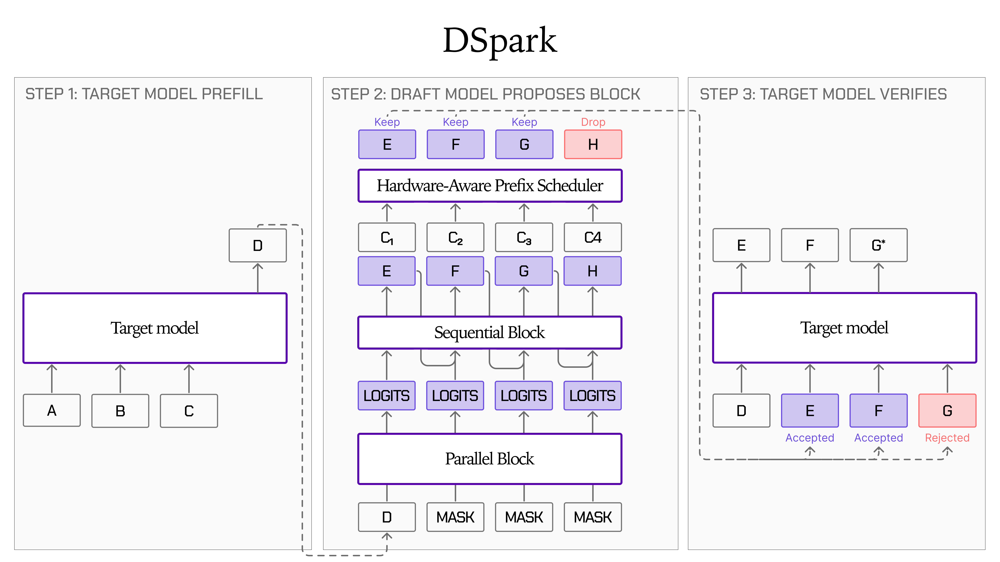
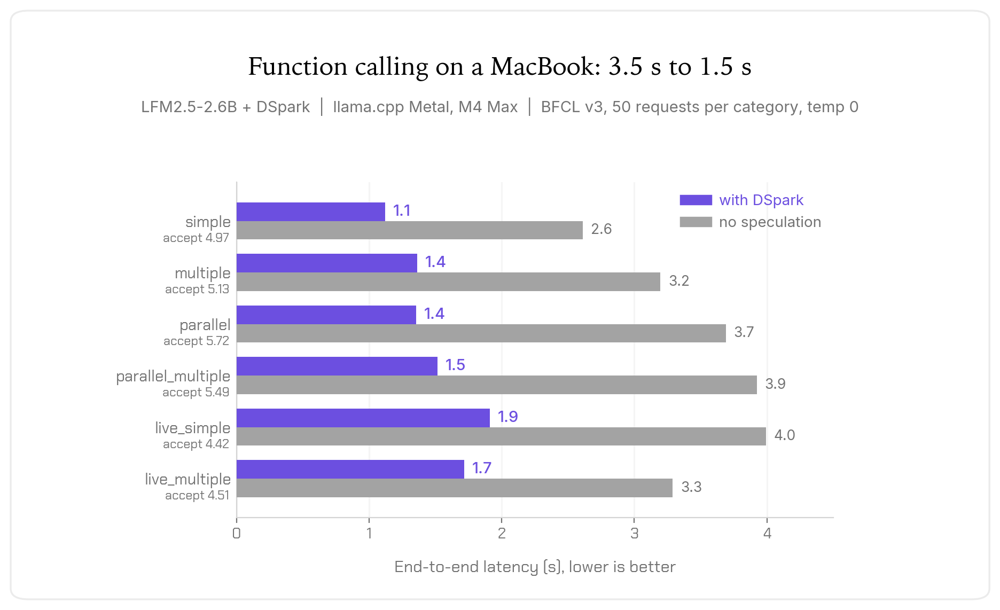

---
authors:
- aitoboxrobot
categories:
- 产品发布
date: 2026-08-22
hide:
- navigation
tags:
- Liquid AI
- 投机解码
- 大模型推理
- llama.cpp
- SGLang
title: 使用 LFM2.5-DSpark 实现高达 3.2 倍的推理加速
---
### 文章背景与核心概要
Liquid AI 近期发布了针对 LFM2.5 模型家族中三个模型（`LFM2.5-1.2B-Instruct`、`LFM2.5-2.6B` 以及 `LFM2.5-8B-A1B`）的 **DSpark 草稿模型检查点（checkpoint）**。这些检查点引入了一种创新的投机解码路径，在保持严格输出质量不变的前提下，以极小的内存开销实现了显著的解码加速。

该技术的核心在于结合了 DFlash 风格的并行主干网络、轻量级顺序头以及置信度调度验证器，有效缓解了大语言模型推理过程中通常面临的内存带宽瓶颈。测试表明，它在 GPU 上最高可带来 3.18 倍的吞吐量提升，在端侧（如苹果芯片）上最高可达 2.87 倍，同时还能将 `LFM2.5-2.6B` 的函数调用（function-calling）延迟平均降低 57%。此外，它在发布首日即获得了 `llama.cpp` 和 `SGLang` 框架的原生集成支持。

---

## 摘要

Liquid AI has released **DSpark draft model checkpoints** for three models within the LFM2.5 family: `LFM2.5-1.2B-Instruct`, `LFM2.5-2.6B`, and `LFM2.5-8B-A1B`. These checkpoints introduce a speculative decoding path that yields significant decoding speedups with minimal memory overhead while strictly preserving output quality. 

> Liquid AI 为 LFM2.5 家族中的三个模型发布了 **DSpark 草稿模型检查点**：`LFM2.5-1.2B-Instruct`、`LFM2.5-2.6B` 和 `LFM2.5-8B-A1B`。这些检查点引入了一种投机解码路径，在保持严格输出质量的同时，以极小的内存开销带来了显著的解码加速。

Key highlights include:
* **Faster Inference:** Up to 3.18x throughput improvement on GPUs and up to 2.87x on-device.
* **On-Device Agentic Capabilities:** Cuts function-calling latency by 57% on average for `LFM2.5-2.6B`.
* **Day-One Framework Support:** Upstream integrations for both `llama.cpp` and `SGLang`.

> 主要亮点包括：
> * **更快的推理：** GPU 上的吞吐量提升高达 3.18 倍，端侧设备上提升高达 2.87 倍。
> * **端侧智能体（Agentic）能力：** 将 `LFM2.5-2.6B` 的函数调用延迟平均降低了 57%。
> * **首日框架支持：** 已对 `llama.cpp` 和 `SGLang` 进行了上游集成。

---

## DSpark 是如何工作的？

The decoding phase in Large Language Model (LLM) inference is traditionally memory-bound, meaning most latency stems from streaming weights from DRAM into SRAM rather than heavy computation. Speculative decoding alleviates this by utilizing a lightweight draft model to generate candidate tokens, allowing the target model to verify them in a single forward pass and amortize weight-loading costs.

> 大语言模型（LLM）推理中的解码阶段传统上受限于内存带宽（memory-bound），这意味着绝大部分延迟来自于将权重从 DRAM 传输到 SRAM，而不是繁重的计算。投机解码通过利用轻量级草稿模型来生成候选 Token 来缓解这一问题，允许目标模型在单次前向传播中对其进行验证，从而分摊权重加载成本。

DSpark combines three core components:
1. **DFlash-Style Parallel Backbone:** Conditioned on the target model's context features to produce hidden states for all draft tokens in a single forward pass.
2. **Lightweight Sequential Head:** Modeled as a Markov chain between neighboring tokens to capture inter-token dependencies and increase acceptance rates at later positions.
3. **Confidence-Scheduled Verifier:** Predicts survival probabilities for each token and prunes low-confidence suffixes when verification costs outweigh potential savings.

> DSpark 结合了三个核心组件：
> 1. **DFlash 风格的并行主干网络：** 以目标模型的上下文特征为条件，在单次前向传播中为所有草稿 Token 生成隐藏状态。
> 2. **轻量级顺序头：** 建模为相邻 Token 之间的马尔可夫链，以捕获 Token 间的依赖关系，并提高后续位置的接受率。
> 3. **置信度调度验证器：** 预测每个 Token 的生存概率，并在验证成本超过潜在节省时修剪低置信度的后缀。



---

## 训练与架构

DSpark models utilize an attention-only architecture consisting of 5 layers (~300M parameters) trained across a diverse data mix (SFT, chat, code, and function calling) for 15 epochs. 

> DSpark 模型采用仅注意力机制（attention-only）架构，包含 5 层（约 3.03 亿参数），在包含 SFT、聊天、代码和函数调用的多样化混合数据集上进行了 15 个周期的训练。

| Component | LFM2.5-1.2B-Instruct | LFM2.5-8B-A1B | LFM2.5-2.6B |
| :--- | :--- | :--- | :--- |
| Decoder stack (5 layers) | 241.2M | 241.2M | 241.2M |
| Hidden-state projection | 21.0M | 21.0M | 21.0M |
| Markov head | 33.6M | 65.5M | 65.5M |
| Norms + confidence head | 27.5k | 27.5k | 27.5k |
| **Total** | **295.7M** | **327.7M** | **327.7M** |

> | 组件 | LFM2.5-1.2B-Instruct | LFM2.5-8B-A1B | LFM2.5-2.6B |
> | :--- | :--- | :--- | :--- |
> | 解码器堆栈（5层） | 241.2M | 241.2M | 241.2M |
> | 隐藏状态投影 | 21.0M | 21.0M | 21.0M |
> | 马尔可夫头 | 33.6M | 65.5M | 65.5M |
> | 归一化 + 置信度头 | 27.5k | 27.5k | 27.5k |
> | **总计** | **295.7M** | **327.7M** | **327.7M** |

---

## 质量一致性

Under greedy decoding, a draft token is only accepted if it matches the target model's distribution. Rejected tokens are replaced by the target model's token. Consequently, the output sequence remains **identical to baseline greedy execution**, meaning benchmark accuracy metrics (pass@1, exact match) remain completely unaffected.

> 在贪婪解码（greedy decoding）下，草稿 Token 只有在与目标模型的分布匹配时才会被接受。被拒绝的 Token 会被目标模型的 Token 替换。因此，输出序列与**基准贪婪执行完全相同**，这意味着基准测试准确率指标（pass@1、精确匹配等）完全不受影响。

---

## CPU 和 GPU 上的推理加速

LFM2.5 DSpark models support **llama.cpp** (utilizing Metal kernels) and **SGLang** out of the box. Below are performance metrics measured using a DSpark block size of 9, a batch size of 1, and zero temperature.

> LFM2.5 DSpark 模型开箱即用地支持 **llama.cpp**（利用 Metal 内核）和 **SGLang**。以下是使用 DSpark 块大小为 9、批大小（batch size）为 1 且温度为 0 测得的性能指标。

### LFM2.5-2.6B
| Dataset | Acceptance (of 10) | Speedup on H100 | Speedup on M4 Max |
| :--- | :--- | :--- | :--- |
| MATH500 | 5.42 | **3.06x** (326 → 1000 tok/s) | **2.25x** (61 → 137 tok/s) |
| HumanEval | 4.54 | **2.56x** (326 → 835 tok/s) | **2.63x** (61 → 161 tok/s) |
| MBPP | 4.71 | **2.64x** (326 → 861 tok/s) | **2.11x** (62 → 132 tok/s) |
| GSM8K | 4.32 | **2.22x** (312 → 693 tok/s) | **2.36x** (60 → 143 tok/s) |
| MT-Bench | 5.07 | **2.87x** (325 → 933 tok/s) | **1.99x** (62 → 123 tok/s) |
| **Mean** | **4.81** | **2.67x** (323 → 864 tok/s) | **2.27x** (61 → 139 tok/s) |

> | 数据集 | 接受率（满分 10） | H100 加速比 | M4 Max 加速比 |
> | :--- | :--- | :--- | :--- |
> | MATH500 | 5.42 | **3.06x** (326 → 1000 tok/s) | **2.25x** (61 → 137 tok/s) |
> | HumanEval | 4.54 | **2.56x** (326 → 835 tok/s) | **2.63x** (61 → 161 tok/s) |
> | MBPP | 4.71 | **2.64x** (326 → 861 tok/s) | **2.11x** (62 → 132 tok/s) |
> | GSM8K | 4.32 | **2.22x** (312 → 693 tok/s) | **2.36x** (60 → 143 tok/s) |
> | MT-Bench | 5.07 | **2.87x** (325 → 933 tok/s) | **1.99x** (62 → 123 tok/s) |
> | **平均** | **4.81** | **2.67x** (323 → 864 tok/s) | **2.27x** (61 → 139 tok/s) |

In multi-tool scenarios, D_Spark reduces overall latency by 57% on average for `LFM2.5-2.6B`.

> 在多工具场景中，对于 `LFM2.5-2.6B`，DSpark 平均将整体延迟降低了 57%。



### LFM2.5-1.2B-Instruct
| Dataset | Acceptance (of 10) | Speedup on H100 | Speedup on M4 Max |
| :--- | :--- | :--- | :--- |
| MATH500 | 6.02 | **2.56x** (668 → 1712 tok/s) | **2.62x** (140 → 366 tok/s) |
| HumanEval | 5.31 | **2.26x** (664 → 1499 tok/s) | **2.87x** (136 → 389 tok/s) |
| MBPP | 5.52 | **2.37x** (667 → 1578 tok/s) | **2.74x** (137 → 375 tok/s) |
| GSM8K | 4.34 | **1.67x** (624 → 1041 tok/s) | **2.73x** (140 → 381 tok/s) |
| MT-Bench | 3.90 | **1.66x** (657 → 1091 tok/s) | **1.72x** (137 → 237 tok/s) |
| **Mean** | **5.02** | **2.10x** (656 → 1384 tok/s) | **2.54x** (138 → 350 tok/s) |

> | 数据集 | 接受率（满分 10） | H100 加速比 | M4 Max 加速比 |
> | :--- | :--- | :--- | :--- |
> | MATH500 | 6.02 | **2.56x** (668 → 1712 tok/s) | **2.62x** (140 → 366 tok/s) |
> | HumanEval | 5.31 | **2.26x** (664 → 1499 tok/s) | **2.87x** (136 → 389 tok/s) |
> | MBPP | 5.52 | **2.37x** (667 → 1578 tok/s) | **2.74x** (137 → 375 tok/s) |
> | GSM8K | 4.34 | **1.67x** (624 → 1041 tok/s) | **2.73x** (140 → 381 tok/s) |
> | MT-Bench | 3.90 | **1.66x** (657 → 1091 tok/s) | **1.72x** (137 → 237 tok/s) |
> | **平均** | **5.02** | **2.10x** (656 → 1384 tok/s) | **2.54x** (138 → 350 tok/s) |

### LFM2.5-8B-A1B
| Dataset | Acceptance (of 10) | Speedup on H100 | Speedup on M4 Max |
| :--- | :--- | :--- | :--- |
| MATH500 | 8.27 | **3.18x** (428 → 1362 tok/s) | **1.21x** (93 → 112 tok/s) |
| HumanEval | 7.02 | **2.58x** (426 → 1100 tok/s) | **1.12x** (91 → 101 tok/s) |
| MBPP | 6.93 | **2.64x** (426 → 1122 tok/s) | **1.09x** (89 → 97 tok/s) |
| GSM8K | 4.02 | **1.29x** (385 → 496 tok/s) | **1.44x** (90 → 129 tok/s) |
| MT-Bench | 8.52 | **3.02x** (426 → 1288 tok/s) | **1.04x** (87 → 90 tok/s) |
| **Mean** | **6.95** | **2.54x** (418 → 1074 tok/s) | **1.18x** (90 → 106 tok/s) |

> | 数据集 | 接受率（满分 10） | H100 加速比 | M4 Max 加速比 |
> | :--- | :--- | :--- | :--- |
> | MATH500 | 8.27 | **3.18x** (428 → 1362 tok/s) | **1.21x** (93 → 112 tok/s) |
> | HumanEval | 7.02 | **2.58x** (426 → 1100 tok/s) | **1.12x** (91 → 101 tok/s) |
> | MBPP | 6.93 | **2.64x** (426 → 1122 tok/s) | **1.09x** (89 → 97 tok/s) |
> | GSM8K | 4.02 | **1.29x** (385 → 496 tok/s) | **1.44x** (90 → 129 tok/s) |
> | MT-Bench | 8.52 | **3.02x** (426 → 1288 tok/s) | **1.04x** (87 → 90 tok/s) |
> | **平均** | **6.95** | **2.54x** (418 → 1074 tok/s) | **1.18x** (90 → 106 tok/s) |

---

## 如何使用 LFM2.5-DSpark

### 使用 SGLang
Ensure you are using an SGLang build with DSpark support for LFM2 targets, then launch the server:

> 确保你使用的 SGLang 版本支持针对 LFM2 目标的 DSpark，然后启动服务器：

```shell
python -m sglang.launch_server \
  --model-path LiquidAI/LFM2.5-2.6B \
  --speculative-algorithm DSPARK \
  --speculative-draft-model-path LiquidAI/LFM2.5-2.6B-DSpark \
  --speculative-draft-attention-backend flashinfer \
  --disable-radix-cache --mem-fraction-static 0.75 --port 30000
```

### 使用 llama.cpp
Run with the respective `llama.cpp` binary supporting DSpark:

> 使用支持 DSpark 的相应 `llama.cpp` 二进制文件运行：

```shell
llama-server -m LFM2.5-2.6B-F16.gguf \
  -md LFM2.5-2.6B-DSpark-F16.gguf \
  --spec-type draft-dspark --spec-draft-n-max 10 --spec-draft-n-min 0 \
  -fa on -ngl 99
```

---

## 开始使用

Checkpoints are available on Hugging Face in both **Safetensors** and **GGUF** formats:

> 检查点已在 Hugging Face 上线，提供 **Safetensors** 和 **GGUF** 两种格式：

* **Safetensors:** 
  * [LFM2.5-2.6B-DSpark](https://huggingface.co/LiquidAI/LFM2.5-2.6B-DSpark)
  * [LFM2.5-1.2B-Instruct-DSpark](https://huggingface.co/LiquidAI/LFM2.5-1.2B-Instruct-DSpark)
  * [LFM2.5-8B-A1B-DSpark](https://huggingface.co/LiquidAI/LFM2.5-8B-A1B-DSpark)
* **GGUF:** 
  * [LFM2.5-2.6B-DSpark-GGUF](https://huggingface.co/LiquidAI/LFM2.5-2.6B-DSpark-GGUF)
  * [LFM2.5-1.2B-Instruct-DSpark-GGUF](https://huggingface.co/LiquidAI/LFM2.5-1.2B-Instruct-DSpark-GGUF)
  * [LFM2.5-8B-A1B-DSpark-GGUF](https://huggingface.co/LiquidAI/LFM2.5-8B-A1B-DSpark-GGUF)

---

## 引用

```bibtex
@article{liquidAI2026dspark,
  author = {Liquid AI},
  title = {LFM2.5-DSpark: Up to 3.2x Faster Inference from H100 to MacBook},
  journal = {Liquid AI Blog},
  year = {2026},
  note = {www.liquid.ai/blog/lfm2.5-dspark},
}
```