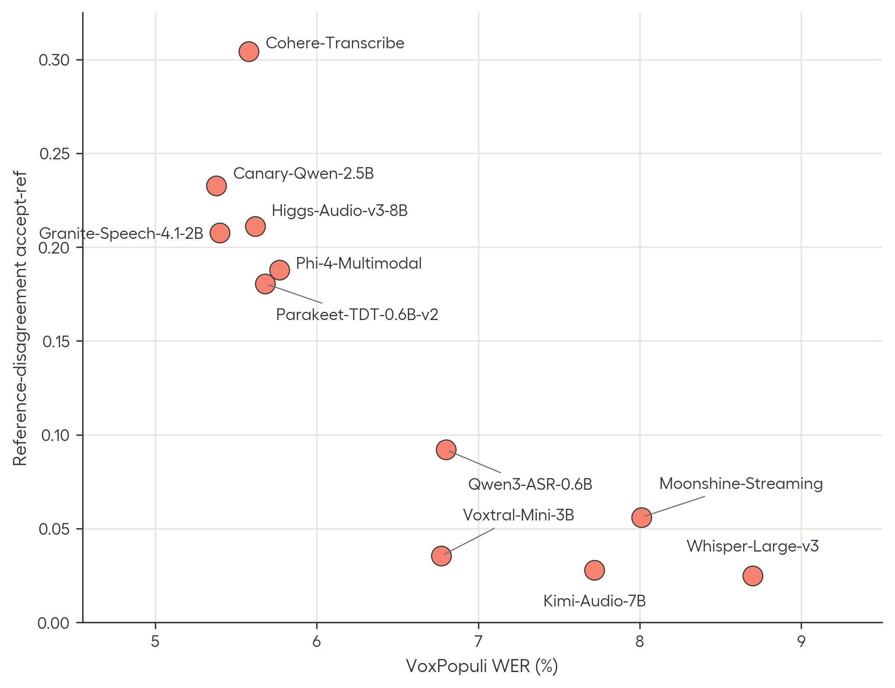
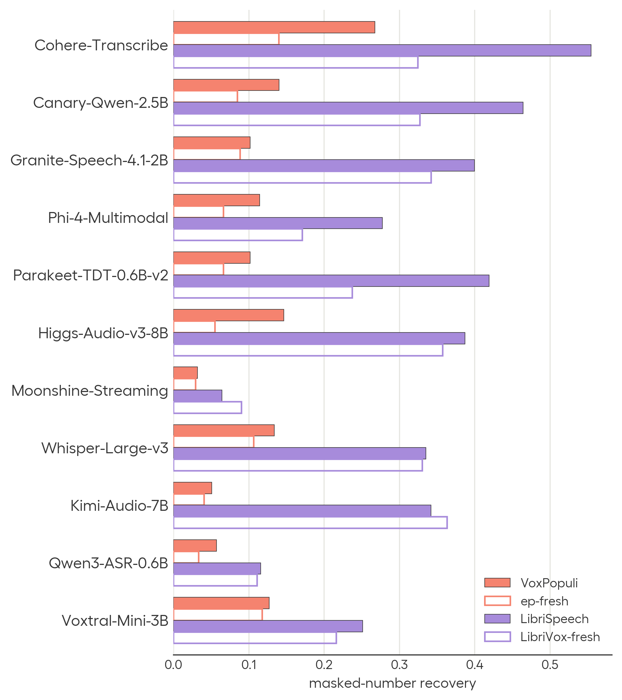
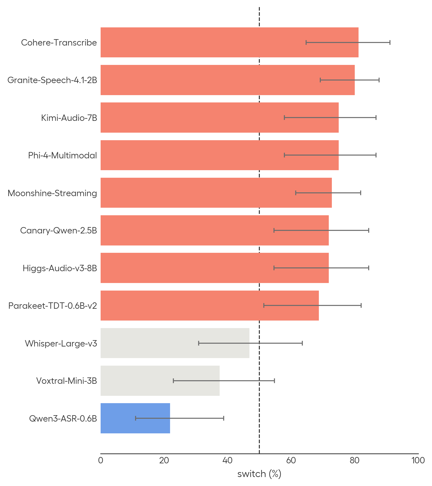
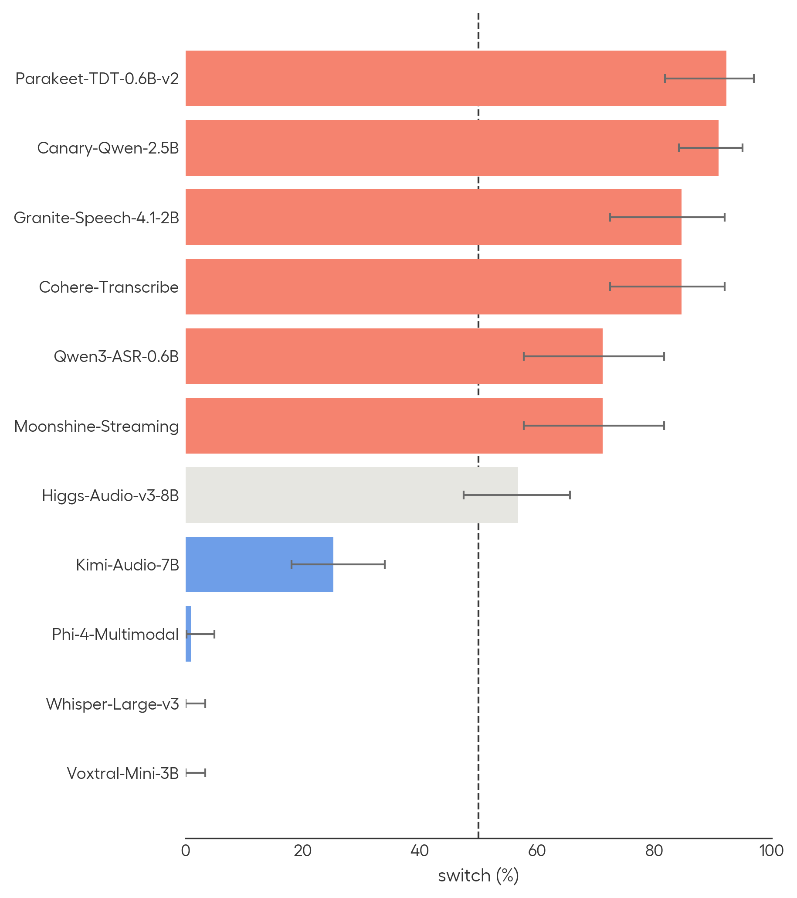
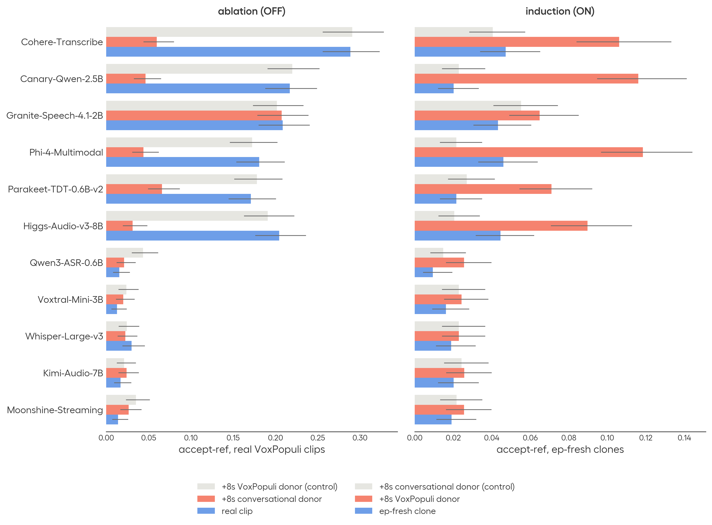

---
authors:
- aitoboxrobot
categories:
- 研究解读
date: 2026-08-22
hide:
- navigation
tags:
- 语音识别
- ASR
- 模型评估
- 基准测试
- 过拟合
title: 衡量语音识别中的基准过拟合现象
---
### 文章背景与核心概要
公开的语音 AI 基准测试往往给人一种模型表现已达到人类水平的错觉，但这些高分并不总能反映出真实世界的可靠性。由于主流基准测试是公开且被广泛使用的，模型可能会对“测试本身进行优化（即所谓的“benchmaxxing”）”——它们学会了针对特定基准的模式，而不是真正提升底层任务的能力。

为了在自动语音识别（ASR）中量化这一现象，近期的一项研究在 11 个广泛使用的开源模型上引入了三项评估测试：1. **参考不一致性（Reference Disagreement）**：评估模型是转录音频实际发出的内容，还是盲目复制基准转录中的已知错误；2. **掩码实体检索（Masked Entity Retrieval）**：测试模型是根据音频内容，还是根据对基准文本的熟悉程度来幻觉或自动补全被静音的数字和实体；3. **正字法切换（Orthographic Switching）**：检查模型是否会根据它们检测到自己正在哪个数据集上受测，从而改变拼写习惯（例如“any one”对“anyone”，或“Mr.”对“Mister”）。

研究结果表明，许多表现顶尖的模型利用了周围的声学和文本线索来迎合数据集特定的期望，从而高估了它们的真实泛化能力。作者建议采用保留评估集（如 *Real World VoiceEQ* 和 *Open-ASR Leaderboard*），并摒弃简单的独立同分布（IID）测试划分。

---

# Measuring Benchmark Optimization in Speech Recognition

**Published:** August 21, 2026  
**Authors:** Theo Lebryk, Eric Bezzam, Alice, David Ayllon, Jakub Piotr Cłapa, Jens Madsen, Panagiotis Tzirakis (Hume AI)

---

## Summary

Public voice AI benchmarks often give the impression that models are performing at human levels, but these high scores do not always reflect real-world reliability. Because popular benchmarks are open and widely used, models can become **optimized for the tests themselves ("benchmaxxing")**—learning benchmark-specific patterns rather than improving at the underlying task. 

To quantify this phenomenon in automatic speech recognition (ASR), recent research introduced three evaluation tests across 11 widely used open-source models:
1. **Reference Disagreement:** Evaluating whether models transcribe what the audio actually says or blindly reproduce known errors in benchmark transcripts (e.g., from *VoxPopuli*).
2. **Masked Entity Retrieval:** Testing whether models hallucinate or autocomplete silenced numbers and entities based on benchmark text familiarity rather than audio.
3. **Orthographic Switching:** Checking whether models alter spelling conventions (e.g., "any one" vs. "anyone", or "Mr." vs. "Mister") based on which dataset they detect they are being tested on.

The findings reveal that many top-performing models leverage surrounding acoustic and textual cues to match dataset-specific expectations, overstating their true generalization capabilities. The authors recommend adopting held-out evaluation sets (such as *Real World VoiceEQ* and the *Open-ASR Leaderboard*) and moving away from simple IID test splits.

---

## Reference Disagreement (VoxPopuli Case Study)
## 参考不一致性（VoxPopuli 案例研究）

VoxPopuli 众所周知包含大量的转录错误。一致性不一致探针（consensus disagreement probe）用于测试领先的 ASR 模型遇到这些错误时的反应：*它们是准确转录音频所说的话，还是复制基准中不正确的参考转录？*

> VoxPopuli is known to contain a high number of transcription errors. A consensus disagreement probe tests what happens when leading ASR models encounter these errors: *Do they accurately transcribe what the audio says, or reproduce the benchmark's incorrect reference transcript?*

为了测试这一点，研究人员使用了一组具有较低音素错误率（PER）的独立模型集成，来标记模型与参考转录完全不一致的情况。例如，当音频片段中清晰包含短语 *"Thank you, Mr. President,"* 时，参考转录却漏掉了 *"Thank you."* 在测试的 11 个模型中，有 6 个复现了错误的参考转录。

> To test this, an ensemble of independent models with low phoneme error rates (PER) was used to flag cases where models unanimously disagreed with the reference transcript. For example, while an audio clip clearly includes the phrase *"Thank you, Mr. President,"* the reference transcript omits *"Thank you."* 6 out of 11 tested models reproduced the erroneous reference transcript. 

然而，当在欧盟议会录音中新收集的语音或通用语音上进行测试时，这种行为基本消失了，这表明模型对表明其属于基准测试的声学线索作出了反应。

> However, when tested on newly collected voices from EU parliamentary recordings or generic voices, this behavior largely disappeared, suggesting models respond to acoustic cues indicating benchmark membership.

---

## Masked Entity Retrieval
## 掩码实体检索

为了进一步验证一致性不一致性，测试数据集音频样本中的数字被刻意进行了静音处理。由于音频中不存在该数字，模型本不应该将其输出。

> To build on consensus disagreement, numbers were deliberately silenced in test dataset audio samples. Because the number is absent from the audio, models should not output it. 

评估显示，在公共基准测试中，被掩码数字的恢复率最高，而在保留音频或新收集的音频上则显著较低。在 *LibriSpeech* 上，尽管音频已经被清洗，但表现顶尖的模型仍在 30%–40% 的样本中复现了被掩码的数字，这证明了周围与基准相关的上下文驱动了文本的补全。

> The evaluation showed that recovery rates for masked numbers were highest on public benchmarks and significantly lower on held-out or newly collected audio. On *LibriSpeech*, top-performing models reproduced masked numbers in 30–40% of examples despite the audio being scrubbed, demonstrating that surrounding benchmark-associated context drives textual completion.

---

## Orthographic Switching
## 正字法切换

正字法切换探针用于测试模型是否会复现完全相同的基准拼写变体（例如 *1* 对 *one*，*Mr.* 对 *mister*，*any one* 对 *anyone*），尽管它们的语音输入完全相同。

> The orthographic switching probe tests whether models reproduce exact benchmark spelling variants (e.g., *1* vs. *one*, *Mr.* vs. *mister*, *any one* vs. *anyone*) despite phonetically identical audio inputs. 

* **数据集内切换（Intra-dataset switching）：** 通过 *LibriSpeech* 中的较旧空格惯例（*"any one"* 对 *"anyone"*）进行测试。
* **数据集间切换（Inter-dataset switching）：** 通过不同基准之间的拼写差异（例如 *VoxPopuli* 使用 *"Mr."* 而 *LibriSpeech* 拼写为 *"Mister"*) 进行测试。

> * **Intra-dataset switching:** Tested via older spacing conventions in *LibriSpeech* (*"any one"* vs. *"anyone"*).
> * **Inter-dataset switching:** Tested via spelling differences across benchmarks (e.g., *VoxPopuli* using *"Mr."* vs. *LibriSpeech* spelling out *"Mister"*).

多个模型的表现超过了 50% 的随机选择基准，部分模型甚至达到了约 90% 的切换准确率——这证明了**模型能够识别音频样本源自哪个数据集，并调整其格式以迎合预期。**

> Multiple models exceeded the 50% random-choice baseline, with some reaching ~90% switch accuracy—proving that **models can identify which dataset an audio sample originates from and adapt their formatting to match expectations.**

---

## Localizing the Switches
## 定位切换行为

进一步的干预措施——例如使用超出训练截止日期的新鲜数据、翻译音频、限制注意力帧（attention frames）或裁剪周围的上下文——表明模型实际上*能够*忠实地转录字面口语。相反，它们是利用周围的声学上下文来决定是遵循音频本身，还是遵循特定于基准的转录策略。

> Further interventions—such as using fresh data past training cutoffs, translating audio, restricting attention frames, or trimming surrounding context—demonstrate that models *can* faithfully transcribe literal spoken words. Instead, they leverage surrounding acoustic context to decide whether to follow the audio or a benchmark-specific transcription policy.

---

## Conclusion
## 结论

该研究表明，开源 ASR 模型经常能够检测到与数据集相关的声学线索，并调整其转录行为以契合基准的特质。

> The research demonstrates that open-source ASR models frequently detect dataset-associated acoustic cues and adjust their transcription behavior to match benchmark idiosyncrasies. 

为了应对这一问题：
* **对于模型选择者：** 使用完全保留的评估集（如 *RW-Voice-EQ Bench* 和 *Open ASR Leaderboard*），并超越单一基准的词错误率（WER）来看待问题。Open ASR Leaderboard 中现已新增一个“基准拟合（Benchmark fitting）”标签页，用于量化参考错误率和正字法切换。
* **对于基准开发者：** 避免使用简单的独立同分布（IID）测试划分，转而采用基于时间、说话人或元数据的分离方式，以确保稳健的泛化能力。

> To combat this:
> * **For model selectors:** Use fully held-out evaluation sets (such as *RW-Voice-EQ Bench* and the *Open ASR Leaderboard*) and look beyond single-benchmark Word Error Rates (WER). A new "Benchmark fitting" tab has been added to the Open ASR Leaderboard to quantify reference error rates and orthographic switching.
> * **For benchmark developers:** Avoid simple IID test splits in favor of temporal, speaker, or metadata-based separation to ensure robust generalization.