---
authors:
- aitoboxrobot
categories:
- 研究解读
date: 2026-08-23
hide:
- navigation
tags:
- Claude
- 文本水印
- 大语言模型
- 采样机制
- SynthID
title: Claude 如何为 AI 生成的文本添加水印
---
### 文章背景与核心概要
在这篇文章中，作者 Sebastian Raschka 深入探讨了 Anthropic 为 Claude 引入的全新文本水印机制。不同于对大语言模型（LLM）架构进行昂贵且复杂的重新训练，该水印技术巧妙地介入了文本生成的**采样阶段**，利用密钥引导词元（token）选择过程中的随机数种子，从而在输出中嵌入一种不可见但可被验证的“数字签名”。

文章详细拆解了 LLM 从分词、获取对数几率（logits）、概率归一化到最终采样的全过程，并进一步剖析了类似 Google "SynthID-Text" 的“锦标赛采样”（tournament sampling）机制。这种方法极大地降低了水印检测的计算成本，无需重新运行庞大的底层模型即可高效验证文本来源。通过此次详尽的讲解，读者可以全面理解 AI 水印的技术原理、安全性以及对抗篡改的实际表现。

---

# Claude 如何为 AI 生成的文本添加水印

> In a recent [Substack note](https://substack.com/@rasbt/note/c-315339554?r=gb4sb), I discussed Anthropic’s new [watermarking process](https://www.anthropic.com/news/claude-text-watermark) for Claude. Due to the high level of interest and the complexity of the mechanism, I have expanded my explanation into a comprehensive lecture.
> 
> Originally planned as a 10-minute overview, this deep dive grew into a 48-minute presentation covering the technical "under-the-hood" mechanics of how LLMs generate text and how watermarking is integrated into that process.
> 
> *   **[Watch the YouTube Lecture](https://youtu.be/tLv7qRWFMlw)**
> *   **[Download the Slide Deck (PDF)](https://sebastianraschka.com/pdf/slides/2026-08-18-claude-watermarking.pdf)**
> 
> [Subscribe to the newsletter](https://magazine.sebastianraschka.com/subscribe?) for more technical deep dives.

在最近的一篇 [Substack 笔记](https://substack.com/@rasbt/note/c-315339554?r=gb4sb)中，我讨论了 Anthropic 针对 Claude 推出的全新[水印机制](https://www.anthropic.com/news/claude-text-watermark)。由于大家对此高度关注且该机制较为复杂，我将解释内容扩展成了一堂全面的技术讲座。

这场深度解析最初计划作为一个 10 分钟的概述，最终扩展成了一场 48 分钟的演示，涵盖了大语言模型（LLM）如何生成文本以及水印如何融入该过程的技术“底层”机制。

*   **[观看 YouTube 讲座](https://youtu.be/tLv7qRWFMlw)**
*   **[下载幻灯片 (PDF)](https://sebastianraschka.com/pdf/slides/2026-08-18-claude-watermarking.pdf)**

[订阅新闻通讯](https://magazine.sebastianraschka.com/subscribe?)以获取更多技术深度解析。

---

## Summary

> This lecture explains that watermarking is not a separate, expensive layer added to an LLM, but rather a subtle modification to the **sampling stage** of text generation. By using a secret key to influence the random seed during token selection, the model creates a detectable "signature" in the output. The lecture also covers the "tournament sampling" method used to make watermark detection computationally efficient without needing to rerun the original LLM.

## 总结

> 本次讲座解释了水印并非添加到 LLM 中的独立且昂贵的层，而是对文本生成**采样阶段**的微妙修改。通过使用密钥在词元选择过程中影响随机种子，模型在输出中创建了一个可检测的“签名”。讲座还涵盖了“锦标赛采样”方法，该方法使得水印检测在计算上高效，而无需重新运行原始 LLM。

---

## Video Transcript

> *(Note: The following transcript has been edited for readability while preserving the flow of the lecture.)*

## 视频文稿

> *（注：为保证可读性并保留讲座的流畅度，以下文稿经过了编辑。）*

### How Claude’s Text Watermarking Works

> <figure><a href="https://substackcdn.com/image/fetch/$s_!weKc!,f_auto,q_auto:good,fl_progressive:steep/https%3A%2F%2Fsubstack-post-media.s3.amazonaws.com%2Fpublic%2Fimages%2F8157c784-d1df-472c-afdf-baf84f813ccf_2000x1125.jpeg" rel="noopener noreferrer" referrerpolicy="no-referrer" target="_blank">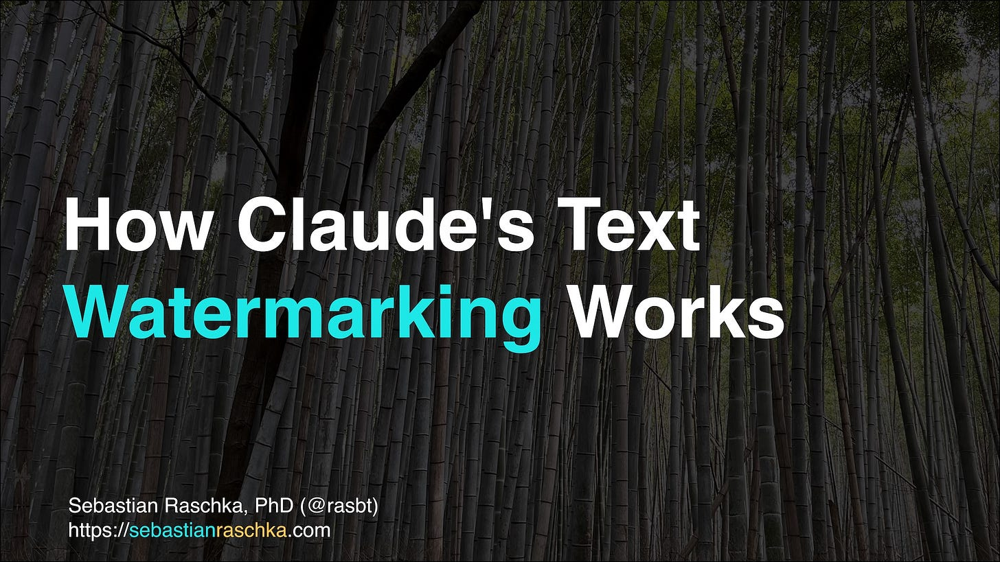</a><figcaption>Slide 2 of 52, time stamp 0:00</figcaption></figure>
> 
> Anthropic recently announced they will watermark Claude’s text outputs. Many users are concerned about whether this degrades text quality or what the actual benefits are. Understanding the mechanism is key to evaluating these concerns.

### Claude 的文本水印是如何工作的

> <figure><figcaption>第 2 页/共 52 页，时间戳 0:00</figcaption></figure>
> 
> Anthropic 最近宣布他们将为 Claude 的文本输出添加水印。许多用户担心这是否会降低文本质量，或者其实际好处是什么。理解这一机制是评估这些担忧的关键。

> <figure><figcaption>Slide 2 of 52, time stamp 1:41</figcaption></figure>
> 
> I believe in building things "from scratch" to understand them deeply. While this isn't a coding tutorial, understanding the sampling process of an LLM is essential to seeing how watermarking is applied.

> <figure><figcaption>第 2 页/共 52 页，时间戳 1:41</figcaption></figure>
> 
> 我坚信通过“从头构建”事物来深刻理解它们。虽然这不是一个编码教程，但理解 LLM 的采样过程对于了解如何应用水印至关重要。

> <figure><a href="https://substackcdn.com/image/fetch/$s_!I26f!,f_auto,q_auto:good,fl_progressive:steep/https%3A%2F%2Fsubstack-post-media.s3.amazonaws.com%2Fpublic%2Fimages%2Fe0589a9a-fcc4-4381-aa57-c1c9ecfa46c1_6667x3750.png" rel="noopener noreferrer" referrerpolicy="no-referrer" target="_blank">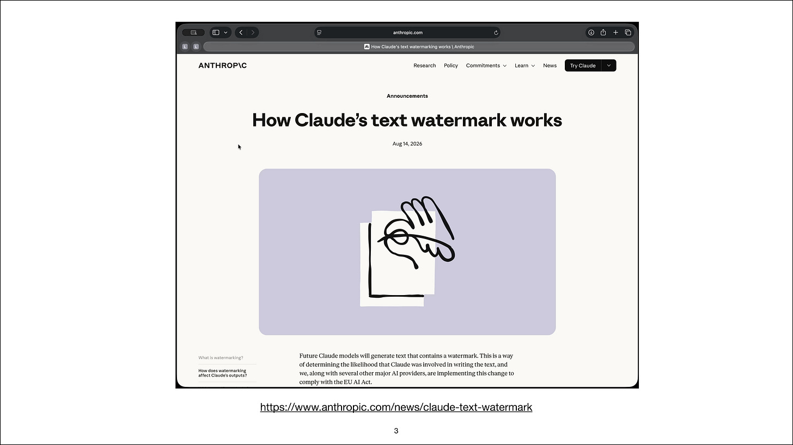</a><figcaption>Slide 3 of 52, time stamp 3:58</figcaption></figure>
> 
> The goal of watermarking is to identify AI-generated text. It is invisible to the user, but allows the provider to verify the origin of the text using a secret key.

> <figure><figcaption>第 3 页/共 52 页，时间戳 3:58</figcaption></figure>
> 
> 添加水印的目标是识别 AI 生成的文本。它对用户是不可见的，但允许提供商使用密钥来验证文本的来源。

---

### How LLM Text Generation Works

> <figure><a href="https://substackcdn.com/image/fetch/$s_!B13P!,f_auto,q_auto:good,fl_progressive:steep/https%3A%2F%2Fsubstack-post-media.s3.amazonaws.com%2Fpublic%2Fimages%2Fdaeee664-bef7-4c48-b851-e84cb93e9cbc_6667x3750.png" rel="noopener noreferrer" referrerpolicy="no-referrer" target="_blank">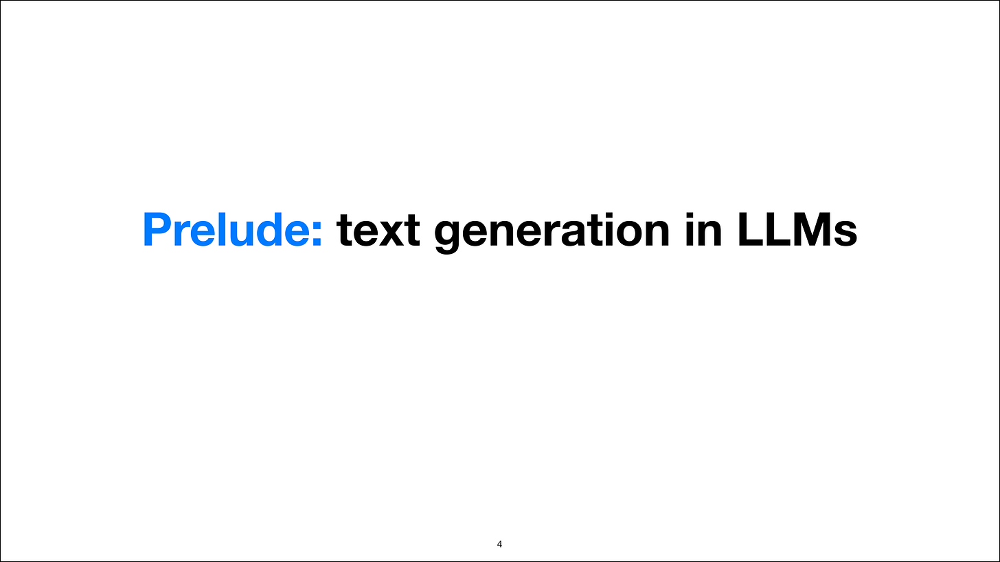</a><figcaption>Slide 4 of 52, time stamp 5:35</figcaption></figure>
> 
> Text generation involves converting input text into token IDs, passing them through the model, and obtaining a score distribution (logits) for the next token.

### LLM 文本生成是如何工作的

> <figure><figcaption>第 4 页/共 52 页，时间戳 5:35</figcaption></figure>
> 
> 文本生成涉及将输入文本转换为词元 ID（token IDs），将其输入模型，并获得下一个词元的得分分布（logits）。

> <figure><a href="https://substackcdn.com/image/fetch/$s_!Vmvq!,f_auto,q_auto:good,fl_progressive:steep/https%3A%2F%2Fsubstack-post-media.s3.amazonaws.com%2Fpublic%2Fimages%2Fe5a835ea-6b7c-47ee-8b73-4f81e132d9fd_6667x3750.png" rel="noopener noreferrer" referrerpolicy="no-referrer" target="_blank">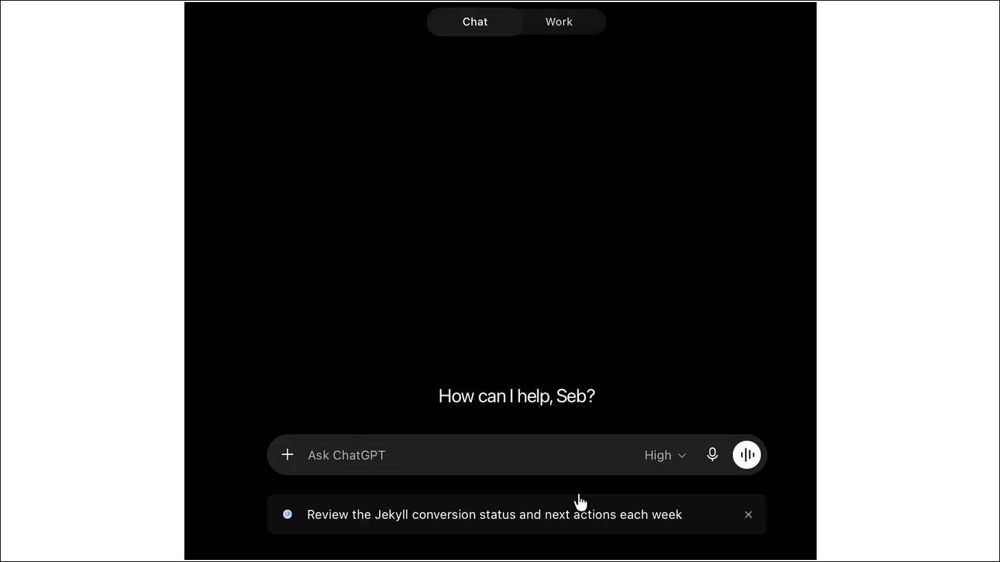</a><figcaption>Slide 5 of 52, time stamp 6:01</figcaption></figure>
> 
> When you ask, "The capital of Germany is," the model calculates probabilities for every token in its vocabulary.

> <figure><figcaption>第 5 页/共 52 页，时间戳 6:01</figcaption></figure>
> 
> 当你问出“德国的首都是”时，模型会计算其词表中每个词元的概率。

> <figure><a href="https://substackcdn.com/image/fetch/$s_!S2o9!,f_auto,q_auto:good,fl_progressive:steep/https%3A%2F%2Fsubstack-post-media.s3.amazonaws.com%2Fpublic%2Fimages%2F9841021b-978d-4891-8865-836754ad7a70_6667x3750.png" rel="noopener noreferrer" referrerpolicy="no-referrer" target="_blank">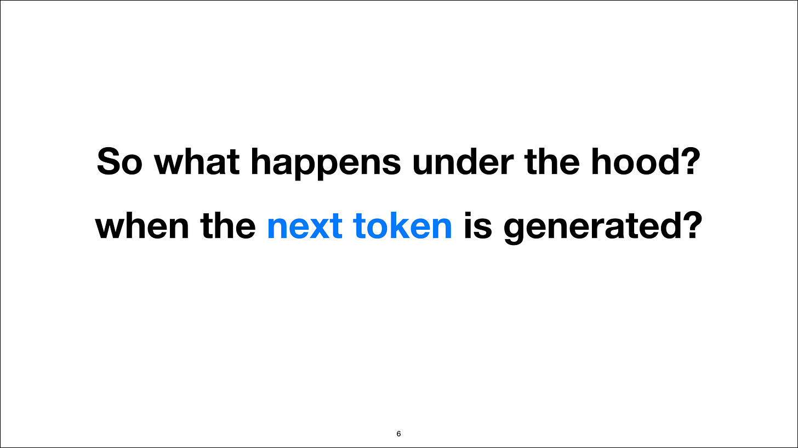</a><figcaption>Slide 6 of 52, time stamp 6:41</figcaption></figure>
> 
> The model generates a score distribution across the entire vocabulary. "Berlin" will have the highest score.

> <figure><figcaption>第 6 页/共 52 页，时间戳 6:41</figcaption></figure>
> 
> 模型在整个词汇表上生成得分分布。“柏林 (Berlin)”将获得最高得分。

> <figure><a href="https://substackcdn.com/image/fetch/$s_!Hwqn!,f_auto,q_auto:good,fl_progressive:steep/https%3A%2F%2Fsubstack-post-media.s3.amazonaws.com%2Fpublic%2Fimages%2Fb502aca2-08e0-4e34-bf27-761bfa00df70_6667x3750.png" rel="noopener noreferrer" referrerpolicy="no-referrer" target="_blank">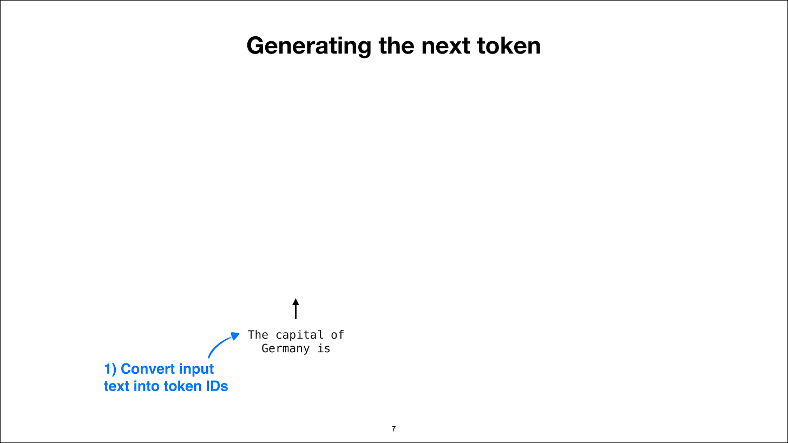</a><figcaption>Slide 7 of 52, time stamp 6:50</figcaption></figure>
> 
> Tokenization is the first step, converting text into IDs that the model can process.

> <figure><figcaption>第 7 页/共 52 页，时间戳 6:50</figcaption></figure>
> 
> 分词（Tokenization）是第一步，将文本转换为模型可以处理的 ID。

> <figure><a href="https://substackcdn.com/image/fetch/$s_!T0La!,f_auto,q_auto:good,fl_progressive:steep/https%3A%2F%2Fsubstack-post-media.s3.amazonaws.com%2Fpublic%2Fimages%2F0703d1f7-cda0-4fd1-a69d-d3865a1011a3_6667x3750.png" rel="noopener noreferrer" referrerpolicy="no-referrer" target="_blank">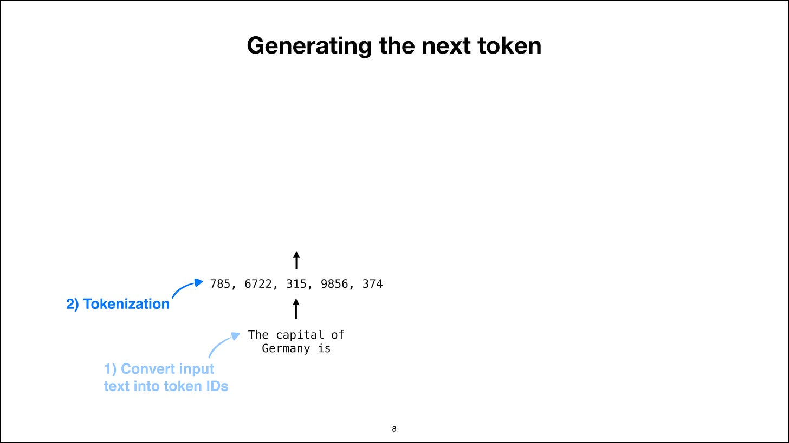</a><figcaption>Slide 8 of 52, time stamp 7:22</figcaption></figure>
> 
> The LLM then outputs a score distribution for the next token.

> <figure><figcaption>第 8 页/共 52 页，时间戳 7:22</figcaption></figure>
> 
> 随后，LLM 会输出下一个词元的得分分布。

> <figure><a href="https://substackcdn.com/image/fetch/$s_!W91w!,f_auto,q_auto:good,fl_progressive:steep/https%3A%2F%2Fsubstack-post-media.s3.amazonaws.com%2Fpublic%2Fimages%2F531a9e21-908f-4b91-844e-9c2e6dbeeb8b_6667x3750.png" rel="noopener noreferrer" referrerpolicy="no-referrer" target="_blank">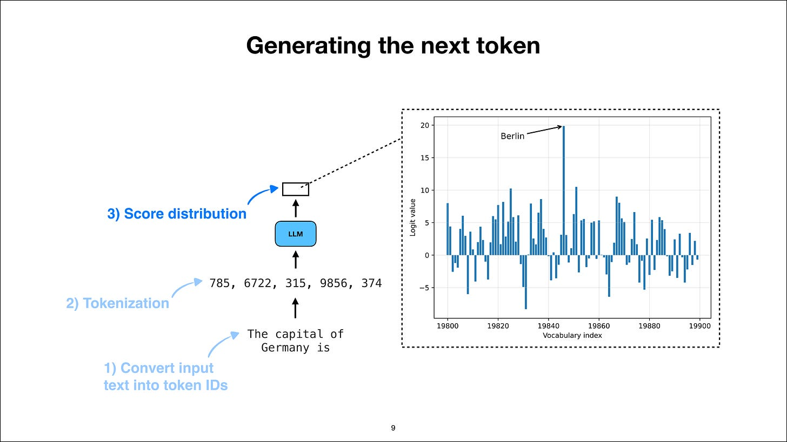</a><figcaption>Slide 9 of 52, time stamp 7:31</figcaption></figure>
> 
> Logit values represent raw scores. We can convert these into probabilities, but the core process is selecting the next token from this distribution.

> <figure><figcaption>第 9 页/共 52 页，时间戳 7:31</figcaption></figure>
> 
> Logit 值代表原始得分。我们可以将其转换为概率，但核心过程是从该分布中选择下一个词元。

> <figure><a href="https://substackcdn.com/image/fetch/$s_!gpfA!,f_auto,q_auto:good,fl_progressive:steep/https%3A%2F%2Fsubstack-post-media.s3.amazonaws.com%2Fpublic%2Fimages%2F25e84186-eb07-4bfa-ae49-3e8e01efe418_6667x3750.png" rel="noopener noreferrer" referrerpolicy="no-referrer" target="_blank">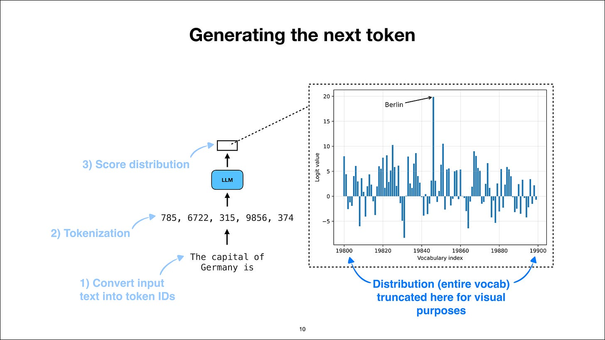</a><figcaption>Slide 10 of 52, time stamp 8:39</figcaption></figure>
> 
> The distribution spans the entire vocabulary. For a specific prompt, the model is highly confident in the correct token.

> <figure><figcaption>第 10 页/共 52 页，时间戳 8:39</figcaption></figure>
> 
> 该分布跨越了整个词汇表。对于特定的提示词，模型对正确的词元具有高度的信心。

> <figure><a href="https://substackcdn.com/image/fetch/$s_!_s6o!,f_auto,q_auto:good,fl_progressive:steep/https%3A%2F%2Fsubstack-post-media.s3.amazonaws.com%2Fpublic%2Fimages%2Feb797090-c626-4857-bd25-68dbbbe3e94b_6667x3750.png" rel="noopener noreferrer" referrerpolicy="no-referrer" target="_blank">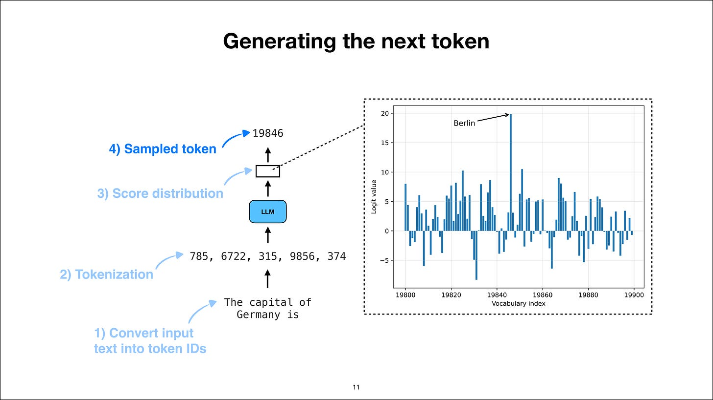</a><figcaption>Slide 11 of 52, time stamp 10:33</figcaption></figure>
> 
> We sample a token from this distribution.

> <figure><figcaption>第 11 页/共 52 页，时间戳 10:33</figcaption></figure>
> 
> 我们从这个分布中采样一个词元。

> <figure><a href="https://substackcdn.com/image/fetch/$s_!u2Kj!,f_auto,q_auto:good,fl_progressive:steep/https%3A%2F%2Fsubstack-post-media.s3.amazonaws.com%2Fpublic%2Fimages%2Fd5f5e5d5-de7f-4925-81cc-4e561aff444a_6667x3750.png" rel="noopener noreferrer" referrerpolicy="no-referrer" target="_blank">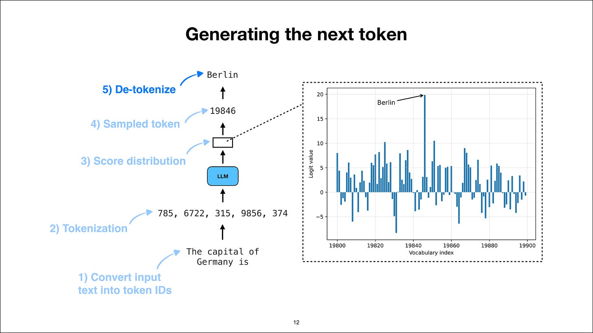</a><figcaption>Slide 12 of 52, time stamp 10:52</figcaption></figure>
> 
> The token is detokenized back into text.

> <figure><figcaption>第 12 页/共 52 页，时间戳 10:52</figcaption></figure>
> 
> 该词元通过反分词（detokenize）转换回文本。

> <figure><a href="https://substackcdn.com/image/fetch/$s_!ok-i!,f_auto,q_auto:good,fl_progressive:steep/https%3A%2F%2Fsubstack-post-media.s3.amazonaws.com%2Fpublic%2Fimages%2Fe7255cfa-288b-4e42-9078-3fd42df67337_6667x3750.png" rel="noopener noreferrer" referrerpolicy="no-referrer" target="_blank">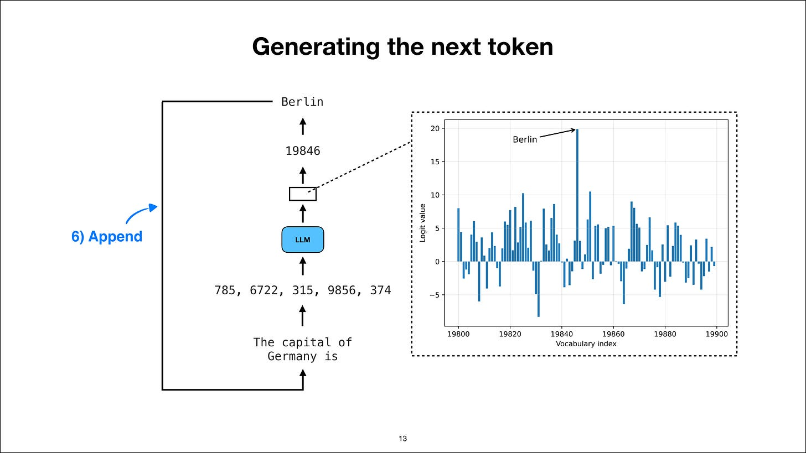</a><figcaption>Slide 13 of 52, time stamp 11:12</figcaption></figure>
> 
> This process repeats in a loop until the response is complete.

> <figure><figcaption>第 13 页/共 52 页，时间戳 11:12</figcaption></figure>
> 
> 这个过程在循环中重复，直到响应生成完毕。

---

### How Next-Token Sampling Works

> <figure><a href="https://substackcdn.com/image/fetch/$s_!6MMi!,f_auto,q_auto:good,fl_progressive:steep/https%3A%2F%2Fsubstack-post-media.s3.amazonaws.com%2Fpublic%2Fimages%2F26f7b92a-ed2a-4f52-bab0-369ad8ae07bd_6667x3750.png" rel="noopener noreferrer" referrerpolicy="no-referrer" target="_blank">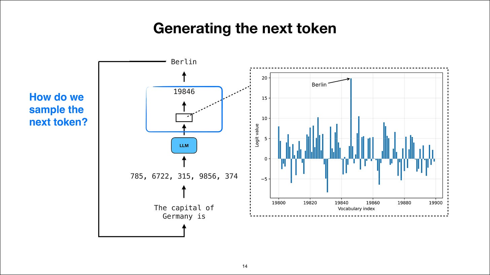</a><figcaption>Slide 14 of 52, time stamp 11:44</figcaption></figure>
> 
> Most LLMs don't use "greedy decoding" (always picking the highest score) because it leads to repetitive, memorized outputs. Instead, they sample from the distribution.

### 下一个词元采样是如何工作的

> <figure><figcaption>第 14 页/共 52 页，时间戳 11:44</figcaption></figure>
> 
> 大多数 LLM 不使用“贪婪解码”（即总是选择最高得分），因为这会导致重复、死记硬背般的输出。相反，它们会从分布中进行采样。

> <figure><a href="https://substackcdn.com/image/fetch/$s_!ctvP!,f_auto,q_auto:good,fl_progressive:steep/https%3A%2F%2Fsubstack-post-media.s3.amazonaws.com%2Fpublic%2Fimages%2F9c902aa2-4200-481c-a615-ecee94a7ed15_6667x3750.png" rel="noopener noreferrer" referrerpolicy="no-referrer" target="_blank">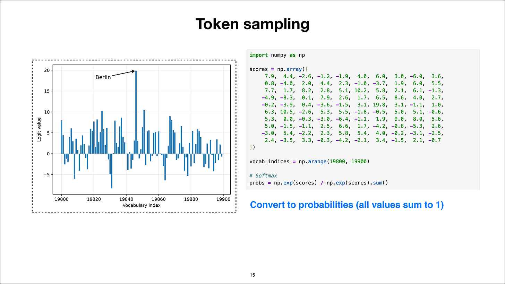</a><figcaption>Slide 15 of 52, time stamp 12:28</figcaption></figure>
> 
> We convert scores into probabilities using a softmax function.

> <figure><figcaption>第 15 页/共 52 页，时间戳 12:28</figcaption></figure>
> 
> 我们使用 softmax 函数将得分转换为概率。

> <figure><a href="https://substackcdn.com/image/fetch/$s_!asg_!,f_auto,q_auto:good,fl_progressive:steep/https%3A%2F%2Fsubstack-post-media.s3.amazonaws.com%2Fpublic%2Fimages%2Fd081359c-5010-4469-a468-c99b2cdb8ded_6667x3750.png" rel="noopener noreferrer" referrerpolicy="no-referrer" target="_blank">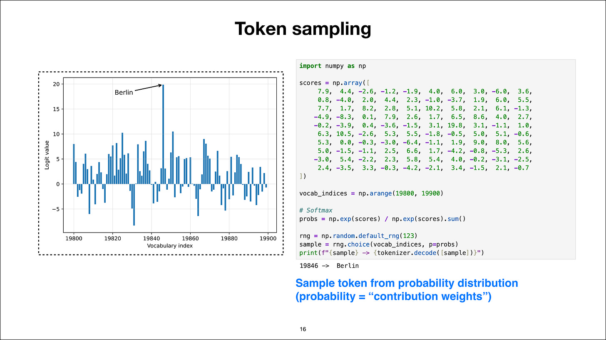</a><figcaption>Slide 16 of 52, time stamp 13:20</figcaption></figure>
> 
> Once normalized, we sample using a random number generator.

> <figure><figcaption>第 16 页/共 52 页，时间戳 13:20</figcaption></figure>
> 
> 一旦归一化，我们就使用随机数生成器进行采样。

> <figure><a href="https://substackcdn.com/image/fetch/$s_!I8cQ!,f_auto,q_auto:good,fl_progressive:steep/https%3A%2F%2Fsubstack-post-media.s3.amazonaws.com%2Fpublic%2Fimages%2F4b33a8bf-df72-49cf-8ba8-3761d3020a73_6667x3750.png" rel="noopener noreferrer" referrerpolicy="no-referrer" target="_blank">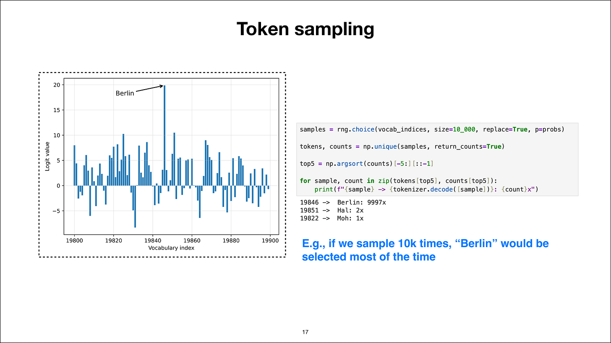</a><figcaption>Slide 17 of 52, time stamp 15:37</figcaption></figure>
> 
> Repeated sampling confirms that the model consistently selects the most probable token.

> <figure><figcaption>第 17 页/共 52 页，时间戳 15:37</figcaption></figure>
> 
> 重复采样证实，模型始终如一地选择概率最高的词元。

---

### From Sampling to Watermarking

> <figure><a href="https://substackcdn.com/image/fetch/$s_!OIiE!,f_auto,q_auto:good,fl_progressive:steep/https%3A%2F%2Fsubstack-post-media.s3.amazonaws.com%2Fpublic%2Fimages%2F8b3237c6-7e82-4c01-8efe-13c815327d1f_6667x3750.png" rel="noopener noreferrer" referrerpolicy="no-referrer" target="_blank">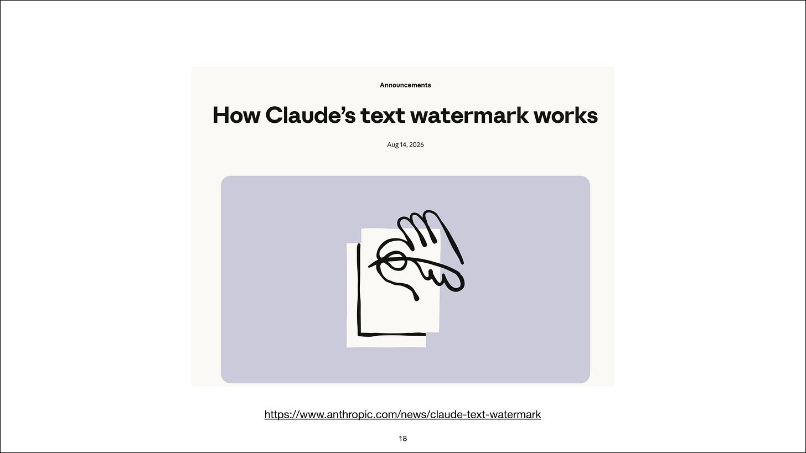</a><figcaption>Slide 18 of 52, time stamp 16:21</figcaption></figure>
> 
> Watermarking is essentially a way to influence this sampling process.

### 从采样到水印

> <figure><figcaption>第 18 页/共 52 页，时间戳 16:21</figcaption></figure>
> 
> 水印本质上是一种影响该采样过程的方法。

> <figure><a href="https://substackcdn.com/image/fetch/$s_!WLE_!,f_auto,q_auto:good,fl_progressive:steep/https%3A%2F%2Fsubstack-post-media.s3.amazonaws.com%2Fpublic%2Fimages%2F432eba26-4618-478b-b6d7-084439017d8a_6667x3750.png" rel="noopener noreferrer" referrerpolicy="no-referrer" target="_blank">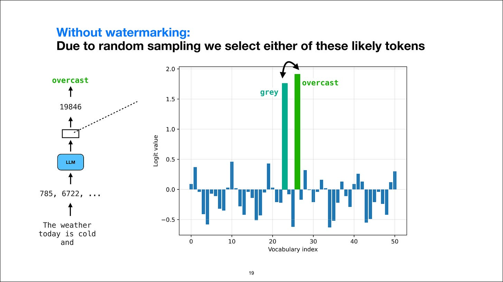</a><figcaption>Slide 19 of 52, time stamp 16:41</figcaption></figure>
> 
> In cases where multiple tokens are equally plausible (e.g., "overcast" vs "gray"), random sampling creates variation.

> <figure><figcaption>第 19 页/共 52 页，时间戳 16:41</figcaption></figure>
> 
> 在多个词元同样合理的情况下（例如，“overcast”与“gray”），随机采样会产生变体。

> <figure><a href="https://substackcdn.com/image/fetch/$s_!ayNq!,f_auto,q_auto:good,fl_progressive:steep/https%3A%2F%2Fsubstack-post-media.s3.amazonaws.com%2Fpublic%2Fimages%2F68ab0eb2-0446-493f-828d-e786748ca541_6667x3750.png" rel="noopener noreferrer" referrerpolicy="no-referrer" target="_blank">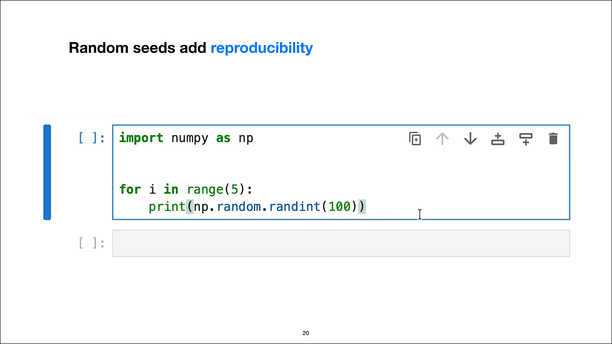</a><figcaption>Slide 20 of 52, time stamp 18:25</figcaption></figure>
> 
> Setting a random seed makes the sampling deterministic and reproducible.

> <figure><figcaption>第 20 页/共 52 页，时间戳 18:25</figcaption></figure>
> 
> 设置随机种子（random seed）可使采样具有确定性和可复现性。

> <figure><a href="https://substackcdn.com/image/fetch/$s_!dZbA!,f_auto,q_auto:good,fl_progressive:steep/https%3A%2F%2Fsubstack-post-media.s3.amazonaws.com%2Fpublic%2Fimages%2F0651955f-e446-4130-866c-a708ca985005_6667x3750.png" rel="noopener noreferrer" referrerpolicy="no-referrer" target="_blank">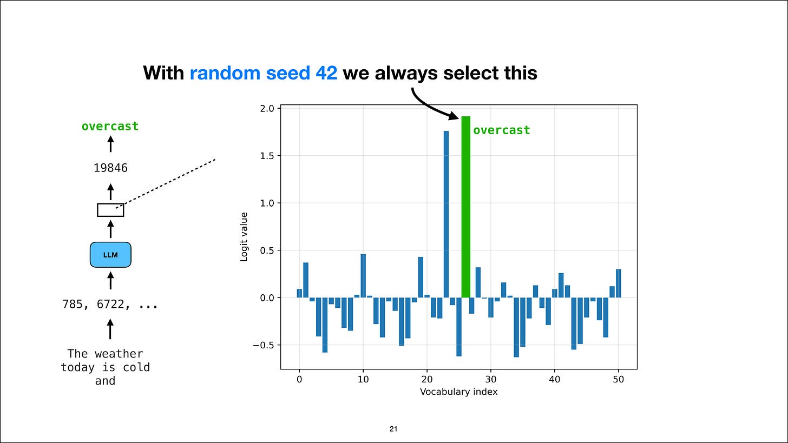</a><figcaption>Slide 21 of 52, time stamp 19:26</figcaption></figure>
> 
> With a fixed seed, the model will consistently pick one specific token over another.

> <figure><figcaption>第 21 页/共 52 页，时间戳 19:26</figcaption></figure>
> 
> 固定种子后，模型将始终如一地选择某个特定词元而不是另一个。

> <figure><a href="https://substackcdn.com/image/fetch/$s_!WlLr!,f_auto,q_auto:good,fl_progressive:steep/https%3A%2F%2Fsubstack-post-media.s3.amazonaws.com%2Fpublic%2Fimages%2F8350e88d-7168-4e7c-91f2-0c0cb7ef4592_6667x3750.png" rel="noopener noreferrer" referrerpolicy="no-referrer" target="_blank">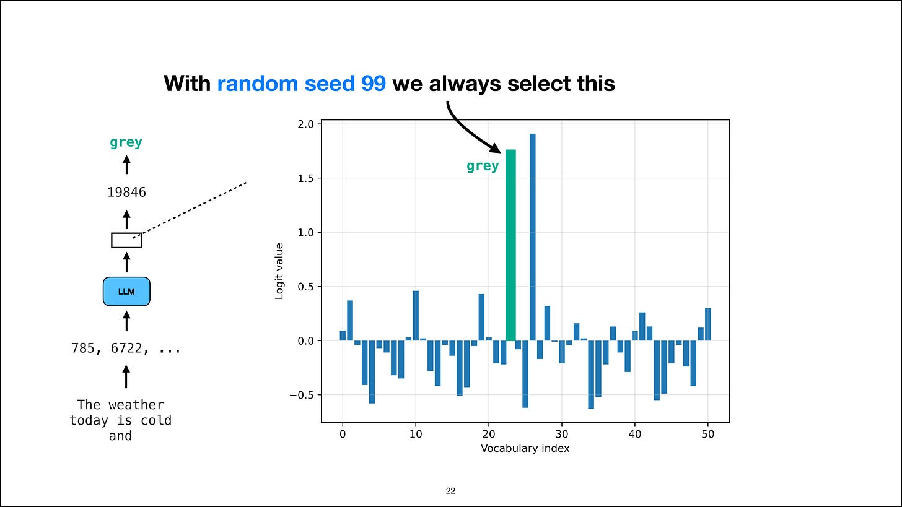</a><figcaption>Slide 22 of 52, time stamp 19:49</figcaption></figure>
> 
> Changing the seed changes the deterministic output.

> <figure><figcaption>第 22 页/共 52 页，时间戳 19:49</figcaption></figure>
> 
> 改变种子会改变确定性的输出。

> <figure><a href="https://substackcdn.com/image/fetch/$s_!L-VB!,f_auto,q_auto:good,fl_progressive:steep/https%3A%2F%2Fsubstack-post-media.s3.amazonaws.com%2Fpublic%2Fimages%2F6547aa47-2631-4fda-a65d-06f7336e6794_6667x3750.png" rel="noopener noreferrer" referrerpolicy="no-referrer" target="_blank">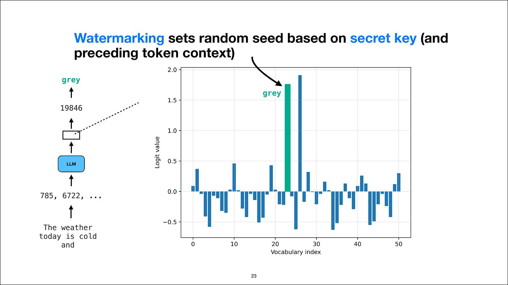</a><figcaption>Slide 23 of 52, time stamp 20:04</figcaption></figure>
> 
> Watermarking uses a secret key and the previous tokens to derive a random seed, effectively controlling the sampling process in a way that only the key-holder can verify.

> <figure><figcaption>第 23 页/共 52 页，时间戳 20:04</figcaption></figure>
> 
> 水印利用密钥和先前的词元推导出一个随机种子，从而有效地控制采样过程，只有密钥持有者才能进行验证。

> <figure><a href="https://substackcdn.com/image/fetch/$s_!0dqQ!,f_auto,q_auto:good,fl_progressive:steep/https%3A%2F%2Fsubstack-post-media.s3.amazonaws.com%2Fpublic%2Fimages%2Fb4c3d6c6-4a48-4f13-8830-eb3e339129ba_6667x3750.png" rel="noopener noreferrer" referrerpolicy="no-referrer" target="_blank">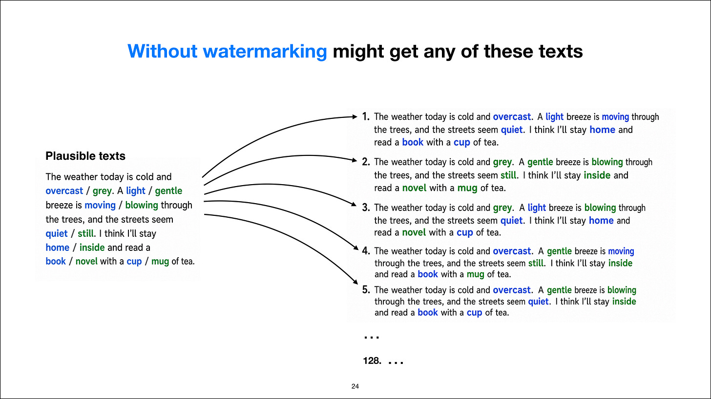</a><figcaption>Slide 24 of 52, time stamp 21:06</figcaption></figure>
> 
> Without watermarking, there are many possible valid outputs.

> <figure><figcaption>第 24 页/共 52 页，时间戳 21:06</figcaption></figure>
> 
> 如果没有水印，可能会有许多种合理且有效的输出。

> <figure><a href="https://substackcdn.com/image/fetch/$s_!Tqte!,f_auto,q_auto:good,fl_progressive:steep/https%3A%2F%2Fsubstack-post-media.s3.amazonaws.com%2Fpublic%2Fimages%2F47f4083b-1e77-4c9c-9641-344c4169739c_6667x3750.png" rel="noopener noreferrer" referrerpolicy="no-referrer" target="_blank">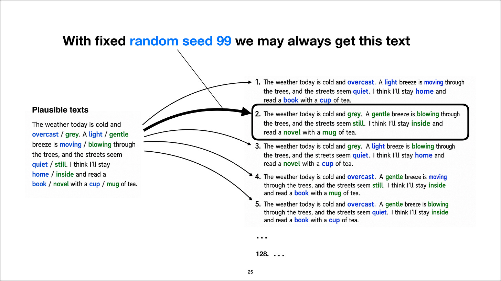</a><figcaption>Slide 25 of 52, time stamp 23:31</figcaption></figure>
> 
> A fixed random seed reproduces one of the plausible texts.

> <figure><figcaption>第 25 页/共 52 页，时间戳 23:31</figcaption></figure>
> 
> 固定的随机种子会复现其中一种合理的文本。

> <figure><a href="https://substackcdn.com/image/fetch/$s_!0Ng5!,f_auto,q_auto:good,fl_progressive:steep/https%3A%2F%2Fsubstack-post-media.s3.amazonaws.com%2Fpublic%2Fimages%2F5782a1d6-f6a1-4fbc-a5aa-096d39fd5335_6667x3750.png" rel="noopener noreferrer" referrerpolicy="no-referrer" target="_blank">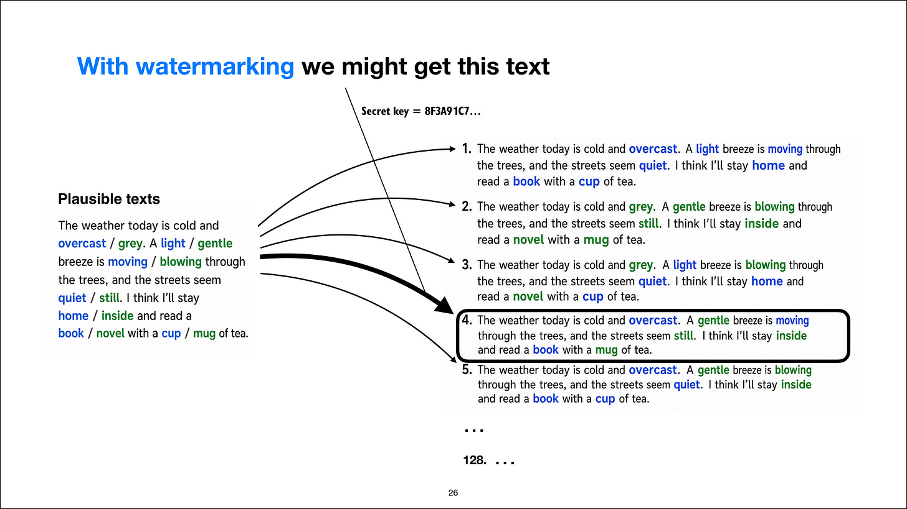</a><figcaption>Slide 26 of 52, time stamp 23:59</figcaption></figure>
> 
> With watermarking, the key controls which plausible text is generated.

> <figure><figcaption>第 26 页/共 52 页，时间戳 23:59</figcaption></figure>
> 
> 引入水印后，密钥会控制生成哪种合理的文本。

> <figure><a href="https://substackcdn.com/image/fetch/$s_!N_67!,f_auto,q_auto:good,fl_progressive:steep/https%3A%2F%2Fsubstack-post-media.s3.amazonaws.com%2Fpublic%2Fimages%2F4df5a34d-ceb2-4811-bf2e-c7c06dd67388_6667x3750.png" rel="noopener noreferrer" referrerpolicy="no-referrer" target="_blank">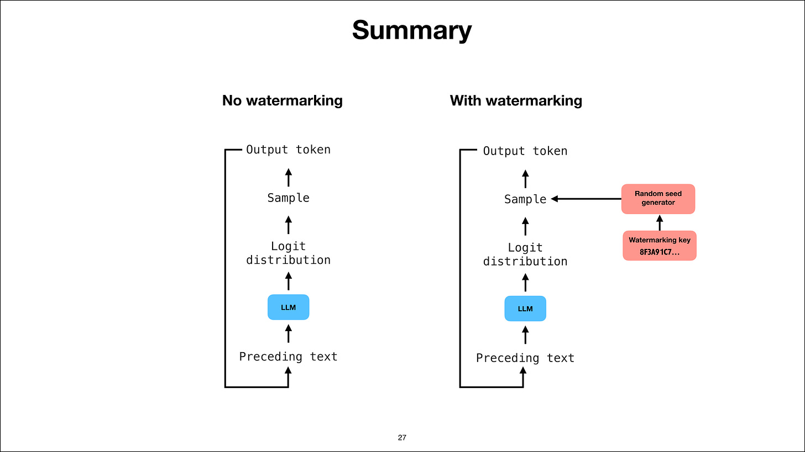</a><figcaption>Slide 27 of 52, time stamp 24:47</figcaption></figure>
> 
> This is applied at the sampling stage, meaning no retraining of the LLM is required.

> <figure><figcaption>第 27 页/共 52 页，时间戳 24:47</figcaption></figure>
> 
> 这应用于采样阶段，这意味着不需要对 LLM 进行重新训练。

---

### How Watermark Detection Works

> <figure><a href="https://substackcdn.com/image/fetch/$s_!h7hT!,f_auto,q_auto:good,fl_progressive:steep/https%3A%2F%2Fsubstack-post-media.s3.amazonaws.com%2Fpublic%2Fimages%2F1eaf8702-9235-4a28-901e-d31059ed0ce0_6667x3750.png" rel="noopener noreferrer" referrerpolicy="no-referrer" target="_blank">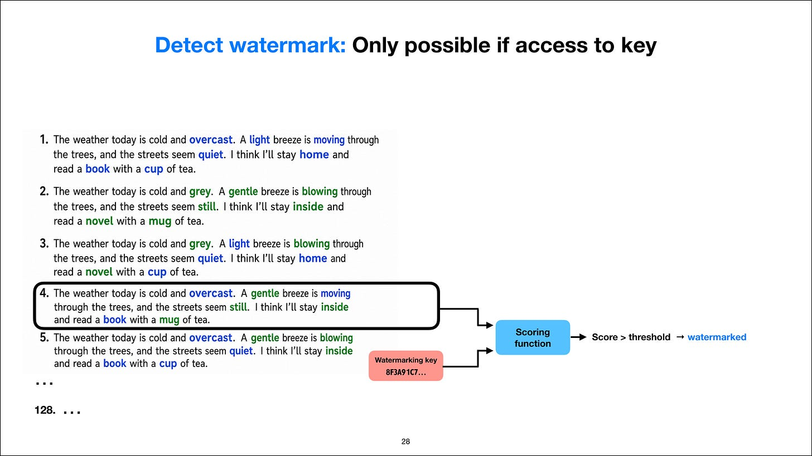</a><figcaption>Slide 28 of 52, time stamp 26:21</figcaption></figure>
> 
> Detection is only possible if you have the secret key.

### 水印检测是如何工作的

> <figure><figcaption>第 28 页/共 52 页，时间戳 26:21</figcaption></figure>
> 
> 只有拥有密钥，才能够进行检测。

> <figure><a href="https://substackcdn.com/image/fetch/$s_!oeAq!,f_auto,q_auto:good,fl_progressive:steep/https%3A%2F%2Fsubstack-post-media.s3.amazonaws.com%2Fpublic%2Fimages%2F71d15440-51d3-4039-8b10-fcb8777f25d9_6667x3750.png" rel="noopener noreferrer" referrerpolicy="no-referrer" target="_blank">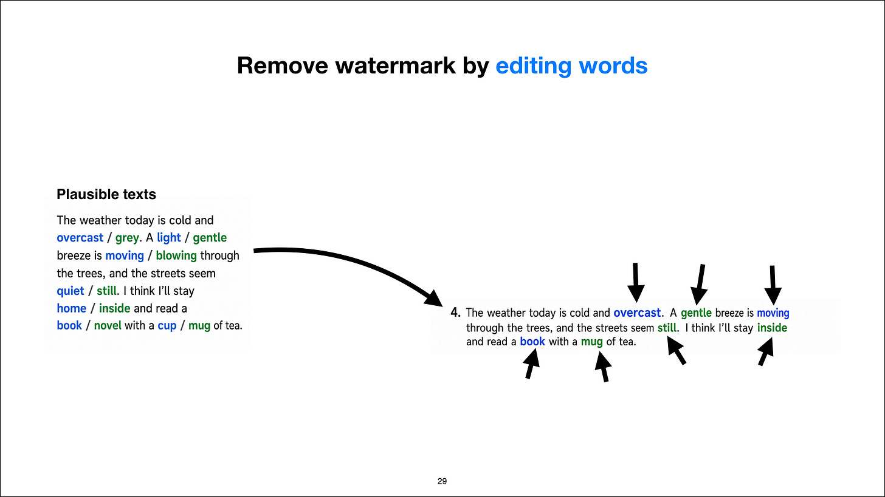</a><figcaption>Slide 29 of 52, time stamp 28:03</figcaption></figure>
> 
> Watermarks can be defeated by editing the specific tokens that were chosen by the watermarking process.

> <figure><figcaption>第 29 页/共 52 页，时间戳 28:03</figcaption></figure>
> 
> 可以通过编辑由水印过程选定的特定词元来消除水印。

> <figure><a href="https://substackcdn.com/image/fetch/$s_!0tU2!,f_auto,q_auto:good,fl_progressive:steep/https%3A%2F%2Fsubstack-post-media.s3.amazonaws.com%2Fpublic%2Fimages%2Fb00cd50b-4601-407e-99a3-cbe417a43902_6667x3750.png" rel="noopener noreferrer" referrerpolicy="no-referrer" target="_blank">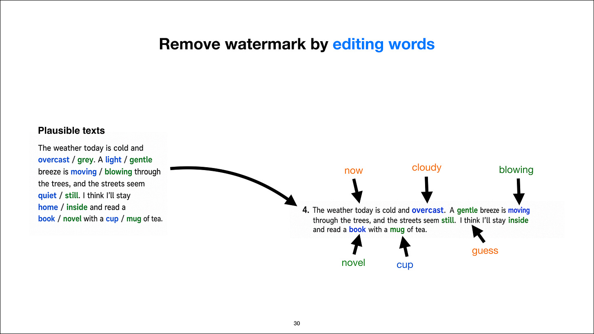</a><figcaption>Slide 30 of 52, time stamp 28:41</figcaption></figure>
> 
> Because the user doesn't know which tokens are watermarked, they must guess, which may lead to awkward or lower-quality text.

> <figure><figcaption>第 30 页/共 52 页，时间戳 28:41</figcaption></figure>
> 
> 由于用户不知道哪些词元带有水印，他们必须去猜测，这可能会导致文本显得生硬或质量下降。

---

### SynthID Text and Tournament Sampling

> <figure><a href="https://substackcdn.com/image/fetch/$s_!pm8a!,f_auto,q_auto:good,fl_progressive:steep/https%3A%2F%2Fsubstack-post-media.s3.amazonaws.com%2Fpublic%2Fimages%2Fdc2307ad-22d9-40b2-93dc-84c671a22b8c_6667x3750.png" rel="noopener noreferrer" referrerpolicy="no-referrer" target="_blank">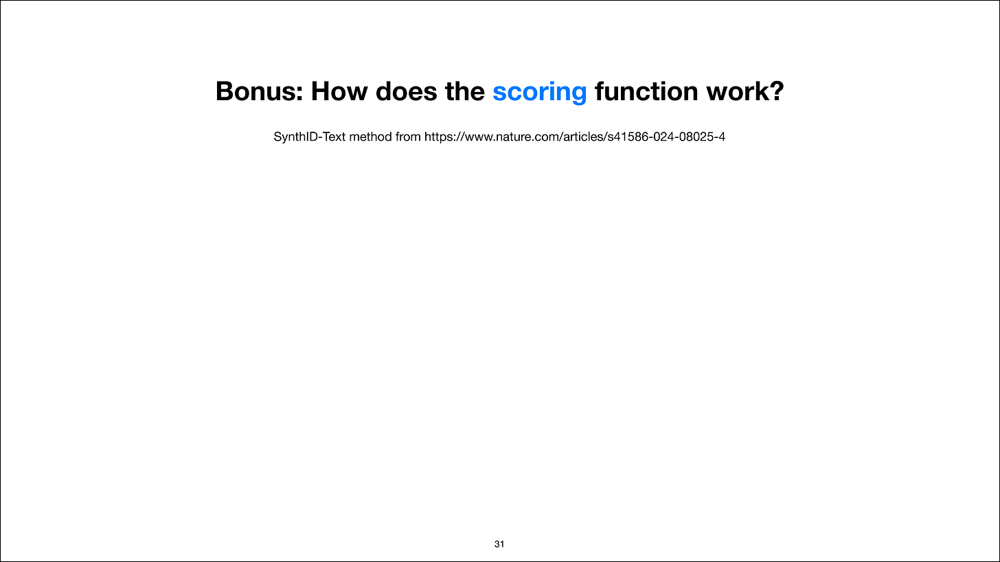</a><figcaption>Slide 31 of 52, time stamp 29:59</figcaption></figure>
> 
> To make detection cheaper, Anthropic uses techniques like those found in Google's "SynthID-Text."

### SynthID Text 与锦标赛采样

> <figure><figcaption>第 31 页/共 52 页，时间戳 29:59</figcaption></figure>
> 
> 为了降低检测成本，Anthropic 使用了类似于 Google "SynthID-Text" 中采用的技术。

> <figure><a href="https://substackcdn.com/image/fetch/$s_!Bh17!,f_auto,q_auto:good,fl_progressive:steep/https%3A%2F%2Fsubstack-post-media.s3.amazonaws.com%2Fpublic%2Fimages%2Fec4472b9-39f3-4b77-b0fe-460ad39ba287_6667x3750.png" rel="noopener noreferrer" referrerpolicy="no-referrer" target="_blank">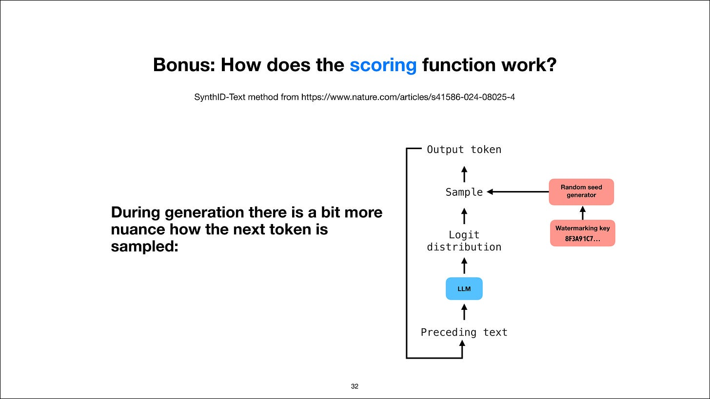</a><figcaption>Slide 32 of 52, time stamp 31:39</figcaption></figure>
> 
> Tournament sampling allows for efficient scoring without needing to rerun the LLM.

> <figure><figcaption>第 32 页/共 52 页，时间戳 31:39</figcaption></figure>
> 
> 锦标赛采样（Tournament sampling）允许进行高效的评分，而无需重新运行 LLM。

> <figure><a href="https://substackcdn.com/image/fetch/$s_!HZkv!,f_auto,q_auto:good,fl_progressive:steep/https%3A%2F%2Fsubstack-post-media.s3.amazonaws.com%2Fpublic%2Fimages%2F0bc03205-dfcb-4577-84dc-ffd146b8c1db_6667x3750.png" rel="noopener noreferrer" referrerpolicy="no-referrer" target="_blank">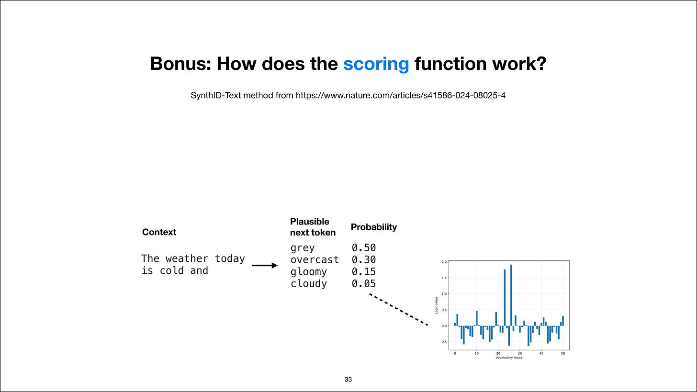</a><figcaption>Slide 33 of 52, time stamp 32:16</figcaption></figure>
> 
> We evaluate candidate tokens based on their probability and their "signature" from random watermarking functions.

> <figure><figcaption>第 33 页/共 52 页，时间戳 32:16</figcaption></figure>
> 
> 我们根据候选词元的概率及其来自随机水印函数的“签名”来评估它们。

> <figure><a href="https://substackcdn.com/image/fetch/$s_!CC2F!,f_auto,q_auto:good,fl_progressive:steep/https%3A%2F%2Fsubstack-post-media.s3.amazonaws.com%2Fpublic%2Fimages%2F1c33ec2c-44af-45a0-99e0-4a7cd5984f2c_6667x3750.png" rel="noopener noreferrer" referrerpolicy="no-referrer" target="_blank">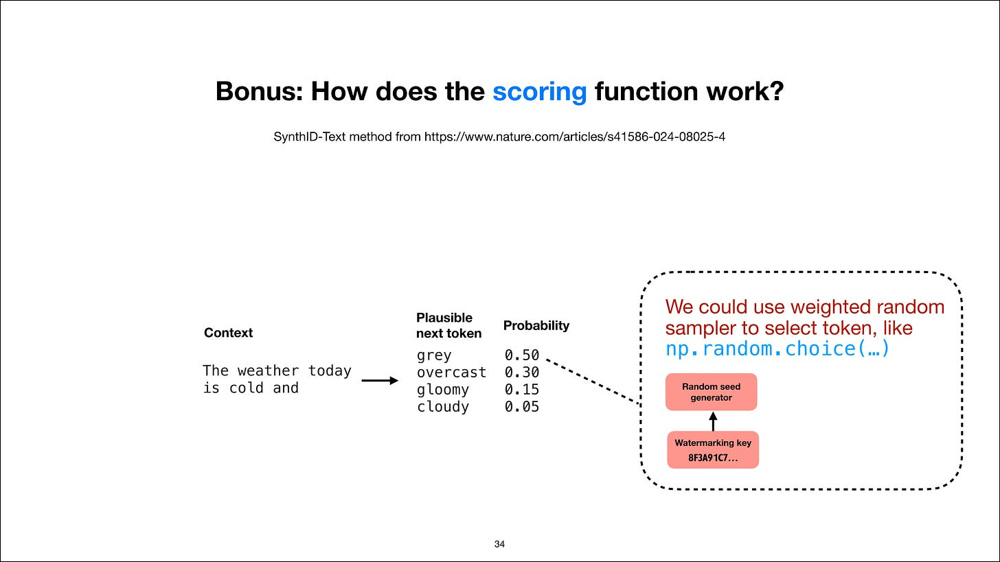</a><figcaption>Slide 34 of 52, time stamp 33:13</figcaption></figure>
> 
> The tournament structure pits tokens against each other based on these signatures.

> <figure><figcaption>第 34 页/共 52 页，时间戳 33:13</figcaption></figure>
> 
> 锦标赛结构根据这些签名让词元相互竞争。

> <figure><a href="https://substackcdn.com/image/fetch/$s_!DUPH!,f_auto,q_auto:good,fl_progressive:steep/https%3A%2F%2Fsubstack-post-media.s3.amazonaws.com%2Fpublic%2Fimages%2Fab7ffafb-9733-4b4f-9789-1bd7d7bb15af_6667x3750.png" rel="noopener noreferrer" referrerpolicy="no-referrer" target="_blank">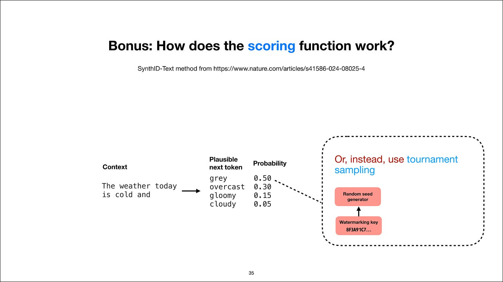</a><figcaption>Slide 35 of 52, time stamp 33:35</figcaption></figure>
> 
> This tournament process ensures the final selected token carries the watermark signature.

> <figure><figcaption>第 35 页/共 52 页，时间戳 33:35</figcaption></figure>
> 
> 这一锦标赛过程确保了最终选定的词元带有水印签名。

> <figure><a href="https://substackcdn.com/image/fetch/$s_!lUpe!,f_auto,q_auto:good,fl_progressive:steep/https%3A%2F%2Fsubstack-post-media.s3.amazonaws.com%2Fpublic%2Fimages%2F27a7a689-db67-4c21-9f9b-7912ad7b0825_6667x3750.png" rel="noopener noreferrer" referrerpolicy="no-referrer" target="_blank">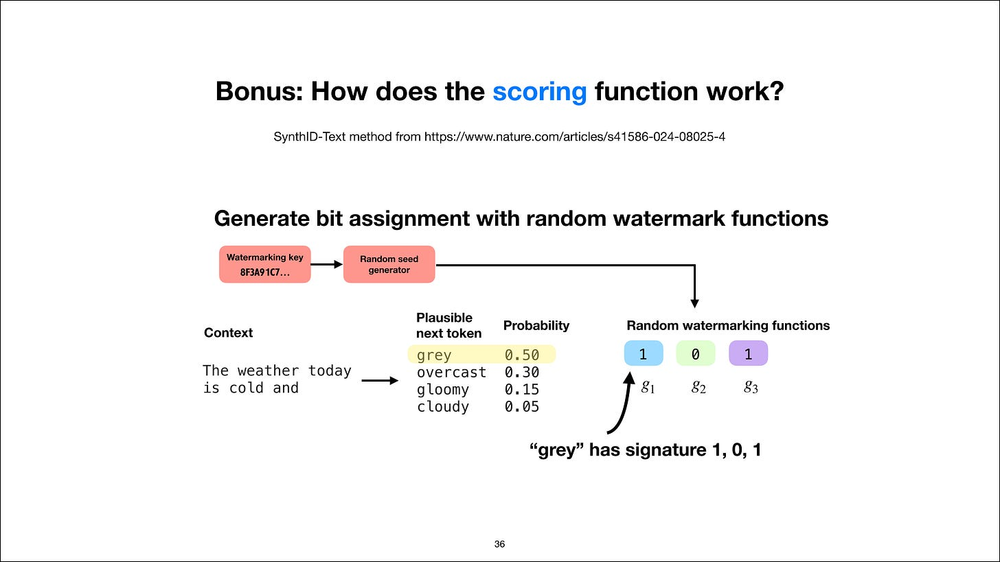</a><figcaption>Slide 36 of 52, time stamp 34:35</figcaption></figure>
> 
> Each token gets a bit signature from the watermark functions.

> <figure><figcaption>第 36 页/共 52 页，时间戳 34:35</figcaption></figure>
> 
> 每个词元从水印函数中获得一个位签名（bit signature）。

> <figure><a href="https://substackcdn.com/image/fetch/$s_!DXbc!,f_auto,q_auto:good,fl_progressive:steep/https%3A%2F%2Fsubstack-post-media.s3.amazonaws.com%2Fpublic%2Fimages%2Fd7e7fae5-8fa0-4f28-9d04-6323df2dfb48_6667x3750.png" rel="noopener noreferrer" referrerpolicy="no-referrer" target="_blank">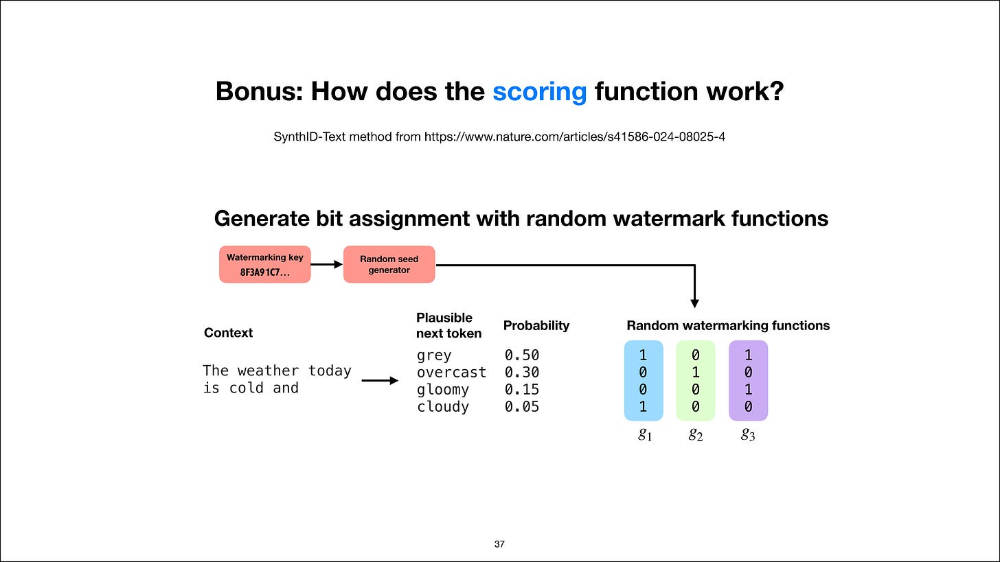</a><figcaption>Slide 37 of 52, time stamp 36:00</figcaption></figure>
> 
> These signatures are the basis for the tournament.

> <figure><figcaption>第 37 页/共 52 页，时间戳 36:00</figcaption></figure>
> 
> 这些签名是锦标赛的基础。

> <figure><a href="https://substackcdn.com/image/fetch/$s_!gcLv!,f_auto,q_auto:good,fl_progressive:steep/https%3A%2F%2Fsubstack-post-media.s3.amazonaws.com%2Fpublic%2Fimages%2F3264ab70-66d2-4c8e-a84e-5fdcc0c12cb6_6667x3750.png" rel="noopener noreferrer" referrerpolicy="no-referrer" target="_blank">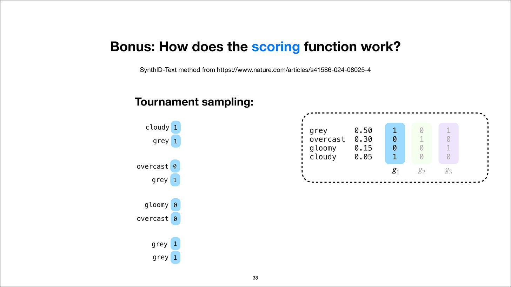</a><figcaption>Slide 38 of 52, time stamp 36:39</figcaption></figure>
> 
> Tokens are paired up, and the winner is determined by the watermark function.

> <figure><figcaption>第 38 页/共 52 页，时间戳 36:39</figcaption></figure>
> 
> 词元被两两配对，由水印函数决定胜者。

> <figure><a href="https://substackcdn.com/image/fetch/$s_!Leog!,f_auto,q_auto:good,fl_progressive:steep/https%3A%2F%2Fsubstack-post-media.s3.amazonaws.com%2Fpublic%2Fimages%2Ffb21bf96-2b71-41d0-83e7-03c2917a1922_6667x3750.png" rel="noopener noreferrer" referrerpolicy="no-referrer" target="_blank">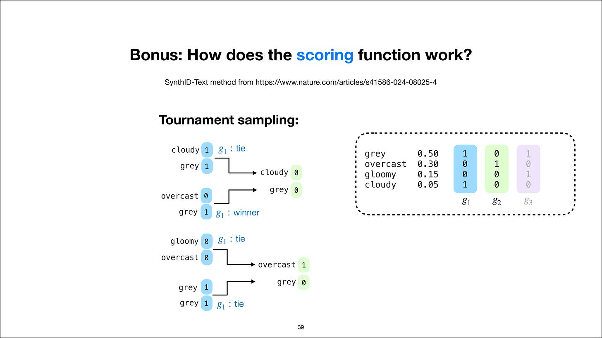</a><figcaption>Slide 39 of 52, time stamp 38:24</figcaption></figure>
> 
> The tournament proceeds until one token remains.

> <figure><figcaption>第 39 页/共 52 页，时间戳 38:24</figcaption></figure>
> 
> 锦标赛一直进行，直到只剩下一个词元。

> <figure><a href="https://substackcdn.com/image/fetch/$s_!Hxlf!,f_auto,q_auto:good,fl_progressive:steep/https%3A%2F%2Fsubstack-post-media.s3.amazonaws.com%2Fpublic%2Fimages%2Fd2b79f05-4b0f-4045-a07c-224d89465d28_6667x3750.png" rel="noopener noreferrer" referrerpolicy="no-referrer" target="_blank">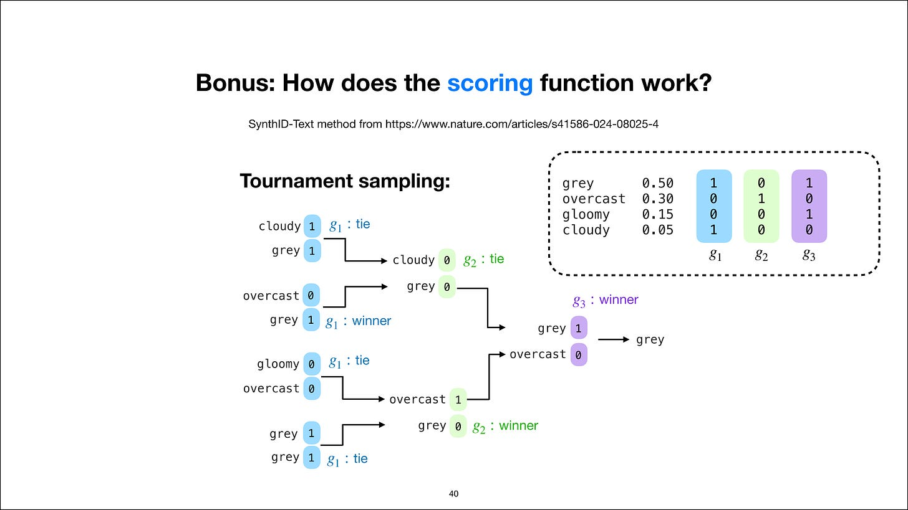</a><figcaption>Slide 40 of 52, time stamp 39:11</figcaption></figure>
> 
> This process is repeated for every token generated.

> <figure><figcaption>第 40 页/共 52 页，时间戳 39:11</figcaption></figure>
> 
> 生成的每个词元都会重复此过程。

> <figure><a href="https://substackcdn.com/image/fetch/$s_!Oir1!,f_auto,q_auto:good,fl_progressive:steep/https%3A%2F%2Fsubstack-post-media.s3.amazonaws.com%2Fpublic%2Fimages%2Fed543675-e6a6-4eed-8392-df4709b97411_6667x3750.png" rel="noopener noreferrer" referrerpolicy="no-referrer" target="_blank">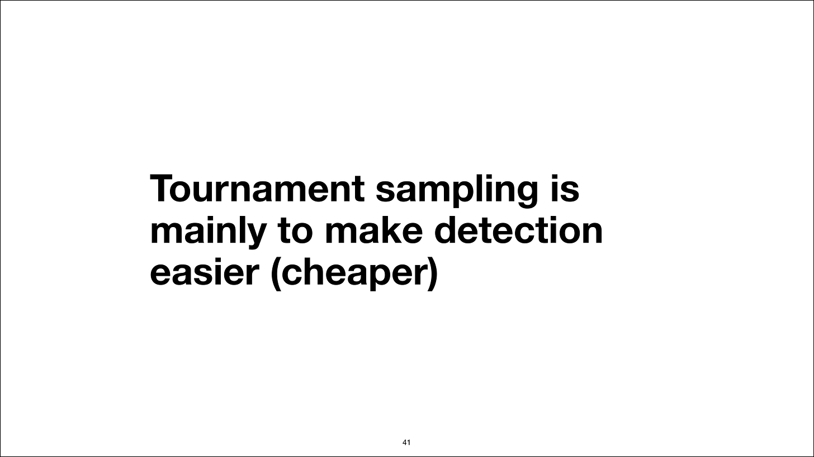</a><figcaption>Slide 41 of 52, time stamp 39:43</figcaption></figure>
> 
> The main benefit is the ease of detection.

> <figure><figcaption>第 41 页/共 52 页，时间戳 39:43</figcaption></figure>
> 
> 主要的好处是检测变得更加容易。

> <figure><a href="https://substackcdn.com/image/fetch/$s_!GmD4!,f_auto,q_auto:good,fl_progressive:steep/https%3A%2F%2Fsubstack-post-media.s3.amazonaws.com%2Fpublic%2Fimages%2F537b1439-71ce-4fa1-8206-b12712297d85_6667x3750.png" rel="noopener noreferrer" referrerpolicy="no-referrer" target="_blank">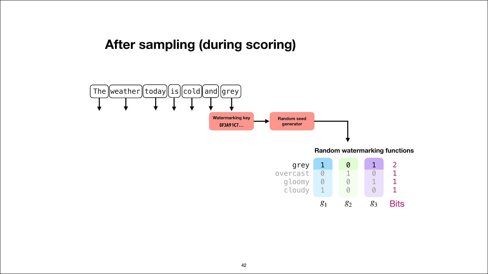</a><figcaption>Slide 42 of 52, time stamp 39:48</figcaption></figure>
> 
> To detect, we simply re-run the watermark functions on the text and check the scores.

> <figure><figcaption>第 42 页/共 52 页，时间戳 39:48</figcaption></figure>
> 
> 为了进行检测，我们只需在文本上重新运行水印函数并检查得分即可。

> <figure><a href="https://substackcdn.com/image/fetch/$s_!Wvvc!,f_auto,q_auto:good,fl_progressive:steep/https%3A%2F%2Fsubstack-post-media.s3.amazonaws.com%2Fpublic%2Fimages%2Feb28d448-0556-4a55-9b38-91d34f1a704e_6667x3750.png" rel="noopener noreferrer" referrerpolicy="no-referrer" target="_blank">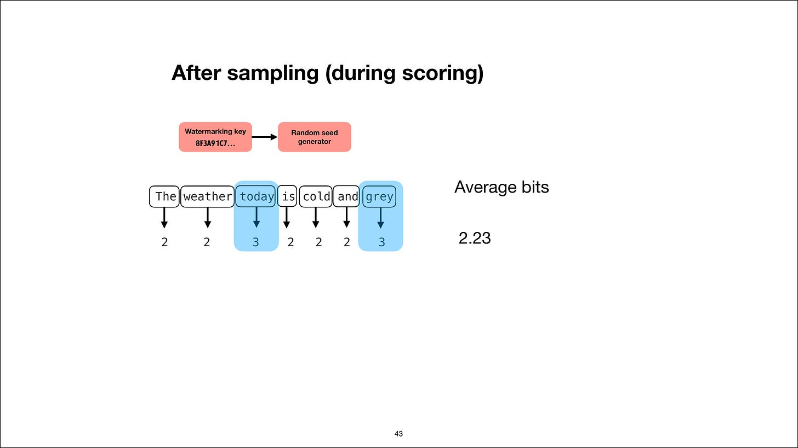</a><figcaption>Slide 43 of 52, time stamp 41:33</figcaption></figure>
> 
> We average the scores to get a final metric.

> <figure><figcaption>第 43 页/共 52 页，时间戳 41:33</figcaption></figure>
> 
> 我们对得分取平均值以获得最终指标。

> <figure><a href="https://substackcdn.com/image/fetch/$s_!80sV!,f_auto,q_auto:good,fl_progressive:steep/https%3A%2F%2Fsubstack-post-media.s3.amazonaws.com%2Fpublic%2Fimages%2F6091c355-86ee-4f3e-9548-c9333b29434d_6667x3750.png" rel="noopener noreferrer" referrerpolicy="no-referrer" target="_blank">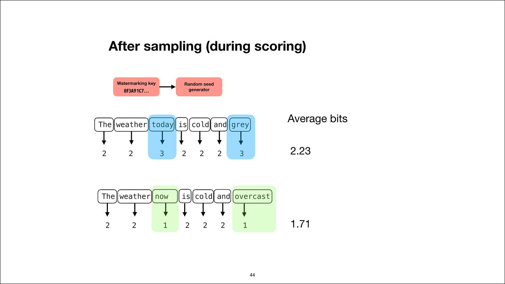</a><figcaption>Slide 44 of 52, time stamp 41:55</figcaption></figure>
> 
> Comparing the average score against a threshold determines if the text is watermarked.

> <figure><figcaption>第 44 页/共 52 页，时间戳 41:55</figcaption></figure>
> 
> 将平均得分与阈值进行比较，即可确定文本是否带有水印。

> <figure><a href="https://substackcdn.com/image/fetch/$s_!s8yD!,f_auto,q_auto:good,fl_progressive:steep/https%3A%2F%2Fsubstack-post-media.s3.amazonaws.com%2Fpublic%2Fimages%2Fcbcca868-1869-41ae-8db6-72eb3dea17f8_6667x3750.png" rel="noopener noreferrer" referrerpolicy="no-referrer" target="_blank">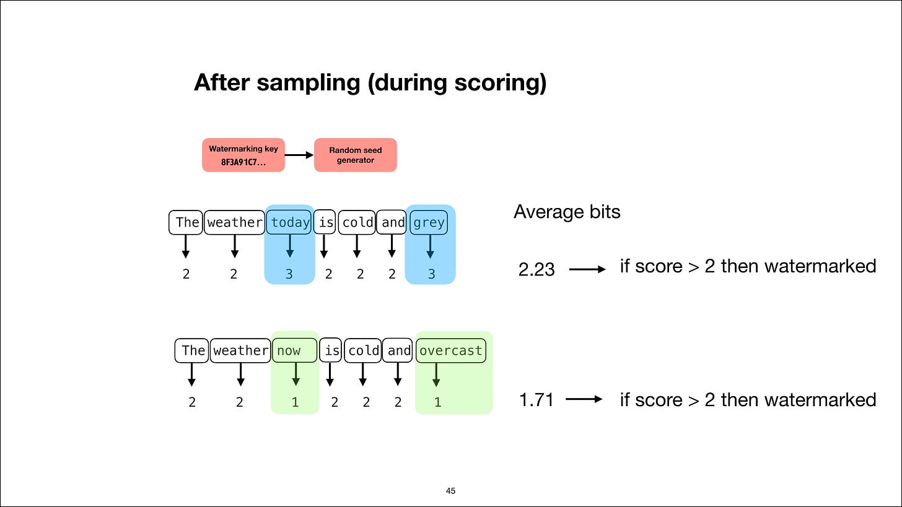</a><figcaption>Slide 45 of 52, time stamp 42:27</figcaption></figure>
> 
> This thresholding is the final step in detection.

> <figure><figcaption>第 45 页/共 52 页，时间戳 42:27</figcaption></figure>
> 
> 这种阈值判定是检测的最后一步。

> <figure><a href="https://substackcdn.com/image/fetch/$s_!VlU3!,f_auto,q_auto:good,fl_progressive:steep/https%3A%2F%2Fsubstack-post-media.s3.amazonaws.com%2Fpublic%2Fimages%2Fb678a404-4f29-433b-8e1a-1d16a5654d86_6667x3750.png" rel="noopener noreferrer" referrerpolicy="no-referrer" target="_blank">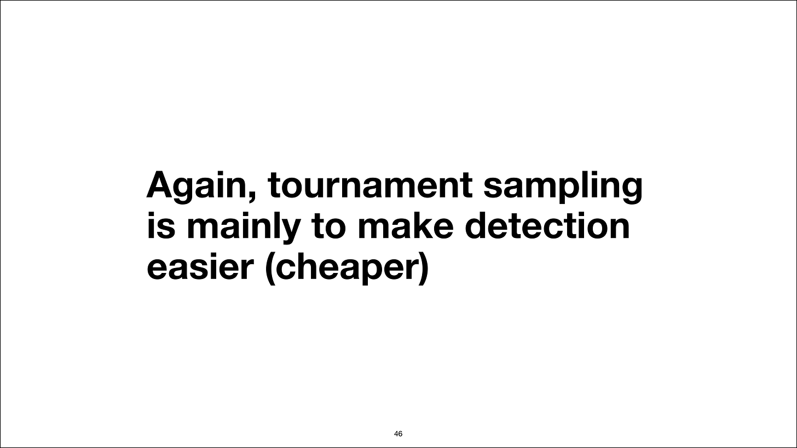</a><figcaption>Slide 46 of 52, time stamp 43:13</figcaption></figure>
> 
> Tournament sampling is a clever way to make detection computationally feasible.

> <figure><figcaption>第 46 页/共 52 页，时间戳 43:13</figcaption></figure>
> 
> 锦标赛采样是一种巧妙的方法，使检测在计算上切实可行。

> <figure><figcaption>Slide 47 of 52, time stamp 43:30</figcaption></figure>
> 
> The key difference is the use of the watermarking key during the sampling stage.

> <figure><figcaption>第 47 页/共 52 页，时间戳 43:30</figcaption></figure>
> 
> 关键区别在于在采样阶段使用了水印密钥。

> <figure><a href="https://substackcdn.com/image/fetch/$s_!xrp1!,f_auto,q_auto:good,fl_progressive:steep/https%3A%2F%2Fsubstack-post-media.s3.amazonaws.com%2Fpublic%2Fimages%2F0815782a-1457-4222-86fe-35187fba75ad_6667x3750.png" rel="noopener noreferrer" referrerpolicy="no-referrer" target="_blank">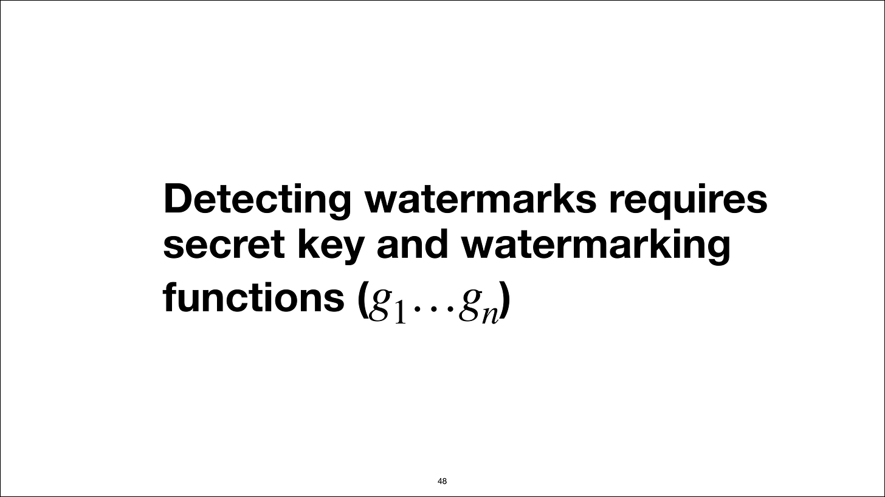</a><figcaption>Slide 48 of 52, time stamp 43:54</figcaption></figure>
> 
> Detection requires the secret key and the specific watermark functions.

> <figure><figcaption>第 48 页/共 52 页，时间戳 43:54</figcaption></figure>
> 
> 检测需要密钥和特定的水印函数。

> <figure><a href="https://substackcdn.com/image/fetch/$s_!Pnq6!,f_auto,q_auto:good,fl_progressive:steep/https%3A%2F%2Fsubstack-post-media.s3.amazonaws.com%2Fpublic%2Fimages%2Fbedeb156-512f-443b-b564-b49fbf87ad88_6667x3750.png" rel="noopener noreferrer" referrerpolicy="no-referrer" target="_blank">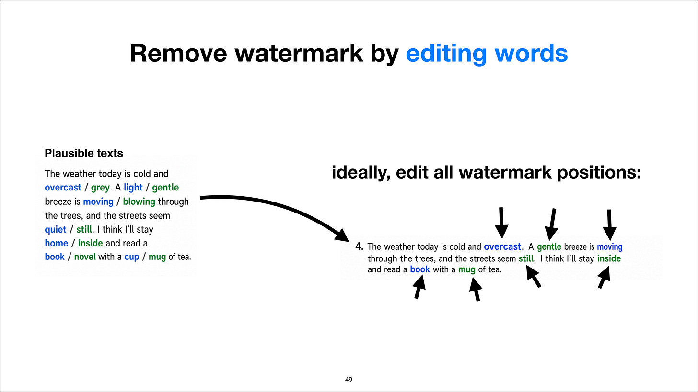</a><figcaption>Slide 49 of 52, time stamp 44:29</figcaption></figure>
> 
> Removing the watermark is difficult because you don't know which positions are watermarked.

> <figure><figcaption>第 49 页/共 52 页，时间戳 44:29</figcaption></figure>
> 
> 移除水印很困难，因为你不知道哪些位置带有水印。

> <figure><a href="https://substackcdn.com/image/fetch/$s_!zF4B!,f_auto,q_auto:good,fl_progressive:steep/https%3A%2F%2Fsubstack-post-media.s3.amazonaws.com%2Fpublic%2Fimages%2F0d06fae7-8fb4-4b20-b06c-7dc027d3de47_6667x3750.png" rel="noopener noreferrer" referrerpolicy="no-referrer" target="_blank">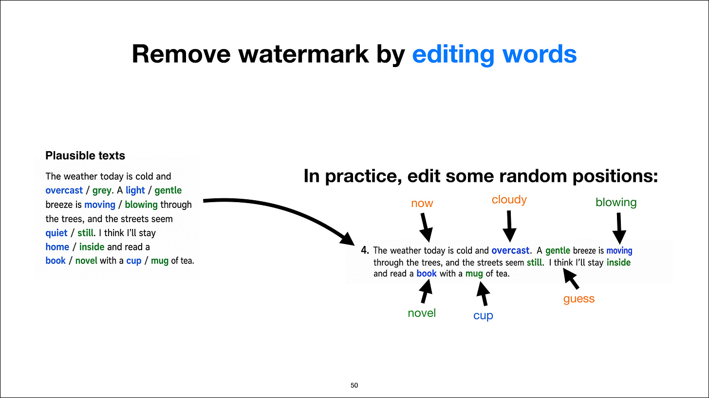</a><figcaption>Slide 50 of 52, time stamp 44:36</figcaption></figure>
> 
> This may lead to "edited" AI text that is lower quality.

> <figure><figcaption>第 50 页/共 52 页，时间戳 44:36</figcaption></figure>
> 
> 这可能会导致“编辑后的”AI 文本质量变低。

> <figure><a href="https://substackcdn.com/image/fetch/$s_!nTtJ!,f_auto,q_auto:good,fl_progressive:steep/https%3A%2F%2Fsubstack-post-media.s3.amazonaws.com%2Fpublic%2Fimages%2F703349f3-c2ce-4982-8261-79dcdc270588_6667x3750.png" rel="noopener noreferrer" referrerpolicy="no-referrer" target="_blank">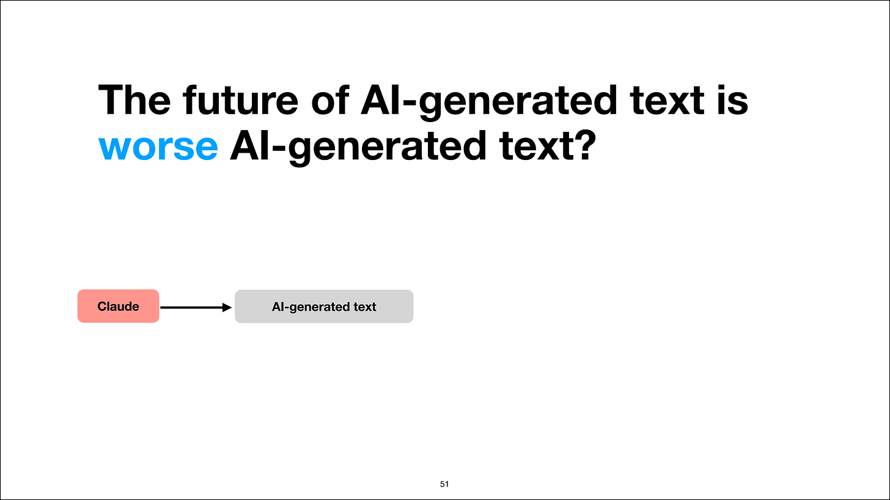</a><figcaption>Slide 51 of 52, time stamp 45:08</figcaption></figure>
> 
> Users might simply use local, non-watermarked models to edit the text, creating a more complex pipeline.

> <figure><figcaption>第 51 页/共 52 页，时间戳 45:08</figcaption></figure>
> 
> 用户可能会简单地使用本地无水印模型来编辑文本，从而创建一个更复杂的处理管道。

> <figure><a href="https://substackcdn.com/image/fetch/$s_!9J2O!,f_auto,q_auto:good,fl_progressive:steep/https%3A%2F%2Fsubstack-post-media.s3.amazonaws.com%2Fpublic%2Fimages%2F9ada6371-d4ee-491d-a25e-5292087efaa3_6667x3750.png" rel="noopener noreferrer" referrerpolicy="no-referrer" target="_blank">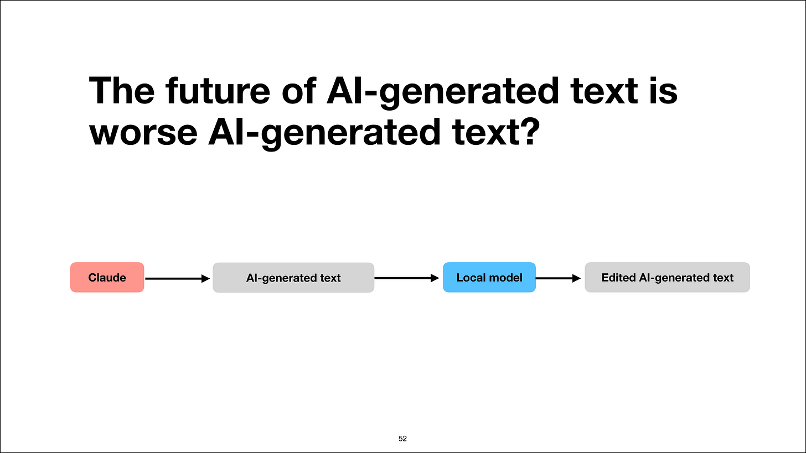</a><figcaption>Slide 52 of 52, time stamp 47:20</figcaption></figure>
> 
> I hope this behind-the-scenes look was useful!

> <figure><figcaption>第 52 页/共 52 页，时间戳 47:20</figcaption></figure>
> 
> 希望这次幕后探秘对大家有所帮助！

---

> *PS: If you like more explainers in this style, I have accumulated over 300 videos over the years, which you can find on [my YouTube channel](https://www.youtube.com/@SebastianRaschka).*

> *附言：如果你喜欢这种风格的更多解析文章，我在过去几年中积累了 300 多个视频，你可以在[我的 YouTube 频道](https://www.youtube.com/@SebastianRaschka)上找到它们。*