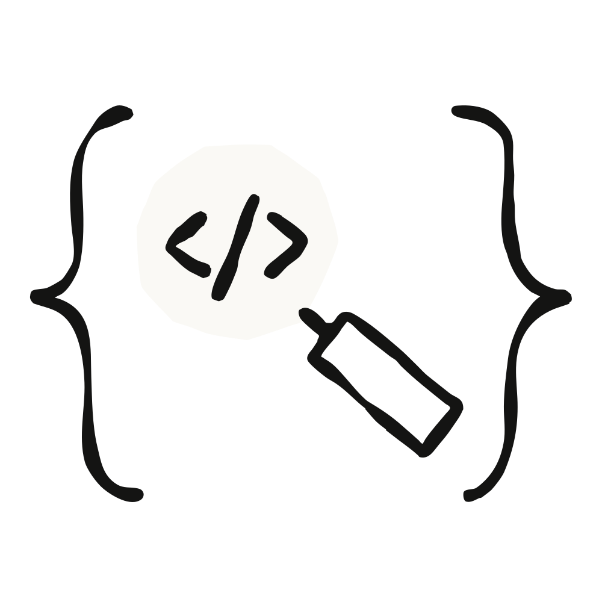

---
authors:
- aitoboxrobot
categories:
- 产品发布
date: 2026-08-23
hide:
- navigation
tags:
- AI智能体
- monday.com
- Claude
- 平台转型
- 协同工作
title: monday.com 是如何将其平台转型为人类与智能体协作的“智能体优先”产品的
---
### 文章背景与核心概要
在经历了简单 AI 附加功能的瓶颈期后，项目管理与协作平台 monday.com 进行了根本性的架构变革，围绕 Claude 重构了其平台，打造出真正的“智能体优先”（agent-first）体验。通过超越“AI点缀”（即在现有工作流中简单嵌入功能），该公司成功将 AI 智能体集成为了积极的团队成员。上线两个月后，该平台已促进了超过五00万次的人机交互，证明了将 AI 深度融入现有工作流是实现持续 AI 采纳的关键所在。

> After hitting a ceiling with simple AI add-ons, monday.com underwent a fundamental architectural shift, rebuilding its platform around Claude to create a truly agent-first experience. By moving beyond "AI dust"—sprinkling features onto existing workflows—the company successfully integrated AI agents as active teammates. Two months post-launch, the platform has facilitated over five million human-agent interactions, proving that deep integration within existing workflows is the key to sustained AI adoption.

---

## 击碎“AI 点缀”的天花板
monday.com 的转型经历了三个阶段。最初，团队专注于将 AI 功能嵌入其现有的可视化界面中。虽然这在早期引起了轰动，但团队很快意识到，他们只是在构建“AI 点缀”——这些自动化并未从根本上改变价值主张，也没有创造出长期的使用习惯。

> ## Hitting the “AI dust” ceiling
> monday.com’s transformation occurred in three phases. Initially, the team focused on embedding AI capabilities into their existing visual interface. While this generated early excitement, the team soon realized they were merely building "AI dust"—automations that didn't fundamentally change the value proposition or create long-term usage patterns.

“采纳 AI 功能并不等于成为一家 AI 公司，”AI 平台产品副总裁 Orly Stern Izhaki 表示。该公司改变了战略使命：不再是在功能上添加 AI，而是将平台重新构建为一个让人类和智能体能够原生协作的地方，并充分利用现有的上下文、看板和治理机制。

> "Adopting AI features is not the same as becoming an AI company," says Orly Stern Izhaki, VP of Product, AI Works Platform. The company shifted its mandate: instead of adding AI to features, they would rebuild the platform to be a place where humans and agents work together natively, utilizing existing context, boards, and governance.

## 智能体作为团队成员
为了缩短抽象的 AI 概念与具体工作之间的距离，monday.com 将智能体设计得如同同事一般。每个智能体都被赋予了一个名字和头像，用户可以通过触发器和 @提及（mentions）为其分配任务。这种设计避免了 AI 聊天界面常有的弊端——即聊天界面独立于实际工作并行运行，而不是融入其中。

> ## Agents as teammates
> To bridge the gap between abstract AI concepts and concrete work, monday.com designed agents to act like colleagues. Each agent is assigned a name and an avatar, and users can assign them tasks via triggers and mentions. This design prevents the common pitfall of AI chat interfaces that run parallel to, rather than within, actual work.

### 智能体工作流实战
| 用例 | 工作内容 |
| :--- | :--- |
| **IT —— 从工单到解决** | 接收与分诊智能体、知识智能体、事件智能体 |
| **HR —— 从职位发布到入职** | 简历筛选智能体、面试排程智能体、招聘协调智能体、反馈管理智能体 |
| **市场营销 —— 竞争情报** | 竞争情报智能体、竞争卡片智能体 |
| **高管办公室 —— 幕僚长（Chief of Staff）** | 运营智能体、组织健康智能体、战略顾问智能体 |

> ### Agent Workflows in Action
> | Use case | Jobs |
> | :--- | :--- |
> | **IT — From ticket to resolution** | Intake & Triage Agent, Knowledge Agent, Incident Agent |
> | **HR — From job post to hire** | Resume Screener, Interview Scheduler, Hiring Coordinator, Feedback Manager |
> | **Marketing — Competitive intelligence** | Competitive Intelligence Agent, Battlecard Agent |
> | **Executive Office — Chief of Staff** | Operator Agent, Org Health Agent, Strategy Consultant Agent |

## 在 monday 中运行 Claude 的四种方式
客户可以通过四种主要功能与 Claude 进行交互：
1. **monday 智能体（monday Agents）：** 使用提示词构建自定义智能体，为其赋予名字、头像以及看板上的特定位置。
2. **自带智能体（BYOA）：** 允许 Claude 托管智能体（Claude Managed Agents）作为团队成员加入平台，供整个团队访问。
3. **预构建智能体：** 来自 monday 智能体商店（monday Agents Store）的专业插件（例如针对法务或财务团队）。
4. **Claude 编码集成：** 将 Claude 连接到仪表盘，以便在客户自己的环境中规划和执行任务。

> ## Four ways to run Claude in monday
> Customers interact with Claude through four primary capabilities:
> 1. **monday Agents:** Build custom agents using prompts, giving them a name, face, and specific place on a board.
> 2. **Bring Your Own Agent (BYOA):** Allows Claude Managed Agents to join the platform as a teammate accessible to the whole team.
> 3. **Pre-built Agents:** Specialized plugins from the monday Agents Store (e.g., for legal or finance teams).
> 4. **Claude Coding integration:** Connects Claude to the dashboard to plan and execute tasks within the customer's own environment.

## 现实世界的影响：Cooke
全球最大的家族海鲜企业 Cooke 已经集成了 Claude 和 monday 来管理 200 个活跃项目。通过利用智能体来自动化状态报告、风险暴露和合同数据准备，他们已经从一个需要手动更新的平台，转型为一个能够积极推动团队产能和资源分配的平台。

> ## Real-world impact: Cooke
> Cooke, the world's largest family-owned seafood company, has integrated Claude and monday to manage 200 active projects. By using agents to automate status reports, risk surfacing, and contract data prep, they have shifted from a platform that required manual updates to one that actively drives team capacity and resource allocation.

## 转型过程中的经验教训
对于希望经历类似转型的组织，monday.com 团队总结了五个关键要点：

*   **心理模型的改变比技术更难：** 从“改进当前产品”转向“为不同的未来重建”是一个重大的文化障碍。
*   **小团队行动更快：** 当一切（用户体验、定价、战略）都在变化时，拥有明确所有权和决策权的小团队往往更有效率。
*   **信任与能力同等重要：** 治理、权限和可靠性是决定智能体能否从试点项目走向生产环境的决定性因素。
*   **能力需要基础设施支撑：** 为了支持智能体的庞大体量和复杂性，后端必须足够稳健——monday 投资构建了 *monday DB* 来处理数据负载。
*   **基于已有成效的产品进行构建：** monday.com 的核心承诺——人们携手合作推动成果——保持不变；唯一的不同在于，现在团队中的某些成员变成了智能体。

> ## Lessons learned from the transition
> For organizations looking to undergo a similar transformation, the monday.com team offers five key takeaways:
> 
> *   **Mental models are harder to change than technology:** Shifting from "improving the current product" to "rebuilding for a different future" is a significant cultural hurdle.
> *   **Small teams move faster:** When everything (UX, pricing, strategy) is in flux, small teams with clear ownership and decision rights are more effective.
> *   **Trust is as important as capability:** Governance, permissions, and reliability are the deciding factors in whether agents move from pilot programs to production.
> *   **Capability needs infrastructure:** To support the volume and complexity of agents, the backend must be robust—monday invested in *monday DB* to handle the data load.
> *   **Build on what already works:** The core promise of monday.com—people teaming up to drive outcomes—remains the same; the only difference is that some team members are now agents.

---

*Category: Agents | Product: Claude Enterprise | Date: August 20, 2026 | Reading time: 5 min*