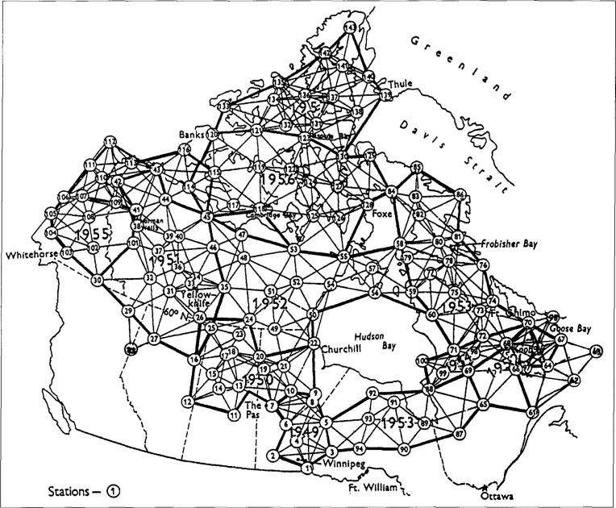
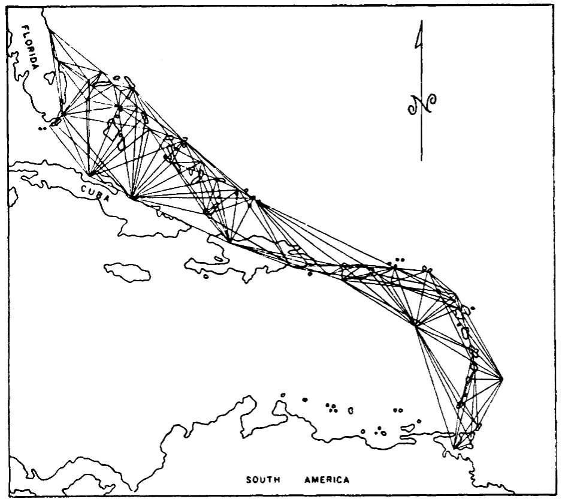
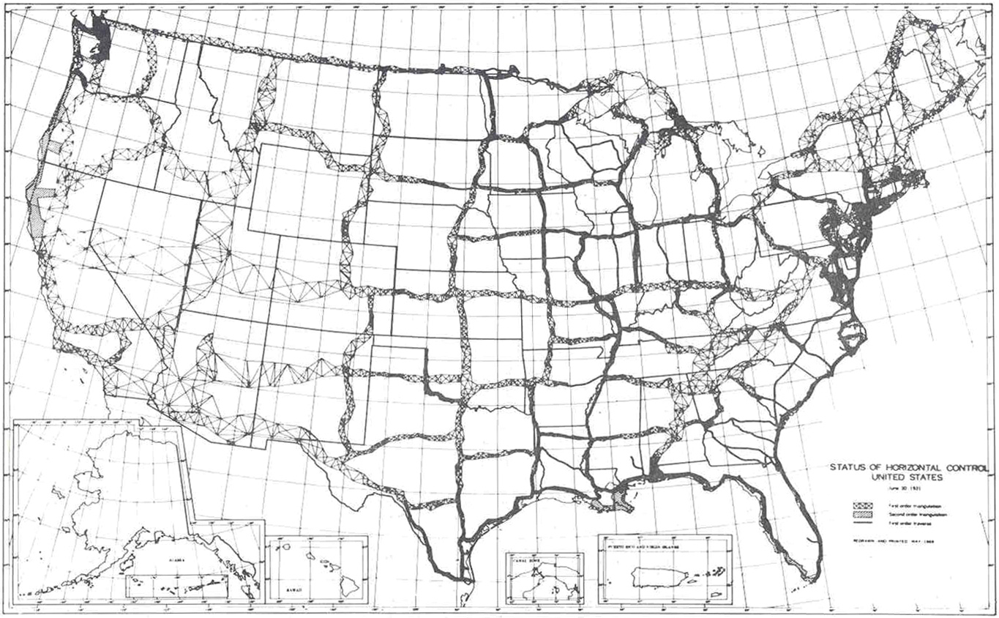
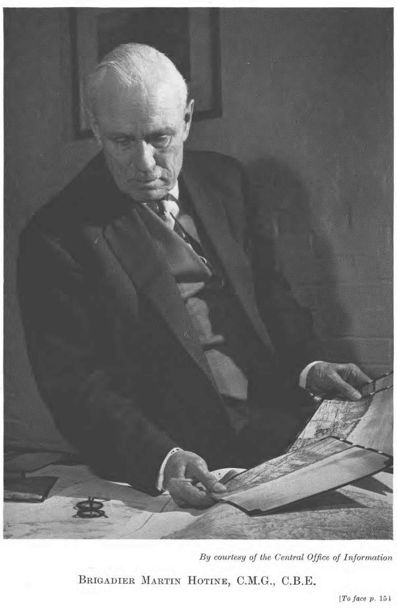

---
authors:
- aitoboxrobot
categories:
- 研究解读
date: 2026-08-24
hide:
- navigation
tags:
- 大地测量学
- 历史
- 空间定位
- WGS84
- 军事测绘
title: 地球的形状：大地测量学史
---
### 文章背景与核心概要
本文深入探讨了大地测量学（即测量地球科学）的演变历程，从18世纪早期的局部三角测量，到现代基于卫星的全球系统。文章重点介绍了马丁·霍蒂恩（Martin Hotine）准将的杰出工作，并剖析了军事需求（特别是两次世界大战和冷战期间）在我们加深对地球形状理解方面所起的关键作用。

叙事从物理“三角点”和基于无线电的导航（SHORAN/HIRAN）过渡到了世界大地测量系统（WGS）的创建，正是这一系统构成了现代全球定位的基础。通过回顾这些跨越数十年、融合了跨大西洋飞行测量与追求极致精度的技术史，我们可以看到现代地理空间数据背后所凝聚的不朽智慧。

---

## 精确的建筑师：马丁·霍蒂恩
> The Architect of Precision: Martin Hotine

马丁·霍蒂恩准将的外表往往显得不修边幅、心不在焉，但这掩盖了他内心那项测量大英帝国的宏伟宏图。除了他的军事勋章之外，他真正的遗产在于他为大英帝国重新三角测量而设计的“三角点”——顶部带有黄铜板的混凝土柱。他的工作彻底革新了大地测量学，并为后来横跨大西洋的宏伟国际合作奠定了基础。

> Brigadier Martin Hotine was a man whose outward appearance—often disheveled and distracted—belied a mind occupied by the monumental task of measuring the British Empire. Beyond his military decorations, his true legacy lies in the "trig points"—concrete pillars topped with brass plates—that he designed for the Retriangulation of Great Britain. His work revolutionized geodesy and set the stage for ambitious international collaborations that would eventually span the Atlantic.

## “地球形状”的复杂性
> The Complexity of the "Figure of the Earth"

大地测量学的复杂性往往具有欺骗性。虽然我们经常将地球简化为一个球体，但它实际上是一个混乱且不规则的形状。
*   **大地水准面（The Geoid）：** 由重力定义，如果地球被一片平静的水域覆盖，这就是地球呈现的形状。由于重力随地壳密度的变化而变化，因此大地水准面是不规则的。
*   **椭球体（The Ellipsoid）：** 为了进行计算，大地测量学家使用椭球体——这是对大地水准面的数学近似。
*   **大地测量基准（The Datum）：** 椭球体必须锚定在特定的位置和方向上才具有实用价值。“基准”将这种形状与参考点结合起来，以实现准确的三维测绘。

> Geodesy is deceptively complex. While we often simplify the Earth to a sphere, it is, in reality, a chaotic, irregular shape. 
> *   **The Geoid:** Defined by gravity, this is the shape the Earth would take if covered in undisturbed water. Because gravity varies based on crustal density, the geoid is irregular.
> *   **The Ellipsoid:** To make calculations possible, geodesists use an ellipsoid—a mathematical approximation of the geoid.
> *   **The Datum:** An ellipsoid must be anchored to a specific location and orientation to be useful. A "datum" combines this shape with reference points to allow for accurate 3D mapping.

## 波束之战与无线电导航
> The Battle of the Beams and Radionavigation

精确测绘的需求由于二战期间航空业的发展和“波束之战”而加速。随着轰炸机转向夜间作战，同盟国和轴心国都开发了无线电导航系统。美国无线电公司（RCA）的 **SHORAN**（短程导航）系统通过测量无线电脉冲的飞行时间，实现了前所未有的定位精度。这项技术非常准确，以至于它帮助修正了当时公认的光速值。

> The necessity of accurate mapping was accelerated by the demands of aviation and the "Battle of the Beams" during WWII. As bombers shifted to night-time operations, both Allied and Axis forces developed radionavigation systems. RCA’s **SHORAN** (Short Range Navigation) system, which measured the time-of-flight of radio pulses, allowed for unprecedented precision in positioning. This technology proved so accurate that it helped refine the accepted value of the speed of light.

## 冷战与全球基准
> The Cold War and the Global Datum

随着冷战的拉开帷幕，建立统一全球地图的需求成了国家安全问题。军事规划人员意识到，不同的国家使用不同的基准（如美国的 NAD27 和欧洲的 ED50），这导致边境地区出现危险的偏差。为了精确瞄准洲际弹道导弹（ICBM），军方需要一个单一的、统一的参考系统。

这催生了**北大西洋联测（North Atlantic Tie）**，这是一项大规模的三边测量工程。测量员使用改装的 B-50 超级堡垒轰炸机，从加拿大到挪威一路跳岛，在大西洋上空进行“跨线”测量。

> As the Cold War dawned, the need for a unified global map became a matter of national security. Military planners realized that different countries used different datums (like NAD27 in the US and ED50 in Europe), leading to dangerous misalignments at borders. To aim ICBMs accurately, the military required a single, unified reference system.
> 
> This led to the **North Atlantic Tie**, a massive trilateration project. Using modified B-50 Superfortresses, surveyors performed "line-crossing" measurements across the Atlantic, island-hopping from Canada to Norway.

## 全球大地测量学的遗产
> The Legacy of Global Geodesy

北大西洋联测促成了**1960年世界大地测量系统（WGS60）**的诞生，这也是今天 GPS 所使用的现代 WGS84 的前身。虽然像横贯大陆大三角测量这样的物理测绘在 20 世纪 70 年代迎来了它的“最后辉煌”，但该领域最终还是迈入了太空时代。

今天，我们认为准确的地理空间数据是理所当然的，但我们的地图是数十年来人类智慧、大西洋上空寒冷飞行的结晶，也是马丁·霍蒂恩等人物对精确度孜孜不倦追求的结果。

> The North Atlantic Tie contributed to the **World Geodetic System of 1960 (WGS60)**, the ancestor of the modern WGS84 used by GPS today. While physical surveying—like the Transcontinental Traverse—had its "last hurrah" in the 1970s, the field eventually moved into the space age. 
> 
> Today, we take accurate geospatial data for granted, but our maps are the result of decades of ingenuity, freezing flights over the Atlantic, and the relentless pursuit of precision by figures like Martin Hotine.

---
*如果你喜欢这篇关于测绘与历史的探索，可以考虑[在 Ko-fi 上支持作者](https://ko-fi.com/jbcrawford)。*