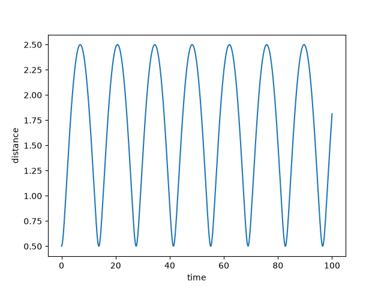
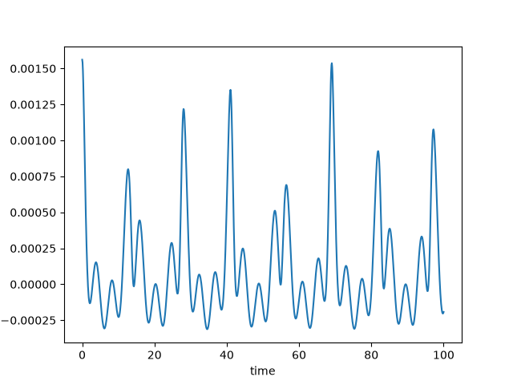

---
authors:
- aitoboxrobot
categories:
- 研究解读
date: 2026-08-24
hide:
- navigation
tags:
- 天体力学
- 行星轨道
- Python
- 轨道倾角
title: 轨道倾角带来的差异
---
### 文章背景与核心概要
在计算地球与火星随时间变化的距离时，人们通常会将行星轨道近似为共面椭圆。然而，火星的轨道实际上相对于地球轨道倾斜了约 1.85°。本文探讨了这种轨道倾角对整体距离计算究竟产生了多大的影响，并展示了一个有趣的现象：尽管这种效应很小（比主要的距离变化小约三个数量级），但其产生的误差模式却出人意料地呈现出不规则的波动。

> ## Summary
> When calculating the distance between Earth and Mars over time, planetary orbits are often approximated as coplanar ellipses. However, Mars's orbit is actually tilted by about 1.85° relative to Earth's. This article explores just how much difference that orbital inclination makes to the overall distance calculation, demonstrating that while the effect is small—about three orders of magnitude less than the primary distance variation—its resulting pattern is surprisingly erratic.

---

## 共面轨道与倾斜轨道

假设你想要计算地球和火星随时间变化的距离。在第一近似下，两颗行星都在同一个平面上以椭圆轨道绕太阳运行。

如果你想更精确一些，就需要考虑到火星轨道的倾斜——它相对于地球轨道倾斜了大约 1.85°。这会带来多大的差异呢？

为了简化问题，我们假设地球在一个半径为 1 的圆轨道上绕太阳运行，而火星在一个半径为 1.5 的圆轨道上绕太阳运行。随时间推移，地球与火星之间的距离基本上会呈现出正弦波形。

> ## Coplanar vs. Inclined Orbits
> 
> Suppose you wanted to find the distance between Earth and Mars over time. To a first approximation, both planets orbit the sun in elliptic orbits in the same plane.
> 
> If you wanted to be more accurate, you’d need to take into account the fact that the orbit of Mars is tilted about 1.85° relative to the Earth’s orbit. How much difference does that make?
> 
> To simplify things, let’s assume the Earth orbits the sun in a circle of radius 1 and Mars orbits the sun in a circle of radius 1.5. The distance between Earth and Mars over time would be basically sinusoidal.



## 量化倾角的影响

倾角对这个距离有多大贡献？换句话说，考虑火星轨道倾角计算出的距离，与假设两个轨道在同一平面时计算出的距离之间有什么区别？

下面这张图给出了答案。

> ## Quantifying the Impact of Inclination
> 
> How much does inclination contribute to this distance? In other words, what is the difference between the distance accounting for the inclination of Mars’ orbit and the distance if we assume the two orbits are in the same plane?
> 
> This plot gives the answer.



这种影响并不大，比主要效应小了约三个数量级，但有趣的是它表现得非常不规则。

> The effect is not large, about three orders of magnitude smaller than the main effect, but it’s interesting how erratic it is.

---

## Python 实现

上述图表是通过以下代码制作的：

> ## Python Implementation
> 
> The plots were made with the following code:

```python
from numpy import *

R = 1.5
T = R**1.5 # Kepler's third law

def f(t, theta):
    return sqrt(
        (cos(t) - R*cos(t/T)*cos(theta))**2 +
        (sin(t) - R*sin(t/T))**2 +
        (R*sin(theta)*cos(t/T))**2
    )
```

第一张图绘制了 $f(t, \theta)$，第二张图绘制了 $f(t, \theta) - f(t, 0)$。

> The first plot graphs $f(t, \theta)$ and the second graphs $f(t, \theta) - f(t, 0)$.

***

*来源：文章 [The difference orbit inclination makes](https://www.johndcook.com/blog/2026/08/22/inclination/) 最初发布于 [John D. Cook](https://www.johndcook.com/blog)。*

> *Source: The post [The difference orbit inclination makes](https://www.johndcook.com/blog/2026/08/22/inclination/) first appeared on [John D. Cook](https://www.johndcook.com/blog).*