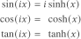
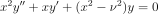
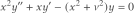

---
authors:
- aitoboxrobot
categories:
- 研究解读
date: 2026-08-25
hide:
- navigation
tags:
- 数学
- 贝塞尔函数
- 特殊函数
- 应用数学
title: 修正贝塞尔函数到底“修正”在哪里？
---
### 文章背景与核心概要

特殊函数往往带有晦涩难懂的名称，这些名称通常根植于其历史背景和数学应用中。本文探讨了为什么“修正”（modified）贝塞尔函数能获得这一独特的称谓，分别从纯数学视角（沿虚轴对其进行求值）和应用数学视角（求解热传导方程与波动方程的区别）剖析了这一概念。

归根结底，“修正”一词通常意味着：将某个函数在虚轴 $ix$ 处进行求值，并乘以一个常数，从而确保当输入为实数时，其输出结果依然保持为实数。理解这些命名背后的原因，有助于我们更好地把握这些数学工具的动机与实际应用。

---

# 修正贝塞尔函数到底“修正”在哪里？

## 摘要

> Special functions often carry arcane names rooted in their historical context and mathematical applications. This article explores why "modified" Bessel functions earn their distinct title, examining the concept from both a pure mathematics perspective (evaluating them along the imaginary axis) and an applied mathematics perspective (solving the heat equation versus the wave equation). Ultimately, the term "modified" generally signifies that a function is evaluated at $ix$ and scaled by a constant to ensure the output remains real for real-valued inputs.

特殊函数往往带有晦涩难懂的名称，如果没有一定的背景知识，这些名字很难让人直观理解。[这篇先前的文章](https://www.johndcook.com/blog/2026/08/23/arcane-terminology/)探讨了其中的一些原因。本文将进一步扩展该文结尾处关于“修正（modified）”函数的一点讨论。

> Special functions often have arcane names that are not very helpful without some context. [This previous post](https://www.johndcook.com/blog/2026/08/23/arcane-terminology/) goes into some reasons for this. This post will expand on a point at the end of that post about “modified” functions.

万物命名皆有因。探索这些原因可以帮助你理解它们的动机和用途。

> Things are given their names for reasons. Discovering those reasons may help you understand their motivation and use.

## 纯数学视角

> Pure Math Perspective

对于每个整数 $n$，修正贝塞尔函数 $I_n$ 本质上就是沿着虚轴求值的贝塞尔函数 $J_n$。具体而言，

> For each integer $n$, the modified Bessel function $I_n$ is essentially the Bessel function $J_n$ evaluated along the imaginary axis. Specifically,

从某种肤浅的视角来看，故事到这里就结束了：修正贝塞尔函数的“修正”之处，就在于其自变量乘以了 $i$。而且前面还莫名其妙地带有一个繁琐的常数项。

> From a certain shallow perspective, that’s the end of the story: modified Bessel functions are modified in the sense that the argument is multiplied by $i$. And there’s a fiddly constant term up front for no apparent reason.

但当然，故事并非如此简单，否则这篇文章就不值得长篇大论了。

> But of course that’s not the end of the story, or else this wouldn’t be worth an entire post.

上述方程类似于三角函数与双曲函数之间的关系：

> The equation above is analogous to the relationships between circular and hyperbolic functions:

这些关系之所以有趣，是因为三角函数和双曲函数各自具有独立的意义。如果你仅仅把这些方程当作定义，就会失去它们的深层意义。在欧拉发现它们之间的联系之前，三角函数和双曲函数就已经被广泛使用了。

> These relationships are interesting because the circular and hyperbolic functions are independently meaningful. If you view these equations merely as definitions, you lose their significance. Circular and hyperbolic functions were widely used before Euler discovered the connection between them.

同理，修正贝塞尔函数被赋予自己专属的名称也是有原因的。如果你是通过不同的应用场景分别接触到贝塞尔函数和修正贝塞尔函数，你会将方程

> Similarly, there’s a reason the modified Bessel functions were given a name of their own. If you were led to Bessel functions and modified Bessel functions separately by different applications, you would regard the equation

视为一项**发现**，而不仅仅是一个定义。下一节将解释为什么人们会对修正贝塞尔函数感兴趣。

> as a **discovery** rather than just a definition. The following section explains why someone would be interested in modified Bessel functions.

在继续之前，我想解释一下 $i^{-n}$ 这一项的原因。总体而言，

> Before we move on, I’d like to explain the reason for the $i^{-n}$ term. In general,

对于所有实数 $\nu$ 均成立。引入 $\exp(\nu\pi i/2)$ 这一项的原因在于，它能使 $I_\nu(x)$ 对于所有实数 $x$ 都保持为实数。

> for all real $\nu$. The reason for the $\exp(\nu\pi i/2)$ term is that it makes $I_\nu(x)$ real for all real $x$.

## 应用数学视角

> Applied Math Perspective

贝塞尔函数通常产生于求解具有**径向对称性**的问题。在圆柱坐标系中利用分离变量法求解**波动方程**，会导出贝塞尔微分方程：

> Bessel functions often arise from solving problems with **radial symmetry**. Solving the **wave equation** in cylindrical coordinates using separation of variables leads to Bessel’s differential equation:

由此得到的解为 $J_n$ 和 $Y_n$，它们分别是第一类和第二类贝塞尔函数。

> This yields the solutions $J_n$ and $Y_n$, which are Bessel functions of the first and second kind.

相反，在圆柱坐标系中利用分离变量法求解**热传导方程**，则会导出*修正的*贝塞尔方程：

> Conversely, solving the **heat equation** in cylindrical coordinates with separation of variables leads to the *modified* Bessel equation:

由此得到的解为 $I_n$ 和 $K_n$，它们分别是第一类和第二类*修正*贝塞尔函数。

> This yields the solutions $I_n$ and $K_n$, which are the *modified* Bessel functions of the first and second kind.

这突显了背后深层的复变函数视角：将 $x$ 替换为 $ix$ 的变量代换，改变了贝塞尔方程中 $x^2$ 项的符号。

> This highlights the underlying complex analysis perspective: the change of variables sending $x$ to $ix$ changes the sign of the $x^2$ term in Bessel’s equation.

* **贝塞尔函数**描述的是径向对称的**振荡**现象，例如鼓面的振动。
* **修正贝塞尔函数**描述的是径向对称的**指数级**增长或衰减 [1]，例如热量在圆柱体中的扩散。

> * **Bessel functions** describe radially symmetric **oscillations**, such as the vibrations of a drum head.
> * **Modified Bessel functions** describe radially symmetric **exponential** growth or decay [1], such as the diffusion of heat in a cylinder.

## 其他修正函数

> Other Modified Functions

**斯特鲁凡函数（Struve functions）**与贝塞尔函数密切相关。（修正的）斯特鲁凡函数同样满足贝塞尔（修正）微分方程，但其右侧不为零。修正的斯特鲁凡函数正比于沿虚轴求值的未修正斯特鲁凡函数，其中的比例常数是为了使修正斯特鲁凡函数在实自变量下保持为实数而选取的。

> **Struve functions** are closely related to Bessel functions. The (modified) Struve functions also satisfy Bessel’s (modified) differential equation, but with a non-zero right-hand side. The modified Struve functions are proportional to the unmodified Struve functions evaluated along the imaginary axis, with a proportionality constant chosen to make the modified Struve functions real for real arguments.

**马丢函数（Mathieu functions）**与修正马丢函数之间也存在类似的关系统。在特殊函数的语境下，其通用的规律是：“修正”意味着**“在 $ix$ 处求值，并乘以一个常数，使得函数在实数自变量下输出为实数。”**

> A similar relationship exists between **Mathieu functions** and modified Mathieu functions. The general pattern is that “modified” in the context of special functions means **“evaluated at $ix$ and multiplied by a constant to make the function real for real arguments.”**

***

[1] 函数 $I_n$ 呈指数级增长，而函数 $K_n$ 呈指数级衰减。正因如此，[A&S手册](https://www.johndcook.com/blog/2017/02/26/function-on-cover-of-abramowitz-stegun/)并没有直接列表给出 $I_n$ 和 $K_n$ 的数值。相反，他们列出的是 $e^{-x}I_n$ 和 $e^x K_n$ 的数值，因为这些经过缩放的函数在其定义域内的变化幅度更小。

> [1] The functions $I_n$ grow exponentially, while the functions $K_n$ decay exponentially. For this reason, [A&S](https://www.johndcook.com/blog/2017/02/26/function-on-cover-of-abramowitz-stegun/) did not tabulate $I_n$ and $K_n$ directly. Instead, they tabulated $e^{-x}I_n$ and $e^x K_n$ because these scaled functions vary less over their range.

***

*本文 [What exactly is modified about a modified Bessel function?](https://www.johndcook.com/blog/2026/08/23/modified-bessel-function/) 最初发布于 [John D. Cook](https://www.johndcook.com/blog)。*

> *The post [What exactly is modified about a modified Bessel function?](https://www.johndcook.com/blog/2026/08/23/modified-bessel-function/) first appeared on [John D. Cook](https://www.johndcook.com/blog).*