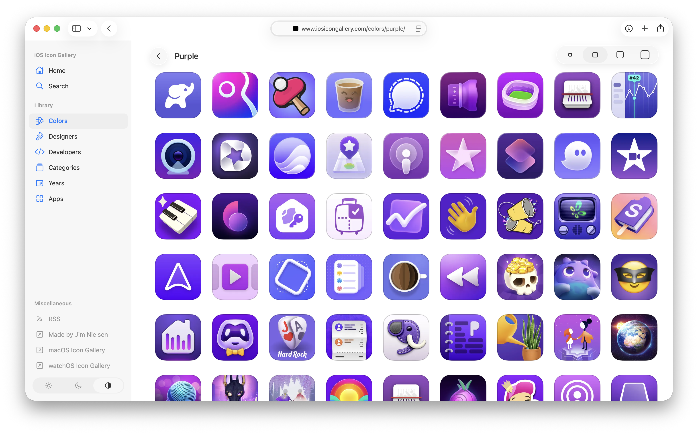

---
authors:
- aitoboxrobot
categories:
- 工具教程
date: 2026-08-25
hide:
- navigation
tags:
- LLM
- 编程辅助
- HTML
- 元数据
- 颜色处理
title: 利用大语言模型为我的图标库制作色彩元数据丰富工具
---
### 文章背景与核心概要
为了解决手动给 2000 多个缺少颜色元数据的图标打标签的繁琐问题，作者利用大语言模型（LLM）协作构建了一个量身定制的、用完即弃的可视化工具。与让 AI 盲目猜测标签不同，LLM 生成了一个轻量级的色相直方图脚本和一个独立的 HTML 界面。这使得作者能够快速审查建议、使用交互式阈值滑块过滤匹配项，并高效地批量更新图标库。

---

## 问题：未打标签的图标

> On my [icon](https://www.iosicongallery.com) gallery [sites](https://www.macosicongallery.com), I have metadata I’ve manually added over the years to tag certain icons as being predominantly [“blue”](https://www.iosicongallery.com/colors/blue/) or [“orange”](https://www.iosicongallery.com/colors/orange/) or some other color.

在我运营的[图标](https://www.iosicongallery.com)库[网站](https://www.macosicongallery.com)上，有多年来手动添加的元数据，用于将某些图标标记为主色调为[“蓝色”](https://www.iosicongallery.com/colors/blue/)、[“橙色”](https://www.iosicongallery.com/colors/orange/)或其他颜色的图标。

> Then I use this metadata to present icons of (roughly) the same color. It’s kinda neat to be able to browse a wall of icons that are all the same color.

然后，我使用这些元数据来展示（大致）相同颜色的图标。能够浏览一面全都是同一种颜色图标的墙，感觉相当酷。

> 

> The thing is: I know there are a lot of icons I’ve missed tagging over the years. But I have no idea how many, and figuring that out seems like a really arduous task. How do I go through 2,000+ icons and find all the ones that look predominantly “orange” but haven’t been tagged as such yet?

问题在于：我知道这些年来我漏掉了许多未打标签的图标。但我不知道具体有多少，要弄清楚这一点似乎是一项非常艰巨的任务。我该如何遍历 2000 多个图标，找出所有看起来主要呈“橙色”但尚未被这样标记的图标呢？

> Seems like a good task to throw at an LLM. But I don’t want to just say, “Go tag everything that’s missing” and blindly trust the output. I need to be able to make a decisions as to whether I think a particular color is “orange” or not.

这似乎是一个交给 LLM 处理的好任务。但我不想只是对它说一句：“去把所有漏掉的标签都打上”，然后盲目信任输出结果。我需要能够自己判断某个特定的颜色到底算不算“橙色”。

## 设计工具

> What I need is a tool for the job. I’m a very visual thinker, so to continue currating these color categorizations, I need some way for the computer to do its thing really, really fast, and then pull me into the loop to visually make decisions.

我需要的是一个专门干这活的工具。我是个视觉型思维的人，为了继续整理这些颜色分类，我需要某种方式让计算机以极快的速度完成它的计算，然后把我拉入循环中，让我来进行视觉决策。

> Here’s how I am thinking about about accomplishing this task:

我是这样考虑如何完成这项任务的：

> * Create a page with a list of colors on the left (red, green, orange, blue, etc.)
* When a color is clicked, show two columns. 1) All icons I currently have tagged for that color, and 2) all icons that might be that color but aren’t tagged as such (you, computer, process all my icons and do the work to figure this out and make recommendations).
* Allow me to select one or more icon(s) in the “not yet tagged as this color” column. Once I have all the ones I perceive as missing, give me a button to say “Copy” which copies the IDs of those icons.
* I’ll paste the IDs back here in the chat and you go add the corresponding metadata.

* 创建一个页面，左侧列出颜色列表（红、绿、橙、蓝等）。
* 点击某个颜色时，显示两列。1）当前已被我标记为该颜色的所有图标，以及 2）可能是该颜色但尚未被标记的图标（电脑，你来处理我所有的图标，完成这项工作并给出推荐）。
* 允许我在“尚未标记为此颜色的”列中选择一个或多个图标。一旦我选好了所有我认为漏掉的图标，给我一个“复制”按钮，把这些图标的 ID 复制下来。
* 我把这些 ID 粘贴回聊天框中，然后你再去添加相应的元数据。

> That seems like it would be a good tool to put me in control of visual decision making around color categorization. So I tell the LLM to run with it.

这听起来是一个能让我掌控颜色分类视觉决策的好工具。于是我让 LLM 直接开干。

## 用 LLM 进行构建

> We chat back and forth. I think, “You probably need to run all the icons through some model to make the correlation?” But it’s like, “Nah bro, just make a ‘hue histogram’.” It tells me how. For a color like “orange”, I can:

我们来回聊了聊。我心想：“你大概需要把所有图标跑一遍某种模型来建立关联吧？” 但它却说：“不老兄，搞个‘色相直方图’就行了。”它告诉我怎么做。对于像“橙色”这样的颜色，我可以：

> [process] each PNG, skip transparent pixels, skip low-saturation gray, convert the rest to HSV, and score how much of the remaining mass sits in the orange hue band (roughly 15–45°). Rank icons that don’t already have colorId: `orange`.

> 处理每个 PNG，跳过透明像素，跳过低饱和度的灰色，将剩余部分转换为 HSV，并为剩余部分中有多少落在橙色色相带（大约 15–45°）内进行打分。对那些尚不包含 `orange` colorId 的图标进行排名。

> Ok, sure. That sounds reasonable.

行吧，听起来挺合理的。

> [This] scores each icon PNG by share of opaque pixels per color bucket, then writes a standalone HTML page: tagged vs maybe-missing, per color.

> 通过每个颜色桶中不透明像素的占比来对每个图标 PNG 进行评分，然后编写一个独立的 HTML 页面：按颜色展示“已标记”与“可能漏掉”的对比。

> Let’s just make it, and then I’ll decide whether it’s good enough.

我们把它做出来，然后我再决定它够不够好。

> After a few iterations, the computer going “brr…”, and me saying “explain that like I’m dumb”, I have a really effective little tool!

经过几次迭代、电脑一阵狂转（“brr...”）、以及我不停地说“用大白话解释给我听”，我得到了一个非常高效的小工具！

> 

> The little threshold slider is a nice touch. It lets me fiddle around with the fidelity of the matches. In some cases, sliding it down reveals more icons I would’ve otherwise missed. In other cases, I’m like “What are you thinking? I don’t see that as ‘yellow’ at all!”

那个小小的阈值滑块是个很棒的点缀。它让我可以调整匹配的精确度。在某些情况下，把滑块往下滑动会暴露出更多我原本会漏掉的图标。但在另一些情况下，我会忍不住想：“你在想什么？我一点也看不出这图标是‘黄色’的！”

<video src="https://cdn.jim-nielsen.com/blog/2026/llm-colors-browse.mp4" width="866" height="540" controls=""></video>

> <video src="https://cdn.jim-nielsen.com/blog/2026/llm-colors-browse.mp4" width="866" height="540" controls=""></video>

> Supper effective little tool. I go through each color, select the ones I think are missing, paste the IDs back into the LLM, and then have it update each icon's metadata.

超级高效的小工具。我遍历每种颜色，选择那些我认为漏掉的图标，把 ID 粘贴回 LLM 中，然后让它更新每个图标的元数据。

> Boom, done! That all would’ve taken *so* long before. I would’ve never done it.

搞定收工！如果用以前的方法，这一切得花*太长*时间了。我大概永远都不会去干这事。

## 核心收获

> * **LLMs excel at throw-away code:** This doesn’t need to be “production-grade” code I depend on. Just something that’s good enough for me to get a job done, then toss. The resulting metadata is the goal, not the tool I use to get to the goal.
* **Keep it simple with standalone HTML:** The LLM is great at making one-off HTML pages for a specific task. Pointing directly to CDN-hosted images from a local `file://` URL meant no bundling, no transpilation, and no web server required—just basic HTML, CSS, and in-page JS.
* **Empower human decision-making:** It’s fun to say, “Don’t do the work for me. Instead, help me make a custom-fit tool that facilitates me doing the work in the most empowering, correct way possible.”

* **LLM 非常擅长编写用完即弃的代码：** 这不需要是什么我所依赖的“生产级”代码。它只需要足够好用，帮我把活干完，然后就可以扔掉。产出的元数据才是目标，而不是我用来达到目标的工具。
* **用独立的 HTML 保持简单：** LLM 非常擅长为特定任务制作一次性的 HTML 页面。从本地 `file://` URL 直接指向托管在 CDN 上的图片意味着无需打包、无需转译、也无需 Web 服务器——只需基础的 HTML、CSS 和页面内嵌的 JS。
* **赋能人类决策：** 这种感觉很有趣：“别替我干活。相反，帮我做一个量身定制的工具，让我能以最具赋能感、最正确的方式自己把活干了。”

---

Reply via:  
[Email](mailto:jimniels%2Bblog@gmail.com?subject=Re:%20blog.jim-nielsen.com/2026/use-llm-to-add-color-metadata/) · [Mastodon](https://mastodon.social/@jimniels) · [Bluesky](https://bsky.app/profile/jim-nielsen.com)