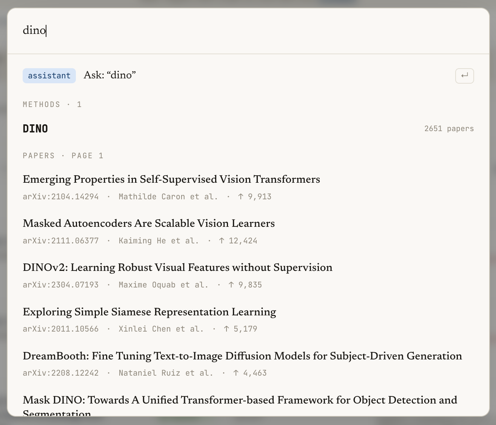
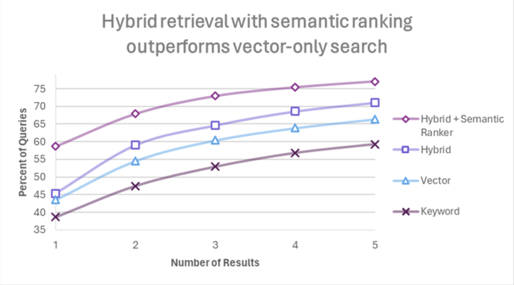
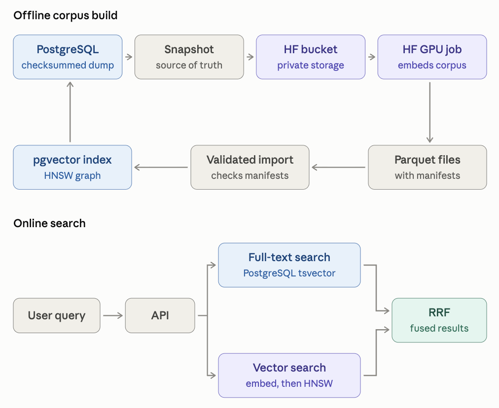
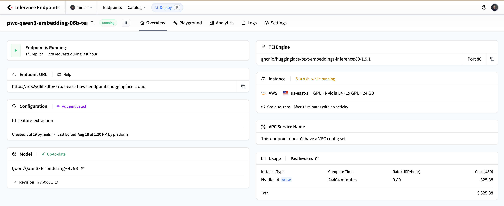
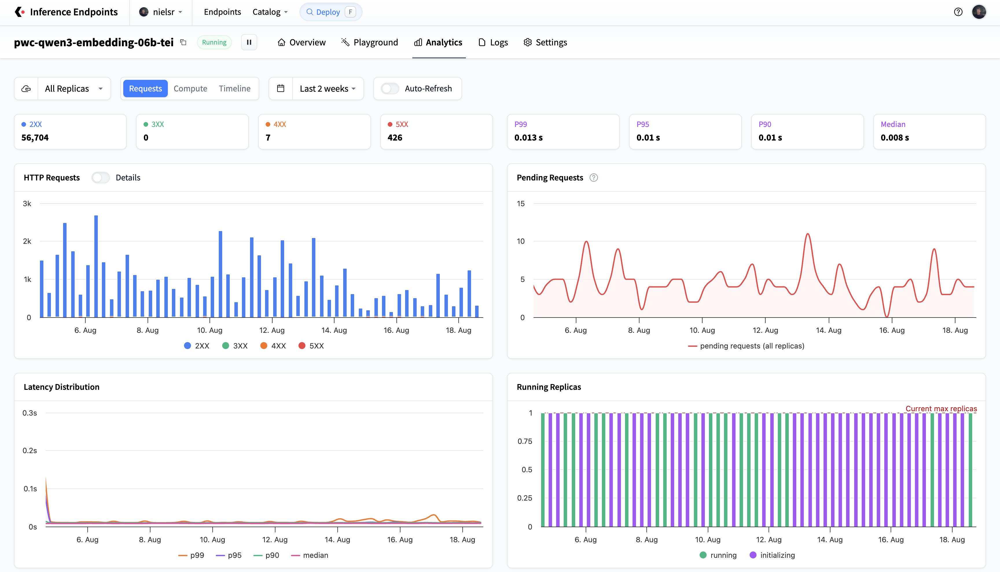
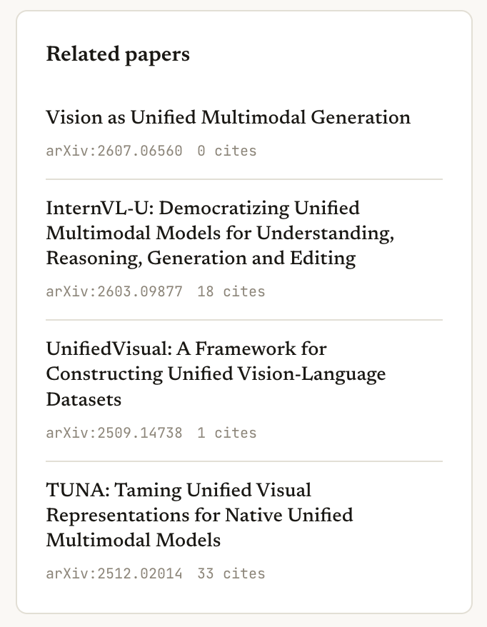

---
authors:
- aitoboxrobot
categories:
- arXiv论文
date: 2026-08-26
hide:
- navigation
tags:
- Hugging Face
- 向量搜索
- 混合搜索
- 架构设计
- Papers with Code
title: Hugging Face Inference Endpoints、Jobs 和 Buckets 如何驱动 Papers with Code 的搜索功能
---
### 文章背景与核心概要

本文详细介绍了重构后的 **Papers with Code** 平台如何构建一套生产级的混合搜索系统，以处理超过 11 万篇学术论文的检索需求。该系统通过结合传统的全文搜索（PostgreSQL）与稠密向量搜索（`pgvector`），实现了对精确元数据查询和语义概念查询的高相关性支持。

该架构的核心依赖于三项 Hugging Face 原生服务：利用 **Jobs** 进行高吞吐量的批量向量化处理，使用 **Storage Buckets** 进行持久化制品管理与可复现构建，以及通过 **Inference Endpoints**（基于 Text Embeddings Inference）实现低延迟的实时查询与增量更新。

---

## 引言

三个月前，我们启动了 [Papers with Code 的复兴计划](https://www.reddit.com/r/MachineLearning/comments/1tgmwqr/reviving_paperswithcode_by_hugging_face_p/)。其目标是让开放的 AI 研究变得易于获取和理解，帮助用户查找研究制品、追踪各领域的最新技术（SOTA），并在此基础上进行创新。

要使 AI 研究具备可搜索性，需要一个复杂的引擎，既能处理精确的 arXiv ID，又能处理诸如“用于代码生成的轻量级语言模型”这类复杂的概念性查询。为了解决这个问题，我们实现了一个结合关键词检索与基于向量的语义搜索的**混合搜索**系统。

<figure class="image text-center">

<figcaption>Papers with Code 中针对“DINO”查询的搜索结果。</figcaption>
</figure>

---

## 为什么选择混合搜索？

关键词搜索擅长查找精确匹配（如特定的论文标题或作者），而向量搜索则能捕捉模糊的、语义相似的概念。通过使用倒数排名融合（Reciprocal Rank Fusion, RRF）将两者结合，我们获得了两者的优势。

<figure class="image text-center">

<figcaption>混合检索优于单纯的向量搜索或关键词搜索。图片来自微软，<a href="https://techcommunity.microsoft.com/blog/azure-ai-foundry-blog/azure-ai-search-outperforming-vector-search-with-hybrid-retrieval-and-reranking/3929167" rel="nofollow">Azure AI Search: Outperforming vector search with hybrid retrieval and reranking</a> (2023)。</figcaption>
</figure>

Papers with Code 利用 PostgreSQL 进行词法搜索，利用 `pgvector` 进行稠密嵌入召回，并使用 RRF 来融合结果。三项主要的 Hugging Face 服务为这些嵌入提供了动力：
1. **Hugging Face Jobs**：用于对海量论文语料库进行嵌入处理的突发性 GPU 计算。
2. **Hugging Face Storage Buckets**：数据库、实验脚本和 Jobs 之间的持久化数据中转。
3. **Hugging Face Inference Endpoints**：用于实时查询和增量更新的低延迟模型服务。

---

## 总结：架构概览

我们特意将搜索工作负载拆分为**离线语料库构建**和**在线搜索服务**：

<figure class="image text-center">

<figcaption>离线语料库构建与在线混合搜索流水线的架构。</figcaption>
</figure>

高吞吐量的操作作为批量 **Jobs** 运行，而持久化制品则安全地存储在 **Storage Bucket** 中。只有轻量级的查询嵌入步骤位于受保护的 **Inference Endpoint** 后方的请求路径上。如果端点处于冷启动或繁忙状态，系统会优雅地回退到全文检索。

---

## 从严格的嵌入契约开始

为了防止模型版本漂移或提示词不匹配等问题，我们将嵌入配置视为一种严格的、版本化的 API 契约。每篇论文的格式化方式如下：

```text
normalized title + "\n\n" + normalized abstract
```

我们为生成的每个向量记录了明确的元数据：
* 模型仓库及精确的修订版本哈希（revision hash）
* 输出维度
* 输入格式版本
* 查询与文档的区分标识
* 归一化方法
* 源文本内容哈希

我们使用 [`Qwen/Qwen3-Embedding-0.6B`](https://huggingface.co/Qwen/Qwen3-Embedding-0.6B)，配置为 256 维，利用**Matryoshka 表示学习 (MRL)** 以提升速度，并配合适当的文档和查询提示词。

---

## Jobs 将数据库快照转化为向量语料库

处理整个语料库是一项非常适合 [Hugging Face Jobs](https://huggingface.co/docs/huggingface_hub/guides/jobs) 的批处理任务。

该过程从 PostgreSQL 快照中流式传输行，写出 JSONL 分片，并记录带有校验和的清单。该目录被同步到私有的 [Storage Bucket](https://huggingface.co/docs/hub/storage-buckets) 中，并通过 [`hf-mount`](https://github.com/hf-mount) 挂载到 `l4x1` Job 实例中：

```bash
hf jobs uv run \
  --flavor l4x1 \
  --timeout 6h \
  --volume hf://buckets/OWNER/pwc-paper-embeddings:/bucket \
  embed_papers_job.py \
  --input /bucket/runs/RUN_ID/input \
  --output /bucket/runs/RUN_ID/output \
  --model Qwen/Qwen3-Embedding-0.6B \
  --revision MODEL_REVISION \
  --dimensions 256 \
  --allow-matryoshka
```

工作节点验证分片、加载固定模型、对文本长度进行排序以优化填充、安全处理批量生成（具备自动 OOM 回退机制）、应用 L2 归一化，并写出 Parquet 分片。

---

## Buckets 作为连接纽带

[Storage Buckets](https://huggingface.co/docs/hub/storage-buckets) 作为 S3 兼容的边界，隔离了三个不同的生命周期：
1. **数据库导出**：原始源记录。
2. **临时 Jobs**：计算密集型的向量生成。
3. **导入程序**：写入搜索索引前的验证检查。

在不可变的运行前缀下组织数据，确保了可复现性、低成本的实验以及安全的回滚。

---

## 请求路径上的 Inference Endpoints

实时查询需要低延迟。我们将固定模型部署为经过身份验证的 [Inference Endpoint](https://huggingface.co/docs/inference-endpoints/index)，运行 [Text Embeddings Inference (TEI)](https://github.com/huggingface/text-embeddings-inference)，使用查询提示词返回归一化的 256 维向量。

<figure class="image text-center">

<figcaption>Papers with Code 查询嵌入模型的 Hugging Face Inference Endpoint。</figcaption>
</figure>

PostgreSQL 使用 HNSW 索引对活跃的 `pgvector` 生成版本执行余弦距离搜索：

```sql
SELECT paper_id,
       embedding <=> CAST(:query_vector AS halfvec(256)) AS distance
FROM paper_embeddings
WHERE generation_id = :active_generation
ORDER BY embedding <=> CAST(:query_vector AS halfvec(256))
LIMIT 50;
```

由于端点在空闲时会缩容至零以节省成本，应用程序代码必须通过严格的超时设置、本地缓存以及在必要时立即回退到纯词法文本搜索来优雅地处理冷启动。

<figure class="image text-center">

<figcaption>显示请求量、错误、延迟和副本状态的 Inference Endpoint 分析仪表板。</figcaption>
</figure>

---

## 混合检索与持续更新

词法分支和语义分支的排名使用**倒数排名融合 (RRF)** 进行合并：

$$\text{score}(d) = \sum_{r \,\in\, \{\text{lexical},\, \text{semantic}\}} \frac{w_r}{k + \text{rank}_r(d)}$$

为了处理持续更新（新论文、更正），每小时一次的增量同步会处理最多 500 篇已更改论文的批次，在更新活跃索引之前调用带有文档提示词的 TEI 端点。

<figure class="image text-center">

<figcaption><a href="https://paperswithcode.co/paper/2605.12500" rel="nofollow">SenseNova-U1</a> 的相关论文功能。</figcaption>
</figure>

这些相同的文档嵌入在论文页面上提供即时的**相关论文**推荐，而无需在请求时进行模型调用。

---

## 经验教训

1. **分离吞吐量与延迟**：针对批量吞吐量优化批处理作业，并将 Inference Endpoints 严格保留用于低延迟查询。
2. **将存储视为契约**：使用带有严格验证清单的 Storage Buckets 作为原始计算与生产数据之间的安全缓冲区。
3. **固定完整配置**：对模型及其精确修订版本、维度、提示词模板和归一化例程进行版本控制。
4. **为冷启动设计**：在处理缩容至零的无服务器端点时，始终实现优雅降级（例如词法回退）。
5. **利用更小的向量**：Matryoshka 表示（例如 256 维）允许在最小化 ANN 召回损失的情况下，显著降低存储和延迟开销。
6. **保持激活过程的枯燥**：独立索引新生成版本，彻底验证覆盖范围，并原子化地交换指针。

*欢迎访问 [paperswithcode.co](https://paperswithcode.co) 体验搜索引擎，或在 [paperswithcode.co/chat](https://paperswithcode.co/chat) 与研究助手互动！*