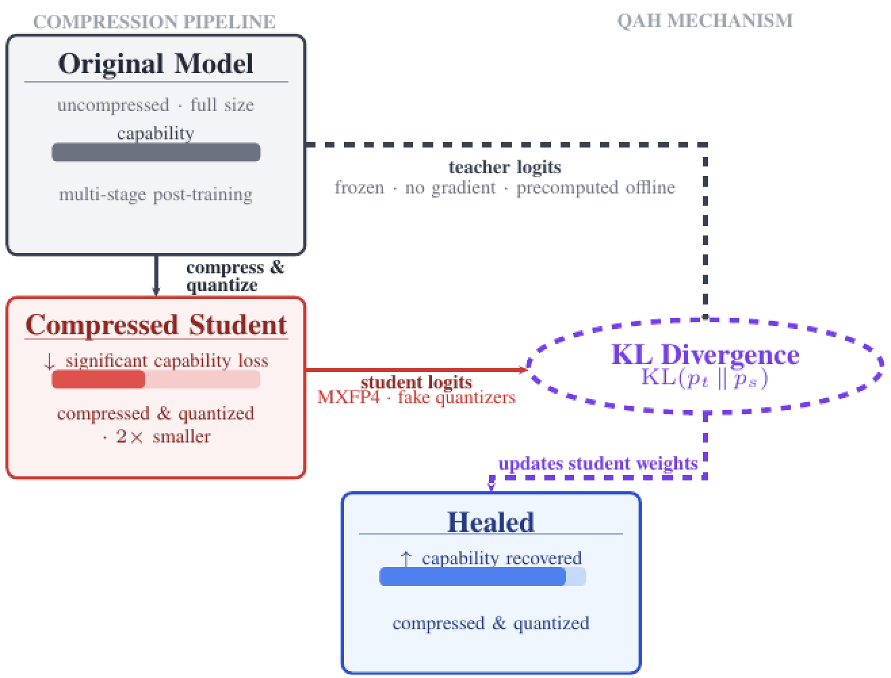
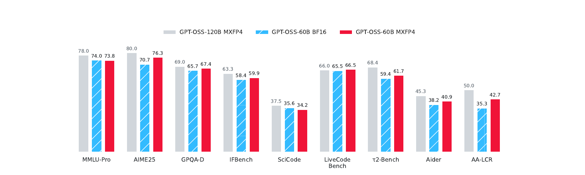
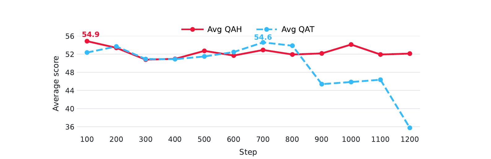

---
authors:
- aitoboxrobot
categories:
- 产品发布
date: 2026-08-26
hide:
- navigation
tags:
- 模型压缩
- 量化
- 大语言模型
- 知识蒸馏
- QAH
title: 量化感知修复（QAH）：一种超越全精度原型的压缩4比特模型
---
### 文章背景与核心概要
将大型语言模型（LLM）进行结构压缩（如减少层数、注意力头或神经元）并结合低比特量化（如4比特）部署时，往往会严重损害推理、编程和数学等复杂核心能力。传统的恢复方法（如量化感知训练 QAT 或量化感知蒸馏 QAD）在面对这种双重压缩时往往效果不佳或扩展性较差。

Multiverse Computing 提出的**量化感知修复（Quantization-Aware Healing, QAH）**技术打破了这一僵局。该方法绕过了从中间恢复检查点进行蒸馏的传统思路，直接利用原始的、全尺寸全精度的教师模型，通过高内存效率的分块 KL 散度损失，将知识蒸馏到压缩后的 4 比特学生模型中。

应用该方法将 GPT-OSS 120B 模型压缩至 60B 参数并量化为 MXFP4 后，得到的 QAH 模型在 9 个基准测试中的 7 个上**超越了其原始的 bfloat16 全精度源模型**。这不仅实现了更低的推理成本和更小的体积，还颠覆了传统 4 比特模型性能必然逊色于 16 比特原型的认知。

---

# 量化感知修复（QAH）：一种超越全精度原型的压缩4比特模型

*发布日期：2026年8月25日*  
*作者：Antonio Tiene, Iker García-Ferrero, Ali Hashemi, Bakbergen Ryskulov (Multiverse Computing)*

将大语言模型体积缩减几乎总是有代价的。目前标准的最高效部署方法是先进行架构压缩——通过移除层、注意力头或神经元来削减参数量，然后将剩余的权重低比特量化到 4 比特，从而进一步缩减内存占用和计算开销。这两步都能节省大量资源，但结合起来却会系统性地损害人们真正关心的核心能力：推理、数学解题以及代码生成。正因如此，严谨的部署流水线通常在模型投入生产前增加一个恢复步骤，通常被称为“修复（healing）”。近期的开源权重发布，如 [gpt-oss](https://huggingface.co/openai/gpt-oss-120b)、NVIDIA 的 [Nemotron](https://huggingface.co/nvidia) 系列，以及我们自己的 [Hypernova 60B](https://huggingface.co/MultiverseComputingCAI/Hypernova-60B-2605)，都依赖于这种“先压缩后修复”方法的某种变体。

我们的最新论文[*《量化感知修复：恢复压缩4比特LLM的实用方案》*](https://huggingface.co/papers/2608.20953)探讨了一个业界大多悬而未决的问题：一旦模型经历了结构压缩（而不仅仅是量化），恢复步骤的实际效果究竟如何？正确的方法又是什么？我们引入了**量化感知修复（Quantization-Aware Healing, QAH）**。将其应用于一个压缩至 60B 参数并量化为 MXFP4 的 GPT-OSS 120B 模型时，它在 9 个基准测试中的 7 个上击败了其自身的全精度（bfloat16）版本。这个 4 比特模型最终不仅体积更小、运行成本更低，其准确率甚至超过了它量化前的检查点。这颠覆了 4 比特模型与源 16 比特模型之间的传统关系。

---

## 为什么常规的修复方法在此处失效

大多数高效部署流水线都遵循相同的三个步骤：压缩架构、量化压缩后的权重，然后修复损伤。不同方法之间的差异完全在于最后这一步。

目前占主导地位的修复方案是量化感知训练（QAT）。它在正向传播中插入伪量化算子，并在任务损失（task loss）上继续微调模型，使权重学会适应低精度表示。在实践中，这意味着要通过噪声更大、更低精度的前向传播，重新运行本已十分昂贵的多阶段后训练过程（包括监督微调、RLHF、智能体微调等）。这不仅代价高昂，而且正如我们的结果所示，如果训练在最佳点之后持续太久，它也可能变得不稳定。

另一种替代方案是量化感知蒸馏（QAD），它避免了重新运行上述繁琐的历史流程。它不使用任务损失，而是通过输出逻辑值（logits）上的 [KL 散度](https://docs.pytorch.org/docs/2.13/generated/torch.nn.KLDivLoss.html)损失，将冻结的全精度教师模型直接蒸馏到量化的学生模型中。当唯一的变更是量化时，这种方法效果很好，因为存在完全相同的模型的真实全精度版本作为教师。但是，一旦模型经历了结构压缩——即拥有更少的层、头或神经元，而不仅仅是更少的比特——这个假设就不成立了。因为不存在独立训练的小架构全精度版本。唯一可选的教师是恢复出来的 bfloat16 检查点，而它本身就是原始模型的一种蒸馏近似。从它进行蒸馏会将量化的学生锚定在一个退化的目标上，并将其准确率上限限制在该恢复检查点自身的上限。

因此，关于如何修复一个既经过结构压缩又经过量化的模型，在过去一直是一个悬而未决的真实问题。

---

## 我们的方法

QAH 通过一个改变消除了这一性能上限：它直接从原始的、压前（pre-compression）的模型进行蒸馏，而不是从恢复后的模型进行蒸馏。教师和学生甚至不需要共享相同的架构。教师是全尺寸、全精度的，而学生则是其一半大小并运行在 MXFP4 下。由于教师的输出分布与架构无关，因此大小或形状的不匹配不会阻碍知识迁移。学生从不接触硬标签（hard labels），只通过 logits 上的 KL 散度匹配教师的输出分布。

这重新定义了量化阶段的作用。在 QAH 下，它不再是修复完成后应用的有损后处理步骤，而是针对原始教师的第二轮完整蒸馏——这是 bfloat16 检查点从未接受过的监督。4 比特学生模型不是在补偿量化损失的信息，而是在拾取早期恢复阶段没有时间或数据传输的信息。

损失函数本身也带来了一个稳定性优势。由于 KL 蒸馏将学生绑定到一个固定的教师分布上，一旦学生追赶上，就不会再有进一步漂移的压力。相比之下，交叉熵任务损失会无限期地将学生推向硬标签。事实证明，这种差异对准确率和训练稳定性都至关重要，正如接下来的对比所示。

为了让 QAH 在长文本（修复语料库包含长达 32k 个 token 的文档）场景下发挥作用，我们复用了我们关于高效蒸馏的配套论文中内存高效的分块 KL 散度损失（chunked KL-divergence loss）。该损失每次计算序列的一个切片，从不显式物化完整的“词表×序列”网格，这正是使 32k token 修复能够契合固定 GPU 内存预算的关键所在。我们在[先前的文章](https://huggingface.co/blog/MultiverseComputingCAI/efficient-knowledge-distillation)中讨论过该损失的运作机制。

*QAH 概述。在结构压缩和量化之后，模型能力急剧下降。QAH 直接从原始模型（一个离线预计算 logits 的冻结教师）进行蒸馏，而不是从恢复后的检查点蒸馏。来源：论文图 1。*

---

## 实验结果

我们将 QAH 应用于一个 GPT-OSS 120B 模型，将其压缩至 60B 参数并在 bfloat16 中恢复，然后在 QAH 下重新量化为 MXFP4。最自然的对比基准是同一 60B 模型的 bfloat16 检查点，即该架构存在的最佳全精度版本。QAH 模型在 9 个基准测试中的 7 个上取得了胜利。

| 基准测试 | 120B 教师模型 (MXFP4) | 60B BF16 (恢复后) | 60B MXFP4 (QAH) | QAH 对比 BF16 |
| :--- | :---: | :---: | :---: | :---: |
| AA-LCR (长文本推理) | 50.0 | 35.3 | 42.7 | +7.4 |
| AIME 2025 (数学) | 80.0 | 70.7 | 76.3 | +5.6 |
| Aider (智能体编程) | 45.3 | 38.2 | 40.9 | +2.7 |
| τ²-bench (工具调用) | 68.4 | 59.4 | 61.7 | +2.3 |
| GPQA Diamond (科学) | 69.0 | 65.7 | 67.4 | +1.7 |
| IFBench (指令遵循) | 63.3 | 58.4 | 59.9 | +1.5 |
| LiveCodeBench (编程) | 66.0 | 65.5 | 66.5 | +1.0 |
| MMLU-Pro (知识) | 78.0 | 74.0 | 73.8 | −0.2 |
| SciCode (科学编程) | 37.5 | 35.6 | 34.2 | −1.4 |

QAH 略有落后的两个基准测试（MMLU-Pro 和 SciCode）差距均不到 1.5 个百分点。在所有其他测试中，4 比特模型的表现都领先于其自身的 16 比特源模型，并且最大的性能提升恰好落在压缩通常损害最严重的能力上：长文本推理（AA-LCR 提升 +7.4）和数学（AIME 2025 提升 +5.6）。

与原始 120B 教师模型的对比同样说明了问题。尽管运行时的参数量仅为教师模型的一半，权重内存约为其四分之一，但 QAH 模型在 LiveCodeBench 上超越了全尺寸教师模型（66.5 对 66.0），在 GPQA Diamond 上仅落后 1.6 个百分点（67.4 对 69.0）。与教师模型最大的差距仍在 AA-LCR 上，这是一个极端长文本基准，压缩所损失的能力本质上最难恢复。

*4 比特 QAH 模型在 9 个基准测试中的 7 个上达到或超越了其 bfloat16 源模型，并在 LiveCodeBench 上击败了全尺寸教师模型。来源：论文图 2。*

### QAH 与 QAT 的正面交锋

为了将损失函数的影响与所有其他因素隔离开来，我们在匹配的条件下直接将 QAH 与 QAT 进行了对比：将一个 GPT-OSS 9B 模型量化为 MXFP4，并追踪在 MMLU-Pro、LiveCodeBench 和 GPQA Diamond 上训练过程中的平均性能。

两种方法都达到了相似的峰值（QAH 为 54.9，QAT 为 54.6），因此在最佳准确率上它们实际上不相上下。区别在于它们如何达到该峰值以及之后发生了什么。QAH 在大约 100 个步骤内达到峰值，速度大约是 QAT（700 步）的 7 倍，并且在接下来的训练中一直保持在峰值附近约两个点以内。而 QAT 在过峰后急剧崩溃，到第 1200 步时性能下降了近 19 个点。

其实际后果带来了真实的部署风险差异。QAT 检查点需要针对验证集进行谨慎的早期停止（early stopping），以避免发布一个已经开始退化的模型；而经过充分训练的 QAH 检查点可以安全地部署，因为它根本不会发生漂移。这与底层机制是一致的：针对冻结教师的 KL 蒸馏使得学生在匹配教师后没有动力移动，而交叉熵目标则不断对硬标签施压，最终侵蚀了模型从原始模型继承的能力。

*QAH 在大约 100 步时达到 54.9 的峰值并保持稳定；QAT 仅在 700 步左右达到 54.6，随后在第 1200 步时损失了近 19 个点。来源：论文图 3。*

---

## 这在实践中改变了什么

准确率表现与激发压缩初衷的高效性相辅相成。在 4 比特精度下，QAH 模型的权重内存消耗大约是 bfloat16 学生的四分之一；由于参数量仅为 120B 教师模型的一半，其每个 token 的计算量大约减半，这正是它能够在明显更小的硬件上运行的原因。对于那些以 bfloat16 而非 4 比特发布的模型系列，参数与精度的双重削减将使每个 token 的计算量减少近 8 倍。

核心结论是：一个经过压缩的 4 比特模型不一定非要成为其全精度对应模型的低准确率版本。有了这种修复方案，它可以同时做到体积更小、部署成本更低且准确率更高，并且它达到这一目标所需的训练量仅为 QAT 方案的一小部分。量化不再是为了追求效率而支付的性能税，而是变成了教导模型的额外契机。

这项工作是 Multiverse Computing 持续研究的一部分，旨在让大模型变得更小、运行成本更低，同时不放弃使其具有实用性的各项能力。它与我们关于高效蒸馏的配套工作相辅相成，后者为 QAH 依赖的长文本训练机制提供了支持。

想要获取全部技术细节（包括修复流水线、用于长文本修复的分块 KL 实现以及分布式训练的发现）？请阅读[完整论文](https://huggingface.co/papers/2608.20953)，或与我们的团队联系，探讨如何将模型压缩与修复应用到您自己的模型中。