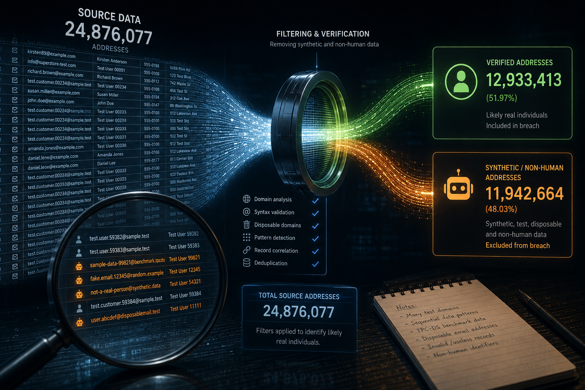

---
authors:
- aitoboxrobot
categories:
- 工具教程
date: 2026-08-27
hide:
- navigation
tags:
- 数据泄露
- AI分析
- 威胁情报
- Databricks
- 安全审计
title: 数据泄露声明、验证与 Carhartt 事件的警示录
---
### 文章背景与核心概要
当黑客组织 ShinyHunters 声称攻陷知名工装品牌 Carhartt 时，初步的数据分析表明这是一起涉及近 2500 万条记录的大规模数据泄露事件。然而，通过严密的调查和 AI 辅助的数据清洗，研究人员发现其中近一半的数据实际上是与公司 Databricks 实例存放在同一环境中的 TPC-DS 基准测试文件的合成“噪音”。本文详细介绍了验证泄露数据、剔除垃圾记录以及确定事件真实范围的全过程，旨在避免虚假信息的传播。

> ### Summary
> When the hacking group ShinyHunters claimed to have compromised Carhartt, the initial data analysis suggested a massive breach of nearly 25 million records. However, through rigorous investigation and AI-assisted data scrubbing, it was revealed that nearly half of that data was synthetic "noise" from TPC-DS benchmark files co-located in the company's Databricks instance. This article details the process of verifying breach data, stripping away junk records, and identifying the true scope of the incident to avoid spreading misinformation.

---

### 最初的声明
在收到关于 Carhartt 50 GB 数据转储的“网络警报”（Cyber Alert）后，使用 *Have I Been Pwned* (HIBP) 电子邮件地址提取工具进行的初步分析返回了 **24,876,077 个唯一的电子邮件地址**。虽然其他分析师轻信了这一数字，但如此庞大的数据量促使人们进行更深入的挖掘，以验证这些记录的真实性。

> ### The Initial Claim
> Following a "Cyber Alert" regarding a 50 GB data dump from Carhartt, initial analysis using the *Have I Been Pwned* (HIBP) Email Address Extractor tool returned **24,876,077 unique email addresses**. While other analysts accepted this figure at face value, the sheer volume warranted a deeper dive to verify the authenticity of the records.

### AI 在泄露分析中的作用
通过使用“PwnedClaw”（一个 AI 辅助分析工具），调查超越了单纯的计数，进入了行为分析阶段。AI 迅速识别出该数据集并非一个干净的生产数据库，而是真实客户数据与 TPC-DS 合成基准测试数据的混合体。

> ### The Role of AI in Breach Analysis
> Using "PwnedClaw" (an AI-assisted analysis tool), the investigation moved beyond simple counting to behavioral analysis. The AI quickly identified that the dataset was not a clean production database but a mix of real customer data and TPC-DS synthetic benchmark data.

**AI 分析的关键发现：**
*   **合成模式：** 大量的“乱码”域名（例如 `roy.griffin@mbfhz82d0vkpes4x.edu`）以及出生年份和国家的均匀分布，表明这些数据是由基准测试工具生成的。
*   **“长尾”特征：** 97.6% 的域名恰好出现了一次，这是合成生成而不是真实世界零售流量的典型标志。
*   **决定性证据（The Smoking Gun）：** 诸如 `carharttdonotship.com` 和 `wctest.com` 等内部域名的存在证实，虽然此次泄露确实发生，但黑客转储的是包含生产数据和测试数据的整个 Databricks 环境。

> **Key findings from the AI analysis:**
> *   **Synthetic Patterns:** A massive number of "gibberish" domains (e.g., `roy.griffin@mbfhz82d0vkpes4x.edu`) and uniform distributions of birth years and countries indicated that the data was generated by a benchmark tool.
> *   **The "Long Tail" Signature:** 97.6% of domains appeared exactly once, a hallmark of synthetic generation rather than real-world retail traffic.
> *   **The Smoking Gun:** The presence of internal domains like `carharttdonotship.com` and `wctest.com` confirmed that while the breach was real, the hackers had dumped an entire Databricks environment containing both production and test data.

### 精炼数据：去伪存真
为了得出准确的计数，分析工作需要进行系统性的数据清洗：

> ### Refining the Data: Separating Fact from Fiction
> To reach an accurate count, the analysis required systematic cleaning:

1.  **移除合成数据：** 通过过滤掉 TPC-DS 基准测试块，数量从约 2500 万降至约 1330 万。
2.  **对 Microsoft 别名进行去重：** Microsoft 365 环境通常会为单个收件箱创建多个路由域名（例如 `carhartt.com`、`carhartt.onmicrosoft.com`）。将其标准化使行数减少了 5,000 多行。
3.  **处理“Deactivate-”前缀：** 系统使用了软删除模式，给停用的账号加上了 `deactivate-` 前缀。由于其中 99% 都有处于活动状态的对应账号，因此将其移除以防止重复计算。
4.  **排除测试数据：** 诸如 `wctest.com` 和 `carharttdonotship.com`（与内部性能测试相关）等域名被清除，因为它们不代表活跃的客户记录。

> 1.  **Removing Synthetic Data:** By filtering out the TPC-DS benchmark chunks, the count dropped from ~25M to ~13.3M.
> 2.  **Deduplicating Microsoft Aliases:** Microsoft 365 environments often create multiple routing domains for a single inbox (e.g., `carhartt.com`, `carhartt.onmicrosoft.com`). Normalizing these reduced the count by over 5,000 rows.
> 3.  **Handling "Deactivate-" Prefixes:** The system used a soft-delete pattern, prefixing deactivated accounts with `deactivate-`. Since 99% of these had active counterparts, they were removed to prevent double-counting.
> 4.  **Excluding Test Data:** Domains like `wctest.com` and `carharttdonotship.com` (associated with internal performance testing) were purged, as they did not represent active customer records.

### 最终结论
经过广泛的净化，唯一的、合法的客户电子邮箱地址最终统计数量为 **12,933,413**。

虽然这次数据泄露是真实的——内部员工地址、带有哈希前缀的内部别名以及带有客户标签的子地址的存在证实了这一点——但由于包含内部测试数据，最初的头条数字被夸大了近 50%。

> ### Final Verdict
> After extensive sanitization, the final count of unique, legitimate customer email addresses was **12,933,413**. 
> 
> While the breach was authentic—confirmed by the presence of internal employee addresses, hash-prefixed internal aliases, and customer-tagged sub-addresses—the initial headline figure was inflated by nearly 50% due to the inclusion of internal test data. 

**经验教训：** 切勿在未核实来源的情况下轻信数据泄露报告中的头条数字。真相永远隐藏在数据之中，但这需要我们深入挖掘、进行尽职调查，并看透威胁行为者表面上的夸大声明。

> **The takeaway:** Never trust headline numbers in a data breach report without verifying the source. The truth is always in the data, but it requires a willingness to dig deep, perform due diligence, and look past the surface-level claims of the threat actors.

