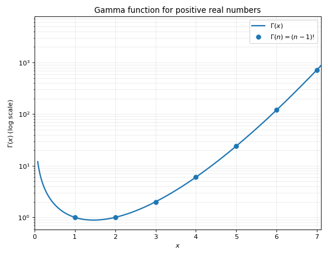
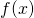
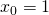

---
authors:
- aitoboxrobot
categories:
- 研究解读
date: 2026-08-29
hide:
- navigation
tags:
- 数学
- 阶乘
- 斯特林近似
- 伽马函数
- 拉普拉斯方法
title: 阶乘到底有多大？
---
### 文章背景与核心概要
在这篇技术文章中，作者探讨了如何在没有计算器或计算机的情况下，快速估算类似 $52!$ 这样庞大阶乘的位数。文章从一个简单的直观估算公式切入，带领读者逐步深入背后的数学原理。

通过引入将阶乘推广到实数的伽马函数（Gamma Function），并利用分部积分法展示了其递推性质，文章为后续推导打下了基础。接着，文章简要回顾了如何通过拉普拉斯方法（Laplace's Method）推导著名的斯特林近似（Stirling's Approximation）。最后，通过对斯特林近似公式取以 10 为底的对数，作者推导出了一个优雅且实用的阶乘位数估算公式。无论是对于数学爱好者还是算法研究者，本文都是一堂生动且富有洞察力的微积分应用课。

---

## 估算位数 (Estimating the Number of Digits)

有一天，我突然在想 $52!$（52的阶乘）到底有多大，这促使我开始思考如何在没有计算器或计算机的情况下估算这类数值。

> The other day, I found myself wondering how big $52!$ (52 factorial) is, and that led me to ponder how these could be estimated without a calculator or a computer.

事实证明，有一些相当有趣的数学方法能够让我们相当准确地估算阶乘的规模（位数）。这篇文章将首先给出估算方法，如果你对背后的数学原理感兴趣，可以继续往下阅读。

> It turns out there’s some fairly interesting math behind being able to estimate the size (number of digits) of a factorial reasonably accurately. This post will start by stating how to do the estimate, and if you’re curious you can read on for the math background.

废话不多说，这个近似公式如下：

> Without further ado, the approximation is:

$$\text{number of digits in n!}\approx n\log_{10}\left(\frac{n}{e}\right)+2$$

作为例子，让我们用我最初提出的问题，来估算 $52!$ 的位数：

> As an example, let’s use my original question, by estimating this for $52!$:

嗯，52 除以 $e$ 大约是……20 左右？而 $\log_{10}(20)$ 大约是 1.3 [1]；因此我们的估算结果为：

> Well, 52 divided by $e$ is... 20-ish? And $\log_{10}(20)$ is about 1.3 [1]; therefore our estimate comes out to:

$$\text{number of digits in 52!}\approx 52\cdot 1.3 +2 \approx69$$

真正的答案是 68，所以这个结果非常接近！在处理这种天文数字的估算时，误差个把位数通常不是什么大问题。

> The real answer is 68, so this is very close! In estimates like this—when you’re dealing with enormous numbers—being off by a couple of digits usually isn't a big deal.

---

## 伽马函数 (The Gamma Function)

对于实数 $n>0$，伽马函数的定义 [2] 如下：

> The Gamma function for real $n>0$ is defined [2] as:

$$\Gamma(n)=\int_{0}^{\infty}x^{n-1}e^{-x}dx$$

这个积分在一般情况下没有解析表达式，但它有一个非常有用且我们可以利用的性质。让我们看看 $\Gamma(n+1)$ 是什么：

> This integral does not have an analytic expression in the general case, but it does have a very useful property that we can take advantage of. Let’s see what $\Gamma(n+1)$ is:

$$\Gamma(n+1)=\int_{0}^{\infty}x^{n}e^{-x}dx$$

现在，使用分部积分法，令：

> And now use integration by parts with:

$$u=x^n\qquad v=-e^{-x}$$

那么：

> Then:

$$du=nx^{n-1} dx\qquad dv=e^{-x}dx$$

所以：

> So:

$$\begin{aligned}
    \Gamma(n+1)&=\int_{0}^{\infty}x^{n}e^{-x}dx\\
    &=\left. -x^n e^{-x}\right|_{0}^{\infty}-\int_{0}^{\infty}-e^{-x}n x^{n-1}dx\\
    &=n\int_{0}^{\infty}x^{n-1}e^{-x}dx
\end{aligned}$$

但请注意，最后的这个积分恰好就是 $\Gamma(n)$；因此，我们证明了：

> But notice that the last integral is just $\Gamma(n)$; therefore, we’ve shown that:

$$\Gamma(n+1)=n\Gamma(n)$$

我们来计算一下 $\Gamma(1)$——这是一个具有解析解的特殊情况：

> Let’s also calculate $\Gamma(1)$—it’s a special case that has an analytical solution:

$$\Gamma(1)=\int_{0}^{\infty}e^{-x}dx=\left. -e^{-x}\right|_{0}^{\infty}=1$$

这有助于建立一个归纳论证：

> This helps establish an induction argument:

$$\begin{aligned}
    \Gamma(2)=1\cdot\Gamma(1)&=1!\\
    \Gamma(3)=2\cdot\Gamma(2)&=2!\\
    \Gamma(4)=3\cdot\Gamma(3)&=3!\\
    &\dots\\
    \Gamma(n+1)=n\cdot\Gamma(n)&=n!
\end{aligned}$$

换句话说，伽马函数是阶乘在所有正实数上的内插。下面是伽马函数在较小范围内的图像；请注意，由于该函数增长极快，纵轴采用了对数刻度：

> In other words—the Gamma function is an interpolation of the factorial over all positive reals. Here’s a plot of the Gamma function over a small range; note that the y axis is log-scale because of the function’s fast growth:

---

## 斯特林近似 (Stirling’s Approximation)

你以前可能遇到过斯特林近似：

> You may have encountered Stirling’s approximation before:

$$n!\approx\sqrt{2\pi n}\cdot\left(\frac{n}{e} \right)^n$$

这是一个极好的近似公式，即使对于较小的  也能表现得相当不错。本节简要概述如何从伽马函数推导斯特林公式。

> It’s a great approximation that works reasonably well even for small . This section is a brief overview of how Stirling’s formula is derived from the Gamma function.

取：

> Taking:

$$n!=\Gamma(n+1)=\int_{0}^{\infty}x^n e^{-x}dx$$

我们首先对被积函数进行一点小小的变形：

> We’ll start by massaging the integrand a bit:

$$n!=\int_{0}^{\infty}x^n e^{-x}dx=\int_{0}^{\infty}e^{n \ln x} e^{-x}dx$$

并进行变量代换 $x=ny$，这意味着 $dx=ndy$：

> And making a change of variables $x=ny$, which means that $dx=ndy$:

$$\begin{aligned}
    n!&=\int_{0}^{\infty}ne^{n\ln(ny) - ny}dy=n\int_{0}^{\infty}e^{n(\ln n+\ln y-y)}dy\\
    &=ne^{n\ln n}\int_{0}^{\infty}e^{n(\ln y-y)}dy
\end{aligned}$$

这些步骤使得该积分能够应用[拉普拉斯方法](https://en.wikipedia.org/wiki/Laplace%27s_method)，该方法允许我们近似计算以下形式的定积分：

> These steps make the integral amenable to applying [Laplace’s method](https://en.wikipedia.org/wiki/Laplace%27s_method), which allows us to approximate definite integrals of the form:

$$\int_{a}^{b}e^{nf(x)}dx$$

其中  是一个二阶可微函数，而  是某个大数。根据拉普拉斯方法，这类积分可以近似为：

> Where  is a twice-differentiable function and  some large number. By Laplace’s method, such integrals can be approximated by:

$$\int_{a}^{b}e^{nf(x)}dx\approx\sqrt{\frac{2\pi}{n|f''(x_0)|}}e^{n f(x_0)}$$

其中  是  的全局最大值。

> Where  is the global maximum of .

让我们看看如何将此方法 [3] 应用于我们关于 $n!$ 的最新方程（将哑积分变量改回 $x$）：

> Let’s see how to apply this method [3] to the latest equation we have for $n!$ (renaming the dummy integration variable back to $x$):

$$n!=ne^{n\ln n}\int_{0}^{\infty}e^{n(\ln x-x)}dx$$

在我们的例子中，$f(x)=\ln x - x$。很容易证明该函数是二阶可微的，并且在  处具有全局最大值。此外：

> In our case, $f(x)=\ln x - x$. It’s easy to show that this function is twice differentiable and has a global maximum at . Moreover:

$$\begin{aligned}
    f(x_0)&=-1\\
    f''(x_0)&=-1\\
\end{aligned}$$

将这些代入拉普拉斯近似的相应位置，我们得到：

> Substituting these into the proper places in Laplace’s approximation, we get:

$$\begin{aligned}
    n! &\approx ne^{n\ln n}\sqrt{\frac{2\pi}{n}}e^{-n}\\
    &\approx \sqrt{2\pi n}\cdot e^{n(\ln n - 1)}\\
    &\approx \sqrt{2\pi n}\cdot \left(\frac{n}{e}\right)^n\quad\blacksquare
\end{aligned}$$

---

## 从斯特林近似推导位数 (Number of Digits from Stirling’s Approximation)

我们可以通过对斯特林公式取以 10 为底的对数来计算 $n!$ 的位数：

> We can calculate the number of digits in $n!$ by taking the base-10 logarithm of Stirling’s formula:

$$\begin{aligned}
\text{number of digits in n!}&\approx \log_{10} \left(\sqrt{2\pi n}\cdot \left(\frac{n}{e}\right)^n\right)\\
&\approx \log_{10}\left(\sqrt{2\pi n}\right)+ \log_{10}\left(\frac{n}{e}\right)^n\\
&\approx \log_{10}\left(\sqrt{2\pi n}\right)+ n\cdot \log_{10}\left(\frac{n}{e}\right)
\end{aligned}$$

请注意，第一项并没有乘以  本身；因此，随着  的增长，它的影响会变得越来越微不足道。话虽如此，它仍然贡献了几个位数——所以如果你想要更精确的近似，应该把这一项考虑进去 [4]。

> Note that the first term is not multiplied by  itself; therefore, as  grows, it will become less and less noticeable. That said, it still adds a couple of digits—so you should take it into account if you want a more accurate approximation [4].

---

## 脚注 (Footnotes)

* **[1]** 心算 $\log_{10}$ 的技巧是另一个话题，但记住 $\log_{10}2=0.3$、$\log_{10}3=0.5$，并以此利用各种对数定律来估算倍数，真的很有帮助。
  > * **[1]** Mental tricks for calculating $\log_{10}$ is a different topic, but it really helps to remember that $\log_{10}2=0.3$, $\log_{10}3=0.5$, and from here using the various logarithm laws to estimate multiples.
* **[2]** 事实上，伽马函数是为复数定义的，但对于我们的目的而言，讨论实数就足够了。
  > * **[2]** As a matter of fact, the Gamma function is defined for complex numbers, but for our purpose talking about the reals is sufficient.
* **[3]** 尽管我很想深入探讨这个近似为什么有效，但这篇文章的兔子洞已经够深的了！
  > * **[3]** As much as I’d like to dive into *why* this approximation works, the rabbit hole in this post is already deep enough!
* **[4]** 只要  小于 1600 左右，它总共会带来 2 个额外的位数，在此之后可能会多加 1 位（即最多 3 位），直到 $n$ 达到 160000。目前还不清楚为什么有人会想要估算 $1600!$（大约是 4450 位，以防你好奇）的位数，更不用说 $160000!$ 了。
  > * **[4]** It adds up to 2 extra digits as long as  is less than 1600 or so, and may add more than 2 after that, though no more than 3 until $n$ is 160000. It’s not clear why anyone would like to estimate the number of digits of $1600!$ (about 4450, in case you were wondering), let alone $160000!$.