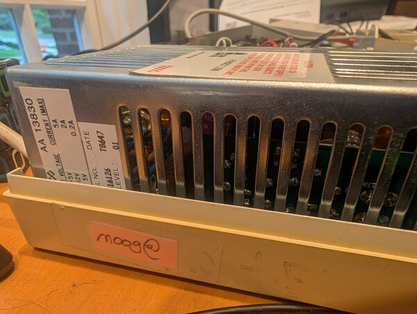
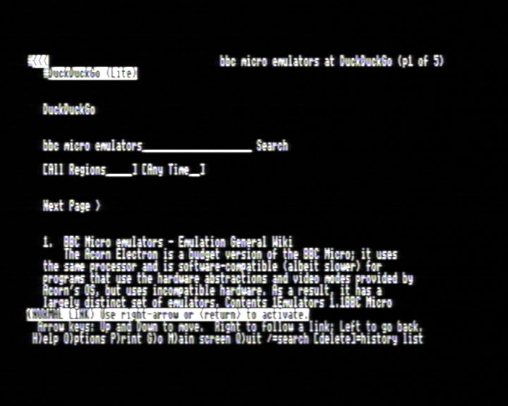
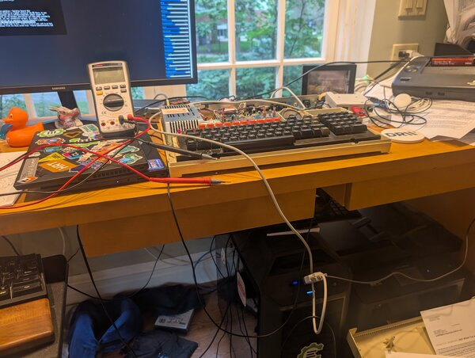

---
authors:
- aitoboxrobot
categories:
- 工具教程
date: 2026-09-01
hide:
- navigation
tags:
- 复古计算
- BBC Master
- 终端模拟
- 串口通信
- 浏览器
title: 重现 2010 年的极客实验：在 BBC Micro 电脑上访问互联网
---
### 文章背景与核心概要

本文是一篇充满怀旧情怀的技术折腾记。作者回顾了自己在 2010 年工作于谷歌期间，曾将一台古老的 BBC Master 电脑“偷渡”进办公室，通过串口连接工作电脑，并利用终端模拟器和 `lynx` 浏览器在谷歌内网“用谷歌搜索谷歌”的趣事。

时隔多年，作者决定在家里重新复现这一实验。由于现代谷歌不再支持纯文本浏览器，他转而借助 DuckDuckGo 的极简版本（Lite mode），并配合 USB 串口转换器、Termulator ROM 以及自研的 PAL 解码软件 `PALindrome`，成功在 BBC Master 上通过文本终端浏览网页。文章不仅记录了硬件连接和配置的细节（如 `lynx` 的键位映射调整），还顺便升级了经典模拟器 `jsbeeb` 的音视频仿真效果，将复古情怀与现代技术完美融合。

---

# Recreating a 2010 Experiment

> **Summary:** A nostalgic journey into retro computing and modern tinkering. The author recounts smuggling a BBC Master into Google in 2010 to browse the web via terminal, and details the recent modern recreation of the setup at home using a serial cable, `lynx`, DuckDuckGo Lite, and custom PAL video decoding software.

---

## Introduction: Googling Google from Within Google

大约在 2010 年，当我还效力于谷歌时，我萌生了一个有趣的小项目：将我对复古计算的热爱与在科技巨头（Big G）工作的兴奋感结合起来。

> Sometime around 2010, while I was working at Google, I came up with a fun mini project to marry my love of retro computing with my excitement for working at big G.

我把我的 BBC Master 电脑偷渡进了办公室，通过串口线将其连接到我的工作台式电脑上。经过一番捣鼓，我成功运行了一个终端模拟器。BBC 电脑作为工作机的哑终端（dumb terminal），我随后运行了 `lynx` 并访问了 `google.com`，搜索了 `google`。我想我可以自信地说，我是唯一一个在谷歌内部、用一台 BBC Micro 电脑搜索谷歌的人。

> I smuggled my BBC Master into the office and hooked it up over a serial cable to my work desktop, and then after some jiggery-pokery, was able to get a terminal emulator running. The BBC was a dumb terminal to the work machine, and I ran `lynx` and visited `google.com`, searched for `google`. I think I can safely say I'm the only person who googled Google on a BBC Micro from within Google itself.

<a href="http://xania.org/202608/moog-label.jpeg" rel="noopener noreferrer" referrerpolicy="no-referrer" target="_blank">

</a>
<br/>我的 Beeb 电脑上仍然贴着 `moog@` 的标签（即我的 LDAP 登录名），用来证明它是谁的设备。

> <a href="http://xania.org/202608/moog-label.jpeg" rel="noopener noreferrer" referrerpolicy="no-referrer" target="_blank">
> 
> </a>
> <br/>My Beeb still has the `moog@` sticker (my LDAP login) to show whose it was.

---

## Recreating the Magic at Home

我曾试图在家里复制这个场景，但遗憾的是，谷歌已经不再支持像 `lynx` 这样不支持 JavaScript 的浏览器了（我想我或许可以找另一个支持的？）。不过我发现 DuckDuckGo 提供了一个“极简版（lite）”模式。经过大量的反复折腾，我终于成功重现了类似的画面：

> I was trying to replicate this at home but sadly Google no longer supports non-JS browsers like `lynx` (I guess I could find another one that does?). But I did see that DuckDuckGo has a "lite" mode. After an enormous amount of fiddling I was able to recreate something similar:

<a href="http://xania.org/202608/beeb-duckduckgo.png" rel="noopener noreferrer" referrerpolicy="no-referrer" target="_blank">

</a>
<br/>在 Beeb 上运行 DuckDuckGo 的荣光。

> <a href="http://xania.org/202608/beeb-duckduckgo.png" rel="noopener noreferrer" referrerpolicy="no-referrer" target="_blank">
> 
> </a>
> <br/>The glory of DuckDuckGo on a Beeb.

上面这张图片是用我正在开发的 PAL 解码软件 [PALindrome](https://github.com/mattgodbolt/PALindrome) 捕捉的，所以画面有些模糊等情况，很可能是因为我那不太成熟的实现导致的。

> The image above was captured with my own in-progress software PAL decoder [PALindrome](https://github.com/mattgodbolt/PALindrome), so the blurriness etc is likely from my inept implementation.

---

## The Technical Setup

我使用了一个廉价的无品牌 USB 串口转换器[^cheap]以及一根 RS232-RS423 DIN 数据线。刚开始时，我把线插反了 180 度（该线缆的防呆设计不太好，哎呀），但正确插入后，一切就开始正常工作了。我最初尝试使用的是 Master 内置的 `*TERMINAL` 程序，但说实话，用来干这个实在太烂了。于是我换成了 Acornsoft 的“Termulator”ROM。4800 波特率是我能稳定运行的最高速度，而且还需要做一些调整来配置 XON/XOFF。在 LLM（大语言模型）的协助下，我运行了一个 `getty` 进程，这样就可以用这台 Beeb 登录了。要想在这样一个并不太常规的键盘上凭肌肉记忆盲打密码，可真是一件难事！

> I used a cheap no-name USB serial converter[^cheap] and an RS232-RS423 DIN cable. I first put the cable in 180 degrees the wrong way (bad keying on the cable, oops), but once correctly plugged in things started working. I initially tried with the Master's built-in `*TERMINAL` program, but it's frankly pretty rubbish for this. I used the Acornsoft "Termulator" ROM instead. 4800 baud was the fastest I could reliably get working, and it needed a bit of work to get XON/XOFF configured. With some LLM help I got a `getty` running so I could log in with the Beeb. It's hard to type your muscle-memory password on a not-quite-normal keyboard! 

这是一个用于告诉 `lynx` 不要处理 XON/XOFF 且不显示颜色的小技巧：

> A hack to tell `lynx` not to process XON/XOFF and not show colour:

```ini
INCLUDE:/etc/lynx/lynx.cfg
KEYMAP:^S:DO_NOTHING
KEYMAP:^Q:DO_NOTHING
SHOW_COLOR:never
```

<a href="http://xania.org/202608/whole-setup.jpeg" rel="noopener noreferrer" referrerpolicy="no-referrer" target="_blank">

</a>
<br/>整个鲁布·戈德堡机械（Heath Robinson）式的凌乱配置。

> <a href="http://xania.org/202608/whole-setup.jpeg" rel="noopener noreferrer" referrerpolicy="no-referrer" target="_blank">
> 
> </a>
> <br/>The whole Heath Robinson setup.

---

## Reflections and Emulator Improvements

对我来说，这算是一种双重怀旧：2010 年正是我的小儿子出生的时候，而我们刚刚庆祝了他的 16 岁生日……时间都去哪儿了？

> A bit of double-nostalgia for me: 2010 is when my youngest was born, and we just celebrated his 16th... where does the time go?

尽管有 [Compiler Explorer](https://compiler-explorer.com) 的繁重工作，以及我那[崭新（且有趣）的工作](https://hudsonrivertrading.com)，我还是设法挤出时间来折腾这些小玩意儿。同时，我结合 PALindrome 的反馈、仔细的音频录制以及测试程序，对 [jsbeeb](https://bbc.xania.org) 的音视频模拟进行了“改进”。这些改进可以说让它变得更加原汁原味……但也让听觉和视觉效果在客观上变得更糟了——不过能收获满满的情怀，这一切都是值得的！当然，所有这些都是可配置的（你可以在设置页面调整，或者点击右上角的快速设置进行修改）。

> Despite all my [Compiler Explorer](https://compiler-explorer.com) commitments, and my [fun new(ish) job](https://hudsonrivertrading.com), I've somehow managed to find time to hack on things like this, and also use feedback from both PALindrome and some careful audio recordings and test programs to "improve" the audio and video emulation of [jsbeeb](https://bbc.xania.org). They make it arguably more authentic... but do sound and look objectively worse — the nostalgia hit is worth it though! All configurable of course (play with the settings on the settings page or the top right for quick settings).

---

## Footnotes

1. <sup id="fnref:cheap"><a href="#fn:cheap">1</a></sup> 嗯，虽然我说它是无品牌的，但说明书上印着“OIKWAN”和“东莞市澳群实业有限公司”，所以我想它其实并不是完全没有名字。 <a href="#fnref:cheap" title="Jump back to footnote 1 in the text">↩</a>

> ## Footnotes
> 
> 1. <sup id="fnref:cheap"><a href="#fn:cheap">1</a></sup> Well, I say no-name but the instruction leaflet says "OIKWAN" and "Dongguan Auqun Industrial Co Ltd", so I suppose it's not completely nameless. <a href="#fnref:cheap" title="Jump back to footnote 1 in the text">↩</a>