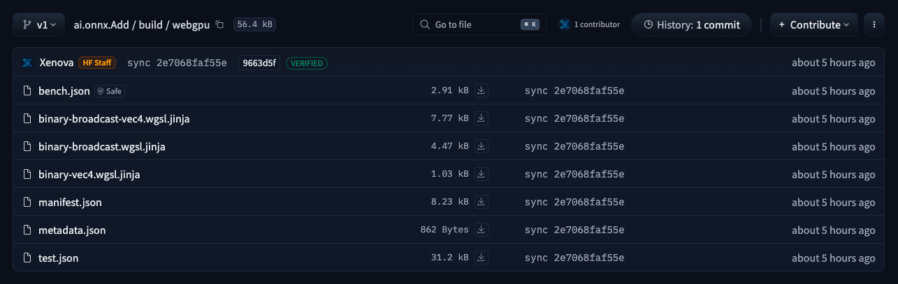
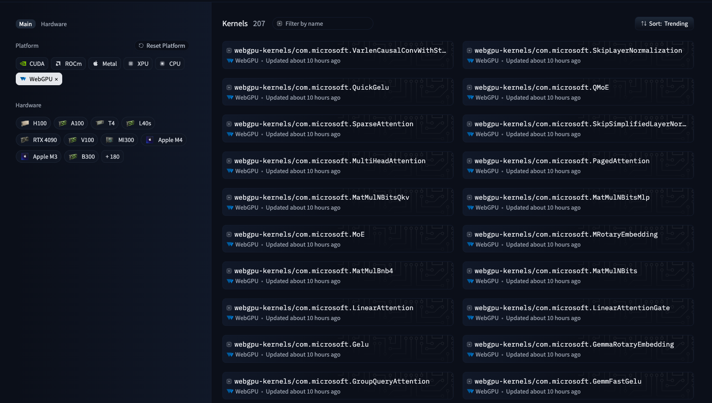

---
authors:
- aitoboxrobot
categories:
- 产品发布
date: 2026-09-02
hide:
- navigation
tags:
- WebGPU
- Hugging Face
- 机器学习
- 浏览器端AI
- 性能优化
title: 介绍 @huggingface/kernels：面向本地 AI 的 200 多个 WebGPU 核函数
---
### 文章背景与核心概要
Hugging Face 的 WebAI 团队近期发布了 `@huggingface/kernels`，这是一个精简的库，旨在直接从 Hugging Face Hub 加载并运行优化后的 WebGPU 核函数（Kernels）。伴随着首批发布的 207 个带有版本控制的核函数（可在 huggingface.co/webgpu-kernels 查阅），该版本为加速基于浏览器的机器学习推理奠定了坚实的底层基础。此外，团队还推出了 Fleet，这是一个通过众包方式收集真实客户端硬件性能与正确性数据的浏览器端基准测试工具。

这一系列工具通过将低级基元解耦为可发现、有版本控制且可测试的独立存储库，打破了“浏览器中运行 AI 模型”的性能瓶颈。相比传统的 ORT WebGPU，这些核函数在几何平均性能上实现了 2.57 倍的提升，并在特定压力测试中取得了惊人的效率。文章详细介绍了这些核函数的结构、JavaScript 加载方式、基准测试表现以及旨在优化未来变体的 Fleet 众包遥测系统。

---

## 📌 摘要 / Summary

> Hugging Face's WebAI team has released **`@huggingface/kernels`**, a minimal library designed to load and run optimized WebGPU kernels directly from the Hugging Face Hub. Accompanied by an initial collection of **207 versioned kernels** (available at [huggingface.co/webgpu-kernels](https://huggingface.co/webgpu-kernels)), this release establishes a foundational low-level layer to accelerate browser-based machine learning inference. Additionally, the team launched **Fleet**, an in-browser benchmarking tool that crowdsources real-world performance and correctness data across diverse client hardware.

Hugging Face 的 WebAI 团队发布了 **`@huggingface/kernels`**，这是一个精简的库，旨在直接从 Hugging Face Hub 加载并运行优化后的 WebGPU 核函数。伴随着首批发布的 **207 个版本化核函数**（可在 [huggingface.co/webgpu-kernels](https://huggingface.co/webgpu-kernels) 获取），该版本建立了一个基础的底层层，以加速基于浏览器的机器学习推理。此外，该团队还推出了 **Fleet**，这是一个浏览器内基准测试工具，可跨各种客户端硬件众包真实的性能和正确性数据。

---

## 📋 核心要点 / TL;DR

> * **207 WebGPU Kernels:** Published as individual Apache-2.0 licensed repositories under the [`webgpu-kernels`](https://huggingface.co/webgpu-kernels) organization.
> * **JavaScript Loader (`@huggingface/kernels`):** Seamlessly downloads, prepares, and executes kernels straight from the Hub.
> * **Explicit Contracts & Reproducible Evidence:** Every kernel includes manifests, correctness test suites, benchmark cases, and parameterized WGSL shader templates.
> * **Fleet Testing Suite:** A crowdsourced browser benchmarking tool that gathers telemetry from real-world GPUs to optimize future kernel variants.

* **207 个 WebGPU 核函数：** 以采用 Apache-2.0 许可证的独立存储库形式发布在 [`webgpu-kernels`](https://huggingface.co/webgpu-kernels) 组织下。
* **JavaScript 加载器 (`@huggingface/kernels`)：** 无缝下载、准备并直接从 Hub 执行核函数。
* **显式契约与可复现证据：** 每个核函数都包含清单、正确性测试套件、基准测试用例以及参数化的 WGSL 着色器模板。
* **Fleet 测试套件：** 一个众包浏览器基准测试工具，可收集来自真实世界 GPU 的遥测数据，以优化未来的核函数变体。

---

## 为什么从核函数开始？ / Why Start with Kernels?

> Running an AI model inside a browser translates execution into a sequence of GPU operations—including matrix multiplications, normalizations, convolutions, attention mechanisms, and quantization routines. While **WebGPU** delivers a portable API across modern browsers, and **WGSL** supplies a shared shader language, **portability does not automatically guarantee optimal performance.**

在浏览器中运行 AI 模型，本质上是将执行过程转化为一系列的 GPU 操作——包括矩阵乘法、归一化、卷积、注意力机制和量化例程。虽然 **WebGPU** 在现代浏览器中提供了可移植的 API，**WGSL** 也提供了共享的着色器语言，但**可移植性并不自动保证最佳性能。**

> Factors like workgroup sizing, memory access layouts, vectorization strategies, and data types mean that identical shaders can behave drastically differently across hardware ecosystems. By decoupling low-level primitives into discoverable, versioned, and testable repositories, Hugging Face provides higher-level runtimes with a stable, high-performance foundation.

工作组大小、内存访问布局、向量化策略和数据类型等因素意味着，相同的着色器在不同的硬件生态系统中表现可能截然不同。通过将底层基元解耦为可发现、有版本控制且可测试的存储库，Hugging Face 为高层运行时提供了一个稳定、高性能的基础。

---

## 核函数存储库，而不仅仅是一个着色器 / A Kernel Repository, Not Just a Shader

> Every kernel in the collection functions as a standalone software artifact accompanied by a dedicated kernel card. For instance, [`ai.onnx.Add`](https://huggingface.co/webgpu-kernels/ai.onnx.Add) handles elementwise addition with multidirectional broadcasting.

集合中的每个核函数都作为一个独立的软件产物运行，并配有专门的核函数卡片。例如，[`ai.onnx.Add`](https://huggingface.co/webgpu-kernels/ai.onnx.Add) 处理具有多向广播的逐元素相加（elementwise addition）。

<figure class="image text-center">

<figcaption>The <code>ai.onnx.Add</code> repository packages its manifest, correctness and benchmark cases, and WGSL shader templates together.</figcaption>
</figure>

> Each repository contains structured components:
> * **`manifest.json`**: The absolute source of truth defining inputs, outputs, attributes, type constraints, and shape derivation logic.
> * **`metadata.json`**: Tracks the kernel identifier, provenance data, and cryptographic digests.
> * **`test.json`**: Encapsulates expected correctness test cases.
> * **`bench.json`**: Supplies performance benchmarking and tuning workloads.
> * **`*.wgsl.jinja`**: Parameterized WGSL shader templates tailored to dynamic execution environments.

每个存储库都包含结构化的组件：
* **`manifest.json`**：定义输入、输出、属性、类型约束和形状推导逻辑的绝对权威来源（source of truth）。
* **`metadata.json`**：跟踪核函数标识符、来源数据和密码学摘要。
* **`test.json`**：封装预期的正确性测试用例。
* **`bench.json`**：提供性能基准测试和调优工作负载。
* **`*.wgsl.jinja`**：专为动态执行环境定制的参数化 WGSL 着色器模板。

---

## 从 Hub 加载核函数 / Loading a Kernel from the Hub

> First, install the preview package from npm:

首先，从 npm 安装预览版软件包：

```bash
npm install @huggingface/kernels@preview
```

> **Note:** Running these kernels requires a browser supporting [WebGPU](https://developer.mozilla.org/en-US/docs/Web/API/WebGPU_API). You can verify availability in JavaScript via `"gpu" in navigator`.

> **注意：** 运行这些核函数需要支持 [WebGPU](https://developer.mozilla.org/en-US/docs/Web/API/WebGPU_API) 的浏览器。你可以通过 JavaScript 中的 `"gpu" in navigator` 来验证其可用性。

### 示例用法 / Example Usage

> The following example demonstrates a simple bias-addition execution pattern:

以下示例演示了一个简单的偏置相加（bias-addition）执行模式：

```js
import { getKernel } from "@huggingface/kernels";

const add = await getKernel("webgpu-kernels/ai.onnx.Add", { version: 1 });

const { c } = await add({
  a: {
    data: new Float32Array([1, 2, 3, 4, 5, 6]),
    shape: [2, 3],
  },
  b: {
    data: new Float32Array([10, 20, 30]),
    shape: [3],
  },
});
```

> The loader automatically computes output shapes and allocates tensor memory based on the kernel contract. 

加载器会根据核函数契约自动计算输出形状并分配张量内存。

---

## 核函数有多快？ / How Fast Are the Kernels?

> Comparing the collection head-to-head against ORT WebGPU on an Apple M4 GPU (using ONNX Runtime Web `1.30.0-dev.20260826-b1f76d586a`) across 809 matching operations revealed significant performance advantages:
> 
> * **2.57x faster** by geometric mean.
> * **1.90x faster** at the median.

在 Apple M4 GPU 上将该集合与 ORT WebGPU（使用 ONNX Runtime Web `1.30.0-dev.20260826-b1f76d586a`）针对 809 个匹配操作进行直接对比，结果显示出显著的性能优势：

* 按几何平均数计算，速度提升 **2.57 倍**。
* 按中位数计算，速度提升 **1.90 倍**。

### 基准测试亮点 / Benchmark Highlights

> | Operation | Compared cases | Our WebGPU Kernel | ORT WebGPU | Speedup |
> | --- | ---: | ---: | ---: | ---: |
> | Add | 5 | 0.064 ms | 0.227 ms | **3.52x** |
> | MatMul | 29 | 0.115 ms | 0.131 ms | **1.14x** |
> | Softmax | 12 | 0.114 ms | 0.240 ms | **2.11x** |
> | LayerNormalization | 6 | 0.061 ms | 0.135 ms | **2.22x** |

| 操作 | 对比用例数 | 我们的 WebGPU 核函数 | ORT WebGPU | 加速比 |
| --- | ---: | ---: | ---: | ---: |
| Add | 5 | 0.064 ms | 0.227 ms | **3.52x** |
| MatMul | 29 | 0.115 ms | 0.131 ms | **1.14x** |
| Softmax | 12 | 0.114 ms | 0.240 ms | **2.11x** |
| LayerNormalization | 6 | 0.061 ms | 0.135 ms | **2.22x** |

> In specialized stress cases, optimizations proved even more dramatic—such as a bilinear Einsum operation running **over 10,000x faster** (0.136 ms vs. 1,396 ms) and a row-wise CumSum operating **301x faster**.

在专用的压力测试用例中，优化效果甚至更加戏剧性——例如，双线性 Einsum 操作运行速度**快了 10,000 倍以上**（0.136 毫秒对 1,396 毫秒），而按行计算的 CumSum 操作速度**快了 301 倍**。

---

## 从单一设备到庞大舰队（Fleet） / From One Device to a Fleet

> Because WebGPU performance relies heavily on client drivers, GPUs, and browser configurations, lab environments are insufficient. **Fleet** acts as an opt-in telemetry suite allowing users to run browser-based benchmarks that securely submit performance and correctness data back to Hugging Face, guiding continuous shader refinement.

由于 WebGPU 性能很大程度上依赖于客户端驱动程序、GPU 和浏览器配置，实验室环境是远远不够的。**Fleet** 充当一个可选择加入（opt-in）的遥测套件，允许用户运行基于浏览器的基准测试，将性能和正确性数据安全地提交回 Hugging Face，从而指导持续的着色器改进。

---

## 为 WebAI 构建共享基础 / Building a Shared Foundation for WebAI

> These initial 207 kernels are fully integrated into the Hub's broader infrastructure:

这最初的 207 个核函数已完全集成到 Hub 更广泛的基础设施中：

<figure class="image text-center">

<figcaption>All 207 WebGPU kernels on the Hub's <a href="https://huggingface.co/kernels?platform=webgpu&amp;sort=trending">Kernels page</a>, filtered by platform.</figcaption>
</figure>

> This architecture relies on a cohesive loop:
> 1. **Versioned Contracts:** Defined explicitly via individual kernel repositories.
> 2. **Simplified Execution:** Handled cleanly through `@huggingface/kernels`.
> 3. **Crowdsourced Telemetry:** Gathered globally via Fleet to identify bottlenecks and optimize variant choices.

该架构依赖于一个紧密结合的闭环：
1. **版本化契约：** 通过各个核函数存储库进行显式定义。
2. **简化的执行：** 通过 `@huggingface/kernels` 干净利落地处理。
3. **众包遥测：** 通过 Fleet 在全球范围内收集，以识别瓶颈并优化变体选择。

> Explore the [WebGPU kernel collection](https://huggingface.co/webgpu-kernels), try out [`@huggingface/kernels`](https://www.npmjs.com/package/@huggingface/kernels), and [join the Fleet](https://webgpu-kernels-fleet.hf.space/) to contribute performance data from your hardware!

欢迎探索 [WebGPU 核函数集合](https://huggingface.co/webgpu-kernels)，试用 [`@huggingface/kernels`](https://www.npmjs.com/package/@huggingface/kernels)，并[加入 Fleet](https://webgpu-kernels-fleet.hf.space/)，贡献来自你硬件的性能数据！