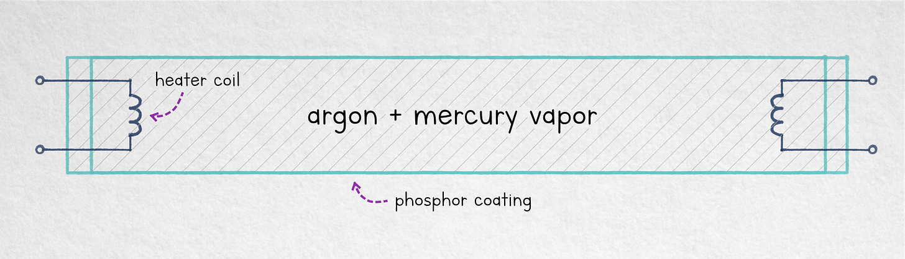

---
authors:
- aitoboxrobot
categories:
- 研究解读
date: 2026-09-02
hide:
- navigation
tags:
- 技术侦察对抗
- 间谍神话
- 物理实验
- 光学窃听
- 荧光灯
title: 荧光灯（其实）没有耳朵
---
### 文章背景与核心概要
本文探讨了作者早年在技术侦察对抗（TSCM）领域的职业经历，并对一个长久以来的间谍传说进行了调查：荧光灯是否可以被用作被动的窃听装置？通过将荧光灯管置于高强度音频系统旁并使用高速摄影技术进行测试，作者从物理学角度评估了声波改变灯管亮度的可能性。

文章回顾了光学窃听的原理与相关研究，并详细记录了作者测试荧光灯窃听可行性的实验过程。最终，通过严谨的实验与观察，作者推翻了这一不切实际的攻击向量，证实了该流言在现实场景中无法成立。

---

# Fluorescent Lamps (Don’t) Have Ears

> # 荧光灯（其实）没有耳朵

## Summary

In this article, the author reflects on their early career in technical surveillance countermeasures (TSCM) and investigates a persistent espionage myth: whether fluorescent lamps can be used as passive listening devices. By testing a fluorescent tube against a high-intensity audio system using high-speed photography, the author evaluates the physical plausibility of sound waves altering the tube's luminosity. Ultimately, the practical attack vector is debunked.

> 在这篇文章中，作者回顾了自己早年在技术侦察对抗（TSCM）领域的职业生涯，并调查了一个持久存在的间谍神话：荧光灯是否可以用作被动窃听装置。通过将荧光灯管置于高强度音响系统旁并结合高速摄影进行测试，作者评估了声波改变灯管亮度的物理合理性。最终，这一实际的攻击向量被证明并不成立。

---

## Introduction to Technical Surveillance Countermeasures

> ## 技术侦察对抗简介

I never mentioned it publicly, but early in my career, I did a part-time stint in *technical surveillance countermeasures* (TSCM) — a fancy term for sweeping office environments in search of listening devices and other unauthorized spy gear. In practice, the job entailed getting several certifications, hauling around a bunch of costly suitcases, and above all, spending some time with ex-spooks, listening to stories that would make James Bond blush.

> 我从未在公开场合提及此事，但在我职业生涯的早期，我曾兼职从事*技术侦察对抗*（TSCM）工作——这是对搜寻办公环境中的窃听器及其他未经授权的间谍装备的高端称呼。在实践中，这项工作需要获得多项认证，拖着一堆昂贵的行李箱，最重要的是，还要花时间与前间谍们呆在一起，听一些足以让詹姆斯·邦德脸红的故事。

The discipline is rather hush-hush, so you never know what’s real. One of the more striking claims I remember from the training was that fluorescent lamps could be used to passively eavesdrop on conversations in the room. This makes some sense: the tubes are filled with glowing gas. A sound wave propagating through this medium could theoretically produce subtle luminosity fluctuations that could be picked from afar.

> 这门学科相当神秘，因此你永远不知道什么是真的。我从培训中记起的比较引人注目的说法之一是，荧光灯可以用来被动窃听房间里的对话。这在某种程度上讲得通：灯管里充满了发光气体。在这个介质中传播的声波理论上可以产生微弱的发光波动，从而可以从远处捕捉到。

## The Science of Optical Eavesdropping

> ## 光学窃听的科学原理

To be clear, long-distance optical audio pickup is real: if you shine a laser at a pane of glass or other reflective surface, sound-induced vibrations can be picked up by measuring the angle of the reflected beam; in favorable conditions, this supposedly works at distances in excess of 100 m (330 ft). Far less practically, a [Black Hat presentation in 2020](https://ad447342-c927-414a-bbae-d287bde39ced.filesusr.com/ugd/a53494_443addc922e048d89a664c2423bf43fd.pdf) demonstrated the ability to passively recover audio by placing a beefy speaker 1 cm away from a dangling lightbulb, and then observing the motion of the lightbulb via a telescope from about 25 m (80 ft).

> 明确地说，远距离光学音频采集是真实存在的：如果你把激光照射到玻璃窗或其他反射表面上，通过测量反射光束的角度就可以采集到声波引起的振动；在有利的条件下，据说这在超过 100 米（330 英尺）的距离上也能起作用。实用性要差得多的是，在 [2020 年的 Black Hat 演讲](https://ad447342-c927-414a-bbae-d287bde39ced.filesusr.com/ugd/a53494_443addc922e048d89a664c2423bf43fd.pdf)中展示了一种能力：将一个强力扬声器放在距离悬空灯泡 1 厘米的地方，然后通过大约 25 米（80 英尺）外的望远镜观察灯泡的运动，从而被动恢复音频。

But is the claim about fluorescent lamps true? At first blush, it sounds physically plausible. But when you think about it, the gas in the tube is kept at about 1/200th of atmospheric pressure. It’s nearly vacuum — hardly a good medium for sound waves. Worse, the glowing gas emits UV, which needs to be converted to visible light using an opaque phosphor layer that covers the inside of the tube and exhibits strong afterglow. Wouldn’t that mask any momentary, localized changes in luminosity?…

> 但关于荧光灯的说法是真的吗？乍一看，这在物理上似乎是合理的。但仔细想想，灯管内的气体压力保持在约为大气压的 1/200。它几乎是真空——很难成为声波的良好介质。更糟糕的是，发光气体发射出紫外线，需要通过覆盖在灯管内侧、具有强余辉的不透明荧光粉层将其转换为可见光。难道这不会掩盖任何短暂的、局部的亮度变化吗？……

## Putting the Myth to the Test

> ## 用实验检验流言

After two short decades, I couldn’t take it anymore and decided to test the claim. My initial plan was to tape a photodiode directly to the tube, connect the sensor into a low-noise amplifier, and then view the resulting waveform on an oscilloscope. But then, I settled for a simpler approach: I placed the lamp next to a high-intensity sound source — a 200 W audio system hooked up to a signal generator and cranked all the way up — and then took a series of high-speed, up-close photos with a shutter of 1/8000 s. I figured that if such powerful sound waves don’t produce visible artifacts in any of the captured 14-bit images, the odds of the scheme working in a more realistic scenario were minimal, even if we used more precise measurement gear.

> 在经历了短短二十年之后，我再也无法忍受了，决定测试这个说法。我最初的计划是将光电二极管直接用胶带粘在灯管上，将传感器连接到低噪声放大器，然后在示波器上查看生成的波形。但随后，我采用了一种更简单的方法：我将灯放在一个高强度声源旁边——一个连接到信号发生器并开到最大的 200 W 音响系统——然后用 1/8000 秒的快门拍摄了一系列高清特写照片。我想，如果如此强大的声波在任何捕获的 14 位图像中都没有产生可见的伪影，那么即使我们使用更精确的测量设备，该方案在更现实的场景中起作用的几率也是微乎其微的。

### Powering the Lamp

> ### 为灯管供电

To begin, I needed to power the tube. Traditional fluorescent lamps rely on thermionic emission to get going: there’s a pair of terminals on each end that connects to an internal heater coil. Once the coil is heated to a glow, it becomes easier for thermally-excited electrons to dart off into the void in response to an externally-applied electromotive force. In this respect, the device is similar to a vacuum tube.

> 首先，我需要为灯管供电。传统的荧光灯依靠热电子发射来启动：每个端部都有一对连接到内部加热线圈的端子。一旦线圈被加热发光，热激发电子就更容易在外部施加的电动势响应下冲入真空。在这方面，该装置类似于真空管。

> 

For the 9” tube I purchased, the heater needed a current of about 200 mA at 16 V. I opted for DC operation to minimize AC-induced flicker, so it was sufficient to heat just the negative side. With that done, the terminals on each end would be shorted and a voltage of roughly 70-80 V would be applied across the tube. The voltage causes plasma to form; from that point on, the current must be capped to about 180 mA at ~35 V.

> 对于我购买的 9 英寸灯管，加热器在 16 V 下需要约 200 mA 的电流。我选择直流运行以尽量减少交流引起的闪烁，因此仅加热负极侧就足够了。完成此操作后，两端的端子将短路，并在灯管两端施加大约 70-80 V 的电压。该电压会导致等离子体形成；从那时起，电流必须限制在 ~35 V 下约 180 mA。

Here’s a quick video showing the process of manually starting the lamp:

> 以下是展示手动启动灯管过程的简短视频：

<iframe src="https://player.vimeo.com/video/1222872992?autoplay=0&amp;h=cd9386f34a&amp;dnt=1" frameborder="0" allowfullscreen="true" sandbox="allow-scripts allow-same-origin allow-popups allow-popups-to-escape-sandbox" loading="lazy"></iframe>

## Results and Conclusion

> ## 结果与结论

I’ll spare you the dozens of fast-shutter photos I’ve taken while playing back different audio frequencies: they show nothing at all. These non-results are summarized more concisely in the following video of a wide-frequency audio sweep:

> 我就不展示我在播放不同音频频率时拍摄的几十张快门照片了：它们什么也没有显示。以下宽频音频扫描视频更简洁地总结了这些无果的结果：

<iframe src="https://player.vimeo.com/video/1222872993?autoplay=0&amp;h=88fb9428e9&amp;dnt=1" frameborder="0" allowfullscreen="true" sandbox="allow-scripts allow-same-origin allow-popups allow-popups-to-escape-sandbox" loading="lazy"></iframe>

I really wanted to believe the claim. Maybe someone else can still “prove” it; pump the volume up even higher, use a larger tube, take absurdly precise measurements. But in terms of a practical attack, I think the myth is busted. Sorry, Mr. Bond?

> 我真的很想相信这个说法。也许其他人仍然可以“证明”它；把音量调得更高，使用更大的灯管，进行极其精确的测量。但就实际攻击而言，我认为这个流言已经被打破了。抱歉，邦德先生？

[Subscribe now](https://blog.coredump.cx/subscribe?)

> [立即订阅](https://blog.coredump.cx/subscribe?)