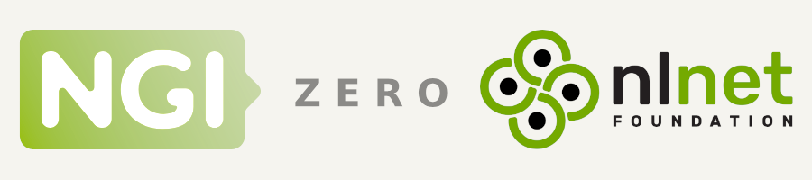

---
authors:
- aitoboxrobot
categories:
- 工具教程
date: 2026-09-04
hide:
- navigation
tags:
- PHP
- ActivityPub
- HTTP Signatures
- RFC 9421
- Mastodon
title: PHP 验证 ActivityPub 的 RFC 9421 HTTP 签名实用指南
---
### 文章背景与核心概要
随着去中心化社交网络（Fediverse）的普及，Mastodon 等服务器广泛采用了最新的 **RFC 9421 HTTP 消息签名**标准来确保服务器间通信的安全性和真实性。本文提供了一套实用且以代码为核心的方法，指导开发者如何在 PHP 中解析并验证这些加密签名。

文章深入浅出地讲解了签名基础字符串（Signature Base String）的构建方式、如何通过 ActivityPub 获取参与者的公钥、利用 PHP 的 OpenSSL 扩展验证密码学签名，以及通过校验 `content-digest` 确保请求体未被篡改。文中附带了完整的实现代码与分步解析，是 PHP 开发者对接 Fediverse 生态不可多得的实战参考。

---

## 闭嘴，看代码！

以下是如何使用 PHP 的 OpenSSL 扩展来验证服务器收到的真实签名：

> Here is how you can validate a real signature received by your server using PHP's OpenSSL extension:

```php
$verified = openssl_verify(
    data:       '"@method": POST
"@target-uri": https://example.viii.fi/inbox
"content-digest": sha-256=:tFdB/ENGczHMlZMDb66pXoUi2d0OqH2iBHdnN/WV1mc=:
"@signature-params": ("@method" "@target-uri" "content-digest");created=1787780262;keyid="https://mastodon.social/users/Edent#main-key"',
    signature:  base64_decode( "sIfmNsM/Q8iG6AJlne1IkZVjQSVFDEYIPsnoSOXQY+W3Eb4+SOn9o4J5SQmFOP+Jecjf3ioFwUdsrFjAGkUUOHPvSbNWkGKtNuGm+C6r3aI3JBCFGPqX3ITgZYV76CF7JJJ5hPGaG8YH/XdmxVIeFfD3M39FQCncMyyq7xJJvwKKP1mzS5s1vNQie8hbQ9owRjtqvoWcmM9GEYCUHNcMPLjZc+CBrj8sfBbNTYgIFI4UtirOaRJvYymxXjmXuzeVYxQujMjAjgobxQ8QFv0zlYsHk+gS5EYyafpJG9zmfCFSoF9+ZwqKNADmuADbISD9LZIH/bmkPoNXhxaeFPqYog==" ),
    public_key: "-----BEGIN PUBLIC KEY-----\nMIIBIjANBgkqhkiG9w0BAQEFAAOCAQ8AMIIBCgKCAQEAsYMEs4waqk/6gaS+xn1T\nYygElTtNIFNkBcEdEBMaeoGVhyZiVKtSjJCS4z+X+394PKvcfSTcFILIt2GI2jOB\nHD0M2fFgxc8mmdSdCQkgEh9jF3bFI3kopDvzYf726iioYKlHXKpfPKvFt7EJgKH7\naCtS25NQkek3YUd6y3VBcT3R6Xhze9P3QNoZMIsFXklgXDKj+EllfbUqLf1vxt3s\nmD9ETxy2bJi9FheE0uY2WhARn49XAvwczM5Wzt+zqxVEtgpi5v2+ZZAVKhDnJkiC\nCCuI6hrSnKNIx/5mSlX0a0S5h5d03djrCkYsqmwelu01rhOXP2grsz4BXp0y2wrO\n3QIDAQAB\n-----END PUBLIC KEY-----\n",
    algorithm:  "sha256"
);

echo $verified;
```

将上述代码复制并粘贴到 PHP 中，你应该会看到 `$verified` 的计算结果为 `true`。

> Copy and paste that into PHP, and you should see that `$verified` evaluates to `true`.

---

## 理解请求头

除了发往服务器的消息体，你还会收到如下所示的 HTTP 请求头：

> Along with the message sent to your server, you will have received HTTP headers like this:

```http
content-digest: sha-256=:tFdB/ENGczHMlZMDb66pXoUi2d0OqH2iBHdnN/WV1mc=:
signature: sig1=:sIfmNsM/Q8iG6AJlne1IkZVjQSVFDEYIPsnoSOXQY+W3Eb4+SOn9o4J5SQmFOP+Jecjf3ioFwUdsrFjAGkUUOHPvSbNWkGKtNuGm+C6r3aI3JBCFGPqX3ITgZYV76CF7JJJ5hPGaG8YH/XdmxVIeFfD3M39FQCncMyyq7xJJvwKKP1mzS5s1vNQie8hbQ9owRjtqvoWcmM9GEYCUHNcMPLjZc+CBrj8sfBbNTYgIFI4UtirOaRJvYymxXjmXuzeVYxQujMjAjgobxQ8QFv0zlYsHk+gS5EYyafpJG9zmfCFSoF9+ZwqKNADmuADbISD9LZIH/bmkPoNXhxaeFPqYog==:
signature-input: sig1=("@method" "@target-uri" "content-digest");created=1787780262;keyid="https://mastodon.social/users/Edent#main-key"
```

`signature-input` 告知了你如何构建**“签名基础（Signature Base）”**。你必须构建一个文本字符串，将各个组件按指定的顺序排列，并用换行符分隔：

> The `signature-input` tells you how to construct a **"Signature Base"**. You have to build a text string that places the various components in the order specified, separated with a newline:

```text
"@method": POST
"@target-uri": https://example.viii.fi/inbox
"content-digest": sha-256=:tFdB/ENGczHMlZMDb66pXoUi2d0OqH2iBHdnN/WV1mc=:
"@signature-params": ("@method" "@target-uri" "content-digest");created=1787780262;keyid="https://mastodon.social/users/Edent#main-key"
```

其中 `@method` 是向服务器发送数据时使用的 HTTP 方法（通常为 `GET` 或 `POST`），而 `@target-uri` 是消息发送到的 URL（通常是你的收件箱）。

> Where `@method` is the HTTP method used to send data to your server (usually `GET` or `POST`), and `@target-uri` is the URL the message was sent to (usually your inbox).

### 获取公钥

`signature-input` 末尾的 `keyid` 指向了参与者的个人资料——例如：  
`keyid="https://mastodon.social/users/Edent#main-key"`

> The `keyid` at the end of `signature-input` points to the actor's profile—for example:  
> `keyid="https://mastodon.social/users/Edent#main-key"`

如果你向该 URL 发起请求，你将收到一个类似于以下的 ActivityPub 参与者文档：

> If you make a request to that URL, you will receive an ActivityPub Actor document looking something like this:

```json
{
  "@context": [
    "https://www.w3.org/ns/activitystreams",
    "https://w3id.org/security/v1"
  ],
  "id": "https://mastodon.social/users/Edent",
  "webfinger": "Edent@mastodon.social",
  "type": "Person",
  "name": "Terence Eden",
  "publicKey": {
    "id": "https://mastodon.social/users/Edent#main-key",
    "owner": "https://mastodon.social/users/Edent",
    "publicKeyPem": "-----BEGIN PUBLIC KEY-----\nMIIBIjANBgkqhkiG9w0BAQEFAAOCAQ8AMIIBCgKCAQEAsYMEs4waqk/6gaS+xn1T\nYygElTtNIFNkBcEdEBMaeoGVhyZiVKtSjJCS4z+X+394PKvcfSTcFILIt2GI2jOB\nHD0M2fFgxc8mmdSdCQkgEh9jF3bFI3kopDvzYf726iioYKlHXKpfPKvFt7EJgKH7\naCtS25NQkek3YUd6y3VBcT3R6Xhze9P3QNoZMIsFXklgXDKj+EllfbUqLf1vxt3s\nmD9ETxy2bJi9FheE0uY2WhARn49XAvwczM5Wzt+zqxVEtgpi5v2+ZZAVKhDnJkiC\nCCuI6hrSnKNIx/5mSlX0a0S5h5d03djrCkYsqmwelu01rhOXP2grsz4BXp0y2wrO\n3QIDAQAB\n-----END PUBLIC KEY-----\n"
  }
}
```

其中的 `publicKeyPem` 正是你所需的字符串。无需将 `\n` 字符转换为字面量换行符。

> The `publicKeyPem` is the string you need. There is no need to convert the `\n` characters into literal newlines.

---

## 验证内容摘要（Content Digest）

仅验证请求头是不够的；你还必须通过 `content-digest` 请求头确保请求体与签名相匹配：

> Verifying the headers alone is not enough; you must also ensure the body matches the signature via the `content-digest` header:

`"content-digest": sha-256=:tFdB/ENGczHMlZMDb66pXoUi2d0OqH2iBHdnN/WV1mc=:`

要在 PHP 中计算你自己的内容摘要：

> To calculate your own content digest in PHP:

```php
$digestCalculated = base64_encode(
    hash(
        algo: "sha256",
        data: $body,
        binary: true
    )
);
```

你的摘要是否与请求头中发送的一致？如果不一致，说明有些地方不对劲。

> Does your digest match the one sent along with the headers? If not, something dodgy is going on.

---

## 整合全过程

### 验证步骤

1. 获取请求头。
2. 获取请求体。
3. 从请求头的 `content-digest` 中提取算法和哈希值。
4. 使用请求体，通过 `content-digest` 中的算法计算你自己的哈希值。
5. 你计算出的哈希值与发送过来的哈希值匹配吗？如果不匹配，则终止；如果匹配，则继续。
6. 从请求头的 `signature` 中提取 Base64 编码的签名。
7. 从请求头的 `signature-input` 中提取签名输入字符串。
8. 从签名输入字符串中提取签名基础（Signature Base）的顺序。
9. 构造签名基础（Signature Base）。
10. 从签名输入字符串中提取 `keyid`。
11. 从 `keyid` 处获取公钥。
12. 使用 `openssl_verify()`，结合 SHA256 算法，针对公钥验证签名基础和 Base64 解码后的签名。

> [!NOTE]
> [Mastodon 仅使用 SHA256](https://docs.joinmastodon.org/spec/security/#http-message-signatures)。

> ### Verification Steps
> 
> 1. Get the headers.
> 2. Get the body.
> 3. From the headers' `content-digest`, extract the algorithm and hash.
> 4. Using the body, calculate your own hash using the algorithm from `content-digest`.
> 5. Does your hash match the sent hash? If not, stop. If so, proceed.
> 6. From the headers' `signature`, extract the Base64-encoded signature.
> 7. From the headers' `signature-input`, extract the signature-input string.
> 8. From the signature-input string, extract the order of the Signature Base.
> 9. Construct the Signature Base.
> 10. From the signature-input string, extract the `keyid`.
> 11. Get the Public Key from the `keyid`.
> 12. Use `openssl_verify()` to verify the Signature Base and the Base64-decoded signature against the Public Key using SHA256.
> 
> > [!NOTE]
> > [Mastodon *only* uses SHA256](https://docs.joinmastodon.org/spec/security/#http-message-signatures). 

### 完整的 PHP 实现

以下是一个用于处理验证流程的健壮脚本。请仔细阅读，因为它包含针对你所在环境硬编码的假设：

> Here is a robust script to handle the verification process. Read through it carefully, as it contains hard-coded assumptions for your environment:

```php
<?php

//  Validate the Digest.
//  It is the hash of the raw input string, in binary, encoded as base64.

//  The format is content-digest => <algorithm>=:<base64 encoded hash>:
$digestString = $headers["content-digest"];
//  The Base64 encoding may have multiple `=` at the end. So split this at the first `=`.
$digestData = explode( separator: "=", string: $digestString, limit: 2 );

//  Hashes are in lowercase, but have a `-` in their name.
//  This is not what hash_algos() expects.
$digestAlgorithm = str_replace( search: "-", replace: "", subject: $digestData[0] );

//  The hash is surrounded by `:` characters.
$digestHash = str_replace( search: ":", replace: "", subject: $digestData[1] );

//  Check if the hash algorithm is one known about to PHP.
//  If not, reject and record an error.
if ( !in_array( needle:$digestAlgorithm, haystack: hash_algos() ) ) {
    return false;
}

//  Manually calculate the digest based on the data sent.
$digestCalculated = base64_encode( hash( algo: $digestAlgorithm, data: $input, binary: true ) );

//  Does our calculation match what was sent?
if ( !( $digestCalculated == $digestHash ) ) {
    return false;
}

//  The signature format is signature => <signature name>=:<base64 encoded hash>:
$signatureString = $headers["signature"];
//  The Base64 encoding may have multiple `=` at the end. So split this at the first `=`.
$signatureData = explode( separator: "=", string: $signatureString, limit: 2 );
$signatureName = $signatureData[0];

//  The signature is surrounded by `:` characters.
$signatureB64 = str_replace( search: ":", replace: "", subject: $signatureData[1] );

//  The signature-input format is complicated!
$signatureInputString = $headers["signature-input"];

//  Get the parameters. Assume there is only one signature.
$signatureParamsString = explode( separator: "=", string: $signatureInputString, limit: 2 )[1];

//  Get the different elements of the signature.
$signatureInputData = explode( separator: ";", string: $signatureInputString );

//  Construct the data.
$signatureInput = [];
foreach( $signatureInputData as $signatureInputParts ) {
    $partsData = explode( separator: "=", string: $signatureInputParts );
    //  Strip quotes from keyid and parentheses from sig1.
    if ( "keyid" == $partsData[0] ) {
        $partsData[1] = str_replace( search: "\"", replace: "", subject: $partsData[1] );
    }

    if ( $signatureName == $partsData[0] ) {
        $partsData[1] = str_replace( search: ["(", ")"], replace: "", subject: $partsData[1] );
    }

    $signatureInput[ $partsData[0] ] = $partsData[1] ;
}

$signatureStructure = $signatureInput[$signatureName];
$signatureKeyID     = $signatureInput["keyid"];

//  Remove quotes.
$signatureStructure = str_replace( search: "\"", replace: "", subject: $signatureStructure );
$signatureStructureData = explode( separator: " ", string: $signatureStructure );

//  https://www.rfc-editor.org/info/rfc9421/#section-2.5
$signatureBase = "";
foreach ( $signatureStructureData as $signatureStructureParts ) {
    if ( "@method" == $signatureStructureParts ) {
        //  https://www.rfc-editor.org/info/rfc9421/#name-method
        $signatureBase .= "\"@method\": " . strtolower( $_SERVER["REQUEST_METHOD"] . "\n" );
    }
    if ( "@target-uri" == $signatureStructureParts ) {
        //  https://www.rfc-editor.org/info/rfc9421/#section-2.2.2
        //  Change the domain name to your own.
        $signatureBase .= "\"@target-uri\": https://EXAMPLE.COM" . $_SERVER["REQUEST_URI"] . "\n";
    }
    if ( "content-digest" == $signatureStructureParts ) {
        $signatureBase .= "\"content-digest\": $digestString\n";
    }
}

//  https://victoronsoftware.com/posts/http-message-signatures/#how-the-signature-is-created
$signatureBase .= "\"@signature-params\": $signatureParamsString";

//  Get the signing user's public key.
//  This is usually in the form `https://example.com/user/username#main-key`
//  This is to differentiate if the user has multiple keys.
//  This may need to be a signed request. You will need to write your own getDataFromURl() function to get the sending user's key.
$userData  = getDataFromURl( $signatureKeyID );
$publicKey = $userData["publicKey"]["publicKeyPem"];

//  Verify the request
$verified = openssl_verify(
    data:       $signatureBase,
    signature:  base64_decode( $signatureB64 ),
    public_key: $publicKey,
    algorithm:  $digestAlgorithm
);

//  Convert the result to boolean.
if ( $verified === 1 ) {
    $verified = true;
} elseif ( $verified === 0 ) {
    $verified = false;
} else {
    $verified = null;
}

return $verified;
```

---

## 延伸阅读

* [RFC 9421 HTTP Message Signatures](https://www.rfc-editor.org/info/rfc9421/)
* [Understanding HTTP message signatures: A developer's guide](https://victoronsoftware.com/posts/http-message-signatures/)
* [Sign and verify HTTP messages (RFC 9421)](https://www.otoroshi.io/docs/tutorials/http-message-signatures-rfc9421/)
* [Verification of HTTP Message Signatures](https://darutk.medium.com/verification-of-http-message-signatures-501bbdc7dfec)
* [HTTP-Message-Signer in PHP](https://github.com/macgirvin/HTTP-Message-Signer)

> * [RFC 9421 HTTP Message Signatures](https://www.rfc-editor.org/info/rfc9421/)
> * [Understanding HTTP message signatures: A developer's guide](https://victoronsoftware.com/posts/http-message-signatures/)
> * [Sign and verify HTTP messages (RFC 9421)](https://www.otoroshi.io/docs/tutorials/http-message-signatures-rfc9421/)
> * [Verification of HTTP Message Signatures](https://darutk.medium.com/verification-of-http-message-signatures-501bbdc7dfec)
> * [HTTP-Message-Signer in PHP](https://github.com/macgirvin/HTTP-Message-Signer)

---

## 鸣谢 NLnet

这篇博客文章的部分资金支持来自于我的 NLnet NGI0 资助项目。谢谢！

> This blog post was funded in part by the work I'm doing for my NLnet NGI0 grant. Thanks!

<a href="https://nlnet.nl/project/ActivityBot/" rel="noopener noreferrer" referrerpolicy="no-referrer" target="_blank"></a>