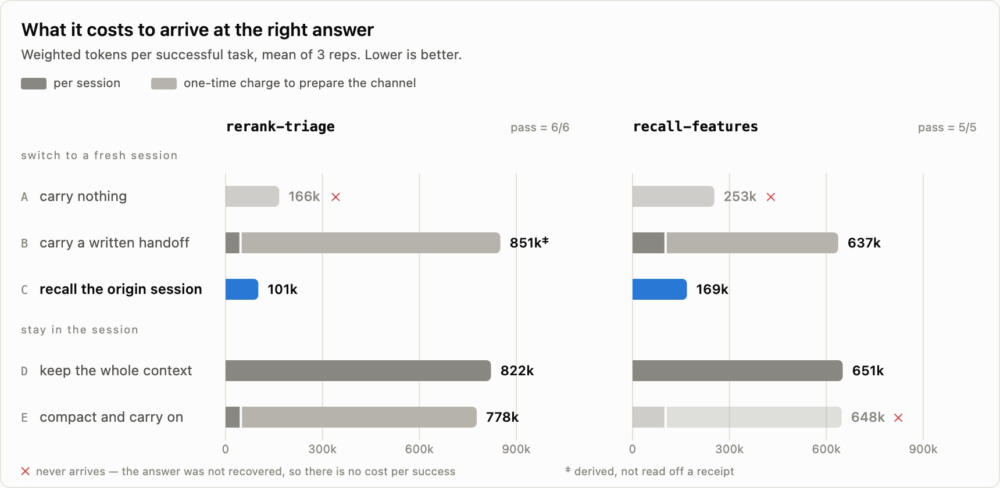

---
authors:
- aitoboxrobot
categories:
- 工具教程
date: 2026-09-04
hide:
- navigation
tags:
- AI编码智能体
- 记忆层
- funes
- Hugging Face
- 混合搜索
title: 为你的编码智能体赋予属于你自己的记忆
---
### 文章背景与核心概要
编码智能体（Coding Agents）在每次开启新会话或切换机器时往往会从零开始，从而丢失关键的上下文和历史决策依据。虽然会话日志记录了一切，但在没有适当索引的情况下，极其难以高效检索。**funes** 是一个专为编码智能体（如 Claude Code、Codex、pi 和 Hermes）设计的持久化、本地优先的记忆层。它通过混合搜索（向量搜索、BM25 和交叉编码器重排）在本地对智能体痕迹进行索引，并可选择与你拥有的私有 Hugging Face 数据集进行同步。这使你能够在不同的机器、团队成员和智能体之间保留上下文，而不会导致长会话臃肿或为外部的“记忆即服务”API 付费。

本文介绍了 funes 的核心架构、工作原理及其如何通过本地与共享记忆解决传统智能体“健忘”的痛点，为开发者提供了一种成本更低、控制力更强的智能体持久化记忆方案。

---

## 为你已经在使用的智能体添加记忆
Add Memory to the Agent You Already Use

> I work across several machines, and I switch coding agents depending on the task. Every one of them meets my projects as a stranger. The reasoning from “last Tuesday” disappears when the session ends. Each new agent, on each new host, starts from zero.

我经常在多台机器间工作，并且会根据具体任务切换不同的编码智能体。它们中的每一个在接触我的项目时都是个陌生人。当会话结束时，“上周二”的推理过程便消失了。每一个新智能体在每一台新主机上，都必须从零开始。

> Earlier this year, [*Software Forgets: Agent Traces Are the Memory*](https://huggingface.co/blog/huggingface/agent-traces-as-memory) made the case that coding agents already produce the record we keep losing. As they search a codebase, try approaches, hit errors, read documentation, and change direction, they leave behind a dense account of not just *what* changed, but *why*.

今年早些时候，[*软件会遗忘：智能体痕迹即记忆*](https://huggingface.co/blog/huggingface/agent-traces-as-memory) 一文提出：编码智能体其实已经生成了我们不断丢失的记录。当它们搜索代码库、尝试各种方法、遇到错误、阅读文档并改变方向时，它们留下的不仅是“修改了什么”的密集记录，还有“为什么这样修改”的理由。

> While the diagnosis is correct, traces are only potential memory. The session logs of an agent are still just an archive. You cannot `grep` your way to *“why did we move off the streaming parser?”* across ten thousand turns. For an agent to use those traces while it works, they need indexing, retrieval, ranking, and exact provenance.

虽然这一诊断是正确的，但痕迹仅仅是潜在的记忆。智能体的会话日志本质上仍只是个归档文件。你无法通过 `grep` 命令在成千上万轮对话中查出*“我们当初为什么要放弃流式解析器？”*。为了让智能体在工作时能够利用这些痕迹，它们需要经过索引、检索、排名以及精确的出处追踪。

> That is what [funes](https://github.com/huggingface/funes) provides. It is a durable memory layer for your agents (Claude Code, Codex, pi, and Hermes). It is built from the sessions already on your machine. It works locally and becomes part of your agent's normal workflow with one command. When you want it to, it can also travel to a Hugging Face dataset you own, private by default.

这就是 [funes](https://github.com/huggingface/funes) 所提供的功能。它是为你的智能体（Claude Code、Codex、pi 和 Hermes）打造的持久化记忆层。它构建于你机器上已有的会话基础之上。它在本地运行，只需一条命令就能融入你智能体的工作流中。当你需要时，它还可以同步到你拥有的 Hugging Face 数据集中（默认私有）。

> funes is a single binary. Its default inference backend has no ML runtime dependency, and embedding and reranking happen *on your machine*. Install it:

funes 是一个单一的二进制文件。其默认的推理后端不依赖任何机器学习运行时，嵌入（embedding）和重排（reranking）均在**你的机器上**完成。安装命令如下：

```bash
curl -fsSL https://huggingface.co/buckets/huggingface/funes/resolve/install.sh | sh
```

> Then add it to an agent:

然后将其添加到某个智能体中：

```bash
funes add claude    # 或: codex, pi, hermes
```

> That one `add` command builds the first index, gives the agent `recall` and `get` tools, and installs the automation that indexes each completed turn. Indexing is incremental, with new runs adding new turns rather than embedding the whole history again. The older and deeper content can backfill in bounded steps.

这一个 `add` 命令会构建初始索引，赋予智能体 `recall`（回忆）和 `get`（获取）工具，并安装用于对每个完成的对话轮次进行索引的自动化脚本。索引是增量进行的，新的运行会添加新的轮次，而无需重新嵌入整个历史记录。更早、更深层的内容可以通过有界步骤进行回填。

> From there, you just work. When a task touches a past decision, rationale, or finding, the agent can reach for `recall` itself. You do not need to remember the old session or paste its context into the new one.

自此之后，你只需正常工作。当任务触及过去的某个决定、理由或发现时，智能体可以自己调用 `recall`。你无需记住旧的会话，也无需将旧上下文粘贴到新会话中。


> With funes added, recall happens inside the conversation. The agent reaches for its memory on its own and names the session behind its answer.

> 引入 funes 后，回忆过程直接在对话内部发生。智能体会自主调用其记忆，并说出其回答背后的会话来源。

> `recall` returns the original text, not a summary, and shows exactly where it came from (the agent, timestamp, session, and turn). Each result includes a `get` command that opens the full turn and its surrounding context.

`recall` 返回的是原始文本，而非摘要，并且会精确显示其出处（智能体、时间戳、会话和轮次）。每个结果都包含一个 `get` 命令，用于打开完整的对话轮次及其上下文环境。

> Underneath, one deterministic pipeline parses every supported trace into the same turn-and-block shape, chunks it, embeds it with a pinned local model, and writes it to a local **Lance** dataset. A query combines vector and BM25 search, fuses their rankings, reranks the candidates with a cross-encoder, reweights them by recency, and attaches neighboring chunks.

在底层，一个确定性的流水线将每个受支持的痕迹解析为相同的“轮次-区块”形态，对其进行分块，使用固定的本地模型进行嵌入，并写入本地的 **Lance** 数据集。查询过程结合了向量搜索和 BM25 搜索，融合两者的排名，使用交叉编码器（cross-encoder）对候选结果进行重排，根据时效性重新加权，并附加相邻的区块。

> That design gives funes three important properties:
> * **One memory across agents:** Claude Code, Codex, pi, and Hermes all write to the same shape. `recall` spans their histories, and every hit says which agent produced it.
> * **Raw evidence stays intact:** Nothing is distilled into a fact at write time. A result can always lead back to the turn that produced it.
> * **`recall` is local by default:** No account or Hub repository is required. A hosted model does not process your sessions for indexing; embedding and reranking run on your machine, and your coding agent does the reasoning.

这一设计赋予了 funes 三个重要的特性：
* **跨智能体的单一记忆：** Claude Code、Codex、pi 和 Hermes 都写入相同的数据形态。`recall` 能够跨越它们的历史记录，并且每一次命中都会标明是由哪个智能体产生的。
* **原始证据保持完整：** 写入时不会将内容提炼为抽象事实。任何检索结果始终都可以追溯到生成它的具体对话轮次。
* **默认本地化 `recall`：** 无需账户或 Hub 仓库。托管模型不会处理你的会话进行索引，嵌入和重排都在你的机器上运行，并由你的编码智能体进行推理。

> The *agent as a stranger* problem is already solved on one machine. But memory gets more useful when the next agent is running somewhere else.

“智能体如陌生人”的问题在一台机器上已经得到解决。但是，当下一个智能体在其他地方运行时，记忆会变得更加有用。

---

## 记忆是一个数据集，而不是一个服务
A Memory Is a Dataset, Not a Service

> To make a memory follow your work, bind one when you add funes to an agent:

为了让记忆跟随你的工作，在将 funes 添加到智能体时绑定一个记忆库：

```bash
funes add codex acme/funes-memory
```

> The bind publishes your current memory there. funes then keeps it current, indexing each turn locally and publishing at session boundaries. The agent recalls from it throughout. Run the same command on another machine and the memory follows you there.

绑定操作会将你当前的记忆发布到该位置。随后，funes 会保持其最新状态，在本地对每一轮对话进行索引，并在会话边界处进行发布。智能体在整个过程中都可以从中进行回忆。在另一台机器上运行相同的命令，记忆就会跟随你到那里。

> Underneath, the local memory is a Lance dataset, and the shared memory is a Hugging Face dataset (private by default) you own.

在底层，本地记忆是一个 Lance 数据集，而共享记忆是你拥有的一个 Hugging Face 数据集（默认私有）。

> Before anything reaches the Hub, credentials have already been redacted during indexing. Publishing then scans every chunk again and withholds anything that still looks like a secret. The scanner behind this is documented in [`SECURITY.md`](https://github.com/huggingface/funes/blob/main/SECURITY.md), including what it does and doesn't cover.

在任何内容到达 Hub 之前，凭证信息已经在索引期间被擦除了。发布时会再次扫描每个区块，并扣留任何看起来仍然像机密的内容。这背后的扫描器记录在 [`SECURITY.md`](https://github.com/huggingface/funes/blob/main/SECURITY.md) 中，其中详细说明了它的涵盖范围和局限性。

> When an agent reads a remote memory, funes caches the dataset files locally, so warm queries return to local speed. The Hub supplies the ownership, access control, versioning, and distribution it already supplies for other datasets. Your memory does not become an account in a separate memory service, and you do not rent it back through an API.

当智能体读取远程记忆时，funes 会在本地缓存数据集文件，因此热查询能够恢复到本地的速度。Hub 为其提供了原本就适用于其他数据集的所有权、访问控制、版本控制和分发机制。你的记忆不会变成独立记忆服务中的一个账号，你也不需要通过 API 租用它。

---

## 先提问，后连线
Ask First, Wire Later

> `recall` is shaped for agents. When you want to put a question to a memory yourself, use `ask`. It reads your local memory by default:

`recall` 是为智能体量身定制的。当你自己想向记忆提出问题时，请使用 `ask`。它默认读取你的本地记忆：

```bash
funes ask claude "what did we decide about the streaming parser"
```

> Or point it at a shared memory. We published a [memory](https://huggingface.co/datasets/huggingface/funes-memory) of funes development, so you can ask why funes works the way it does without creating a memory of your own:

或者将其指向一个共享记忆。我们发布了一个关于 funes 开发过程的[记忆库](https://huggingface.co/datasets/huggingface/funes-memory)，因此你无需创建自己的记忆，就可以直接询问 funes 为什么会这样设计：

```bash
funes ask claude "why is funes append-only" --memory huggingface/funes-memory
```


> `funes ask` is the read-only, one-question sibling of `funes add`. It recalls the passages, hands them to a coding agent, and returns a grounded answer that names its sources. It does not install an integration or change the agent's persistent setup.

> `funes ask` 是 `funes add` 的只读、单次提问的“兄弟功能”。它回忆相关段落，将其交由编码智能体处理，并返回一个有据可依且标明来源的回答。它不会安装任何集成，也不会改变智能体的持久化配置。

> A retrieval miss is not papered over. If the passages do not support an answer, the agent says so. You can rephrase the question or add funes to the agent so it can search the memory iteratively during normal work.

检索未命中时不会被掩盖。如果段落不支持某个回答，智能体会直言不讳。你可以重新措辞问题，或者将 funes 添加到智能体中，以便它在正常工作期间能够迭代地搜索记忆。

---

## 切换智能体而不丢失脉络
Switching Agents Without Losing the Thread

> A shared memory is not tied to the agent or model that created it. Start a task in Claude Code, continue it in Codex next week, and the second agent can recall the first agent's reasoning. Use pi with a local model or one served through the Hugging Face router, then return to Claude.

共享记忆并不绑定于创建它的智能体或模型。你可以在 Claude Code 中开始一个任务，下周在 Codex 中继续，第二个智能体就能够回忆起第一个智能体的推理过程。你可以配合本地模型或通过 Hugging Face 路由提供的模型来使用 pi，然后再切回 Claude。


> *Claude makes a decision; a hook indexes it; Codex recalls it in another session. The older hits in the demo are earlier recordings of the same experiment: an append-only memory remembered the rehearsals too.*

> *Claude 做出决定；钩子（hook）对其进行索引；Codex 在另一个会话中回忆起它。演示中较早的命中是同一实验的早期记录：只追加（append-only）的记忆连排练过程也一并记住了。*

> This matters in a few different scopes:
> * **Across your machines:** Bind each agent to one memory and recall the history from whichever host you are using.
> * **Across a team:** A new teammate's agent can retrieve months of decisions on day one, including dead ends and rationale that never made it into a pull request.
> * **Alongside an open-source project:** A maintainer can publish the sessions behind a release, naming them on the push. Think of it as a searchable `CLAUDE.md` that holds the history of why the project is the way it is, instead of a page someone must keep rewriting. Anyone can read a public memory with `--memory`.

这在以下几种场景中尤为重要：
* **跨机器：** 将每个智能体绑定到一个记忆库，无论使用哪台主机都可以随时回忆历史。
* **跨团队：** 新队友的智能体在第一天就能检索到数个月的决策记录，包括那些未能进入 Pull Request 的死胡同和底层逻辑。
* **配合开源项目：** 维护者可以在发布版本时发布背后的会话记录并在推送时命名。你可以把它想象成一个可搜索的 `CLAUDE.md`，它承载了项目之所以成其现状的历史记录，而不需要某人不断去重写文档。任何人都可以通过 `--memory` 读取公开的记忆。

> Published memories carry a dataset card and the funes tag, making them recognizable and [discoverable on the Hub](https://huggingface.co/datasets?other=funes). The Hub already hosts open weights and datasets. funes adds open working memory. It holds the decisions, failed approaches, and rationale behind a project, queryable by another agent and traceable to the sessions that produced them.

发布的记忆带有数据集卡片和 funes 标签，使其具有可识别性，并[能够在 Hub 上被发现](https://huggingface.co/datasets?other=funes)。Hub 已经托管了开放权重和数据集，而 funes 则为之增添了开放的工作记忆。它保存了一个项目背后的决策、失败的尝试和设计理由，可供其他智能体查询，并可追溯到生成它们的会话。

---

## 摆脱长会话困境的最经济方式
The Cheapest Way Out of a Long Session

> A long investigation bloats a session until each turn costs more to carry the context than to do the work. The usual answers are to let the agent compact and carry on, or to write a handoff and start fresh. Recall is a third, so we measured them against each other on the [handoff-vs-recall benchmark](https://huggingface.co/datasets/dacorvo/funes-handoff-recall-benchmark/blob/main/results/README.md): two tasks whose answer cannot be reconstructed without the session prior knowledge.

漫长的排查会让会话变得臃肿，直到每轮对话中携带上下文的成本超过了实际干活的成本。通常的解决方法是让智能体压缩（compact）上下文并继续，或者编写交接文档（handoff）并重新开始。回忆（Recall）则是第三种选择，因此我们在[交接对决回忆基准测试](https://huggingface.co/datasets/dacorvo/funes-handoff-recall-benchmark/blob/main/results/README.md)中对它们进行了相互对比：这两项任务如果不依赖会话先验知识，其答案就无法被重建。

> Compaction is what most agents do by default, and it was the only one of the three whose result divided: it arrived on one task and never arrived on the other. Where it failed, its summary had flattened the findings that mattered. Recall returns the passages themselves, so a finding does not have to survive summarization.

上下文压缩是大多数智能体默认采用的做法，也是三者中唯一结果出现分化的方法：它在一项任务上成功了，但在另一项任务上彻底失败。在失败的场景中，其摘要抹平了至关重要的发现。而 Recall 返回的是段落本身，因此重要的发现无需在摘要中大难不死。

> Recall was the cheapest of the three on both tasks, 8x cheaper than a written handoff on one and 4x on the other.

在两项任务中，Recall 都是三者中最经济的，在一项任务中比手写交接文档便宜 8 倍，在另一项中便宜 4 倍。



> *The lighter segment of each bar is the one-time charge for preparing the channel, the handoff or the compaction, paid before the first question is asked and counted once. A cross marks a channel that never arrives, and so has no cost per success.*

> *每个柱状图较浅的部分是准备渠道（交接或压缩）的一次性费用，在提出第一个问题之前支付并计费一次。交叉标记代表从未成功送达的渠道，因此其单次成功的成本为零。*

---

## 告别从零开始
Stop Starting from Zero

> > *“To think is to forget differences, generalize, make abstractions.”*  
> > — Jorge Luis Borges, *Funes the Memorious*

> *“思考就是忘记差异、概括、进行抽象。”*  
> —— 豪尔赫·路易斯·博尔赫斯，《博闻强记的富内斯》

> Your agents already wrote the record. funes lives at [`github.com/huggingface/funes`](https://github.com/huggingface/funes), one command away from turning that record into a memory the next agent can read, on whichever machine you happen to be on.

你的智能体已经写好了记录。funes 项目托管在 [`github.com/huggingface/funes`](https://github.com/huggingface/funes)，只需一条命令，就能将这些记录转化为下一个智能体无论身处何台机器都能读取的记忆。

---

## 建立在开源基础之上
Built on Open Source

> funes invents little of this. It leans on open-source embedding models good enough to run locally, on [Lance](https://github.com/lancedb/lance)'s append-only datasets with cheap incremental writes, and on the Hub's caching and content-dedup for datasets. The work is in fitting them into a memory an agent can actually use.

funes 并没有凭空发明多少新东西。它依托于足以在本地运行的开源嵌入模型、[Lance](https://github.com/lancedb/lance) 的低成本增量写入“只追加”数据集，以及 Hub 的数据集缓存和内容去重机制。其核心工作在于将这些技术有机结合，打造成智能体真正能够使用的记忆。

> funes is open source too. [Open an issue](https://github.com/huggingface/funes/issues) for anything from an install snag to a recall that missed, or an agent you'd like supported.

funes 同样是开源的。无论是安装遇到阻碍、回忆未能命中，还是希望增加对某个智能体的支持，欢迎随时[提交 Issue](https://github.com/huggingface/funes/issues)。