---
authors:
- aitoboxrobot
categories:
- 工具教程
date: 2026-09-04
hide:
- navigation
tags:
- TRL
- OpenEnv
- 强化学习
- 图像生成
- 艺术创作
title: 使用 TRL 与 OpenEnv 训练会用代码画水彩画的代码模型
---
### 文章背景与核心概要
本文探讨了对 Surya Narreddi 病毒式开源项目的公开复现。该项目通过教授语言模型编写代码来绘制自然水彩画。作者利用 **TRL**（Transformer 强化学习库）和 **OpenEnv**，成功训练模型使用 `p5.brush` 库编写 JavaScript 程序，生成具有独特质感的水彩画作。

该开源实现的主要贡献与要点包括：端到端构建于 Hugging Face 平台（Jobs、Spaces、Inference Providers 和 Hub Collections）的全可复现流程；创建并整理了一个包含 178 幅画作、按偏好分级的参考池；通过对比三种奖励组合（仅 HPS、裁判主导、HPS主导），评估了将美学模型（如 **HPSv3**）与成对视觉裁判（**Qwen3-VL**）相结合如何影响策略优化与风格输出；所有代码、数据集、环境及训练后的模型均已公开供社区使用。

---

> ## Training a Coding Model to Paint Watercolours with TRL and OpenEnv
> 
> *Published September 3, 2026 by [Sergio Paniego](https://sergiopaniego)*  
> *[View on GitHub](https://github.com/huggingface/blog/blob/main/train-to-paint-with-code.md)*

---

> ## Summary
> 
> This article explores an open reproduction of Surya Narreddi’s viral project teaching language models to paint natural watercolours via code. Using **TRL** (Transformer Reinforcement Learning) and **OpenEnv**, the author successfully trains models to write JavaScript programs using the `p5.brush` library. 
> 
> Key contributions and takeaways of this open-source implementation include:
> - A fully reproducible pipeline built end-to-end on Hugging Face (Jobs, Spaces, Inference Providers, and Hub Collections).
> - The creation and curation of a 178-painting reference pool divided into preference tiers.
> - A comparative analysis of three reward mixes (`hps-only`, `judge-led`, and `hps-led`) evaluating how pairing aesthetic models like **HPSv3** with a pairwise vision judge (**Qwen3-VL**) influences policy optimization and stylistic output.
> - All code, datasets, environments, and trained models published openly for community use.

---

[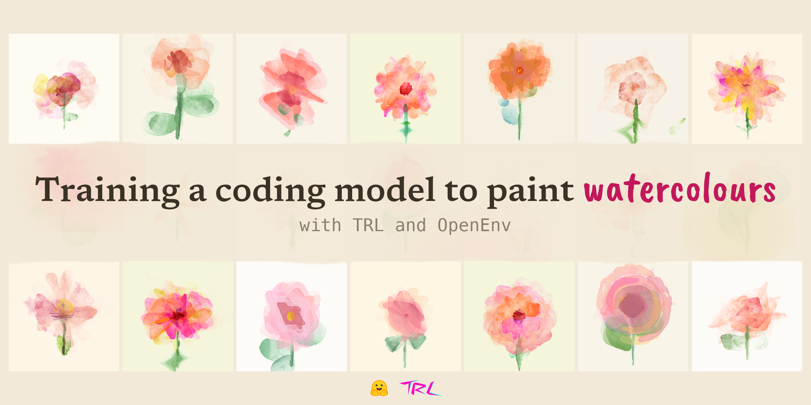](./images/99d77c963ed2.png)

> On 23 August, [Surya Narreddi](https://x.com/kickingkeys/status/2091570990048276897) posted a beautiful video of watercolours painted by a language model. The model writes JavaScript through [p5.brush](https://github.com/acamposuribe/p5.brush), a library that "adds natural drawing tools to p5.js". The video went viral fast, gathering over 1.5M views at the time of writing.
> 
> The video came with [a blog post](https://surya.website/rling-qwen-to-paint-with-code) explaining the training behind an earlier and narrower stage of the project (close-up flowers rather than full compositions), though sadly without open artifacts at the time. His site notes that a full technical report is coming, so be sure to follow him. The original concept is his, coming from the art and design side, where [his skills are way beyond mine](https://x.com/kickingkeys/status/2094901433149612118). My attempt focuses on the engineering side: reproducing the recipe in the open with every piece published.
> 
> > **Note:** For context behind the project, explained by Surya himself, watch [this video of his thesis](https://vimeo.com/1190839818).
> 
> In this article, I attempt to reproduce his idea using [TRL](https://huggingface.co/docs/trl) and [OpenEnv](https://github.com/huggingface/OpenEnv). The reference pool dataset, the RL environment, the training scripts, and the trained models are all open.
> 
> The entire pipeline runs on Hugging Face, end-to-end:
> - Training on [Jobs](https://huggingface.co/docs/huggingface_hub/guides/jobs)
> - The RL environment and the scorer model hosted as [Spaces](https://huggingface.co/docs/hub/spaces)
> - The pairwise judge powered through [Inference Providers](https://huggingface.co/docs/inference-providers)
> - Every artifact published on the Hub and gathered into [one collection](https://huggingface.co/collections/HuggingEnvs/paint-with-code-6a955b79d63f67f1631d9be6)
> 
> Once the two Spaces are up, the recipe requires only a single command. Duplicate the [environment](https://huggingface.co/spaces/HuggingEnvs/watercolour-env) and the [scorer model](https://huggingface.co/spaces/HuggingEnvs/watercolour-hpsv3), set two environment variables for the reward mix, and launch:

8月23日，[Surya Narreddi](https://x.com/kickingkeys/status/2091570990048276897) 发布了一段精美的视频，展示了由语言模型绘制的水彩画。该模型通过 [p5.brush](https://github.com/acamposuribe/p5.brush)（一个为 p5.js “添加自然绘图工具”的库）编写 JavaScript 代码。这段视频迅速走红，在撰写本文时已获得超过 150 万次的观看。

伴随视频发布的是[一篇博客文章](https://surya.website/rling-qwen-to-paint-with-code)，其中解释了该项目早期较窄阶段（特写花卉而非完整构图）背后的训练过程，不过遗憾的是当时并没有开源产物。他的网站指出完整的技术报告即将推出，因此请务必关注他。最初的概念来自艺术与设计领域的他，正如他所说[他的技能远远超过我](https://x.com/kickingkeys/status/2094901433149612118)。我的尝试则专注于工程侧：在开源社区中复现这一配方，并公开每一个组件。

> **注意：** 如需了解该项目背后的背景（由 Surya 本人亲自解释），请观看[他的毕业论文视频](https://vimeo.com/1190839818)。

在本文中，我尝试使用 [TRL](https://huggingface.co/docs/trl) 和 [OpenEnv](https://github.com/huggingface/OpenEnv) 来复现他的想法。参考池数据集、RL 环境、训练脚本以及训练好的模型均已全部开源。

整个流程端到端运行在 Hugging Face 上：
- 在 [Jobs](https://huggingface.co/docs/huggingface_hub/guides/jobs) 上进行训练
- RL 环境和评分模型托管在 [Spaces](https://huggingface.co/docs/hub/spaces) 上
- 成对裁判（Pairwise judge）由 [Inference Providers](https://huggingface.co/docs/inference-providers) 提供支持
- 每个产物都发布在 Hub 上并汇集到[一个合集](https://huggingface.co/collections/HuggingEnvs/paint-with-code-6a955b79d63f67f1631d9be6)中

一旦这两个 Spaces 启动完毕，整个配方只需一条命令即可运行。复制[环境](https://huggingface.co/spaces/HuggingEnvs/watercolour-env)和[评分模型](https://huggingface.co/spaces/HuggingEnvs/watercolour-hpsv3)，为奖励组合设置两个环境变量，然后启动：

```bash
hf jobs uv run train/watercolour_grpo.py --flavor h200 --timeout 48h --secrets HF_TOKEN -- \
  --env-url https://<you>-watercolour-env.hf.space \
  --model Qwen/Qwen3.5-35B-A3B --lora --all-linear --bf16 --gradient-checkpointing \
  --subject 'a peach hibiscus' --references 4 \
  --top-p 0.95 --top-k 20 \
  --lr 5e-5 --lr-scheduler constant_with_warmup --warmup-steps 5 \
  --scale-rewards none \
  --steps 110 --n-episodes 240 --num-generations 8 \
  --per-device-batch-size 1 --gradient-accumulation-steps 8 \
  --max-completion-length 8192 \
  --run-tag my-run --out <you>/watercolour-grpo --push-to-hub
```

> The rest of this article tells the story of getting there, and [every piece is available in the repository](https://github.com/adithya-s-k/HuggingEnvs/tree/main/02-watercolour).
> 
> I followed the original blog step by step, adapting things only when strictly necessary. Ideas of my own went into a separate list rather than interrupting the experiments, which became "What I would try next" at the end of this article, alongside the full catalog of published artifacts. If you have already read his post, the framing and reward design will feel familiar. The new material here includes the open implementation, the hand-rated pool, and three trained reward mixes compared side-by-side, beginning with [The RL environment you need to build](#the-rl-environment-you-need-to-build).

本文的其余部分将讲述实现这一目标的历程，[所有内容都可以在代码库中找到](https://github.com/adithya-s-k/HuggingEnvs/tree/main/02-watercolour)。

我一步步遵循了原博客，仅在绝对必要时才进行了调整。我自己的想法被归入单独的列表中，而没有打断实验，这些想法最终成为了本文末尾的“我接下来会尝试什么”，以及已发布产物的完整目录。如果你已经读过他的文章，那么框架和奖励设计会让你感到熟悉。这里的新内容包括开源实现、人工打分的参考池，以及并排对比的三种训练奖励组合，让我们从[你需要构建的 RL 环境](#the-rl-environment-you-need-to-build)开始。

<figure class="image text-center">
<video autoplay="" controls="" loop="" muted="" playsinline="" src="https://huggingface.co/datasets/huggingface/documentation-images/resolve/main/blog/train-to-paint-with-code/three-runs-evolution.mp4" title="Three runs evolving in parallel"></video>
<figcaption>Three runs, one per reward mix, evolving in parallel. Each frame shows the median painting of a step. No need to tell them apart yet—the article explains which run is which.</figcaption>
</figure>

---

> ## Why People Loved It
> 
> The paintings look loose, imperfect, and handmade—a refreshing break at a time when image models produce mathematically optimized, statistically average pictures. My guess is that this contrast is a major reason why the video went viral. It recalled the early days of generative AI art, when the goal was to explore the medium itself. [DeepDream](https://research.google/blog/inceptionism-going-deeper-into-neural-networks/) (2015) started as a debugging tool that people turned into art; works like [Edmond de Belamy](https://en.wikipedia.org/wiki/Edmond_de_Belamy) (2018) came from artists probing what a GAN could do; and creators like [Mario Klingemann](https://quasimondo.com) spent those years making [dreamy portraits with neural networks](https://artsandculture.google.com/asset/memories-of-passerby-i-mario-klingemann/aAHG7iV3aXme8g).
> 
> This project feels closely aligned with those early days. In his thesis, Surya describes the path that led here. He started by prompting text-to-image models, where the prompt is the only lever you can pull, and adding detail only increases control up to a point. Training the model itself goes much further. 
> 
> The other half of the idea is the medium: the model writes a program of about 150 lines of JavaScript that paints the image. Because the output is code, you can read it, edit it, run it again, and see the exact decision behind each brushstroke. Furthermore, the distinctive style comes from an intentional restriction where the model is only allowed to use *ten specific methods* from the library (more on that below).
> 
> During that same period, [Anna Ridler](https://annaridler.com/works/myriad-tulips) photographed thousands of tulips, hand-labelled every single one, exhibited the dataset itself as an artwork, and later trained a model on it. I found her work through the references AI agents brought back while building this project, and I loved it because this project does something very similar: curating a set of images by hand, and then training against them.

## 为什么人们会喜欢它

这些画作看起来很随性、不完美且带有手工感——在图像模型生成数学优化、统计学平均画作的时代，这无疑是一股清流。我猜这种对比是这段视频迅速走红的主要原因。它让人回想起生成式 AI 艺术的早期，当时的目标是探索媒介本身。[DeepDream](https://research.google/blog/inceptionism-going-deeper-into-neural-networks/)（2015）最初是一个调试工具，后来被人们转变为艺术；诸如《[Edmond de Belamy](https://en.wikipedia.org/wiki/Edmond_de_Belamy)》（2018）这样的作品源于艺术家对 GAN 潜力的探索；而像 [Mario Klingemann](https://quasimondo.com) 这样的创作者在那几年里用[神经网络制作了梦幻般的肖像](https://artsandculture.google.com/asset/memories-of-passerby-i-mario-klingemann/aAHG7iV3aXme8g)。

这个项目感觉与那些早期日子高度契合。在论文中，Surya 描述了通往此处的道路。他从提示文本到图像模型开始，其中提示词是你唯一能拉动的杠杆，增加细节在一定程度上也只能提高控制力。而直接训练模型则能走得更远。

这个构想的另一半是媒介：模型编写了一段约 150 行的 JavaScript 程序来绘制图像。由于输出是代码，你可以阅读它、编辑它、重新运行它，并看到每个笔触背后的精确决策。此外，其独特的风格来自于一项刻意的限制——模型只允许使用该库中的*十个特定方法*（详见下文）。

在同一时期，[Anna Ridler](https://annaridler.com/works/myriad-tulips) 拍摄了数千朵郁金香，手动标记了每一朵，将数据集本身作为艺术品展出，并在后来以此训练了一个模型。我在构建这个项目时通过 AI 代理带回的参考资料发现了她的作品，我非常喜欢它，因为这个项目做的事非常相似：手工策划一组图像，然后针对它们进行训练。

---

> ## RL Over Taste
> 
> Most recent RL work on language models relies on verifiable rewards—for instance, math problems with known answers, code that passes test suites, or binary graders that are cheap to run. This project is closer to an older paradigm (RLHF), where a model learns a reward model derived from human preferences.
> 
> Here, the reward is based on *aesthetic preference*. There is no objective "correct" answer; the real question of the project is whether you can successfully run RL over taste.
> 
> As defined in his blog and implemented in my RL environment, the reward function comprises four terms:
> 
> | Term | Weight | What it measures |
> | :--- | :--- | :--- |
> | `gate` | 0.05 | The sketch compiles, paints something valid, and does not cheat |
> | `length` | 0.05 | A soft nudge towards longer code snippets |
> | Pairwise judge | 0.60 | Aesthetic style compared against references drawn from a pool |
> | [HPSv3](https://huggingface.co/MizzenAI/HPSv3) | 0.30 | Aesthetic preference on the final render |
> 
> [HPSv3](https://huggingface.co/MizzenAI/HPSv3) is an open 7B preference model. Give it an image and a text description, and it outputs a score representing how much a human would prefer that image. Trained on a large dataset of human choices between pairs of images, its score aggregates general human taste. 
> 
> Meanwhile, the pairwise judge uses [Qwen3-VL-30B-A3B-Instruct](https://huggingface.co/Qwen/Qwen3-VL-30B-A3B-Instruct), a general vision model accessed via HF Inference Providers. The pairwise judge evaluates the candidate painting next to four reference images randomly drawn from the pool. It is guided by a prompt specifying what to look for (bleeds, translucent washes, soft edges) across both presentation orders, and its score reflects the share of comparisons the candidate wins. Its benchmark is purely the pool—meaning its score represents *my* taste as encoded in those ratings.

## 针对“审美”的强化学习

最近关于语言模型的 RL 工作大多依赖于可验证的奖励——例如有已知答案的数学问题、通过测试套件的代码、或者运行成本低廉的二元评分器。本项目则更接近于较旧的范式（RLHF），即模型学习由人类偏好派生的奖励模型。

在这里，奖励基于*审美的偏好*。没有客观的“正确”答案；该项目的真正问题在于，你是否能够成功地对“审美（taste）”进行强化学习。

正如他的博客中所定义并在我的 RL 环境中所实现的那样，奖励函数由四项组成：

| 项 (Term) | 权重 | 衡量内容 |
| :--- | :--- | :--- |
| `gate` | 0.05 | 草图能够编译、画出有效内容且没有作弊 |
| `length` | 0.05 | 对更长的代码片段进行轻微引导 |
| Pairwise judge (成对裁判) | 0.60 | 与从池中抽取的参考图像进行美学风格对比 |
| [HPSv3](https://huggingface.co/MizzenAI/HPSv3) | 0.30 | 对最终渲染图的美学偏好 |

[HPSv3](https://huggingface.co/MizzenAI/HPSv3) 是一个开源的 7B 偏好模型。给它一张图片和一个文本描述，它就会输出一个分数，代表人类偏好该图像的程度。由于在大规模人类图像成对选择数据集上进行过训练，其评分聚合了普遍的人类审美。

同时，成对裁判使用 [Qwen3-VL-30B-A3B-Instruct](https://huggingface.co/Qwen/Qwen3-VL-30B-A3B-Instruct)，这是一个通过 HF Inference Providers 访问的通用视觉模型。成对裁判将候选画作与从池中随机抽取的四张参考图像进行对比评估。它受到提示词的引导，该提示词指定了在两种展示顺序中需要寻找的特征（晕染、半透明水洗、柔和边缘），其得分反映了候选画作赢得比较的份额。它的基准纯粹是参考池——这意味着它的得分代表了编码在这些评分中的*我的*审美。

<figure class="image text-center">
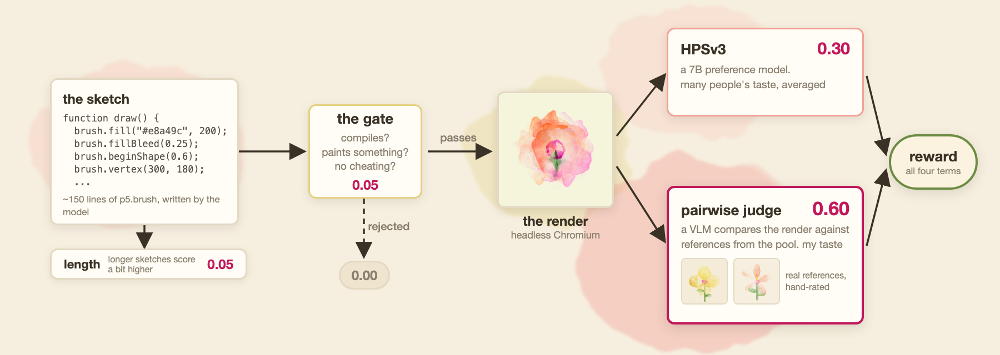
<figcaption>Two of the four terms in the reward function are models. Both serve as proxies for individual taste.</figcaption>
</figure>

> Those are the weights Narreddi converged upon. Because the pool defines taste, the project shifts from tuning standard hyperparameters to curating the dataset that decides what is beautiful.
> 
> I trained three runs using this reward structure, differing only in how the weight split between the two model judges:
> 
> | Run | Pairwise Judge | HPSv3 | Role |
> | :--- | :--- | :--- | :--- |
> | `judge-led` | 0.60 | 0.30 | The original mix, stopped at step 110 |
> | `hps-led` | 0.30 | 0.60 | The middle ground, stopped at step 110 |
> | `hps-only` | 0.00 | 0.90 | The validation run, stopped at step 60 |
> 
> I started with `hps-only` to validate that the pipeline could learn at all. Once the reward curves climbed and metrics looked healthy, I launched the two longer runs. The question investigated by the longer runs is: *How much of HPSv3's generalized power can you shift to the pairwise judge?* The more weight the judge carries, the more the reward reflects individual taste rather than generic consensus—and the harder the model's optimization climb becomes. If pushed too far, or if your style deviates too drastically from the average, the model might fail to learn altogether.
> 
> Fortunately, it didn't stall; both runs incorporating the pairwise judge learned successfully. The hand-rated pool effectively steers the policy, as shown by the metrics and final paintings detailed below.
> 
> > **Disclaimer:** If we use a frontier model, it can already generate JavaScript code that paints watercolours from a prompt. That is simply the starting point. The real work here is teaching a smaller model to do it while aligning with specific human artistic preferences.

这些是 Narreddi 最终收敛确定的权重。由于参考池定义了审美，项目的工作重心从调整标准超参数转移到了策划决定什么是美的数据集上。

我使用这种奖励结构进行了三次运行，它们唯一的区别在于两个模型裁判之间的权重分配：

| 运行 (Run) | Pairwise Judge | HPSv3 | 角色 |
| :--- | :--- | :--- | :--- |
| `judge-led` | 0.60 | 0.30 | 原始配方，在第 110 步停止 |
| `hps-led` | 0.30 | 0.60 | 折中方案，在第 110 步停止 |
| `hps-only` | 0.00 | 0.90 | 验证运行，在第 60 步停止 |

我首先从 `hps-only` 开始，以验证整个流水线是否能够学习。一旦奖励曲线上升且指标看起来健康，我就启动了两次较长时间的运行。较长运行所要探究的问题是：*你可以将 HPSv3 的多少通用能力转移给成对裁判？* 裁判承载的权重越大，奖励就越能反映个人品味而非通用共识——模型的优化攀登过程也就越艰难。如果推得太远，或者你的风格与平均水平偏离太大，模型可能根本无法学习。

幸运的是，它并没有停滞不前；包含成对裁判的两次运行都成功完成了学习。正如后文详细介绍的指标和最终画作所示，人工打分的参考池有效地引导了策略。

> **免责声明：** 如果我们使用前沿模型，它已经能够根据提示词生成绘制水彩画的 JavaScript 代码。这仅仅是起点。这里真正的难点在于教导一个更小的模型来完成这项工作，同时使其与特定的艺术偏好保持一致。

---

> ## The RL Environment You Need to Build
> 
> The environment wraps everything sitting between the model and the reward: the JavaScript library used for painting, the system prompt restricting it, the headless Chromium instance rendering each sketch, and the validation gate rejecting cheats.
> 
> The library performs much of the heavy lifting. [p5.brush](https://github.com/acamposuribe/p5.brush) by [@acamposuribe](https://x.com/acamposuribe) simulates a physical medium rather than drawing sterile vector shapes: pigment bleeds past fill boundaries, paper possesses texture, strokes have mass, and flow fields drag brushwork around. When the model calls `brush.fillBleed(0.25)`, it is deciding how far the ink runs.
> 
> > **Note:** The author of `p5.brush` had been trying to teach machines to paint long before any of this. In 2022, he created a generative art series that hides a diary about teaching p5.js to draw like a child: *"It is barely able to use the crayons [...] It cannot follow simple commands. I'm done for today, very infuriating."* The series was planned to have three pieces, but he only made two. When Surya's video went viral, [he quoted it](https://x.com/acamposuribe/status/2091668313449316651), sharing that diary and noting that this work was the third piece arriving on its own.
> 
> `p5.brush` exposes 47 methods, but our prompt restricts the model to just 10: `scaleBrushes`, `noStroke`, `fill`, `noFill`, `fillBleed`, `fillTexture`, `beginShape`, `vertex`, `endShape`, and `circle`. Allowing the remaining 37 methods (lines, hatching, custom brushes) would break the watercolour aesthetic. Restricted to these ten, the model can only paint filled shapes, letting the library handle the natural bleeds automatically.

## 你需要构建的 RL 环境

该环境包装了位于模型和奖励之间的所有内容：用于绘图的 JavaScript 库、限制它的系统提示词、渲染每个草图的无头 Chromium 实例，以及拒绝作弊的验证门槛（validation gate）。

这个库承担了大部分重任。由 [@acamposuribe](https://x.com/acamposuribe) 开发的 [p5.brush](https://github.com/acamposuribe/p5.brush) 模拟的是物理媒介，而不是绘制死板的矢量形状：颜料会溢出填充边界，纸张具有纹理，笔触具有质量，流场会拖动笔触。当模型调用 `brush.fillBleed(0.25)` 时，它是在决定墨水晕染多远。

> **注意：** `p5.brush` 的作者在这之前很久就一直在尝试教机器画画。2022 年，他创作了一个生成艺术系列，其中隐藏了一篇关于教 p5.js 像小孩子一样画画的日记：*“它几乎不会用蜡笔[...] 它无法遵循简单的指令。我今天不干了，太令人气愤了。”* 该系列原计划有三件作品，但他只完成了两件。当 Surya 的视频走红时，[他引用了它](https://x.com/acamposuribe/status/2091668313449316651)，分享了那篇日记并指出这项工作是自行到来的第三件作品。

`p5.brush` 暴露了 47 个方法，但我们的提示词将模型限制为仅仅 10 个：`scaleBrushes`、`noStroke`、`fill`、`noFill`、`fillBleed`、`fillTexture`、`beginShape`、`vertex`、`endShape` 和 `circle`。如果允许其余 37 个方法（线条、阴影线、自定义画笔）将会破坏水彩画的美学。受限于这十个方法，模型只能绘制填充形状，从而让该库自动处理自然的晕染效果。

<figure class="image text-center">
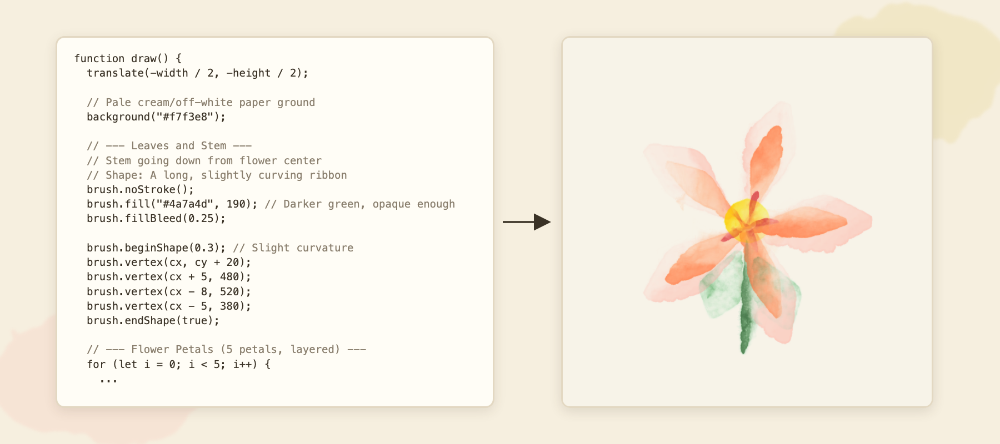
<figcaption>Part of one rollout's <code>draw()</code> function and its resulting render. The comments are the model's own. Reward: 0.864, 129 lines, step 22. The full source code for every painting is available in the rollouts dataset.</figcaption>
</figure>

> His blog post saved me hours of iterative prompt engineering. A lengthy API reference encourages models to hallucinate non-existent methods; his 200 GEPA iterations converged on a strict allowlist devoid of documentation. I experienced the same failures and adopted a similar allowlist by hand. My only addition to that recipe was a single sentence: *paint each petal two or three times—a large pass first, followed by a smaller, more opaque pass inside it.* This minor tweak made outputs significantly more colorful.
> 
> > **Note:** If this is your first time hearing about [GEPA](https://huggingface.co/papers/2507.19457), it is an automatic prompt optimizer. A language model reflects in plain text on where the current prompt failed, proposes an improved version, and the loop repeats.
> 
> Finally, the gate ensures the sketch compiles successfully, utilizes the library instead of direct p5 calls, deposits actual pigment onto the canvas, and avoids cheating (such as writing plain text on the canvas).

他的博客文章为我节省了数小时的迭代提示词工程。冗长的 API 参考文档会诱导模型产生不存在的方法的幻觉；他通过 200 次 GEPA 迭代收敛到了一个不包含文档的严格白名单。我也经历了同样的失败，并手动采用了类似的白名单。我对该配方唯一的补充只有一句话：*每片花瓣画两到三次——先画一个大的，接着在里面画一个较小且更不透明的。* 这个小调整使得输出的色彩丰富度显著提升。

> **注意：** 如果这是你第一次听说 [GEPA](https://huggingface.co/papers/2507.19457)，它是一个自动提示词优化器。语言模型以纯文本形式反思当前提示词失败的地方，提出改进版本，然后循环重复。

最后，门槛（gate）确保草图成功编译、使用了该库而不是直接调用 p5、将真实的颜料沉积在画布上，并避免作弊（例如在画布上写纯文本）。

---

> ## The Pool is the Reward Function
> 
> The pool consists of [178 paintings](https://huggingface.co/datasets/HuggingEnvs/watercolour-reference-pool) divided into two tiers based on personal preferences: `love` and `okay`. All of them were generated by AI models. Four open-weight models, called through Inference Providers, wrote `p5.brush` sketches based on real, openly licensed photos of hibiscus flowers from iNaturalist. A vision model provided written feedback on every sketch across three refinement iterations. Every final render was then rated individually by me, resulting in 178 pieces making the final cut.
> 
> | Generator | Number of Paintings |
> | :--- | :--- |
> | [GLM-5.2](https://huggingface.co/zai-org/GLM-5.2) | 64 |
> | [Kimi-K3](https://huggingface.co/moonshotai/Kimi-K3) | 57 |
> | [Qwen3-Coder-Next](https://huggingface.co/Qwen/Qwen3-Coder-Next) | 35 |
> | [Qwen3.5-122B-A10B](https://huggingface.co/Qwen/Qwen3.5-122B-A10B) | 22 |
> 
> I tested four different model families to explore their stylistic variations. These four open models consistently produced valid sketches during a quick reliability check (two other candidates failed and were dropped). If you wish to build your own pool, you may choose differently.

## 参考池即奖励函数

参考池由 [178 幅画作](https://huggingface.co/datasets/HuggingEnvs/watercolour-reference-pool)组成，根据个人偏好分为两个等级：`love`（喜爱）和 `okay`（一般）。它们全部由 AI 模型生成。四个通过 Inference Providers 调用的开源权重模型，根据 iNaturalist 上真实、开源授权的木槿花照片编写了 `p5.brush` 草图。一个视觉模型对经过三个精炼迭代的每个草图提供了书面反馈。随后，我对我挑选的每幅最终渲染图进行了单独评分，最终有 178 幅作品入选。

| 生成模型 | 画作数量 |
| :--- | :--- |
| [GLM-5.2](https://huggingface.co/zai-org/GLM-5.2) | 64 |
| [Kimi-K3](https://huggingface.co/moonshotai/Kimi-K3) | 57 |
| [Qwen3-Coder-Next](https://huggingface.co/Qwen/Qwen3-Coder-Next) | 35 |
| [Qwen3.5-122B-A10B](https://huggingface.co/Qwen/Qwen3.5-122B-A10B) | 22 |

我测试了四个不同的模型系列以探索它们的风格变化。这四个开源模型在快速可靠性检查期间稳定地生成了有效的草图（另外两个候选模型失败并被剔除）。如果你希望构建自己的参考池，你可以做出不同的选择。

<figure class="image text-center">
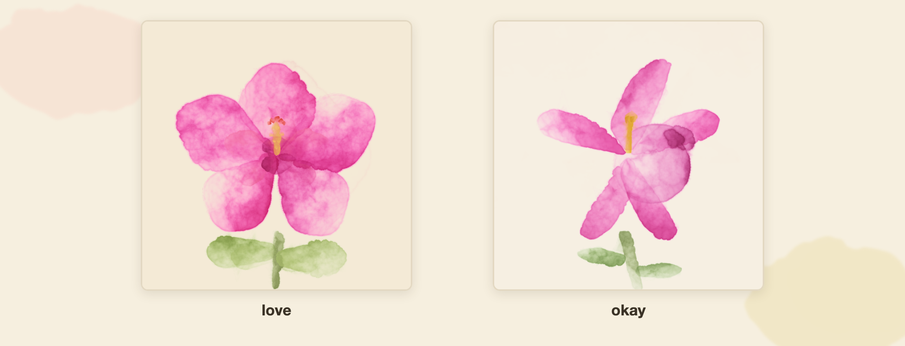
<figcaption>The two tiers in practice. Disagreeing with the ratings is completely valid—someone's subjective judgment forms the core of the reward function.</figcaption>
</figure>

> The tiers play an active role in calculating rewards. When the pairwise judge draws four references, half come from `love` and half from `okay`, ensuring the policy always faces some rivals it can beat. A win yields the same reward against either tier. This represents one of my few deliberate modifications: the original recipe compares exclusively against its top tier, whereas I retained the easier tier in the draw so that weaker early policies still receive constructive signal.
> 
> Notably, no human-made paintings are included, which introduces a real limitation. `p5.brush` is a niche library, and existing human-crafted examples with accessible code are scarce—nowhere near the volume a typical training corpus requires, as Surya's blog notes.
> 
> The interesting takeaway here is that the model learns to mirror the contents of the pool. If we redirect the environment to a completely different dataset, the reward function updates automatically without changing a single line of code. For the dataset I generated and openly shared, I have also included the source sketches.
> 
> Examining the judges more closely reveals that they address distinct questions: HPSv3 determines whether the render successfully depicts a flower, while the pairwise judge determines whether it is well-painted in the chosen style.

这两个等级在计算奖励时发挥着积极作用。当成对裁判抽取四张参考图时，一半来自 `love` 级别，一半来自 `okay` 级别，这确保了策略总能遇到一些它能够击败的对手。无论是战胜哪个等级，获胜带来的奖励都是相同的。这是我少数几个刻意的修改之一：原始配方仅与其最高等级进行对比，而我在抽取时保留了较容易的等级，以便较弱的早期策略仍能收到建设性的信号。

值得注意的是，其中并未包含人类创作的画作，这引入了一个实际的局限性。正如 Surya 的博客所指出的那样，`p5.brush` 是一个利基库，现有的、带有可访问代码的人类手工示例非常稀缺——远达不到典型训练语料库所需的规模。

这里有趣的一点是，模型学会了镜像参考池的内容。如果我们把环境重定向到一个完全不同的数据集，奖励函数就会自动更新，而无需更改单行代码。对于我生成并公开分享的数据集，我还附带了源草图。

更仔细地检查裁判可以发现它们解决了不同的问题：HPSv3 确定渲染是否成功描绘了一朵花，而成对裁判则确定它是否以所选风格画得很好。

---

> ## Just One More YOLO Run
> 
> Before anything functioned correctly, I faced a long stretch of flat reward curves. If you have ever tried reproducing research or a blog post without open artifacts, you will likely relate. Every run tested a new theory about what went wrong. Because training takes considerable time, I queued subsequent experiments while reviewing previous results. As is often the case, starting with a simplified task that works and gradually layering complexity proved to be the solution. A basic control task—devoid of browsers and judges—was the first attempt that successfully learned, revealing that my learning rate was simply too low.

## 再来一次 YOLO 运行

在一切正常工作之前，我面对的是长长一段平坦的奖励曲线。如果你曾经尝试过在没有开源产物的情况下复现研究或博客，你很可能会感同身受。每一次运行都在测试关于哪里出错了的新理论。由于训练需要相当长的时间，我在审查先前结果的同时排队了后续实验。事实往往如此，从一个可行的简化任务开始，然后逐步叠加复杂性，被证明是解决方案。一个没有浏览器和裁判的基础控制任务是第一次成功学习的尝试，这表明我的学习率实在是太低了。

<figure class="image text-center">
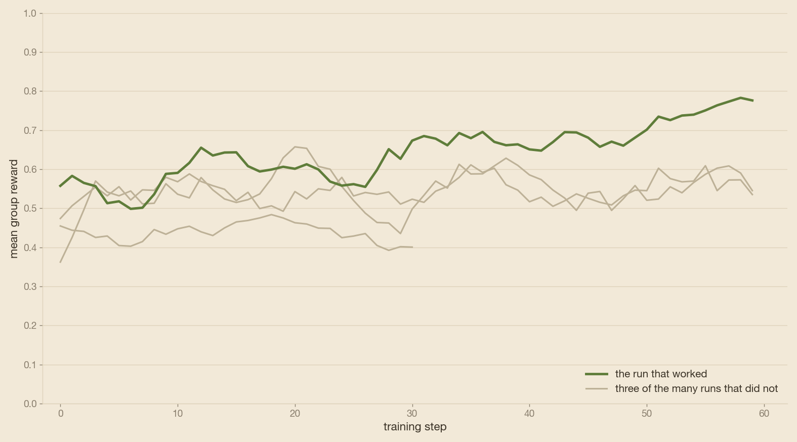
<figcaption>Three experiments on the reward yielding flat lines. I swapped the pool, removed renderer noise, and disabled the pairwise judge—none of it moved the curve. The successful run stemmed from changing the trainer configuration, proving the breakthrough came from the trainer, not the reward mix.</figcaption>
</figure>

> Another time sink involved configuring LoRA parameters correctly. The standard `target_modules` list assumes a dense model, whereas [`Qwen/Qwen3.5-35B-A3B`](https://huggingface.co/Qwen/Qwen3.5-35B-A3B) is a Mixture-of-Experts architecture naming most of its projections differently. As a result, the adapter was only training 10 layers out of 40. Switching to `all-linear` resolved this by targeting every linear layer. While routed experts in this architecture are fused tensors that remain frozen even under `all-linear`, everything else receives an adapter, which was sufficient for learning.
> 
> The fix required four adjustments in TRL's [`GRPOTrainer`](https://huggingface.co/docs/trl/grpo_trainer):
> 
> | Setting | From | To | Why |
> | :--- | :--- | :--- | :--- |
> | Learning rate | 2e-5 | **5e-5** | The ceiling recommended by *LoRA Without Regret* for GRPO |
> | Scheduler | `linear` | **`constant_with_warmup`** | Linear decay drained the learning rate by mid-run, stalling the reward |
> | `scale_rewards` | `group` | **`none`** | A single gate rejection was shrinking every other advantage in the group |
> | `target_modules` | Hand-coded list | **`all-linear`** | Ensures coverage across every linear layer |
> 
> These four changes unlocked our first successful run (`hps-only`), showing clear reward improvements.

另一个耗时的地方涉及正确配置 LoRA 参数。标准的 `target_modules` 列表假设是一个密集模型，而 [`Qwen/Qwen3.5-35B-A3B`](https://huggingface.co/Qwen/Qwen3.5-35B-A3B) 是一种混合专家架构，其大部分投影的命名有所不同。因此，适配器当时只训练了 40 层中的 10 层。切换到 `all-linear` 通过将目标指向每个线性层解决了这个问题。虽然该架构中的路由专家是融合张量，即使在 `all-linear` 下也保持冻结，但其他所有东西都接收了适配器，这足以进行学习。

该修复需要在 TRL 的 [`GRPOTrainer`](https://huggingface.co/docs/trl/grpo_trainer) 中进行四处调整：

| 设置 | 从 (From) | 到 (To) | 原因 |
| :--- | :--- | :--- | :--- |
| 学习率 (Learning rate) | 2e-5 | **5e-5** | 《LoRA Without Regret》为 GRPO 推荐的上限 |
| 调度器 (Scheduler) | `linear` | **`constant_with_warmup`** | 线性衰减在运行中途耗尽了学习率，导致奖励停滞 |
| `scale_rewards` | `group` | **`none`** | 单次门槛拒绝会缩小该组中的所有其他优势 |
| `target_modules` | 手动编写的列表 | **`all-linear`** | 确保覆盖每个线性层 |

这四项改动解锁了我们的第一次成功运行（`hps-only`），显示出明显的奖励提升。

> With this configuration in place, all three runs learned successfully. Both judge-led runs were launched for 200 steps and stopped at 110 while rewards were still climbing gradually. Each step takes 15 to 18 minutes, and the comparison between mixes was already stable, so I halted both to conserve compute. The mean group rewards over the first and final thirds of each run are summarized below:
> 
> | Run | Steps | First Third | Final Third | $\Delta$ |
> | :--- | :--- | :--- | :--- | :--- |
> | `hps-only` | 60 | 0.58 | 0.71 | +0.13 |
> | `judge-led` | 110 | 0.45 | 0.72 | +0.27 |
> | `hps-led` | 110 | 0.57 | 0.82 | +0.24 |

有了这个配置，三次运行都成功完成了学习。两次由裁判主导的运行都启动了 200 步，并在奖励仍在缓慢攀升时于第 110 步停止。每一步需要 15 到 18 分钟，并且不同混合方案之间的对比已经趋于稳定，因此我为了节省算力而终止了这两次运行。每次运行的前三分之一和最后三分之一的平均组奖励总结如下：

| 运行 (Run) | 步数 (Steps) | 前三分之一 | 最后三分之一 | $\Delta$ |
| :--- | :--- | :--- | :--- | :--- |
| `hps-only` | 60 | 0.58 | 0.71 | +0.13 |
| `judge-led` | 110 | 0.45 | 0.72 | +0.27 |
| `hps-led` | 110 | 0.57 | 0.82 | +0.24 |

<figure class="image text-center">
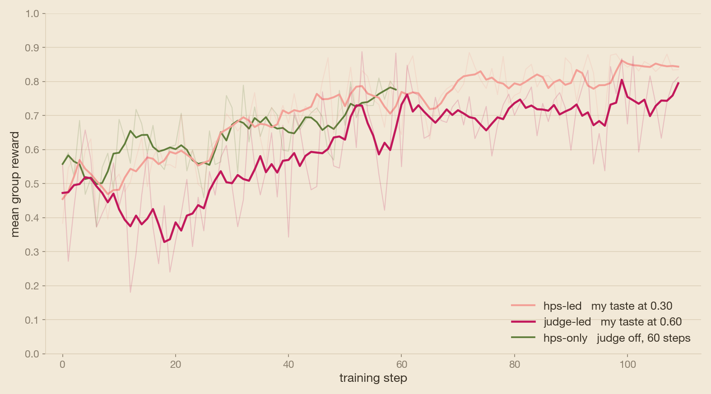
</figure>

> The three curves correlate directly with how heavily individual taste weights into the model. The more the judge weighs, the lower the starting point and the noisier the climb. `judge-led` remained nearly flat for its first 30 steps before moving—a dynamic mirroring our initial debugging phase. Simplify the problem until learning occurs, then reintroduce complexity step-by-step.
> 
> The pairwise judge term itself climbed steadily across the two runs that utilized it. The model wins increasingly more comparisons against the pool as training progresses—a milestone `hps-only` could not achieve. No group in any run collapsed into identical rewards (the classic GRPO failure mode that kills gradients). For the curious, per-metric curves (HPSv3, paint coverage, entropy) are [available as CSV files in the repository](https://github.com/adithya-s-k/HuggingEnvs/tree/main/02-watercolour/results).
> 
> The complete launch command, hardware specifications, and environment variables needed to replicate these runs are detailed in [the recipe](https://github.com/adithya-s-k/HuggingEnvs/tree/main/02-watercolour).

这三条曲线直接对应于个人审美对模型的影响权重。裁判权重越大，起点越低，攀升过程中的噪声也越大。`judge-led` 在前 30 步几乎保持平坦然后才开始移动——这种动态镜像了我们的初始调试阶段。简化问题直到学习发生，然后逐步重新引入复杂性。

在采用成对裁判的两次运行中，成对裁判项本身稳步上升。随着训练的进展，模型在与参考池的比较中赢得了越来越多的胜利——这是 `hps-only` 无法实现的里程碑。任何运行中的任何组都没有崩溃为相同的奖励（这是会杀死梯度的经典 GRPO 失败模式）。对于感兴趣的人，各项指标曲线（HPSv3、颜料覆盖率、熵）[作为 CSV 文件可在代码库中找到](https://github.com/adithya-s-k/HuggingEnvs/tree/main/02-watercolour/results)。

复制这些运行所需的完整启动命令、硬件规范和环境变量详见[配方说明](https://github.com/adithya-s-k/HuggingEnvs/tree/main/02-watercolour)。

---

> ## What It Actually Learned
> 
> **First, every run learned to eliminate bad paintings**—specifically near-blank canvases and shapeless washes scoring under 0.3 in total reward. In `hps-only`, three-quarters of the rise in group mean stems from poor paintings becoming rare. In the judge-led runs, this collapse is even steeper: rollouts scoring under 0.3 dropped from 99 to 16 across `judge-led`'s thirds, and from 37 to 4 in `hps-led`.

## 它实际上学到了什么

**首先，每次运行都学会了消除糟糕的画作**——具体来说是总奖励低于 0.3 的近乎空白的画布和无定型的水洗画。在 `hps-only` 中，组平均值上升的三分之二源于差劲画作变得稀少。在裁判主导的运行中，这种下降更为陡峭：在 `judge-led` 的各阶段中，得分低于 0.3 的 rollout 从 99 降至 16，而在 `hps-led` 中则从 37 降至 4。

<figure class="image text-center">
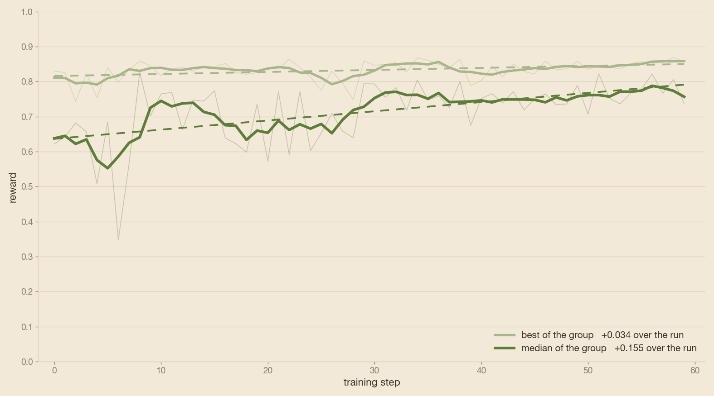
</figure>

> This explains why the obvious visual metric—the best painting of each step—shows almost no improvement in `hps-only`, moving a mere **+0.034** across the run while the median shifts by **+0.155**. The true learning occurs in the middle of the distribution.
> 
> **The pairwise judge transforms the top tier.** In `hps-only`, paintings became more reliable without becoming noticeably better. The quality of its top-tier outputs added just +0.03 to the group mean; once HPSv3 registered petals surrounding a center and stem, it stopped demanding more pigment. 
> 
> With the judge enabled, the other half of the story unfolds. *Better* here means closer to the pool—closer to what I rated as "good" or personally favored. This added +0.12 in `judge-led` and +0.16 in `hps-led`, lifting the best paintings of each step while doubling paint coverage in both runs (from 0.11 to 0.23, and 0.13 to 0.30), whereas `hps-only` barely budged paint coverage. Given a reference standard to beat, quality outputs continue improving, and the model is rewarded for applying richer pigment.
> 
> Another interesting finding: the model deliberately ignores an explicit prompt instruction, and it is correct to do so. The system prompt asks for 15 to 30 filled shapes. However, the empirical mean sits between 7 and 9, and `n_shapes` barely correlates with reward in any run (+0.000, −0.14, +0.07). Because the policy is not rewarded for obeying that specific sentence, it ignores it.
> 
> There is also a clear ceiling on the `hps-only` trajectory. If every rollout matched its best performers, that run's mean would plateau around 0.771. Whether additional steps would shatter this ceiling remains an open question.

这就解释了为什么明显的视觉指标——每一步中最好的画作——在 `hps-only` 中几乎没有显示出改进，在整个运行过程中仅移动了 **+0.034**，而中位数却变动了 **+0.155**。真正的学习发生在分布的中部。

**成对裁判改变了顶层表现。** 在 `hps-only` 中，画作变得更加稳定，但并没有变得明显更好。其顶级输出的质量仅为组平均值增加了 +0.03；一旦 HPSv3 识别出围绕着中心和茎的花瓣，它就不再要求更多的颜料了。

启用裁判后，故事的另一半展开了。这里的*更好*意味着更接近参考池——更接近我评为“好”或个人偏好的内容。这在 `judge-led` 中增加了 +0.12，在 `hps-led` 中增加了 +0.16，提升了每一步中最好的画作，同时使两次运行中的颜料覆盖率翻倍（从 0.11 到 0.23，以及从 0.13 到 0.30），而 `hps-only` 的颜料覆盖率几乎没有变动。有了需要超越的参考标准，高质量的输出在不断改善，并且模型因应用更丰富的颜料而获得奖励。

另一个有趣的发现：模型刻意忽略了一条明确的提示词指令，而且这样做是正确的。系统提示词要求 15 到 30 个填充形状。然而，经验平均值位于 7 到 9 之间，并且 `n_shapes` 在任何运行中都与奖励几乎没有相关性（+0.000，−0.14，+0.07）。由于策略因为遵守该特定句子而得不到奖励，它便忽略了它。

`hps-only` 的轨迹也存在一个清晰的上限。如果每个 rollout 都与其最佳表现者相匹配，那么该运行的平均值将稳定在 0.771 左右。更多的步数是否会打破这个上限仍然是一个未解的问题。

> The paintings also reveal something quantitative tables miss: stylistic homogenization within runs. As training progresses, rewards inside each group cluster closer together, and the median paintings in the opening video resemble minor variations of the exact same flower. That is GRPO performing as designed when fed a pool built from a single subject. The pool defines variety, just as it defines quality. If the reward exclusively pays out for matching one specific flower, the model learns to paint that single flower. Achieving more diverse output requires a more diverse pool, which entails heavier curation work. Surya's newer compositions showcase this, while [Alex Yango's animal paintings](https://x.com/alexyango/status/2091696296931574217) apply the same recipe with different pool selections. 
> 
> This highlights the core difference between an aesthetic reward and a mathematical grader: behind every metric lies deeply human labor deciding what belongs in the reward set. [Jason Liu's essay on taste](https://x.com/jxnlco/status/2073819508729684462) summarizes the generalized version in a single line: *AI has shifted the bottleneck from making to noticing.*
> 
> Surya concludes his blog post with a selection of his favorites. Rather than hand-picking mine, below is a wall featuring the 178 paintings that scored highest across the two judge runs (matching the exact size of the reference pool), presented in random order. Feel free to browse and pick your own favorites.

这些画作还揭示了定量表格所忽略的东西：运行内部的风格同质化。随着训练的进展，每个组内的奖励聚拢得更紧密，开场视频中的中位数画作类似于同一朵花的微小变体。这就是当输入由单个主题构建的参考池时，GRPO 按预期发挥作用的表现。参考池定义了多样性，正如它定义了质量一样。如果奖励专门针对匹配一朵特定的花进行支付，模型就会学会画那朵单一的花。要获得更多样化的输出，需要更多样化的参考池，这需要更繁重的手工策划工作。Surya 较新的作品展示了这一点，而 [Alex Yango 的动物画作](https://x.com/alexyango/status/2091696296931574217)则通过不同的参考池选择应用了相同的配方。

这突出了美学奖励与数学评分器之间的核心区别：每个指标背后都包含着决定什么属于奖励集合的深度人类劳动。[Jason Liu 关于审美的文章](https://x.com/jxnlco/status/2073819508729684462)用一句话总结了通用版本：*AI 已经将瓶颈从“制造”转移到了“注意到（noticing）”。*

Surya 在其博客文章的结尾展示了他最喜欢的一些精选。与其手动挑选我的最爱，不如看看下面这面墙，它展示了在两次裁判运行中得分最高的 178 幅画作（与参考池的大小完全相同），以随机顺序呈现。请随意浏览并挑选你自己的最爱。

<figure class="image text-center">
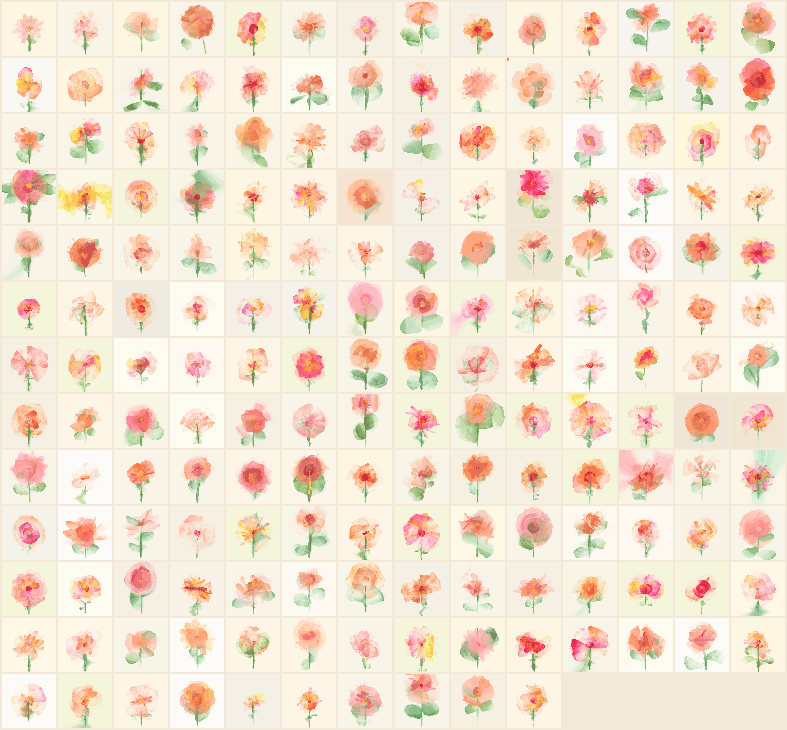
<figcaption>The reward model's 178 favorites from the two judge runs, shuffled. Now pick yours.</figcaption>
</figure>

> To make your selection, you likely inspected many and kept a few—precisely the curation labor that constructed this project's reward function. Every painting from every run, alongside its source sketch and reward score, is included in the rollouts datasets and browsable in [this gallery](https://huggingface.co/spaces/HuggingEnvs/watercolour-gallery).

为了做出选择，你可能检查了许多并保留了少数——这正是构建该项目奖励函数的策展劳动。来自每次运行的每一幅画作，连同其源草图和奖励分数，都包含在 rollouts 数据集中，并可在[这个画廊](https://huggingface.co/spaces/HuggingEnvs/watercolour-gallery)中浏览。

<figure class="image text-center">
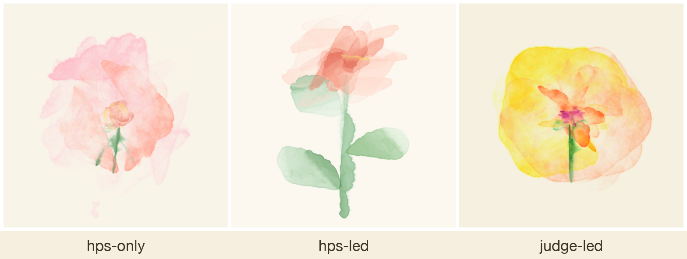
<figcaption>The final step's median painting from each run, ordered identically to the opening video. Same base model, same pool, three reward mixes, three distinct styles.</figcaption>
</figure>

> Because the reward relied partly on my personal taste, it is only fair to close with my verdict as a viewer. To my eye, `judge-led` produces the most diverse and artistically interesting results. `hps-led` paints convincing watercolours, but its best outputs share a soft, wet-on-wet uniformity that feels like its own standalone style. `hps-only` converges most aggressively, causing most of its paintings to settle on identical color palettes. You can judge for yourself in [the gallery](https://huggingface.co/spaces/HuggingEnvs/watercolour-gallery), which hosts every painting from every run, sortable by step and reward score.

由于奖励部分依赖于我个人的品味，作为观众，用我的结论来收尾再合适不过了。在我的眼里，`judge-led` 产生最多样化且在艺术上最有趣的结果。`hps-led` 画出了令人信服的水彩画，但其最佳输出共享了一种柔和的、湿画法（wet-on-wet）的均一性，感觉像是一种独立的风格。`hps-only` 收敛最为激进，导致其大部分画作落脚于相同的调色板。你可以在[画廊](https://huggingface.co/spaces/HuggingEnvs/watercolour-gallery)中自行判断，那里托管了来自每次运行的每一幅画作，可按步数和奖励分数进行排序。

---

> ## Infra is Hard
> 
> This project is predominantly an infrastructure challenge. A successful run requires a trainer, two Spaces, an inference router, and a persistent WebSocket functioning smoothly for hours on end—and any silent failure propagates into incorrect numeric scores elsewhere. Half the battle is verifying that the recorded metrics match reality.

## 基础设施很难

这个项目主要是一个基础设施挑战。一次成功的运行需要一个训练器、两个 Spaces、一个推理路由器和一个持续数小时平稳运行的持久 WebSocket——任何静默失败都会传播到其他地方的不正确数值评分中。战斗的一半在于验证记录的指标是否符合现实。

> **Infrastructure failures were polluting rewards as zeros.** A rendering timeout or unresponsive scorer received a score identical to a terrible painting (0.0 inside the group). Across my runs, this accounted for about 1.5% of rollouts, spiking up to 5.2% in the worst run. This trains the model on noise; these paths now return `None` and are excluded from the group.
> 
> **I also fixed a bug in OpenEnv and submitted the fix upstream.** The client maintains a single persistent WebSocket connection, but sockets closed by the remote end remained cached, causing all subsequent calls to fail despite a healthy environment. Troubleshooting this cost me two half-finished runs. The fix has been [submitted upstream](https://github.com/huggingface/OpenEnv/pull/1103), and subsequent runs have executed cleanly since.

**基础设施故障正在将奖励污染为零。** 渲染超时或无响应的评分器获得的分数与糟糕的画作相同（组内为 0.0）。在我的运行中，这约占 rollout 的 1.5%，在最糟糕的运行中甚至飙升至 5.2%。这导致模型在噪声上进行训练；这些路径现在返回 `None` 并被从组中排除。

**我还修复了 OpenEnv 中的一个 Bug 并将修复提交到了上游。** 客户端维护一个单独的持久 WebSocket 连接，但由远程端关闭的 socket 仍然被缓存着，导致尽管环境健康，所有后续调用依然失败。排查这个问题花费了我两次半途而废的运行。该修复已经[提交到了上游](https://github.com/huggingface/OpenEnv/pull/1103)，此后的运行一直执行得很干净。

<figure class="image text-center">
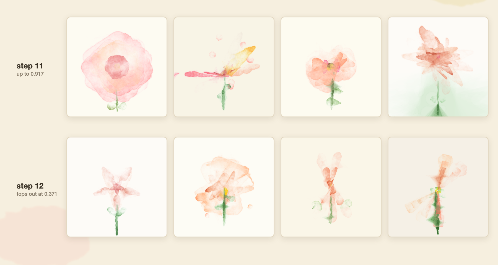
<figcaption>Two consecutive steps of the <code>judge-led</code> run, showing the top four rollouts of each. Whether step 12's paintings look half a point worse is entirely subjective.</figcaption>
</figure>

> **A step's reward depends on its randomly drawn references.** Because the pairwise judge samples four references per step, every step encounters a different set of rivals, meaning some draws are inherently more difficult. GRPO is mostly resilient to this because advantages are computed relative to the group, causing a hard draw to shift the entire group down collectively. However, the tracking curves themselves were not immune, and some apparent regressions were simply the result of harder reference draws. The image above illustrates this: step 12 scored half a point lower than step 11 primarily because it drew the run's most challenging references, even though the visual quality of the paintings remained comparable.

**一步的奖励取决于其随机抽取的参考图。** 由于成对裁判每步采样四张参考图，每步都会遇到一组不同的对手，这意味着某些抽取天生就更困难。GRPO 对此大多具有鲁棒性，因为优势是相对于组计算的，这导致艰难的抽取会使整个组集体向下平移。然而，跟踪曲线本身并非坚不可摧，一些表面上的倒退仅仅是更艰难的参考抽取的结果。上图说明了这一点：第 12 步的得分比第 11 步低了半个点，主要是因为它抽到了本次运行中最具挑战性的参考图，尽管画作的视觉质量保持相当。

---

> ## What It Costs
> 
> These figures are approximate and limited to fully completed runs.
> 
> | Component | Requirements |
> | :--- | :--- |
> | Trainer | 1 H200 GPU. **18 hours** for 60 steps; approximately **34 hours** for 110 steps |
> | HPSv3 | An `a100-large` Space running continuously throughout training |
> | Environment | A `cpu-upgrade` Space, which renders comfortably within allotted deadlines |
> | Pairwise judge | Inference Providers quota for `Qwen/Qwen3-VL-30B-A3B-Instruct` |
> | Reference pool (one-off) | Openly licensed iNaturalist photos, Inference Providers quota for four generators, plus human rating hours |

## 成本消耗

这些数字是近似值，仅限于完全完成的运行。

| 组件 | 要求 |
| :--- | :--- |
| 训练器 (Trainer) | 1 个 H200 GPU。60 步需要 **18 小时**；110 步大约需要 **34 小时** |
| HPSv3 | 在整个训练过程中持续运行的 `a100-large` Space |
| 环境 (Environment) | 一个 `cpu-upgrade` Space，可在指定期限内舒适地完成渲染 |
| 成对裁判 (Pairwise judge) | `Qwen/Qwen3-VL-30B-A3B-Instruct` 的 Inference Providers 配额 |
| 参考池（一次性） | 开源授权的 iNaturalist 照片，四个生成器的 Inference Providers 配额，加上人工评分时间 |

> A single step consists of eight rollouts and takes 15 to 18 minutes, of which **70% to 80% is spent rendering**. A single render takes 69 to 96 seconds against a 90-second deadline. Part of this is expected: lacking a GPU, the Space relies on Chromium to render WebGL canvases in software, and `p5.brush` bleeds and textures involve heavy pixel-level manipulation. Even so, I anticipated faster execution, and the exact bottleneck remains fully unverified.
> 
> Keep in mind that a scorer can easily cost more than the training session utilizing it: HPSv3 must remain active for the duration of the run, so remember to pause the Space (or configure its sleep timer) once training concludes.

单个步骤包含八个 rollout，耗时 15 到 18 分钟，其中 **70% 到 80% 的时间花在渲染上**。在 90 秒的期限内，单次渲染需要 69 到 96 秒。部分原因是可以预料的：由于缺乏 GPU，该 Space 依赖 Chromium 在软件中渲染 WebGL 画布，并且 `p5.brush` 的晕染和纹理涉及繁重的像素级操作。即便如此，我原本预期执行速度会更快，确切的瓶颈目前仍未完全验证。

请记住，评分器的成本很容易超过利用它的训练会话：HPSv3 必须在整个运行期间保持活跃，因此请在训练结束后记得暂停该 Space（或配置其睡眠定时器）。

<figure class="image text-center">
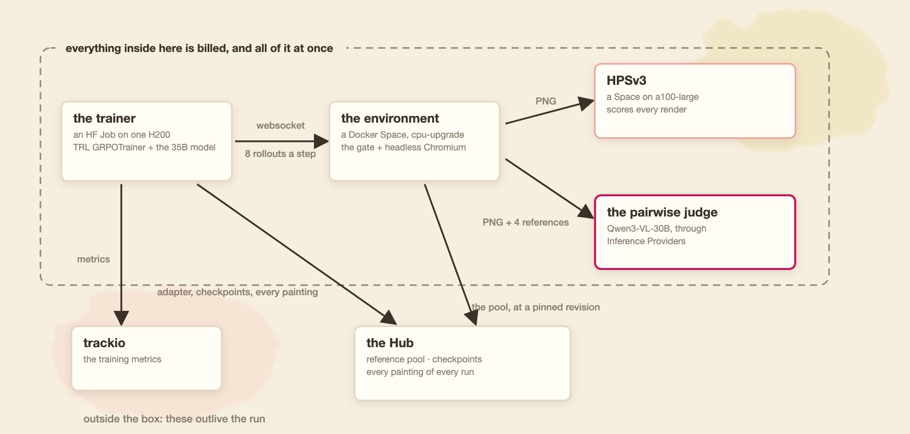
<figcaption>The infrastructure: what is billed during a run, and what outlives it</figcaption>
</figure>

> Everything runs on [HF Jobs](https://huggingface.co/docs/huggingface_hub/guides/jobs), utilizing the environment as a [Docker Space](https://huggingface.co/docs/hub/spaces-sdks-docker) and tracking metrics via [trackio](https://huggingface.co/docs/trackio).

一切都运行在 [HF Jobs](https://huggingface.co/docs/huggingface_hub/guides/jobs) 上，利用环境作为 [Docker Space](https://huggingface.co/docs/hub/spaces-sdks-docker) 并通过 [trackio](https://huggingface.co/docs/trackio) 跟踪指标。

---

> ## What I Would Try Next
> 
> The governing rule of this project was to reproduce the recipe with every resource open rather than improve upon it, leaving a backlog of untested ideas. These are the modifications I would prioritize, ordered by empirical backing:
> 
> **1. Multi-step generation with visual feedback.** This is my top priority. The original blog trains in a single turn, so I trained single-turn—meaning the model paints entirely blind. No image is ever fed back into the model, and its sole feedback is a scalar number. Proof that feedback loops work is found in the pool itself: the reference paintings were generated by models iterating across three rounds guided by a vision critic, resulting in noticeably higher quality in later rounds. The pool defining our reward was crafted using loops that the training policy never gets to experience.
> 
> **2. Smaller base models.** Evidence suggests a 35B model exceeds what is strictly necessary. In my side experiments, a 4B model successfully wrote valid sketches passing the gate. If a 4B model can learn this task, experiment costs drop by an order of magnitude.
> 
> Other promising ideas on my list include performing Supervised Fine-Tuning (SFT) on the pool sources prior to RL, explicitly rewarding pigment density, shifting the judge's reference mix from easy to hard as training progresses until only `love` tier references remain, expanding the 10-method allowlist to increase visual range (though my attempts at this caused more rendering crashes and broke the watercolour aesthetic), and verifying pairwise judge consistency by scoring identical images twice.
> 
> Crucially, this method is not restricted to flowers. [Alex Yango painted animals using this exact mechanism](https://x.com/alexyango/status/2091696296931574217), and [Brendan Hogan trained canvas animations against a pool of hand-rated clips](https://x.com/brendanh0gan/status/2092650655789855222). Previously, I played with a similar concept using [Simon Willison's pelican benchmark](https://huggingface.co/blog/sergiopaniego/pelican-env-openenv), where code is rendered to an image and scored.
> 
> Underpinning all of this lies a question this project cannot definitively answer: *Can 178 AI-generated paintings reliably define what a trained model considers beautiful?* The pool remains the primary bottleneck—and the one component of the pipeline lacking a principled, automated answer.

## 我接下来会尝试什么

该项目的基本原则是用所有公开的资源来复现配方，而不是对其进行改进，这留下了一堆未经测试的想法。按经验支持度排序，这些是我会优先考虑的修改：

**1. 带有视觉反馈的多步生成。** 这是我的首要任务。原博客在单轮中进行训练，因此我也进行了单轮训练——这意味着模型完全在盲画。没有任何图像被反馈给模型，它唯一的反馈是一个标量。反馈循环有效的证据可以在参考池本身中找到：参考画作是由在视觉评论家指导下跨三轮迭代的模型生成的，从而在后面的轮次中产生了明显更高的质量。定义我们奖励的参考池是使用训练策略永远无法体验的循环制作的。

**2. 更小的基础模型。** 有证据表明，35B 模型超出了严格必要的范围。在我的副实验中，一个 4B 模型成功编写了通过门槛的有效草图。如果 4B 模型能够学习这项任务，实验成本将呈数量级下降。

我清单上的其他有前途的想法包括：在 RL 之前对参考池源进行监督微调（SFT）、明确奖励颜料密度、随着训练的进展将裁判的参考组合从易到难转变，直到只剩下 `love` 级别的参考图、扩展 10 方法白名单以增加视觉范围（尽管我对此的尝试导致了更多的渲染崩溃并破坏了水彩画美学），以及通过对相同图像进行两次评分来验证成对裁判的一致性。

至关重要的是，这种方法并不局限于花卉。[Alex Yango 使用这种精确的机制画了动物](https://x.com/alexyango/status/2091696296931574217)，[Brendan Hogan 针对一组人工评分的剪辑训练了画布动画](https://x.com/brendanh0gan/status/2092650655789855222)。此前，我使用[Simon Willison 的鹈鹕基准](https://huggingface.co/blog/sergiopaniego/pelican-env-openenv)玩过类似的概念，其中代码被渲染为图像并进行评分。

所有这一切的基础是一个该项目无法给出明确答案的问题：*178 幅由 AI 生成的画作能否可靠地定义训练有素的模型认为什么是美？* 参考池仍然是主要的瓶颈——也是流水线中缺乏原则性、自动化答案的一个组件。

---

> ## What I Changed From the Original
> 
> For anyone reproducing this work, note two deliberate departures from Narreddi's original recipe, as discussed earlier:
> - The pairwise judge draws its references evenly split between `love` and `okay` tiers (rather than comparing against the top tier exclusively), giving weaker early policies a reliable learning signal.
> - A concise instruction regarding craft in the prompt: *paint each petal two or three times—a large pass first, followed by a smaller, more opaque pass inside it.*
> 
> Everything else—using `all-linear` for LoRA modules, treating infrastructure failures as `None` rather than 0.0 scores, and stopping judge runs at step 110—involved engineering decisions made independently because his blog does not specify them. Because his implementation remains unpublished, I cannot verify whether these choices mirror his exact workflow.

## 我对原版做了哪些更改

对于任何复现这项工作的人，请注意正如前面所讨论的，对 Narreddi 原版配方的两处刻意背离：
- 成对裁判将其参考图均匀地拆分抽取在 `love` 和 `okay` 等级之间（而不是专门与最高等级进行对比），从而为较弱的早期策略提供可靠的学习信号。
- 提示词中关于技艺的简明指令：*每片花瓣画两到三次——先画一个大的，接着在里面画一个较小且更不透明的。*

其他所有方面——为 LoRA 模块使用 `all-linear`、将基础设施故障视为 `None` 而不是 0.0 分数、在第 110 步停止裁判运行——涉及独立做出的工程决策，因为他的博客没有具体说明。由于他的实现仍然未公开，我无法验证这些选择是否反映了他的确切工作流。

---

> ## Everything is Published
> 
> | Artifact | Location |
> | :--- | :--- |
> | The recipe and reproduction instructions | [`02-watercolour/`](https://github.com/adithya-s-k/HuggingEnvs/tree/main/02-watercolour) |
> | The reference pool with all source sketches | [`watercolour-reference-pool`](https://huggingface.co/datasets/HuggingEnvs/watercolour-reference-pool) |
> | The RL environment, ready to duplicate | [`watercolour-env`](https://huggingface.co/spaces/HuggingEnvs/watercolour-env) |
> | The HPSv3 scorer, ready to duplicate | [`watercolour-hpsv3`](https://huggingface.co/spaces/HuggingEnvs/watercolour-hpsv3) |
> | `hps-only` adapter and rollouts | [`watercolour-grpo-hps-only`](https://huggingface.co/HuggingEnvs/watercolour-grpo-hps-only) · [`watercolour-rollouts-hps-only`](https://huggingface.co/datasets/HuggingEnvs/watercolour-rollouts-hps-only) |
> | `judge-led` adapter and rollouts | [`watercolour-grpo-judge-led`](https://huggingface.co/HuggingEnvs/watercolour-grpo-judge-led) · [`watercolour-rollouts-judge-led`](https://huggingface.co/datasets/HuggingEnvs/watercolour-rollouts-judge-led) |
> | `hps-led` adapter and rollouts | [`watercolour-grpo-hps-led`](https://huggingface.co/HuggingEnvs/watercolour-grpo-hps-led) · [`watercolour-rollouts-hps-led`](https://huggingface.co/datasets/HuggingEnvs/watercolour-rollouts-hps-led) |
> | The browsable painting gallery | [`watercolour-gallery`](https://huggingface.co/spaces/HuggingEnvs/watercolour-gallery) |
> | Training curves | Live: [`judge-led`](https://huggingface.co/spaces/HuggingEnvs/watercolour-trackio-judge-led) · [`hps-led`](https://huggingface.co/spaces/HuggingEnvs/watercolour-trackio-hps-led) · [`hps-only`](https://huggingface.co/spaces/HuggingEnvs/watercolour-trackio-hps-only), plus CSV files in `results/` |
> | Complete collection | [Paint with Code Collection](https://huggingface.co/collections/HuggingEnvs/paint-with-code-6a955b79d63f67f1631d9be6) |
> 
> The per-rollout figures presented in this article can be recomputed directly from the published datasets. Nothing here relies on any external Space remaining continuously active.
> 
> *The underlying methodology and original concept belong to Surya Narreddi. The underlying drawing library was created by Alejandro Campos Uribe.*

## 所有内容均已发布

| 产物 (Artifact) | 位置 (Location) |
| :--- | :--- |
| 配方和复现说明 | [`02-watercolour/`](https://github.com/adithya-s-k/HuggingEnvs/tree/main/02-watercolour) |
| 包含所有源草图的参考池 | [`watercolour-reference-pool`](https://huggingface.co/datasets/HuggingEnvs/watercolour-reference-pool) |
| 随时可复制的 RL 环境 | [`watercolour-env`](https://huggingface.co/spaces/HuggingEnvs/watercolour-env) |
| 随时可复制的 HPSv3 评分器 | [`watercolour-hpsv3`](https://huggingface.co/spaces/HuggingEnvs/watercolour-hpsv3) |
| `hps-only` 适配器和 rollouts | [`watercolour-grpo-hps-only`](https://huggingface.co/HuggingEnvs/watercolour-grpo-hps-only) · [`watercolour-rollouts-hps-only`](https://huggingface.co/datasets/HuggingEnvs/watercolour-rollouts-hps-only) |
| `judge-led` 适配器和 rollouts | [`watercolour-grpo-judge-led`](https://huggingface.co/HuggingEnvs/watercolour-grpo-judge-led) · [`watercolour-rollouts-judge-led`](https://huggingface.co/datasets/HuggingEnvs/watercolour-rollouts-judge-led) |
| `hps-led` 适配器和 rollouts | [`watercolour-grpo-hps-led`](https://huggingface.co/HuggingEnvs/watercolour-grpo-hps-led) · [`watercolour-rollouts-hps-led`](https://huggingface.co/datasets/HuggingEnvs/watercolour-rollouts-hps-led) |
| 可浏览的画作画廊 | [`watercolour-gallery`](https://huggingface.co/spaces/HuggingEnvs/watercolour-gallery) |
| 训练曲线 | 实时: [`judge-led`](https://huggingface.co/spaces/HuggingEnvs/watercolour-trackio-judge-led) · [`hps-led`](https://huggingface.co/spaces/HuggingEnvs/watercolour-trackio-hps-led) · [`hps-only`](https://huggingface.co/spaces/HuggingEnvs/watercolour-trackio-hps-only)，外加 `results/` 中的 CSV 文件 |
| 完整合集 | [Paint with Code Collection](https://huggingface.co/collections/HuggingEnvs/paint-with-code-6a955b79d63f67f1631d9be6) |

本文中呈现的每个 rollout 的数据可以直接从发布的数据集中重新计算。这里没有任何内容依赖于任何外部 Space 保持持续活跃。

*底层方法论和原始概念归 Surya Narreddi 所有。底层绘图库由 Alejandro Campos Uribe 创建。*