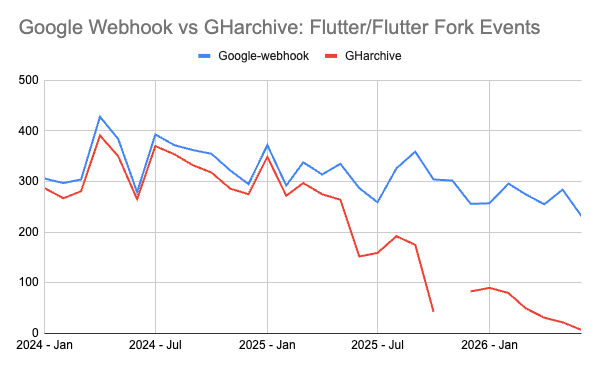

---
authors:
- aitoboxrobot
categories:
- arXiv论文
date: 2026-09-05
hide:
- navigation
tags:
- 开源数据
- GHarchive
- 数据清洗
- 软件工程
- Ecosyste.ms
title: 我们该多大程度上信任开源数据？
---
### 文章背景与核心概要

开源软件构成了现代数字基础设施的基石，然而我们对这一生态系统的可见度却出人意料地模糊。尽管开发过程通过提交（commits）、问题（issues）和 API 等形式公开进行，但依赖单一的开源数据源往往会产生严重的误导。本文深入探讨了流行开源数据集（如 GHarchive）中隐藏的缺陷，指出了在大规模下进行数据聚合所面临的巨大挑战，并为负责任地组装、使用和解释开源数据提供了指导原则。

文章指出，由于 API 速率限制、平台规模呈指数级增长以及抓取逻辑的局限性，像 GHarchive 这样的老牌数据集正面临严重的数据衰减问题。为此，作者从组装、消费和解释三个维度提出了建议：在组装时必须假设问题必然存在并整合多方来源；在消费时需要根据具体用例设计管道并尊重人类隐私基础设施；在解释时则要保持批判性质疑，认识到数据的局限性，从而提高洞察和模型的准确性。

---

## Executive Summary

Open source software powers our digital infrastructure, yet our visibility into this ecosystem remains surprisingly opaque. While development happens publicly through commits, issues, and APIs, relying on a single source of open-source data can be deeply misleading. 

This article explores the hidden flaws in popular open-source datasets (such as **GHarchive**), highlights the immense challenges of data aggregation at scale, and offers guiding principles for assembling, consuming, and interpreting open source data responsibly.

> 开源软件构成了我们数字基础设施的基石，然而我们对这一生态系统的可见度却出人意料地模糊。尽管开发过程是通过提交（commits）、问题（issues）和 API 公开进行的，但依赖单一的开源数据源可能会带来严重的误导。本文探讨了流行开源数据集（如 **GHarchive**）中隐藏的缺陷，强调了在大规模下进行数据聚合的巨大挑战，并为负责任地组装、使用和解释开源数据提供了指导原则。

---

## The Illusion of Complete Open Source Data

Every second, open source contributions quietly shape the software we rely on. Because development is performed in public spaces—with visible commits, issues, comments, and free APIs—it is easy to assume we can simply collect all of the data.

However, researchers know we are usually only looking at [part of the whole](https://ieeexplore.ieee.org/stamp/stamp.jsp?tp=&amp;arnumber=9463079). Many individuals and business decision-makers are **too comfortable with unsubstantiated data**. [We’ve grown used to it](https://arxiv.org/abs/2106.15611); our models assume data is [smelly](https://arxiv.org/abs/2203.10384), and we adjust logic and weights to compensate. When it comes to open source, our confidence is even lower, even though our resulting decisions can [directly impact individuals](https://www.youtube.com/watch?v=8Yr2gGsgRsY) upon whom we collectively depend.

### The Case Study: GHarchive and Data Decay

Consider one of the most popular datasets: [GHarchive](https://www.gharchive.org/). Started as a [hobby project](https://changelog.com/podcast/144) in 2011, this crawler has amassed over 15 years of event data from GitHub. While valuable historically, it is unreliable as a real-time or comprehensive source for volume-based metrics.

* **In 2025**, GHarchive captured **14% fewer events** than in 2024, despite steady growth in [platform adoption](https://innovationgraph.github.com/global-metrics/repositories).
* **Since 2025**, data retention in GHarchive has fallen to an estimated **~50%**.
* **In 2026**, retention may be as low as **20%** for certain event types.

The underlying [crawler logic](https://github.com/igrigorik/gharchive.org) is simple: query the [GitHub Event](https://docs.github.com/en/rest/using-the-rest-api/github-event-types) stream. However, API [rate limits](https://docs.github.com/en/rest/using-the-rest-api/rate-limits-for-the-rest-api) mean that spiky days result in missed data. Furthermore, GitHub announced [2 million public repositories](https://en.wikipedia.org/wiki/Timeline_of_GitHub) in 2011, that figure surpassed [400 million](https://innovationgraph.github.com/global-metrics/repositories) by 2026. 

Building comprehensive open datasets at scale—especially when [over 36 million new developers joined GitHub in the past year alone](https://github.blog/news-insights/octoverse/octoverse-a-new-developer-joins-github-every-second-as-ai-leads-typescript-to-1/)—is profoundly difficult.

> ## 完整开源数据的幻觉
> 
> 每分每秒，开源贡献都在悄然塑造着我们所依赖的软件。由于开发是在公共空间进行的——具有可见的提交、问题、评论和免费的 API——人们很容易认为我们可以简单地收集所有数据。
> 
> 然而，研究人员知道我们通常只看到了[整体的一部分](https://ieeexplore.ieee.org/stamp/stamp.jsp?tp=&amp;arnumber=9463079)。许多个人和商业决策者对未经证实的数据**过于习以为常**。[我们已经习惯了这一点](https://arxiv.org/abs/2106.15611)；我们的模型假设数据是[有瑕疵的（smelly）](https://arxiv.org/abs/2203.10384)，并且我们会调整逻辑和权重来进行补偿。在开源方面，我们的信心甚至更低，尽管我们做出的决策可能会[直接影响到我们共同依赖的个体](https://www.youtube.com/watch?v=8Yr2gGsgRsY)。
> 
> ### 案例研究：GHarchive 与数据衰减
> 
> 考虑一下最受欢迎的数据集之一：[GHarchive](https://www.gharchive.org/)。这个爬虫始于 2011 年的一个[业余项目](https://changelog.com/podcast/144)，它积累了来自 GitHub 的超过 15 年的事件数据。虽然它在历史上很有价值，但作为基于体量的指标的实时或全面数据源，它是不可靠的。
> 
> * **2025 年**，尽管[平台采用率](https://innovationgraph.github.com/global-metrics/repositories)稳步增长，但 GHarchive 捕获的**事件比 2024 年减少了 14%**。
> * **自 2025 年以来**，GHarchive 中的数据保留率已降至估计的 **~50%**。
> * **到 2026 年**，某些事件类型的数据保留率甚至可能低至 **20%**。
> 
> 
> 
> 底层的[爬虫逻辑](https://github.com/igrigorik/gharchive.org)很简单：查询[GitHub 事件](https://docs.github.com/en/rest/using-the-rest-api/github-event-types)流。然而，API [速率限制](https://docs.github.com/en/rest/using-the-rest-api/rate-limits-for-the-rest-api)意味着流量高峰日会导致数据丢失。此外，GitHub 在 2011 年宣布拥有 [200 万个公共仓库](https://en.wikipedia.org/wiki/Timeline_of_GitHub)，而到 2026 年，这一数字已超过 [4 亿](https://innovationgraph.github.com/global-metrics/repositories)。
> 
> 在大体量下构建全面的开放数据集——尤其是当[仅在过去一年里就有超过 3600 万新开发者加入 GitHub 时](https://github.blog/news-insights/octoverse/octoverse-a-new-developer-joins-github-every-second-as-ai-leads-typescript-to-1/)——是极其困难的。

---

## 1. Assembling: Assume There Will Be Problems

When Andrew Nesbitt of [Ecosyste.ms](https://ecosyste.ms) was asked about the challenges of assembling comprehensive datasets, his response was blunt: 
> *"I just assume I’m going to have a terrible time anyway, so I start with my best effort and fill in the gaps."*

Data aggregation tools like [GrimoireLabs](https://chaoss.github.io/grimoirelab/) and [OSS Insights](https://ossinsight.io/) also require multi-step processes for collection, combination, and reconciliation. Key challenges include:

* **One source is not enough:** Understanding a project requires combining development history, dependency graphs, CVE databases, and more. 
* **Inconsistent naming conventions:** Variables, repository names, versions, packages, tags, and licenses differ widely across platforms, often lacking a universal identifier like [purl](https://github.com/package-url) or [SWHID](https://www.softwareheritage.org/software-hash-identifier-swhid/).
* **Keeping data up to date:** Changes, deletions, and API updates are usually discovered through errors rather than release notes. 

> ## 1. 组装阶段：假设问题必然发生
> 
> 当 [Ecosyste.ms](https://ecosyste.ms) 的 Andrew Nesbitt 被问及组装全面数据集的挑战时，他的回答很直白：
> > *“我只是假设自己无论如何都会经历一段痛苦的时光，所以我先尽最大努力开始，然后再去填补空白。”*
> 
> 诸如 [GrimoireLabs](https://chaoss.github.io/grimoirelab/) 和 [OSS Insights](https://ossinsight.io/) 等数据聚合工具同样需要经过多步骤的收集、组合和协调过程。主要的挑战包括：
> 
> * **单一来源远远不够：** 要理解一个项目，需要结合开发历史、依赖关系图、CVE 数据库等多种信息。
> * **命名规范不一致：** 变量、仓库名称、版本、包、标签和许可证在不同平台之间差异很大，通常缺乏像 [purl](https://github.com/package-url) 或 [SWHID](https://www.softwareheritage.org/software-hash-identifier-swhid/) 这样的通用标识符。
> * **保持数据最新：** 变更、删除和 API 更新通常是通过错误而不是通过版本说明（release notes）被发现的。

---

## 2. Consuming: Design Your Pipeline for Your Use Case

With the rise of LLMs, **“it’s now easier for anyone to try to access and build reports.”** However, quick reports often bypass the rigor needed for comprehensiveness. Data consumers should keep the following in mind:

* **Collection methodology matters:** Centralized vs. distributed architectures, caching strategies, and database topologies (relational vs. graph) drastically affect query efficiency and cost. Data producers cannot design for every persona, so consumers must understand the trade-offs of their chosen data source.
* **Respect the [human infrastructure](https://www.opensourcestories.org/stories/2023/critical-human-infrastructure/):** Open source datasets contain personally identifiable information (PII). Aggregating individual contributions across platforms can violate privacy boundaries. Always anonymize data where possible and adhere to relevant privacy policies.

> ## 2. 消费阶段：针对你的用例设计管道
> 
> 随着大语言模型（LLM）的兴起，**“现在任何人都可以更容易地尝试访问和构建报告。”** 然而，快速生成的报告往往缺乏全面性所需的严谨性。数据消费者应当牢记以下几点：
> 
> * **收集方法至关重要：** 集中式与分布式架构、缓存策略以及数据库拓扑（关系型与图数据库）会极大地影响查询效率和成本。数据生产者无法为每一种角色量身定制设计，因此消费者必须了解其所选数据源的权衡取舍。
> * **尊重[人类基础设施](https://www.opensourcestories.org/stories/2023/critical-human-infrastructure/)：** 开源数据集包含个人身份信息（PII）。跨平台聚合个人贡献可能会违反隐私边界。在可能的情况下务必对数据进行匿名化处理，并遵守相关的隐私政策。

---

## 3. Interpreting: Never Stop Asking Questions

While many organizations have shifted from "data-driven" to "AI-enabled," **all AI systems still depend fundamentally on [data](https://hackernoon.com/the-ai-hierarchy-of-needs-18f111fcc007).** 

Our data regarding open source will always be incomplete and imperfect. However, by critically questioning our sources, acknowledging gaps, and understanding the technical and human processes behind open source development, we can significantly improve the accuracy of our insights and models—even when they don't capture the entire reality.

> ## 3. 解读阶段：永不停歇地提出质疑
> 
> 虽然许多组织已经从“数据驱动”转向了“AI 赋能”，但**所有 AI 系统本质上仍然依赖于[数据](https://hackernoon.com/the-ai-hierarchy-of-needs-18f111fcc007)。**
> 
> 我们关于开源的数据将永远是不完整和不完美的。然而，通过对数据源进行批判性质疑、承认数据空白，并理解开源开发背后的技术与人文流程，我们可以显著提高洞察和模型的准确性——即便它们并未完全捕捉到现实的全貌。