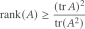
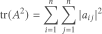

---
authors:
- aitoboxrobot
categories:
- 工具教程
date: 2026-09-05
hide:
- navigation
tags:
- 线性代数
- 矩阵论
- 数值计算
- Python
- 稳定秩
title: 计算矩阵秩的下界
---
### 文章背景与核心概要
计算 $n \times n$ 矩阵 $A$ 的精确秩面临着诸多挑战：它是一个不连续函数、计算成本高昂（需要 $O(n^3)$ 次运算），且在无法显式构建完整矩阵时极不实用。当不需要严格的精确秩时，通过秩-迹不等式（rank-trace inequality）推导出的**稳定秩（stable rank）**则提供了一个可靠的下界。

稳定秩克服了上述难题：它具有连续性，无需进行完整的矩阵乘法即可在 $O(n^2)$ 时间内高效计算，并且能够与蒙特卡洛迹估计方法结合，适用于隐式矩阵。本文详细探讨了计算矩阵秩的困难、秩-迹不等式的原理及其三大优势，并附带了 Python 代码示例。

---

## 计算机算矩阵秩的困难 (Difficulties in Computing Rank)

假设你想知道一个 $n \times n$ 矩阵 $A$ 的秩（即线性无关的行数或列数）。这其中至少存在三个主要困难：

> Suppose you want to know the rank of an $n \times n$ matrix $A$ (the number of linearly independent rows or columns). There are at least three primary difficulties:

1. **不连续性：** 秩不是矩阵的连续函数 [1]。由于秩是一个整数，矩阵中任意微小的变化都可能导致秩发生离散跳跃。计算 $A$ 时产生的微小数值误差，就可能产生一个秩完全不同的矩阵。
2. **计算复杂度：** 求精确秩通常需要 $O(n^3)$ 次运算，根据具体应用场景，这可能会带来也可能不会带来 prohibitive（过高）的计算成本。
3. **隐式表示：** 你可能无法以显式形式获得矩阵 $A$。你可能只能针对给定的向量 $v$ 计算矩阵-向量乘积 $Av$，这使得构建整个矩阵 $A$ 变得不切实际。

> 1. **Discontinuity:** Rank is not a continuous function of a matrix [1]. Because rank is an integer, an arbitrarily small change in the matrix can cause a discrete change in the rank. A small numerical error in computing $A$ could produce a matrix with a completely different rank.
> 2. **Computational Complexity:** Finding the exact rank typically takes $O(n^3)$ operations, which may or may not be prohibitive depending on the context.
> 3. **Implicit Representation:** You may not have the matrix $A$ in an explicit form. You might only be able to compute matrix-vector products $Av$ for given vectors $v$, making it impractical to construct the entire matrix $A$.

---

## 秩-迹不等式 (The Rank-Trace Inequality)

如果你只需要知道矩阵 $A$ 的秩是否超过某个阈值，那么一个下界可能就足够了。

假设 $A$ 是一个厄米特矩阵（Hermitian matrix，这意味着如果它是实矩阵则为对称矩阵，如果它是复矩阵则等于其共轭转置）。**秩-迹不等式**表明：

> If you only need to know whether the rank of $A$ exceeds a certain threshold, a lower bound may suffice. 
>
> Suppose $A$ is a Hermitian matrix (meaning $A$ is symmetric if real, or equals its conjugate transpose if complex). The **rank-trace inequality** states that:



右侧的量被称为 $A$ 的**稳定秩（stable rank）**。虽然它在严格的代数意义上并不是秩，但它为真实秩提供了一个可靠的下界，并成功解决了前面提到的三个挑战：

> The quantity on the right-hand side is known as the **stable rank** of $A$. While it is not a rank in the strict algebraic sense, it provides a dependable lower bound on the true rank and successfully addresses the three aforementioned challenges:

### 1. 稳定性 (Stability)
迹*确实*是矩阵的连续函数。因此，只要分母不为零，稳定秩也是连续的。对矩阵的微小扰动只会导致其稳定秩发生微小变化——这也是“稳定秩”这一名称的由来。

> Trace *is* a continuous function of a matrix. Consequently, the stable rank is also continuous, provided the denominator is non-zero. A small perturbation to a matrix results in only a small change to its stable rank—hence the name "stable rank."

### 2. 高效性 (Efficiency)
尽管计算精确秩需要 $O(n^3)$ 次运算，但计算稳定秩仅需 $O(n^2)$ 次运算（尽管这一点并非显而易见）。

* 通过简单地对角线元素求和，计算 $A$ 的迹只需 $n$ 次运算。
* 直接将 $A$ 自乘来求 $\operatorname{tr}(A^2)$ 将需要 $O(n^3)$ 次运算，从而抵消了任何效率优势。

然而，你可以通过计算幅值平方的逐元素之和来高效地计算 $\operatorname{tr}(A^2)$：

> Although computing the exact rank requires $O(n^3)$ operations, computing the stable rank takes only $O(n^2)$ operations (though this is not immediately obvious).
>
> * Computing the trace of $A$ takes $n$ operations by simply summing the diagonal elements.
> * Squaring $A$ directly to find $\operatorname{tr}(A^2)$ would take $O(n^3)$ operations, negating any efficiency advantage. 
>
> However, you can compute $\operatorname{tr}(A^2)$ efficiently via the element-wise sum of squared magnitudes:



### 3. 构造 (Formation)
当矩阵 $A$ 太大而无法放入内存，或者显式计算太慢时，你可以依赖仅通过矩阵-向量乘积探测 $A$ 的方法。蒙特卡洛算法可用于估计 $A$ 和 $A^2$ 的迹，从而在不显式构造 $A$ 的情况下估计稳定秩。

> When the matrix $A$ is too large to fit into memory or explicit computation is too slow, you can rely on methods that only probe $A$ via matrix-vector products. Monte Carlo algorithms can be used to estimate the traces of $A$ and $A^2$, subsequently estimating the stable rank without forming $A$ explicitly.

---

## 演示 (Demonstration)

以下 Python 代码说明了上面讨论的概念：

> The following Python code illustrates the concepts discussed above:

```python
import numpy as np

np.random.seed(20260904)
n = 5
B = np.random.randn(n, n)
A = B.T @ B + 1e-8 * np.eye(n)  # Gram matrix plus a tiny shift => SPD

rank_A = np.linalg.matrix_rank(A)
tr_A = np.trace(A)
tr_A2 = np.trace(A @ A) # matrix product 
sum_sq = np.sum(A * A) # element-by-element product
stable_rank = (tr_A ** 2) / tr_A2

print(f"A =\n{A}\n")
print(f"rank(A)              = {rank_A}")
print(f"tr(A)                = {tr_A:.12f}")
print(f"tr(A^2) direct       = {tr_A2:.12f}")
print(f"tr(A^2) indirect     = {sum_sq:.12f}")
print(f"stable rank          = {stable_rank:.12f}")
```

### 输出 (Output)

> ### Output

```text
A =
[[ 1.09945682  0.4899665   0.98901845  0.66983113 -1.35006341]
 [ 0.4899665   0.98531254  0.35067791  0.89757603 -0.72037507]
 [ 0.98901845  0.35067791  4.31233926  0.94556225 -0.54819048]
 [ 0.66983113  0.89757603  0.94556225  1.3494295  -1.33840786]
 [-1.35006341 -0.72037507 -0.54819048 -1.33840786  3.54858332]]

rank(A)              = 5
tr(A)                = 11.295121449420
tr(A^2) direct       = 51.035447533673
tr(A^2) indirect     = 51.035447533673
stable rank          = 2.499826585688
```

---

## 脚注 (Footnotes)

[1] **拓扑学论证：** 从连通空间（例如 $\mathbb{R}^{n \times n}$）到离散空间（例如 $\mathbb{Z}$）的映射不可能是连续的。否则，值域中点的原像会将连通空间分割成不相交的开集，这违背了连通空间的定义。

> [1] **Topological argument:** A map from a connected space (such as $\mathbb{R}^{n \times n}$) onto a discrete space (such as $\mathbb{Z}$) cannot be continuous. Otherwise, the inverse images of the points in the range would partition the connected space into disjoint open sets, violating the definition of a connected space.

---

*本文 [Computing a lower bound on matrix rank](https://www.johndcook.com/blog/2026/09/04/stable-rank/) 最初发布于 [John D. Cook](https://www.johndcook.com/blog)。*

> *The post [Computing a lower bound on matrix rank](https://www.johndcook.com/blog/2026/09/04/stable-rank/) first appeared on [John D. Cook](https://www.johndcook.com/blog).*