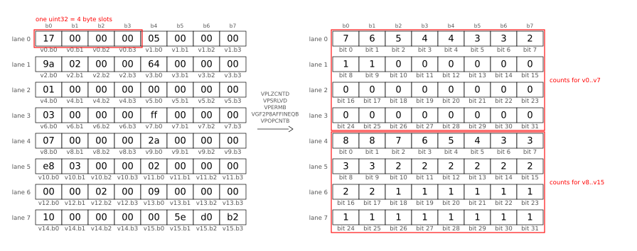
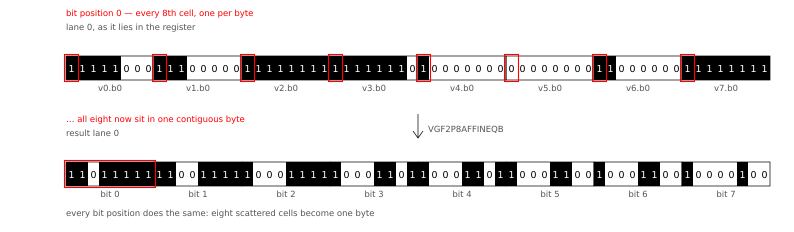
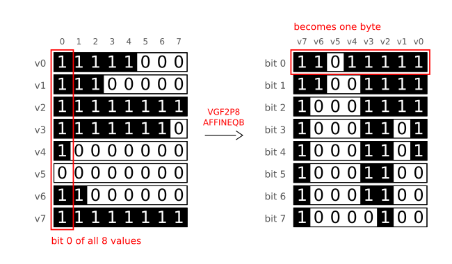
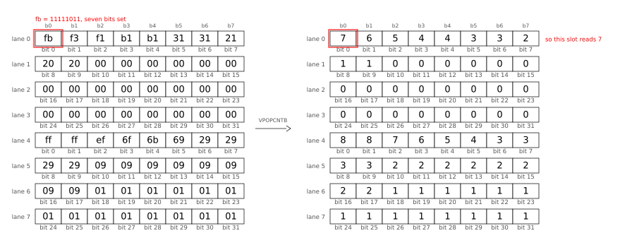
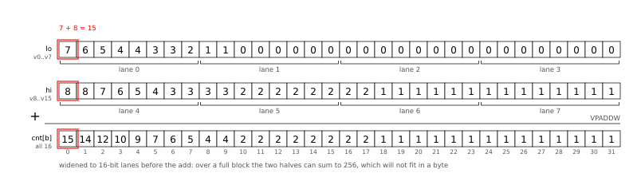

---
authors:
- aitoboxrobot
categories:
- 工具教程
date: 2026-09-07
hide:
- navigation
tags:
- debian
- golang
- simd
- performance
- optimization
title: Debian 代码搜索：利用 Go SIMD 实现极速 TurboPFor
---
### 文章背景与核心概要

在经历了多年通过 cgo 依赖 C 语言库的阶段后，Debian 代码搜索（DCS）目前已彻底摆脱了对 cgo 的依赖。这一里程碑的达成，得益于 Go 语言新引入的实验性 SIMD 支持（Go 1.26 中引入的 `simd/archsimd` 软件包），它使得完全用原生 Go 实现 TurboPFor 整数压缩格式成为可能。

通过结合 AVX2 和 AVX512 向量指令集、编译期位宽特化（bit-width specialization）以及一种名为“位置总体计数（positional popcount）”的技术，全新的 Go 编解码器不仅追平了原版 C 语言参考实现的性能，甚至在许多情况下实现了超越。本文将深入探讨 Michael Stapelberg 如何在没有汇编或 cgo 的情况下，在纯 Go 中榨干硬件极限。

---

## 目录
1. [背景：为什么 DCS 需要快速整数编解码器？](#背景为什么-dcs-需要快速整数编解码器)
2. [Go 语言中的 SIMD](#go-语言中的-simd)
3. [环境搭建与基准测试](#环境搭建与-基准测试)
4. [标量优化](#标量优化)
5. [SIMD 优化与更大的步长（Strides）](#simd-优化与更大的步长strides)
6. [位置总体计数（实现 2 倍提速）](#位置总体计数实现-2-倍提速)
7. [结论](#结论)

---

## 背景：为什么 DCS 需要快速整数编解码器？

Debian 代码搜索（DCS）是一个搜索引擎，允许用户通过字面表达式或正则表达式搜索 Debian 中的所有开源代码。与其他搜索引擎类似，DCS 依赖于**倒排索引（inverted index）**——即从词条（term）到包含该词条的文档（由文档 ID 表示）的映射。

* **2012–2019 年：** 索引完全保存在内存（RAM）中。
* **2019 年至今：** 使用 **TurboPFor** 整数压缩实现了一种磁盘上的位置索引格式。字面量查询（占 DCS 查询的 78.2%）现在直接查询磁盘上的位置索引时速度更快。

为了在查询时实现快速解码，同时又不会导致 RAM 或磁盘用量爆炸，DCS 此前通过 `cgo` 依赖于 C 语言的 `powturbo/TurboPFor` 库。

> After years of relying on a C library via cgo, Debian Code Search (DCS) is now completely free of cgo dependencies. This milestone was achieved by leveraging Go’s newly introduced experimental SIMD support (`simd/archsimd` package introduced in Go 1.26), enabling the implementation of the TurboPFor integer compression format entirely in native Go. By combining AVX2 and AVX512 vector instruction sets, compile-time bit-width specialization, and a technique called "positional popcount," the new Go encoder and decoder not only match the performance of the original C reference implementation but frequently exceed it.
> 
> ## Table of Contents
> 1. [Background: Why Does DCS Need a Fast Integer Codec?](#background-why-does-dcs-need-a-fast-integer-codec)
> 2. [SIMD in Go](#simd-in-go)
> 3. [Setup & Benchmarking](#setup--benchmarking)
> 4. [Scalar Optimizations](#scalar-optimizations)
> 5. [SIMD Optimizations & Larger Strides](#simd-optimizations--larger-strides)
> 6. [Positional Popcount (The 2x Speed-Up)](#positional-popcount-the-2x-speed-up)
> 7. [Conclusion](#conclusion)
> 
> ## Background: Why Does DCS Need a Fast Integer Codec?
> 
> Debian Code Search (DCS) is a search engine allowing users to search all open-source code within Debian via literal expressions or regular expressions. Like most search engines, DCS relies on an **inverted index**—a map from terms to documents containing those terms (represented by document IDs).
> 
> * **2012–2019:** The index was kept entirely in RAM.
> * **2019 Onwards:** An on-disk positional index format was implemented using **TurboPFor** integer compression. Literal queries (78.2% of DCS queries) are now faster when querying the positional index directly on disk.
> 
> To make decoding fast at query time without exploding RAM or disk usage, DCS previously relied on the C `powturbo/TurboPFor` library via `cgo`.

---

## Go 语言中的 SIMD

在历史上，在 Go 中使用 SIMD 指令意味着：
1. **手写 Go 汇编代码**（复杂，仅对小型函数实用）。
2. 使用诸如 Michael McLoughlin 的 `Avo` 等工具**生成 Go 汇编代码**（依然过于贴近底层汇编）。
3. **通过 cgo 使用 C 库**（DCS 使用了 7 年的方法，将 C 代码引入了一个纯 Go 项目中）。

Go 1.26 引入了实验性的 `simd/archsimd` 软件包（通过 `GOEXPERIMENT=simd` 启用），在 `amd64` 架构上提供了特定于架构的 SIMD 操作，支持 128 位、256 位和 512 位向量类型。

通过优化原生 Go 解码器，并最终编写带有 SIMD 内联函数的原生 Go 编码器，Michael Stapelberg 成功去掉了最后的 `cgo` 依赖。

> Historically, using SIMD instructions in Go meant:
> 1. **Hand-writing Go assembler code** (complex, only practical for small functions).
> 2. **Generating Go assembler code** using tools like Michael McLoughlin's `Avo` (still too close to raw assembly).
> 3. **Using a C library via cgo** (the approach DCS used for 7 years, introducing C code into a pure Go project).
> 
> Go 1.26 introduced the experimental `simd/archsimd` package (enabled via `GOEXPERIMENT=simd`), providing architecture-specific SIMD operations on `amd64` with 128-bit, 256-bit, and 512-bit vector types.
> 
> By optimizing a native Go decoder and eventually writing a native Go encoder with SIMD intrinsics, Michael Stapelberg successfully eliminated the final `cgo` dependency.

---

## 环境搭建与基准测试

### 1. 设置 `GOAMD64`
要使用现代指令集（如 AVX2 和 AVX512），请使用适当的微架构级别进行编译：
* `GOAMD64=v3` 启用 AVX2、BMI1/2、FMA 和 LZCNT（需要 Intel Haswell / AMD Zen 1 或更新的处理器）。
* `GOAMD64=v4` 启用 AVX512F、AVX512BW 等（需要 AMD Zen 4 / Zen 5 或更新的处理器）。

### 2. 使用 `benchstat` 进行基准测试
基准测试的设计旨在对比 C (`cgo`)、纯 Go 以及带有流式 API 的 Go，并利用 `golang.org/x/perf/cmd/benchstat` 进行严谨的统计分析。

> ## Setup & Benchmarking
> 
> ### 1. Setting `GOAMD64`
> To use modern instruction sets (like AVX2 and AVX512), compile with the appropriate microarchitecture level:
> * `GOAMD64=v3` enables AVX2, BMI1/2, FMA, and LZCNT (requires Intel Haswell / AMD Zen 1 or newer).
> * `GOAMD64=v4` enables AVX512F, AVX512BW, etc. (requires AMD Zen 4 / Zen 5 or newer).
> 
> ### 2. Benchmarking with `benchstat`
> Benchmarks were structured to compare C (`cgo`), pure Go, and Go with a streaming API, utilizing `golang.org/x/perf/cmd/benchstat` for rigorous statistical analysis.

---

## 标量优化

在引入 SIMD 之前，实现了几项标量优化：
* **配置文件引导优化（PGO）：** 实现了激进的函数内联。
* **消除内存分配：** 重用内部暂存缓冲区和数组（例如 `[256]uint32`），以防止运行时的切片分配和垃圾回收开销。
* **用于位宽特化的泛型：** 不再将位宽作为运行时参数传递，而是利用 Go 泛型和固定数组类型（例如从 `[1]byte` 到 `[32]byte`），在编译期为每个可能的位宽特化循环展开，从而消除了分支，并允许编译器优化移位和掩码操作。

> ## Scalar Optimizations
> 
> Before reaching for SIMD, several scalar optimizations were implemented:
> * **Profile-Guided Optimization (PGO):** Enabled aggressive function inlining.
> * **Allocations Removal:** Reused internal scratch buffers and arrays (e.g., `[256]uint32`) to prevent runtime slice allocations and garbage collection overhead.
> * **Generics for Bit-Width Specialization:** Instead of passing bit width as a runtime parameter, Go generics and fixed array types (e.g., `[1]byte` through `[32]byte`) were used to specialize unrolled loops for every possible bit width at compile time, eliminating branches and letting the compiler optimize shifts and masks.

---

## SIMD 优化与更大的步长（Strides）

### 1. SIMD 构建标签
使用条件编译（`//go:build goexperiment.simd && amd64`），引擎根据 CPU 功能执行运行时调度，并在较旧的硬件上回退到标量实现。

### 2. 256 `uint32` 垂直布局
TurboPFor 为 256 个值的完整块使用了一个向量变体（`bitunpack256v32`）。解码器使用 `archsimd.Uint32x8` 通过 AVX2 寄存器并发处理 8 个值，达到了标量版本大约 **3 倍的速度**。

```go
// Go SIMD 中的 AVX2 加载并移位模式示例
next := archsimd.LoadUint8x32(input[pos : pos+32]).ReshapeToUint32s()
cur8 = rest8.Or(next.ShiftAllLeft(uint64(bits)))
rest8 = next.ShiftAllRight(uint64(uint(bitWidth) - bits))
```

> ## SIMD Optimizations & Larger Strides
> 
> ### 1. SIMD Build Tags
> Using conditional compilation (`//go:build goexperiment.simd && amd64`), the engine performs runtime dispatch based on CPU capabilities, falling back to scalar implementations for older hardware.
> 
> ### 2. The 256 `uint32` Vertical Layout
> TurboPFor uses a vector variant (`bitunpack256v32`) for full blocks of 256 values. Using `archsimd.Uint32x8`, the decoder processes 8 values concurrently using AVX2 registers, achieving roughly **3x the speed** of the scalar version.
> 
> ```go
> // Example AVX2 load-and-shift pattern in Go SIMD
> next := archsimd.LoadUint8x32(input[pos : pos+32]).ReshapeToUint32s()
> cur8 = rest8.Or(next.ShiftAllLeft(uint64(bits)))
> rest8 = next.ShiftAllRight(uint64(uint(bitWidth) - bits))
> ```

---

## 位置总体计数（实现 2 倍提速）

一旦编码块被优化，性能瓶颈便转移到了**扫描**输入值以决定最佳块类型上。

### 诀窍：涂抹掩码（Smear Masks）
通过前导零计数（`LZCNT`）将输入值转换为“涂抹掩码”，我们可以按列而非按行计算位。这就是所谓的**位置总体计数（Positional Population Count）**。

```
输入值：23 (二进制: 0000010111)
涂抹掩码：0000011111
```

利用诸如 `VPOPCNTB`（一次性跨 64 字节进行 popcount）、`VPERMB`（字节排列/转置）和 `GF2P8AFFINEQB`（用于位转置的伽罗瓦域仿射变换）等 AVX512 指令，编码器以 **低 8 倍的指令开销** 评估异常直方图。

#### 位置总体计数可视化：
<a href="./images/09a3cdfffe8e.svg"></a>

字节转置（`VPERMB`）：
<a href="https://michael.stapelberg.ch/posts/2026-09-06-dcs-fast-turbopfor-go-simd/2026-pospop-vpermb.svgo.svg"></a>

通过 `GF2P8AFFINEQB` 进行位转置：
<a href="./images/b69db0099654.svg"></a>

顺时针旋转 90 度的视图：
<a href="./images/8e3955c4cbd8.svg"></a>

跨 64 字节的并行总体计数（`VPOPCNTB`）：
<a href="./images/0a590e0966d7.svg"></a>

累加最终的 32 个异常计数：
<a href="./images/579e8ef6789c.svg"></a>

> ## Positional Popcount (The 2x Speed-Up)
> 
> Once encoding blocks were optimized, the bottleneck shifted to **scanning** the input values to decide the optimal block type. 
> 
> ### The Trick: Smear Masks
> By converting input values into "smear masks" via leading-zero counts (`LZCNT`), we can count bits column-wise rather than row-wise. This is known as **Positional Population Count**.
> 
> ```
> Input value: 23 (binary: 0000010111)
> Smear mask:  0000011111
> ```
> 
> Using AVX512 instructions such as `VPOPCNTB` (popcount across 64 bytes at once), `VPERMB` (byte permutation/transpose), and `GF2P8AFFINEQB` (Galois Field affine transform for bit transposition), the encoder evaluates exception histograms at **8x lower instruction overhead**.
> 
> #### Visualizing Positional Popcount:
> <a href="./images/09a3cdfffe8e.svg"></a>
> 
> Byte transposition (`VPERMB`):
> <a href="https://michael.stapelberg.ch/posts/2026-09-06-dcs-fast-turbopfor-go-simd/2026-pospop-vpermb.svgo.svg"></a>
> 
> Bit transposition via `GF2P8AFFINEQB`:
> <a href="./images/b69db0099654.svg"></a>
> 
> 90-degree clock-wise rotation view:
> <a href="./images/8e3955c4cbd8.svg"></a>
> 
> Parallel popcounting across 64 bytes (`VPOPCNTB`):
> <a href="./images/0a590e0966d7.svg"></a>
> 
> Accumulating final 32 exception counts:
> <a href="./images/579e8ef6789c.svg"></a>

---

## 结论

Go 的 SIMD 支持（`simd/archsimd`）弥合了高级安全性与原始硬件性能之间的鸿沟。在不诉诸 cgo 或内联汇编的情况下，现在完全可以直接用纯 Go 实现诸如 TurboPFor 这样高吞吐量的整数压缩算法，并实现与高度调优的 C 语言实现相媲美的性能特征。

> ## Conclusion
> 
> Go’s SIMD support (`simd/archsimd`) bridges the gap between high-level safety and raw hardware performance. Without resorting to cgo or inline assembly, it is now possible to implement high-throughput integer compression algorithms like TurboPFor directly in pure Go, achieving performance characteristics competitive with highly tuned C implementations.