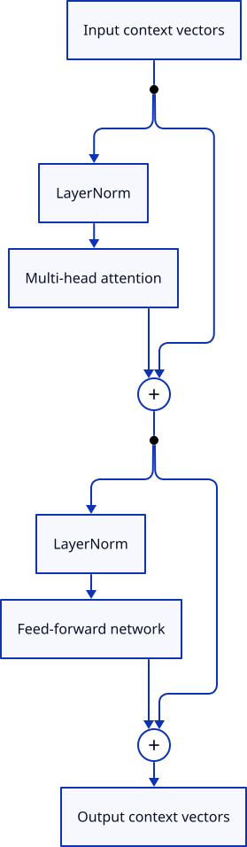
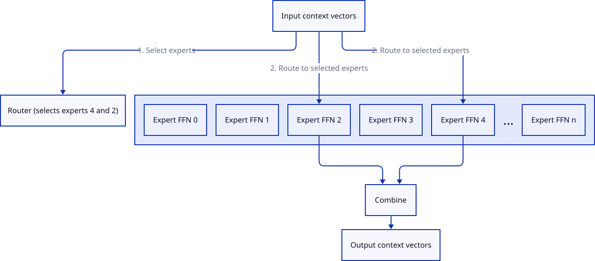
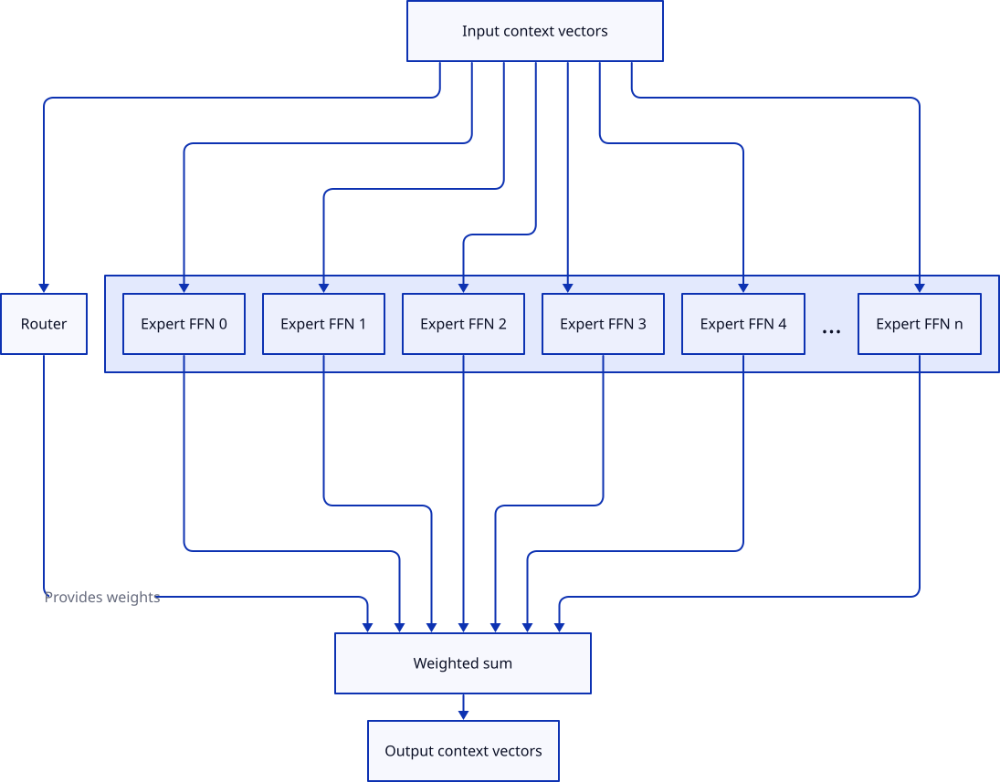
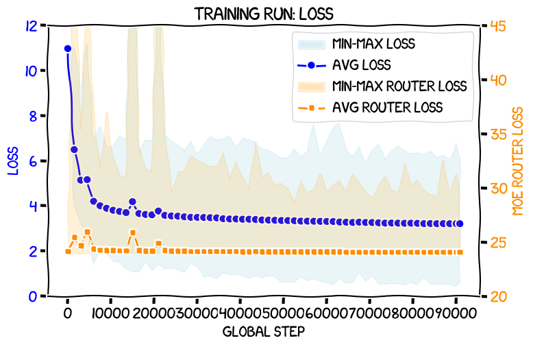

---
authors:
- aitoboxrobot
categories:
- 工具教程
date: 2026-09-11
hide:
- navigation
tags:
- GPT-2
- MoE
- PyTorch
- 深度学习
- 大语言模型
title: 扩展 Raschka 的 GPT-2：在 RTX 3090 上从头训练专家混合（MoE）模型
---
### 文章背景与核心概要
本文详细介绍了如何在 Sebastian Raschka 的畅销书《Build a Large Language Model (from Scratch)》中的 GPT-2 框架基础之上，实现并扩展**专家混合（Mixture-of-Experts, MoE）**架构。通过将标准的前馈神经网络（FFN）替换为一个路由器和多个专家网络，作者成功在单张 RTX 3090 显卡上从头训练了一个总参数量达 446M（激活参数量为 220M）的 MoE 模型。

项目重点探讨了确保专家负载均衡所需的**辅助损失（auxiliary loss）**机制，并深入剖析了实现高效稀疏路由所需的底层张量操作。这项实验证明，在消费级硬件上独立研究和训练 MoE 架构是完全可行的，为个人开发者和研究人员探索前沿大模型技术提供了宝贵的实战参考。

---

## 混合专家模型（MoE）的工作原理
混合专家模型允许模型在保持极低推理速度（类似小型模型）的同时，拥有大型模型的庞大知识容量。在标准的 Transformer 块中，前馈网络（FFN）是“思考”的核心区域。而 MoE 用多个“专家”和一个动态选择激活特定专家的**路由器（router）**替代了单一的 FFN。

> Mixture-of-Experts models allow for the inference speed of a small model while retaining the knowledge capacity of a large one. In a standard Transformer block, the feed-forward network (FFN) is the primary site for "thinking." An MoE replaces this single FFN with multiple "experts" and a **router** that dynamically selects which experts to activate for each incoming context vector.

<small><strong>Diagram 1</strong>: a GPT-2-style LLM at the top level</small>

<small><strong>Diagram 2</strong>: a GPT-2-style Transformers block</small>

<small><strong>Diagram 3</strong>: an outline of an MoE block</small>

---

## 我是如何将这一切整合在一起的
该实现的灵感和指导主要来源于四篇奠基性论文：
1. 《局部专家的自适应混合》（*Adaptive Mixtures of Local Experts*, 1991）
2. 《出奇庞大的神经网络》（*Outrageously Large Neural Networks*, 2017）
3. 《GShard》（2020）
4. 《Switch Transformers》（2021）

最终的架构使用路由器将上下文向量映射到不同的专家。为了确保路由器可训练，其输出被视为权重，从而通过反向传播将路由器与损失函数有效地连接起来。

> The implementation was guided by four foundational papers:
> 1. *Adaptive Mixtures of Local Experts* (1991)
> 2. *Outrageously Large Neural Networks* (2017)
> 3. *GShard* (2020)
> 4. *Switch Transformers* (2021)
> 
> The final architecture uses a router to map context vectors to experts. To ensure the router is trainable, the output is treated as weights, effectively connecting the router to the loss function via back-propagation.

---

## 路由器初探
路由器使用一个线性层来为每个专家生成 logits（对数几率）。我们为每个 Token 选择前 $k$ 个专家（top-$k$）。面临的一个严峻挑战是，标准的路由可能会导致计算图出现“死胡同”，从而使路由器无法接收到梯度。通过采用“先 softmax 后掩码”的方法（或者将非 top-$k$ 的值替换为 $-\infty$），我们确保了路由器依然处于可微的路径中。

> The router uses a linear layer to produce logits for each expert. We select the top-$k$ experts for each token. A critical challenge is that standard routing can lead to "dead-end" computation graphs where the router doesn't receive gradients. By using a softmax-then-mask approach (or replacing non-top-$k$ values with $-\infty$), we ensure the router remains part of the differentiable path.

<small><strong>Diagram 4</strong>: An MoE with all experts active</small>

---

## 实际代码
该实现扩展了 `TransformersBlock`，用 `MixtureOfExperts` 类替换了标准的 `FeedForward` 模块。

> The implementation extends the `TransformersBlock` by replacing the standard `FeedForward` module with a `MixtureOfExperts` class.

### 张量可视化
为了管理路由的复杂性，该实现依赖于张量展平（flattening）以及利用 `scatter_` 操作来屏蔽未激活的专家。

> ### Tensor Visualizations
> To manage the complexity of routing, the implementation relies on flattening tensors and using `scatter_` operations to mask inactive experts.

<small><strong>Diagram 5</strong>: The `xs` tensor as a 3-D cuboid</small>

<small><strong>Diagram 6</strong>: `xs` as two 2-D views</small>

---

## 采用 Switch 风格的负载均衡
如果没有人为干预，MoE 模型往往会发生坍塌，即过度依赖少数几个专家而忽略其他专家。为了防止这种情况，我们根据《Switch Transformers》论文实现了一种**辅助损失（auxiliary loss）**。该损失会对专家利用率的不均衡进行惩罚，从而迫使路由器更加均匀地分发流量。

> Without intervention, MoEs tend to collapse, relying heavily on a few experts while ignoring others. To prevent this, we implement an **auxiliary loss** based on the *Switch Transformers* paper. This loss penalizes imbalances in expert utilization, forcing the router to distribute traffic more evenly.

### 辅助损失计算
损失定义如下：
$$\text{loss} = \alpha \cdot N \cdot \sum_{i=1}^{N} f_i \cdot P_i$$
其中：
* $f_i$ 是分发给专家 $i$ 的 Token 比例。
* $P_i$ 是分配给专家 $i$ 的平均概率。
* $\alpha$ 是缩放超参数（本次运行中设为 $0.005$）。

> ### Auxiliary Loss Calculation
> The loss is defined as:
> $$\text{loss} = \alpha \cdot N \cdot \sum_{i=1}^{N} f_i \cdot P_i$$
> Where:
> * $f_i$ is the fraction of tokens dispatched to expert $i$.
> * $P_i$ is the average probability allocated to expert $i$.
> * $\alpha$ is a scaling hyper-parameter (set to $0.005$ for this run).

---

## 训练过程
模型在 89 亿个 Token 上训练了约 8 天。损失平稳下降，辅助损失也稳定在 24.0 的理想值附近。

> The model was trained for ~8 days on 8.9 billion tokens. The loss decreased smoothly, and the auxiliary loss stabilized near the ideal value of 24.0.

### 结果
该模型的表现超越了以往所有的 163M 参数模型以及 OpenAI 的 GPT-2 small (124M)，在测试集损失上仅次于 OpenAI 的 GPT-2 medium (345M)。

> ### Results
> The model outperformed all previous 163M-parameter models and the OpenAI GPT-2 small (124M), landing just behind the OpenAI GPT-2 medium (345M) in test loss.

| 模型 | 参数量 | 测试集损失 (Test Loss) |
| :--- | :--- | :--- |
| OpenAI 权重: medium | 345M | 3.231442 |
| **PyTorch MoE, 6 专家, 2 激活** | **446M/220M** | **3.253928** |
| OpenAI 权重: small | 124M | 3.499677 |

| Model | Params | Test Loss |
| :--- | :--- | :--- |
| OpenAI weights: medium | 345M | 3.231442 |
| **PyTorch MoE, 6 experts, 2 active** | **446M/220M** | **3.253928** |
| OpenAI weights: small | 124M | 3.499677 |

## 结论
这项实验表明，MoE 架构对于拥有消费级硬件的独立研究人员来说是完全可及的。成功的关键在于精心实现辅助损失以确保专家利用率的均衡。未来的工作将集中于对比该 MoE 模型与同等训练成本的稠密模型（dense models）之间的计算效率。

> This experiment demonstrates that MoE architectures are accessible to individual researchers with consumer hardware. The key to success lies in the careful implementation of the auxiliary loss to ensure expert utilization. Future work will focus on comparing the compute-efficiency of this MoE against dense models of equivalent training cost.