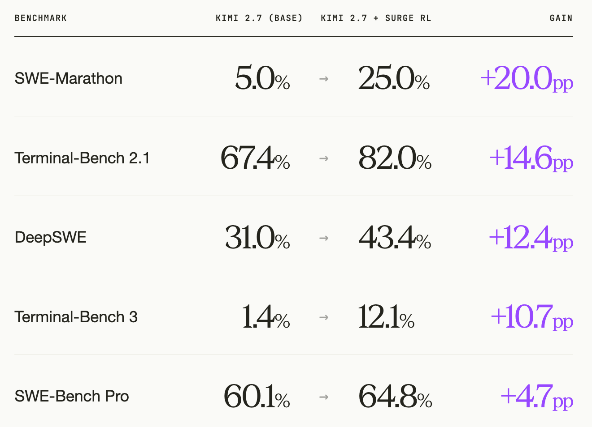
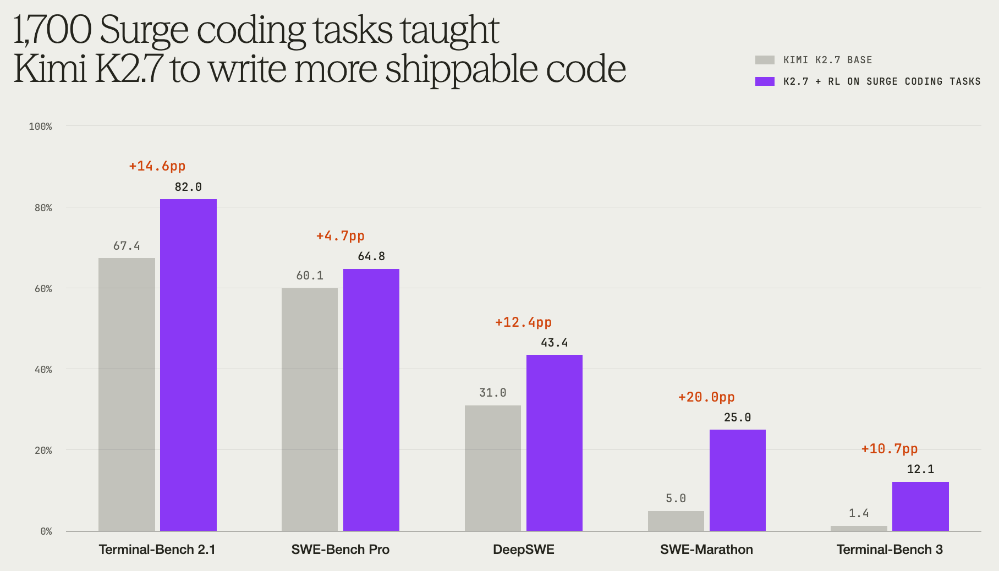
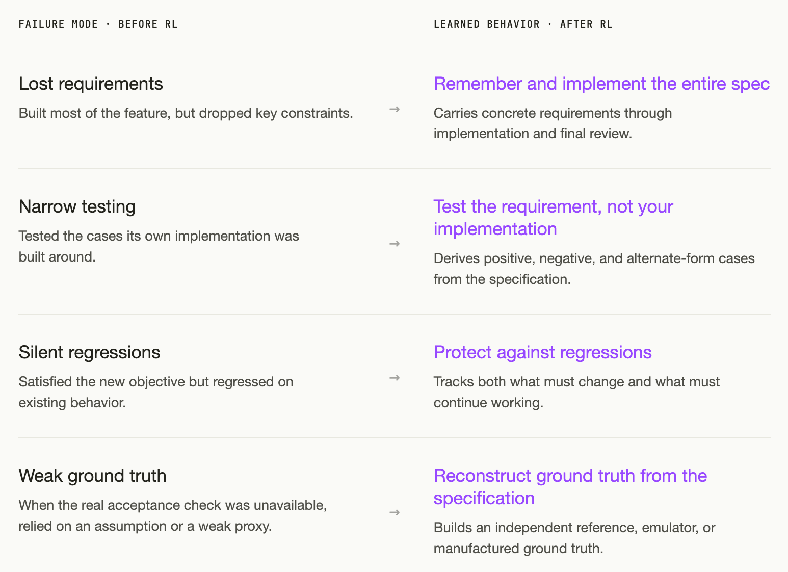
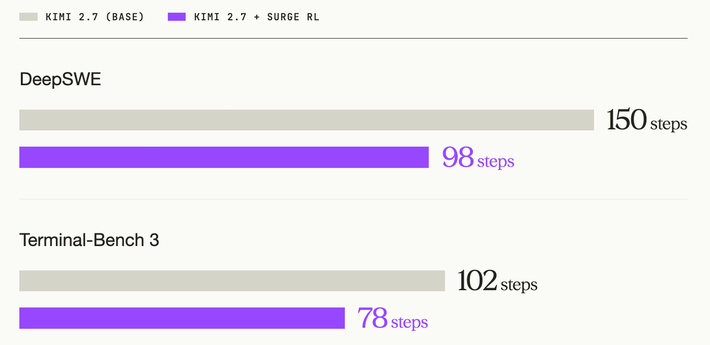
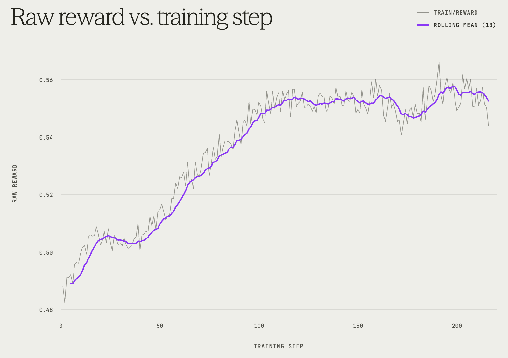
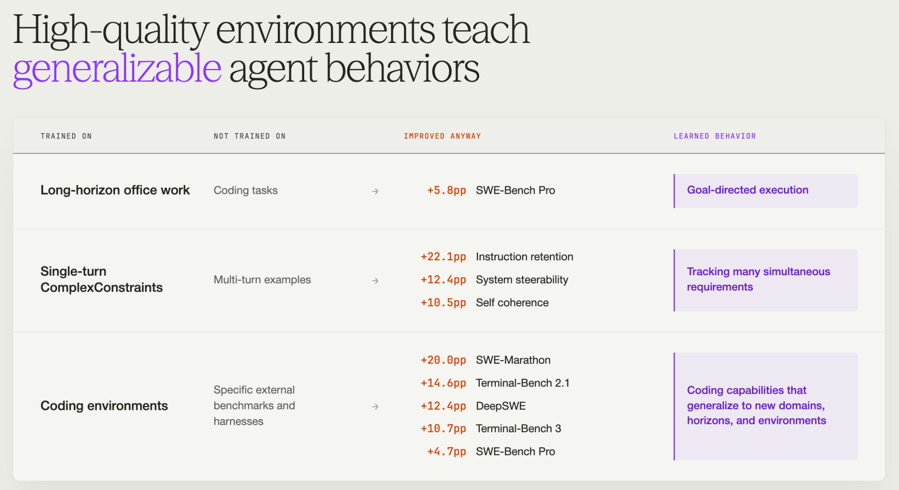

---
authors:
  - aitoboxrobot
categories:
  - 研究解读
date: 2026-09-12
hide:
  - navigation
tags:
  - SWE Agent
  - 强化学习
  - Kimi K2.7
  - 代码智能体
title: "爬坡 SWE 智能体：1700 个编程任务教会了 Kimi K2.7 什么"
---

# 爬坡 SWE 智能体：1700 个编程任务教会了 Kimi K2.7 什么

> # Hill-Climbing a SWE Agent: What 1,700 Coding Tasks Taught Kimi K2.7

**发布时间：** 2026年9月11日  
**来源：** Surge AI 官方博客 (The Surge AI Blog)  

> **Published:** September 11, 2026  
> **Source:** The Surge AI Blog

### 文章背景与核心概要

在软件工程智能体 (SWE Agent) 的开发中，让大语言模型编写出可运行的代码已非难事，但真正产出能够直接合并交付、满足全部严苛规约的“可上线代码”依然是巨大挑战。Surge AI 团队利用精心策展的 1,700 个由人类专家构建的真实编程任务，仅通过强化学习 (Reinforcement Learning, RL) 对 Kimi K2.7 (Max reasoning) 进行后训练 (Post-Training)，且全程未引入任何监督微调 (Supervised Fine-Tuning, SFT)。

评测结果令人瞩目：后训练后的 Kimi K2.7 在五个外部权威代码基准测试中平均提升了 12.5 个百分点，并在部分榜单上超越了参数规模大得多的 K3，甚至比肩 GPT-5.6 Sol。更关键的是，模型解决复杂任务的中位数思考与执行步数从 150 步锐减至 98 步，展现出“做得更少、写得更准”的成熟工程师直觉。本案例研究深入剖析了强化学习如何教会智能体严格落实全部规约、针对需求而非自身实现设计测试、筑牢防回归防线以及在缺失基准时自主构建验证真值，为代码智能体的进化提供了极具价值的实践范式。

---

## 执行摘要

> ## Executive Summary

本案例研究探讨了仅使用强化学习 (RL)，在由专家构建的 1,700 个精选编程任务集上，对 **Kimi K2.7 (Max reasoning)** 进行后训练的效果。在五个外部编程基准测试的评估中，经过后训练的模型在多种智能体脚手架 (Harness) 上均展现出显著的性能提升，尽管在训练期间从未专门针对这些基准测试的格式进行过任何优化。

> This case study examines the effects of post-training **Kimi K2.7 (Max reasoning)** using reinforcement learning (RL) exclusively on a curated set of 1,700 expert-built coding tasks. Evaluated across five external coding benchmarks, the post-trained model demonstrated significant performance gains across multiple agent harnesses, despite never explicitly targeting those benchmark formats during training.

核心要点包括：
* **强大的迁移泛化能力：** 性能提升成功泛化到了不同的脚手架、提示词、工具和评估格式中 (包括类似 *SWE-Marathon* 这种跨越数小时的长轨迹任务，以及像 *Terminal-Bench 3* 这样涵盖广泛硬件与系统的综合评估)。
* **超越更大规模模型：** 经过后训练的 K2.7 在 Terminal-Bench 2.1 和 Terminal-Bench 3 上超越了 K3，并在 SWE-Bench Pro 上取得了可媲美 GPT-5.6 Sol 的优异成绩。
* **执行效率显著提升：** 解决复杂任务所需的中位数轨迹步数大幅下降 (例如在 DeepSWE 上从 150 步降至 98 步)，表明模型学会了更加聪明地工作，而非单纯延长求解时间。

> Key takeaways include:
> * **Strong Transferability:** Performance gains generalized across different harnesses, prompts, tools, and evaluation formats (including multi-hour trajectories like *SWE-Marathon* and broad hardware/systems evaluations like *Terminal-Bench 3*).
> * **Outperforming Larger Models:** Post-trained K2.7 surpassed K3 on Terminal-Bench 2.1 and 3, and scored competitively with GPT-5.6 Sol on SWE-Bench Pro.
> * **Increased Efficiency:** Median trajectory steps required to solve complex tasks dropped significantly (e.g., from 150 to 98 on DeepSWE), showing the model learned to work smarter rather than just longer.

---

## 1. 引言与总览

> ## 1. Introduction & Overview

我们仅使用强化学习对 Kimi K2.7 (Max reasoning) 进行了后训练，随后在五个外部编程基准测试上对最终检查点进行了评测。模型在全部五个基准测试中均取得了全面提升：

> We post-trained Kimi K2.7 (Max reasoning) using reinforcement learning only, then evaluated the final checkpoint on five external coding benchmarks. It improved on all five:

  

其中有三大亮点尤为突出：

> Three things stood out:

1. **显著的泛化迁移性：** 这一提升在三种不同的智能体脚手架中均得以保持，涵盖了不同的工具集、提示词体系以及执行循环结构。其中一些最大的增益出现在训练中从未针对过的评测格式上：例如 *SWE-Marathon* 要求智能体在长达数小时的执行轨迹中构建完整系统；而 *Terminal-Bench 3* 则横跨硬件、科学计算、底层系统、网络安全与常规软件开发。更值得一提的是，我们的训练任务早在这些基准测试诞生之前就已采集完成。
2. **更小体量的模型在多个评测中击败了大得多的模型：** 根据 Kimi 官方汇报的基线数据，我们后训练的 K2.7 在 Terminal-Bench 2.1 和 Terminal-Bench 3 上均领先于 K3。在 SWE-Bench Pro 上，它的得分略高于 GPT-5.6 Sol (Max reasoning)。由于不同评测使用的脚手架与任务版本可能存在差异，我们将这些成绩视为宏观背景对比，而非严格受控的直接对抗。
3. **达成目标的执行步数大幅减少：** 在 DeepSWE 上，中位数轨迹长度从 **150 步锐减至 98 步**，在 Terminal-Bench 3 上则从 **102 步降至 78 步**。模型显然变得更加敏捷高效。

> 1. **The gains transferred.** They held across three different agent harnesses, with different tools, prompting, and loop structures. Some of the largest gains appeared on evaluation formats we never targeted in training: *SWE-Marathon* asks agents to build complete systems over multi-hour trajectories; *Terminal-Bench 3* spans hardware, scientific computing, systems, security, and software work. Our tasks were collected before either benchmark existed.
> 2. **A much smaller model surpassed much larger models on several evals.** On Kimi’s own reported scores, our post-trained K2.7 is ahead of K3 on Terminal-Bench 2.1 and Terminal-Bench 3. On SWE-Bench Pro, it scores slightly ahead of GPT-5.6 Sol (Max reasoning). Since harnesses and task versions can differ, we treat these as contextual rather than controlled head-to-head comparisons.
> 3. **And it used fewer steps to get there.** Median trajectory length fell from **150 to 98** steps on DeepSWE and from **102 to 78** on Terminal-Bench 3. The model became more efficient.

为了搞清楚模型究竟习得了哪些新行为习惯以实现上述突破，我们深入分析了它的执行轨迹。

> To understand what new behaviors the model learned to achieve these gains, we studied its trajectories.

  

<em>图 1: 在 1,700 个 Surge 编程任务上进行强化学习前后，模型在五个外部编程基准测试上的 Pass@1 表现。</em>

> 
<em>Pass@1 on five external coding benchmarks before and after RL on 1,700 Surge coding tasks.</em>

---

## 2. 为什么 Kimi K2.7 此前难以写出“可直接交付”的代码

> ## 2. Why Kimi K2.7 Failed to Write Shippable Code

为了弄清后训练模型所习得的具体行为，我们将基座模型与后训练模型在相同任务上的运行轨迹进行了一对一配对对比，系统分析了模型的推理逻辑、终端命令、测试用例以及输出结果。

> In order to understand our post-trained model’s learned behaviors, we paired base and post-trained trajectories on the same tasks and analyzed the models’ reasoning, commands, tests, and outputs.

Kimi K2.7 本身就已经是一款非常出色的编程智能体模型。基座模型在很多时候都能通过绝大部分目标测试用例。在 DeepSWE 的失败用例中，未通过运行的中位数依然通过了 **86% 的目标测试**；其中有 49 次运行通过了至少 80% 的测试，且有 70 次完美保留了所有已有的回归测试 (Pass-to-pass tests)。

> Kimi K2.7 is already a strong agentic coding model. The base model often passed most of the target tests. Across DeepSWE failures, the median failed run still passed **86% of the target tests**; 49 passed at least 80%, and 70 preserved every existing pass-to-pass test.

**简而言之，模型大体上知道该做什么，它只是不知道如何稳定可靠地把工作彻底做完。**

> **The model knew generally what to do. It just didn’t know how to reliably finish the job.**

它的失败模式集中在四个反复出现的典型特征上，而后训练模型恰好学会了如何针对性化解它们。这四种特征映射了软件工程的基本循环：**理解需求、设计测试、维护兼容与验证真值**。

> Its failures clustered into four recurring patterns, which the post-trained model learned to mitigate. They map to a basic engineering loop: **understand, test, maintain, and verify**.

  

有一个案例格外鲜明地体现了这种思维转变。在 SWE-Marathon 基准测试中，模型需要在一个没有现成 `zstd` 参考二进制工具的环境中，实现一个 Zstandard 解压器。后训练模型的应对策略令人拍案叫绝——它**先自己写了一个压缩器**，从而让自己拥有了生成标准压缩文件的能力，进而能够严谨验证解压器是否能将数据无损还原。

> One example captures the shift unusually well. On SWE-Marathon, the model had to build a Zstandard decompressor in an environment with no reference zstd binary. The trained model responded by **writing a compressor first**, giving itself a way to manufacture valid compressed files and test whether its decompressor recovered them correctly.

换句话说，**当环境中不存在现成的验证真值 (Ground Truth) 时，它学会了自己亲手构建真值。**

> In other words, **when no ground truth existed, it built it itself.**

---

### 习得行为 #1：牢记并完整实现规约中的每一项细节

> ### Learned Behavior #1: Remember and Implement the Entire Spec

* **强化学习训练前：** 在一个涉及 FastAPI 的任务中共有二十项具体需求。第 18 条需求要求追踪中间件暴露 `get_stats()` 和 `reset_stats()` 方法。基座模型基本实现了整个核心功能，却将这两个函数放在了模块顶级作用域中，而不是作为中间件对象的实例方法。最终它通过了 **137 个目标测试中的 121 个**；而剩下的 16 个测试严格按照规约要求调用中间件实例方法，全部以报错告终。
* **强化学习训练后：** 训练后的模型正确地将它们实现为了实例方法，并通过了全部 **137/137 个测试**。基座模型显然完全理解了该功能——它的架构设计合理且代码切实可用——但其中某一项接口需求却在阅读规约到最终完成编码的过程中不知不觉被遗忘了。而训练后的模型则将最后一项约束始终贯彻到底。
* **为什么训练数据能奖赏这种行为：** 训练任务中密集包含了大量显式、可检验的需求：明确命名的边界用例、禁止性条款、精确的接口签名、输出格式规范以及背后由隐藏测试支撑的严苛约束。强化学习的奖励是按条款逐项累加的，因此模型能够反复接收到清晰反馈：仅仅理解任务大意与完整兑现全部软件契约之间，有着天壤之别。
* **为什么这至关重要：** 真实软件工程中最硬核的挑战，从来不是搞懂个大概就提前宣布完工，而是一丝不苟地实现每一处既定需求。

> * **Before RL:** One FastAPI task had twenty requirements. Requirement 18 asked the tracking middleware to expose `get_stats()` and `reset_stats()`. The base model implemented essentially the whole feature, but put those functions at the module level instead of making them methods on the middleware object. It passed **121 of 137 target tests**; the remaining sixteen called the methods exactly where the specification said they should exist, and all sixteen failed.
> * **After RL:** The trained model made them instance methods and passed **137 of 137**. The base model clearly understood the feature—it had the right architecture and wrote working code—but one interface requirement disappeared somewhere between reading the spec and finishing the implementation. The trained model carried that last constraint all the way through.
> * **Why the training data rewards this:** The tasks are dense with explicit, testable requirements: named edge cases, prohibitions, exact interfaces, output formats, and constraints backed by hidden checks. Reward increases criterion by criterion, so the model repeatedly gets feedback on the difference between understanding the gist of a task and successfully satisfying the whole contract.
> * **Why this matters:** The hard part of real software is implementing every requirement, instead of declaring the job done early.

---

### 习得行为 #2：测试原始需求本身，而非测试你自己的实现

> ### Learned Behavior #2: Test the Requirement, Not Your Implementation

* **强化学习训练前：** 两个模型都会频繁编写和运行测试，核心差异在于它们**选择测试什么**。某项任务要求默认参数能够同时支持命名函数与匿名函数。基座模型选择了一种能够完美处理匿名形式 `func(a = 1)` 的实现，并且它编写的每一条测试用例都局限于这种形式。然而规约同时明确要求支持命名形式 `func f(a = 1)`。基座模型的代码未能解析 `func` 与括号 `(` 之间的标识符，导致两套隐藏测试套件全军覆没。模型实际上是在围绕自己代码已经支持的逻辑路径“自圆其说”式地设计测试。
* **强化学习训练后：** 训练后的模型首先以规约中列出的命名函数样例入手，随后主动尝试了匿名函数、多行参数、展开调用 (Spread calls)、立即执行函数 (IIFE) 以及各种边界变形。它不再满足于验证自己的实现能否跑通已知路径，而是主动寻找可能证伪自身需求理解的刁钻用例。
* **为什么训练数据能奖赏这种行为：** 评分测试是完全隐藏的。在轨迹生成 (Rollout) 过程中，模型只能看到需求规约，而看不到决定最终奖励的测试用例。它无法投机取巧地针对可见测试“面向测试编程”；它必须深度推断规约所隐含的全部语义，并自行决策哪些行为值得测试。这在强化学习中反复强化了一个微妙而深刻的认知：**去测试需求真正要求的东西，而不仅仅测试你碰巧写出的代码。**
* **为什么这至关重要：** 优秀的测试远不止覆盖脑海中已有的构想，更能揭示你未曾预料到的边缘盲区。

> * **Before RL:** Both models tested frequently. The difference was what they chose to test. One task required default arguments to work for both named and anonymous functions. The base model chose an implementation that worked for `func(a = 1)`. Every test it wrote used that form. But the specification also required `func f(a = 1)`. Its implementation did not handle the identifier between `func` and `(`, so both hidden test suites failed. The model had designed its tests around the path its own implementation already supported.
> * **After RL:** The trained model started with the named example from the specification itself, then tried anonymous functions, multiline parameters, spread calls, immediately invoked functions, and other variants. Instead of asking whether its implementation worked on the cases it already supported, it looked for cases that could prove its interpretation of the requirement wrong.
> * **Why the training data rewards this:** The grader is hidden. During a rollout, the model sees the specification but not the tests that determine reward. It cannot simply code against visible cases; it has to infer what the specification implies and decide for itself what behavior is worth testing. That repeatedly rewards a subtle distinction: **test what was asked for, not just what you happened to build.**
> * **Why this matters:** Good testing goes beyond the cases you already had in mind and uncovers the edge cases you hadn’t thought of.

---

### 习得行为 #3：筑牢防线，严防功能回归

> ### Learned Behavior #3: Protect Against Regressions

* **强化学习训练前：** 有一项任务要求模型消除页面布局偏移 (Layout shift)，同时必须完整保留现有的可见元素、样式呈现以及埋点分析等副作用。基座模型虽然在每个页面上都达成了零布局偏移的目标，但其代价却是擅自删除了两个组件。在其自我总结中，模型甚至认为这种删除无伤大雅，因为部分样式已被内联处理。
* **强化学习训练后：** 训练后的模型在动手修改代码前，显式梳理并标记了规约明确要求必须保留的元素。它完整保留了这两个组件，仅调整了其视觉效果的渲染应用方式。它不再盲目追求单一的修改目标，而是双线并行：既时刻追踪“必须改变什么”，又严密防守“绝不能破坏什么”。
* **为什么训练数据能奖赏这种行为：** 对既有行为的保护被直接硬编码在奖励信号中。许多规约都明确指出了哪些内容绝对不可变更，并且代码仓库任务自带的回归测试 (Pass-to-pass tests) 构成了硬性门禁：**只要破坏了既有的既定功能，无论实现了多少项全新需求，奖励直接清零**。
* **为什么这至关重要：** 真实的软件工程极少只是单纯的“把需求 X 做出来”，而是“在绝对不破坏 Y、Z 以及用户赖以生存的现有功能的前提下，把 X 做出来”。

> * **Before RL:** One task asked the model to eliminate layout shift while preserving the same visible elements, styling, and analytics side effects. The base model achieved zero layout shift on every page, but partly by deleting two components. Its own final review judged the deletion harmless because some of their styling had been inlined.
> * **After RL:** The trained model explicitly tracked what the specification said had to remain before it started editing. It preserved the components while changing how their visual effects were applied. Instead of optimizing only for the requested change, it tracked both what needed to change and what was not allowed to.
> * **Why the training data rewards this:** Preserving existing behavior is built directly into the training signal. Many specifications explicitly say what must remain unchanged, and the repository tasks carry pass-to-pass tests that act as a hard regression gate: **break required existing behavior and the reward goes to zero**, no matter how many new requirements you satisfy.
> * **Why this matters:** Real engineering is rarely just “make X happen.” It is “make X happen without breaking Y, Z, and everything the user already depends on.”

---

### 习得行为 #4：立足规约自身，自主重构验证真值

> ### Learned Behavior #4: Reconstruct Ground Truth from the Specification

* **强化学习训练前：** 部分任务并未提供直观的参考实现或现成可信的参考答案供模型检验成果。在这种情况下，基座模型往往会做出某种主观假设，随后构造一个完全继承了该假设的测试用例。在某项二维谱求解器 (Spectral-solver) 任务中，容器环境中缺失了官方参考函数。基座模型想当然地认为该问题本质上可近似为一维问题，于是构建了一维求解器，并用基于相同假设构造的参考数据进行了验证。这样的测试根本无法暴露其底层的根本性错误。
* **强化学习训练后：** 训练后的模型巧妙选择了一个能够在数学上严格推导出解析解的二维特解，构造出该特解必须成立的特定输入，并以此作为独立的校验基准。这在最终提交前成功暴露了一处数值不稳定性。我们在其他任务中也观察到了同样强大的直觉习惯：在某项 Verilog 控制台任务中，训练后的模型自主编写了一个 Python 仿真模拟器，逐条指令对比硬件实现；而在 Zstandard 任务中，它专程编写了一套压缩器，只为给自己的解压器提供合法的输入测试样本。
* **为什么训练数据能奖赏这种行为：** 训练数据中没有任何样本直接教导模型去构建偏微分方程 (Partial Differential Equation, PDE) 参考解、硬件模拟器或压缩器。但每一个任务都将模型置于相同的基本处境：严谨详尽的规约、完全隐藏的校验器、以及无法接触到的参考标准答案。要想稳定通关，模型必须能够自行寻找证据证明自身方案的正确性：**如果我的解决方案是正确的，应当满足哪些必然真理？我又该如何对其进行验证？**
* **为什么这至关重要：** 在真实的日常工作中，往往没有现成的单元测试、没有标准参考实现、身边更没有随时提供标准答案的专家。能够自主创建验证手段，正是智能体走出基准测试、真正发挥实际生产力的核心特质。

> * **Before RL:** Some tasks do not provide an obvious reference implementation or trusted answer the model can use to verify its work. In those situations, the base model would sometimes make an assumption and then construct a test that inherited the same assumption. On a two-dimensional spectral-solver task, the official reference functions were unavailable inside the container. The base model decided the problem was probably effectively one-dimensional, built a one-dimensional solver, and then validated it against reference data constructed with the same assumption. Its test had no way to expose the original mistake.
> * **After RL:** The trained model chose a two-dimensional solution whose correct answer it could derive mathematically, constructed an input for which that solution had to be correct, and used the pair as an independent test. That exposed an instability before submission. We saw the same instinct elsewhere: on a Verilog console task, the trained model wrote a Python emulator and compared the hardware implementation against it instruction by instruction; on the Zstandard task, it wrote a compressor solely to generate valid inputs for its decompressor.
> * **Why the training data rewards this:** Nothing in the training set explicitly teaches the model to build PDE reference solutions, hardware emulators, or compressors. But every task puts it in the same basic situation: a precise specification, a hidden checker, and no access to the answer key. To succeed consistently, the model has to develop its own evidence that the result is correct: **what should be true if my solution works, and how can I check it?**
> * **Why this matters:** Real work often does not come with a unit test, reference implementation, or someone nearby with the answer. Being able to create your own check is part of what makes an agent useful outside a benchmark.

---

## 3. 效率跃升：以更少的冗余操作写出更优质的代码

> ## 3. Efficiency Gains: Writing Better Code by Writing Less

对于性能提升，一个直观的猜测可能是：后训练仅仅让模型变得更加“有毅力”——进行了更多的思考推理、开展了更多的试错实验、执行了更多的测试用例。

> One obvious explanation for the gains could be that post-training simply made the model more persistent: more reasoning, more experiments, more tests.

然而执行轨迹所呈现的事实却恰恰相反。在配对的 DeepSWE 评测中，训练后模型的中位数轨迹长度从 **150 步降至 98 步**；在 Terminal-Bench 3 上，该指标也从 **102 步降至 78 步**。

> The trajectories point in the opposite direction. On paired DeepSWE runs, median trajectory length fell from **150 steps to 98** after training. On Terminal-Bench 3, it fell from **102 to 78**.

  

<em>图 2: 训练后的模型步数更少，而不是更多。</em>

> 
<em>Figure 2. The trained model used fewer steps, not more.</em>

训练后的模型胜在行动更加精准聚焦：它花费在排查错误理解和测试无关用例上的无用功大大减少。

> The trained model won by being more targeted in its work: less time debugging the wrong interpretation and testing irrelevant cases.

---

## 4. 训练数据集的构成

> ## 4. The Training Set Composition

这 1,700 个任务来自 [Surge 数据集目录](https://surgehq.ai/ots) 中的两类编程任务集合：

> The 1,700 tasks came from two types of coding collections from [Surge’s dataset catalog](https://surgehq.ai/ots).

1. **1,000 个代码仓库任务 (Repository tasks)：** 从固定提交记录 (Pinned commits) 的真实代码库切入，要求模型实现具体的代码变更。隐藏测试用于验证所要求的新增行为，而回归测试则确保现有功能完好无损。
2. **700 个终端环境任务 (Terminal tasks)：** 将模型置于真实的运行环境中，要求其输出具备实际可用性的工作成果。由人类专家编写的隐藏校验脚本会全面检查系统的最终状态。

> 1. **1,000 repository tasks** start from repositories at pinned commits and ask the model to make specific changes. Hidden tests check the requested new behavior, while regression tests make sure existing functionality still works.
> 2. **700 terminal tasks** put the model inside working environments and ask it to produce real deliverables. Expert-written hidden verifiers inspect the final state.

这些任务的组织形态虽然是大家熟悉的 SWE-Bench 与 Terminal-Bench 格式，但**我们在构建训练数据时并未专门迎合这些基准测试的数据分布**。代码仓库任务并非为了刷高 SWE-Bench 的得分而挑选，终端任务也并非针对 Terminal-Bench 2.1 量身定制；它们仅仅复用了这种评估形态。对于其他几项评测，数据隔离则更加纯粹：本次训练任务的采集时间早在 DeepSWE、SWE-Marathon 和 Terminal-Bench 3 问世之前就已完成。

> The formats are familiar SWE-Bench and Terminal-Bench formats, but **we did not build the training data to target the benchmark distributions**. The repository tasks were not selected to improve SWE-Bench, and the terminal tasks were not selected to improve Terminal-Bench 2.1; they mirrored the format only. For the other evaluations, the separation is even cleaner: the training tasks were collected before DeepSWE, SWE-Marathon, and Terminal-Bench 3 existed.

当模型在全部五个外部基准测试中均展现出跨越式的提升时，我们见证了在某一类特定环境中习得的良好行为习惯成功泛化到了全新的领域——而这正是我们最为看重的智能体迁移能力。

> When performance improves across all five external evals, we are seeing behaviors learned in one set of environments generalize to somewhere else, which is the kind of transfer we care about.

---

## 5. 训练奖励信号：阶梯式部分得分与功能回归零容忍

> ## 5. The Training Signal: Partial Credit, Zero Tolerance for Regressions

本次训练完全采用强化学习，未经历任何监督微调 (Supervised Fine-Tuning, SFT) 阶段。为了探究高质量数据本身的纯粹效果，我们特意保持了训练设置的简洁克制：采用 GSPO 算法、Rank 为 32 的 LoRA 适配器、每步每个任务采样 8 条轨迹 (Rollouts)、单轮 65,536 Token 的上下文与响应上限，并开启最大推理努力 (Maximum reasoning effort)。

> Training was RL only, with no supervised fine-tuning stage. In order to focus on the effect of the data, we kept the training setup deliberately simple. We used GSPO, a rank-32 LoRA adapter, eight rollouts per task per step, a 65,536-token per-turn context and response cap, and maximum reasoning effort.

训练中的奖励函数定义如下：

> The reward was defined as:

$$\text{R} = \mathbb{I}[\text{all pass-to-pass tests pass}] \times \text{fraction of target checks passed}$$

* 如果一条轨迹满足了 12 项要求检查中的 3 项，且没有破坏既有功能，它将获得 **0.25** 分。
* 如果一条轨迹虽然完美达成了全部 12 项全新检查，但只要破坏了哪怕一项已有的回归测试，其得分便直接**清零**。

> * A rollout that satisfies 3 of 12 requested checks without breaking existing behavior gets **0.25**. 
> * A rollout that satisfies all 12 new checks but breaks one pass-to-pass test gets **zero**.

这一机制赋予了模型**关于任务进展的高密度稠密反馈**，同时设立了**抵御代码回归的刚性门禁**。历经海量轨迹的淬炼，模型得以反复感知哪些具体的实现选择能够推动一个半成品方案向完整可用的正确方案迈进。我们的假说是：这种结合促使模型能够从“差一点成功”的微小挫折中汲取经验，而不会将所有未竟全功的尝试简单粗暴地打成同等的失败。

> That gives the model **dense feedback about progress**, but a **hard gate against regressions**. Over many rollouts, it gets repeated feedback about which implementation choices move an incomplete solution toward a complete one. Our hypothesis is that this combination lets the model learn from near-misses rather than treating every incomplete attempt as equally wrong.

  

<em>图 3: 原始奖励随训练步数的变化曲线。</em>

> 
<em>Figure 3. Raw reward vs training step over time.</em>

虽然我们尚未进行充分的消融实验以断言这种奖励设计是促成性能蜕变的唯一要素，但训练信号所鼓励的行为导向与模型轨迹中发生的深刻转变之间的紧密契合，确实显而易见。

> We have not run the ablations needed to claim that this reward design alone caused the change. But the correspondence between what the training signal rewards and what changed in the trajectories is hard to miss.

---

## 6. 后训练如何塑造智能体的行为模式

> ## 6. How Post-Training Shapes Behavior

高质量的交互环境赋予模型超越训练任务本身的新能力，这并非我们首次见证。

> This isn’t the first time we’ve seen high-quality environments teach models new capabilities beyond the tasks they trained on.

* 在此前的一项后训练实验中，我们[在长周期日常办公强化学习环境中训练了一个模型](https://surgehq.ai/blog/office-work-post-training-improves-coding)，其中**完全不包含任何编程任务**。然而令人惊奇的是，该模型在 SWE-Bench Pro 编程测试中依然取得了 **+5.8 个百分点**的提升。深度分析表明，模型习得了一种更加通用的高阶能力——**目标导向执行 (Goal-Directed Execution)**。
* 在我们的 [ComplexConstraints 后训练实验](https://surgehq.ai/blog/training-on-complexconstraints)中，全部 1,000 个训练样本均为**单轮交互 (Single-turn)**，但在多轮评估基准 MultiChallenge 上，最大的增益却恰恰出现在需要长线保持的多轮行为中：**指令留存能力 (+22.1 个百分点)、系统可操纵性 (+12.4 个百分点) 以及自洽连贯性 (+12.4 个百分点)**。

> * In one post-training run, we [trained a model on long-horizon office work RL environments](https://surgehq.ai/blog/office-work-post-training-improves-coding) with **no coding tasks at all**. SWE-Bench Pro still improved **+5.8pp**. The analysis pointed to a broader capability called **Goal-Directed Execution**.
> * In our [ComplexConstraints post-training run](https://surgehq.ai/blog/training-on-complexconstraints), all 1,000 training examples were **single-turn**, yet some of the largest gains on MultiChallenge appeared in multi-turn behaviors: **Instruction Retention (+22.1pp), System Steerability (+12.4pp), and Self Coherence (+12.4pp)**.

我们的假说在于：任务的表层格式虽然千变万化，但其底层的核心能力却高度共通。无论是在单个高密度的提示词中同时把控相互交织的多项需求 (ComplexConstraints)，还是在跨越 9 轮的深度对话中持续维护累积的需求条件 (MultiChallenge)，本质上都依赖于同一项底层功底：**紧握各项既定约束不掉队**。结构复杂、质量上乘的训练任务，切实将这种底层能力锻造进了模型骨髓。

> Our hypothesis was that the surface format changed, but the underlying skill did not. Keeping track of many interacting requirements in one dense prompt (ComplexConstraints) and keeping track of requirements that accumulate over nine turns (MultiChallenge) both depend on the same basic capability: **holding onto constraints without dropping them**. Complex, high-quality tasks taught the model that underlying skill.

本次针对编程任务的强化学习训练再次提供了强有力的佐证：**模型在五个外部基准测试中取得了 +4.7 到 +20.0 个百分点的全面跃升**，横跨了截然不同的软件开发类型与三种形态各异的智能体脚手架。模型绝不仅仅是在它训练过的那些代码库上变得熟练；它显然真正领悟到了更加通用的软件工程行为准则，这种工程直觉足以经受住任务形态、时间跨度、技术领域乃至脚手架架构变迁的严苛考验。

> This coding run adds the same kind of evidence: **+4.7pp to +20.0pp across five external benchmarks**, spanning very different kinds of coding and three different agent harnesses. The model was not just getting better at the repositories it trained on; it appeared to be learning broader software-engineering habits that survived changes in format, horizon, domain, and scaffold.

  

<em>图 4: 可泛化的智能体行为习惯。</em>

> 
<em>Figure 4. Generalizable agent behaviors.</em>

贯穿这一系列研究，我们始终探寻的核心议题是：**究竟怎样的经历才能孕育出怎样的能力？** 智能源于经验的沉淀，而我们的终极目标，正是揭示后训练是如何深度重塑模型的思考与行动范式的。

> Across these studies, the question we care about is: **which experiences teach which capabilities?** Intelligence emerges from experience, and our goal is to understand how post-training shapes the way models behave.

---

## 7. 结语：攻克“最后一公里”才是工程的本质

> ## 7. Conclusion: The Last Mile Is the Job

Kimi K2.7 本身在编程领域就已积累了极其深厚的基础能力。然而，仅仅依靠 1,700 个由领域专家精心构筑的高难度任务以及简洁纯粹的强化学习流程，就让它在**五个外部基准测试中平均大幅跃升了 12.5 个百分点**。这种性能增益在三种截然不同的智能体脚手架中稳稳确立，甚至包括了我们在训练阶段从未预设过的未知评测环境。

> Kimi K2.7 already knew a lot about coding. Yet 1,700 expert-built tasks and a straightforward RL recipe improved it by an average of **12.5pp across five external benchmarks**. The gains held across three agent harnesses, including evaluations we did not target.

执行轨迹清晰勾勒出了本质的转变。在强化学习之前，模型常常能够攻克核心算法逻辑，却往往在边缘细节上功亏一篑：要么遗漏了某项细微需求，要么仅针对自己碰巧写出的代码路径进行测试，要么破坏了原本需要严格保持的功能逻辑，要么从未对赖以推导的关键假设进行过求证。而经过训练后，它真正学会了如何**有始有终、滴水不漏地把整项工程彻底做完**。

> The trajectories show what changed. Before training, the model would often solve the core problem and still fail somewhere around the edges: it dropped a requirement, tested only the case its implementation already handled, broke behavior that was supposed to stay intact, or never checked an assumption it was relying on. After training, it was better at **finishing the whole job**.

这就是“随手写点代码”与“交付真正软件”之间的根本鸿沟。软件工程的“最后一公里”绝非浮于表面的打磨修饰；它正是决定一段“差不多的代码”究竟是蜕变为可靠运行的软件、还是沦为彻底失败的任务的关键决胜点。

> That’s the difference between writing code and shipping software. The last mile isn’t polish; it’s where “almost right” becomes either working software or a failed task.

> 💬 **想要训练更强大的 SWE 智能体？** 本次后训练运行所使用的编程数据集现已在 Surge 提供。欢迎探索[我们的数据集目录](https://surgehq.ai/ots)或[与我们联系](mailto:team@surgehq.ai)。

> 💬 [原文引用 / Original Quote]:
> **Want to train better SWE agents?** The coding datasets used in this post-training run are available from Surge. Explore [our dataset catalog](https://surgehq.ai/ots) or [get in touch](mailto:team@surgehq.ai).

---

## 附录：训练运行配置

> ## Appendix: Training Run Configuration

| 配置项 | 具体参数 |
| :--- | :--- |
| **训练数据** | 1,700 个任务：1,000 个 SWE-Bench 风格任务与 700 个 Terminal-Bench 风格任务 |
| **基座模型** | Kimi K2.7 |
| **训练流程** | 纯强化学习 (RL only，无 SFT)；采用 GSPO；通过回归测试门禁的细粒度准则奖励 |
| **适配器** | LoRA rank 32, alpha 32, dropout 0 |
| **优化器** | Adam, betas (0.9, 0.98), 权重衰减 0.1, 学习率 2e-5, 余弦学习率衰减调度 (cosine schedule) |
| **采样参数** | 温度 (Temperature) 0.7；top-p 0.95；最大推理努力 (maximum reasoning effort) |
| **上下文窗口** | 每轮 65,536 Token 上下文与响应上限 |
| **评测指标** | Pass@1，最大推理努力；最终检查点 (final checkpoint) |
| **评测脚手架** | mini-swe-agent (SWE-Bench Pro, DeepSWE, Terminal-Bench 3)；Terminus-2 (Terminal-Bench 2.1)；Claude Code (SWE-Marathon) |

> | Field | Configuration |
> | :--- | :--- |
> | **Training data** | 1,700 tasks: 1,000 SWE-Bench-style and 700 Terminal-Bench-style |
> | **Base model** | Kimi K2.7 |
> | **Pipeline** | RL only (no SFT); GSPO; dense criterion reward gated on pass-to-pass tests |
> | **Adapter** | LoRA rank 32, alpha 32, dropout 0 |
> | **Optimization** | Adam, betas (0.9, 0.98), weight decay 0.1, learning rate 2e-5, cosine schedule |
> | **Sampling** | Temperature 0.7; top-p 0.95; maximum reasoning effort |
> | **Context** | 65,536-token per-turn context and response cap |
> | **Evaluation** | Pass@1, maximum reasoning effort; final checkpoint |
> | **Harnesses** | mini-swe-agent (SWE-Bench Pro, DeepSWE, Terminal-Bench 3); Terminus-2 (Terminal-Bench 2.1); Claude Code (SWE-Marathon) |
