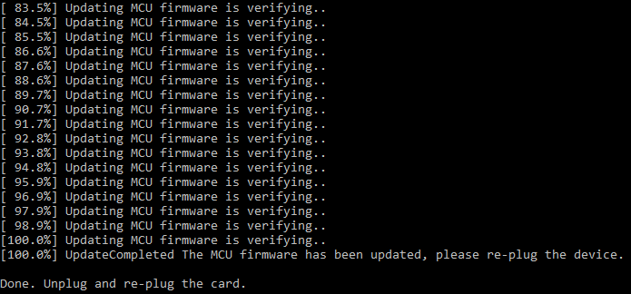

---
authors:
  - aitoboxrobot
categories:
  - 工具教程
date: 2026-09-15
hide:
  - navigation
tags:
  - NZXT
  - 固件逆向
  - 硬件调试
  - HDMI
  - 驱动修复
  - Claude
title: "修复 NZXT Signal 4K30 采集卡 (第二部分)：攻克绿粉色画面显示异常"
---

### 文章背景与核心概要

在成功修复了一块因电感虚焊而无法开机的二手 NZXT Signal 4K30 视频采集卡后，作者在接入特定 720p60 的 HDMI 信号源时遭遇了诡异的“绿粉色画面”异常。借助 AI (Claude) 的反编译辅助与硬件 UART 调试分析，作者顺藤摸瓜排查到设备芯片所采用的 ITE 官方驱动源码，精准锁定了因 DVI 模式信号识别错误导致误配 YUV 4:2:2 色彩格式的固件 Bug。通过逆向固件升级程序并仅修改 1 字节的汇编指令，作者成功修复了这一顽疾，让被官方弃用的老硬件重焕生机，并向社区公开了完整的免拆机刷机补丁。

---

# 修复 NZXT Signal 4K30 采集卡 (第二部分)：攻克绿粉色画面显示异常

> # Fixing an NZXT Signal 4K30, Part 2: The Green/Pink Video Bug

## 概要

> ## Summary

在通过重新焊接松脱的电感引脚、成功救活了一块在二手平台淘来的“故障” NZXT Signal 4K30 视频采集卡后，作者又发现了一个棘手的画面色彩 Bug：当接入某个特定的 720p60 HDMI 信号源时，采集到的视频画面居然严重偏色，呈现出失真的绿粉相间色调。在 AI (Claude) 的协助下，作者对该采集卡的固件以及板载 IT6805 HDMI 接收芯片的原厂驱动进行了深入逆向分析，最终将罪魁祸首锁定在 DVI 模式信号处理代码中的逻辑缺陷——该缺陷引发了 YUV 与 RGB 颜色模式的错误匹配。随后，作者通过逆向工程剖析了固件升级工具，仅通过修改底层机器码中的单个字节汇编指令便彻底解决了该问题，恢复了正常的视频色彩采集，并将这一补丁开源分享给了社区。

> After successfully repairing a dead, thrifted NZXT Signal 4K30 capture card by fixing a bad solder joint, the author discovered a stubborn color bug: a specific 720p60 HDMI source caused the captured video to appear in distorted green and pink hues. With the help of AI (Claude) to analyze the device's firmware and vendor drivers for the IT6805 HDMI receiver IC, the author traced the issue to a YUV vs. RGB mismatch caused by a bug in the handling of DVI-mode signals. By reverse-engineering the firmware updater and patching a single byte of assembly, the author successfully fixed the bug, restored proper color capture, and published the patch for the community.

---

> ---

## 故障背景

> ## Background on the Issue

去年，我在 eBay 上廉价淘到了一台有故障的 NZXT Signal 4K30 USB 视频采集卡并[成功完成了硬件修复](https://www.downtowndougbrown.com/2025/01/easy-repair-of-a-defective-nzxt-signal-4k30-capture-card/)。在修好电路板上一颗接触不良的电感焊点、让设备顺利恢复供电后，我拿各种不同的 HDMI 设备对它进行了测试。正如我在上一篇文章中所提到的：

> Last year, I [repaired an NZXT Signal 4K30 USB capture device](https://www.downtowndougbrown.com/2025/01/easy-repair-of-a-defective-nzxt-signal-4k30-capture-card/) bought cheaply on eBay. After fixing a bad solder joint on an inductor that restored power to the board, I tested it with various HDMI sources. As I noted in my initial post:

> 💬 [原文引用 / Original Quote]:
> 我确实遇到了一个这块卡“极不感冒”的 720p60 HDMI 信号源——采集出来的画面全变成了粉色和绿色。
> 
> I did find one 720p60 HDMI source that it doesn’t like — the captured video shows up as pink and green.

在网络论坛上，其他玩家在使用 PS5 和 Nintendo Switch 等游戏主机时也曾反馈过类似的画面偏色问题 (参见 Reddit 讨论帖 [1](https://www.reddit.com/r/NZXT/comments/17csgqa/picture_is_green_and_pink_from_signal_4k30/) 与 [2](https://www.reddit.com/r/obs/comments/16l8efg/pink_and_green_screen/))。下面就是从那个“刺头”信号源采集到的实际画面截图：

> Similar issues had been reported by other users online regarding devices like the PS5 and Nintendo Switch (see Reddit threads [1](https://www.reddit.com/r/NZXT/comments/17csgqa/picture_is_green_and_pink_from_signal_4k30/) and [2](https://www.reddit.com/r/obs/comments/16l8efg/pink_and_green_screen/)). Here is what the captured video looked like from the problematic source:

<figure><a href="https://www.downtowndougbrown.com/wp-content/uploads/2026/09/yuv422.jpg" rel="noopener noreferrer" referrerpolicy="no-referrer" target="_blank"></a></figure>

画面色彩彻底错乱了——呈现出诡异的黄绿色和紫红色，这是极其典型的 RGB 与 YUV 视频色彩空间配置错位现象。鉴于 NZXT 似乎已经完全退出了视频采集卡市场 (各大主流零售渠道均已下架该设备，相关资料也被打入冷门支持归档)，指望联系官方售后出补丁显然是一条死胡同。

> The colors were completely wrong—green and purple—which is classic behavior for an RGB vs. YUV video mismatch. Because NZXT appears to have exited the capture card market (the device is no longer sold on major retailers and is relegated to support pages), contacting them for a fix was a dead end. 

---

> ---

## 借助 AI 展开逆向排查

> ## Investigating with AI

最近一段时间，我一直在尝试利用 Claude 协助进行深度的逆向工程与底层漏洞排查工作。例如之前为 Elgato Game Capture HD60 S 编写[通过逆向工程构建的 Linux 内核 V4L2 驱动](https://github.com/dougg3/hd60s-linux-driver) (当时我[借助 Ghidra 工具进行了反汇编分析](https://www.downtowndougbrown.com/2024/09/fixing-an-elgato-hd60-s-hdmi-capture-device-with-the-help-of-ghidra/))。于是我决定看看 Claude 能否帮我搞定这个困扰已久的固件幽灵。

> Recently, I've been using Claude for in-depth reverse engineering and bug investigations, such as writing a [reverse-engineered Linux kernel V4L2 driver](https://github.com/dougg3/hd60s-linux-driver) for the Elgato Game Capture HD60 S (which I [analyzed via Ghidra](https://www.downtowndougbrown.com/2024/09/fixing-an-elgato-hd60-s-hdmi-capture-device-with-the-help-of-ghidra/)). I decided to see if Claude could help solve this lingering firmware problem.

我给 Claude 提供了以下材料：
* 在硬件维修过程中梳理出的设备元器件与芯片文档；
* 来自 Reddit 社区关于该 Bug 的现象描述与截图；
* [NZXT 于 2022 年发布的最终版固件更新包](https://support.nzxt.com/hc/en-us/articles/35642755429019-Signal-4K30-Downloads)；
* Signal 4K30 采集卡内部采用的 [ITE IT6805 HDMI 接收芯片驱动代码仓库](https://github.com/Qiuzixing/IP5000-A302/tree/b7f61f612672301979b6f062129f8ffd0163c45d/modules/ast_modules/it6805)。

> I fed Claude:
> * Documentation of the device's components gathered during the hardware repair.
> * Descriptions and images of the bug from Reddit.
> * [NZXT’s final 2022 firmware update](https://support.nzxt.com/hc/en-us/articles/35642755429019-Signal-4K30-Downloads).
> * A GitHub repository containing [ITE’s driver for the IT6805 HDMI receiver IC](https://github.com/Qiuzixing/IP5000-A302/tree/b7f61f612672301979b6f062129f8ffd0163c45d/modules/ast_modules/it6805) used by the Signal 4K30.

不到 15 分钟，Claude 便赞同了我的猜想：这极大概率是 YUV 与 RGB 格式匹配错误引起的。为了进一步收窄排查范围，我使用便携式示波器找到了微控制器 (MCU) 未标明引脚定义的调试排针上的 TX (发送) 引脚，并在连入问题信号源时抓取了它的 UART 串口输出日志。结合我此前编写 Elgato HD60 S 驱动时积累的经验，我们赫然发现：**输入信号源设备当前居然是以 DVI 模式而非标准 HDMI 模式进行输出的**，这意味着传输的数据流中缺少了诸如 AVI InfoFrames 这类包含色彩元数据的附加数据包。

> Within 15 minutes, Claude agreed it was likely a YUV vs. RGB mismatch. To narrow it down, I used a portable oscilloscope to identify the TX pin on the microcontroller's unmarked debug header and captured its UART output while connected to the problematic source. Combined with details from my Elgato HD60 S driver, we discovered that **the source device was outputting in DVI mode instead of HDMI mode**, meaning it lacked extra data packets like AVI InfoFrames.

---

> ---

## 在驱动源码中揪出根因

> ## Pinpointing the Bug in the Driver Code

Claude 在 [ITE 原厂的 IT6805 芯片驱动源码](https://github.com/Qiuzixing/IP5000-A302/blob/b7f61f612672301979b6f062129f8ffd0163c45d/modules/ast_modules/it6805/iTE6805_SYS.c)中敏锐地发现了一段极度可疑的代码，而这段代码同样原封不动地存在于 NZXT 的固件中：

> Claude highlighted a suspicious section in [ITE’s stock IT6805 driver](https://github.com/Qiuzixing/IP5000-A302/blob/b7f61f612672301979b6f062129f8ffd0163c45d/modules/ast_modules/it6805/iTE6805_SYS.c) that also existed in NZXT's firmware:

```c
// REG6B[5:4]: Reg_ColMod_Set Input color mode set 00: RGB mode - 01: YUV422 mode, 10: YUV444 mode, 11: YUV420 mode
chgbank(0);
if (iTE6805_Check_HDMI_OR_DVI_Mode(iTE6805_DATA.CurrentPort) == MODE_HDMI)
{
    HDMIRX_DEBUG_PRINT(("---- CSC HDMI mode ----\n"));
    ...
    hdmirxset(0x6B, 0x30, iTE6805_DATA.AVIInfoFrame_Input_ColorFormat << 4);// seting input format by info frame ??? do not need ???
    ...
}
else
{
    ...
    HDMIRX_DEBUG_PRINT(("---- CSC DVI mode ----\n"));
    hdmirxset(0x6B, 0x30, 0x10);                        // seting input format to RGB
    ...
}
```

### 根本原因

> ### The Root Cause

当检测到 HDMI 信号时，驱动程序会从 AVI InfoFrame 数据包中提取输入色彩模式；而当检测到 DVI 信号时，驱动知道 DVI 必须使用 RGB 格式，因此会尝试去配置寄存器 `0x6B`。

> When detecting an HDMI signal, the code extracts the color mode from the AVI InfoFrame. When detecting a DVI signal, it correctly understands the video must be RGB and attempts to configure register `0x6B`. 

然而，**这里的代码存在严重的逻辑缺陷**。虽然代码注释里写着要将输入格式配置为 RGB，但它写入的值却是 `0x10` (对应第 5:4 位的值为 `01`)。这个数值错误地让芯片进入了 **YUV 4:2:2 模式**，而不是代表 RGB 模式的 `00`！推测当时的原厂开发者可能是因为注释中连字符的位置 (`00: RGB mode - 01: YUV422 mode...`)，在阅读时把格式对照表给看串行了。

> However, **the code is bugged**. While the comment states it is setting the input format to RGB, it writes `0x10` (which evaluates to `01` in bits 5:4), mistakenly commanding **YUV 4:2:2 mode** instead of `00` (RGB mode). The original developer likely misparsed the top comment (`00: RGB mode - 01: YUV422 mode...`) due to the hyphen placement.

---

> ---

## 固件打补丁与实机验证

> ## Patching and Testing the Firmware

抱着哪怕把采集卡刷成砖头也要探明真相的决心，我让 Claude 对 NZXT 官方的固件更新程序进行了逆向反编译。Claude 分析得出，该 MCU 固件并没有做校验和 (Checksum) 保护，并给出了精准修改二进制文件的方案——将一条 `movs r2, #16` 汇编指令直接改为 `movs r2, #0`，这样就能向寄存器 `0x6B` 写入正确的 `00` 而非错误的 `01`。此外，Claude 还顺手写了一个命令行刷机工具，利用 NZXT 安装包自带的 DLL 动态链接库直接刷写设备 (完美绕过了原厂更新程序的各种前置检查限制)。

> Willing to risk bricking my device to find a fix, I had Claude reverse-engineer the NZXT firmware updater utility. Claude determined that the MCU firmware was not checksum-protected and provided a way to patch the binary—changing a single `movs r2, #16` instruction to `movs r2, #0`—to write `00` to register `0x6B` instead of `01`. Claude also provided a command-line utility to reflash the device using NZXT's included DLLs (bypassing the stock updater's checks).

我运行了刷机工具：

> I ran the updater:

<figure><a href="./images/e647fd6645da.png" rel="noopener noreferrer" referrerpolicy="no-referrer" target="_blank"></a></figure>

将采集卡断电并重新插拔上电后，我打开 OBS 软件检验效果。令人欣慰的是，设备顺利开机初始化，而且**原本顽固的色彩 Bug 彻底烟消云散**！来自 DVI 源的画面终于呈现出色彩鲜艳、还原精准的画面：

> After power-cycling the capture card, I opened OBS to test the results. To my relief, the device booted successfully, and **the color bug was completely gone**. The DVI source rendered with vibrant, accurate colors:

<figure><a href="https://www.downtowndougbrown.com/wp-content/uploads/2026/09/rgb.jpg" rel="noopener noreferrer" referrerpolicy="no-referrer" target="_blank"></a></figure>

---

> ---

## 总结与补丁获取

> ## Conclusion and Availability

由于这个错误直接出自 ITE 原厂公版芯片驱动，因此几乎可以肯定，市面上其他直接照搬原厂公版代码、且未做充分跨设备信号源兼容性测试的产品，大概率也普遍存在同样的隐患。

> Because this is a bug in ITE’s stock driver, it likely impacts many other devices that drop in vendor code without extensive source/sink testing. 

为了帮助同样拥有这款已停产采集卡的小伙伴，我将固件补丁及详细的安装刷写教程发布到了 GitHub 上：
👉 **[https://github.com/dougg3/nzxt-signal-4k30-color-bug-firmware-patch/](https://github.com/dougg3/nzxt-signal-4k30-color-bug-firmware-patch/)**

> To help others with this discontinued hardware, I have published the firmware bug fix and installation instructions to GitHub:
> 👉 **[https://github.com/dougg3/nzxt-signal-4k30-color-bug-firmware-patch/](https://github.com/dougg3/nzxt-signal-4k30-color-bug-firmware-patch/)**

尽管在折腾业余逆向工程时，经常需要应对 AI 过于严苛的网络安全护栏与误警，但这次探索无疑是一次彻底的胜利。通过修复闭源固件来改善那些被厂商遗弃的硬件生命周期，具有完全正当且利他积极的现实意义。能为我的这台 Signal 4K30 维修之旅画上一个完美的句号，感觉真的太棒了！

> While navigating AI cybersecurity guardrails can occasionally be a hurdle for hobbyist reverse-engineering, this project was a complete success. Fixing closed-source firmware to improve abandoned hardware has entirely legitimate, non-nefarious uses, and it feels fantastic to fully close the book on my Signal 4K30 repair story. 

*(注：本文中用于演示修复效果的彩色样本测试图来自 [Kodak Lossless True Color Image Suite](https://r0k.us/graphics/kodak/)。)*

> *(Note: The sample color images used to demonstrate this fix originated from the [Kodak Lossless True Color Image Suite](https://r0k.us/graphics/kodak/).)*
