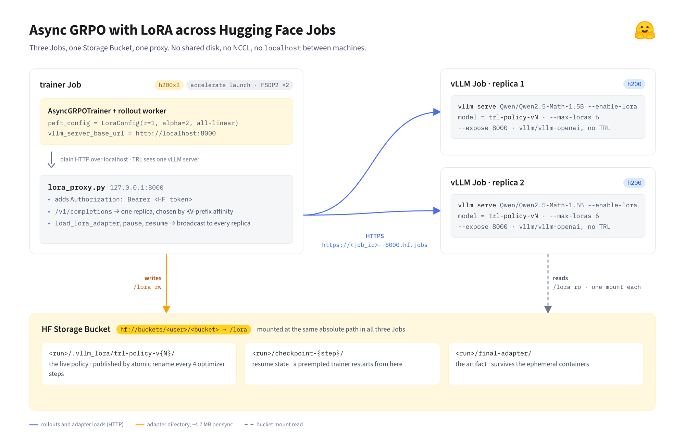
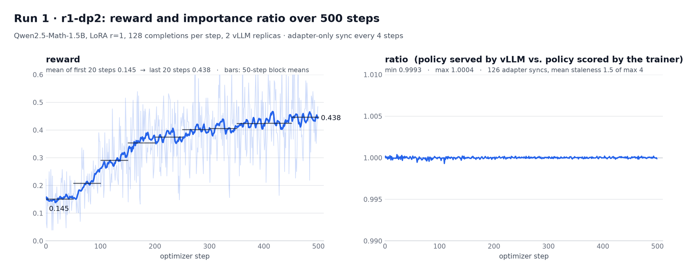
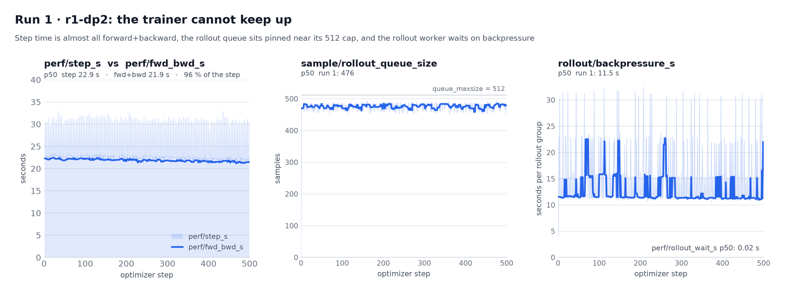
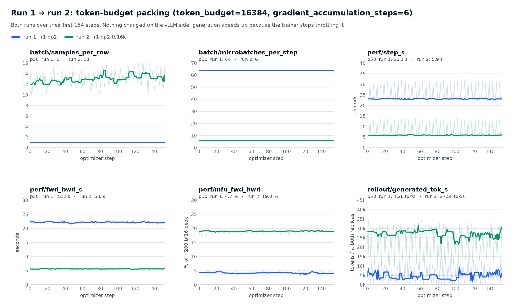
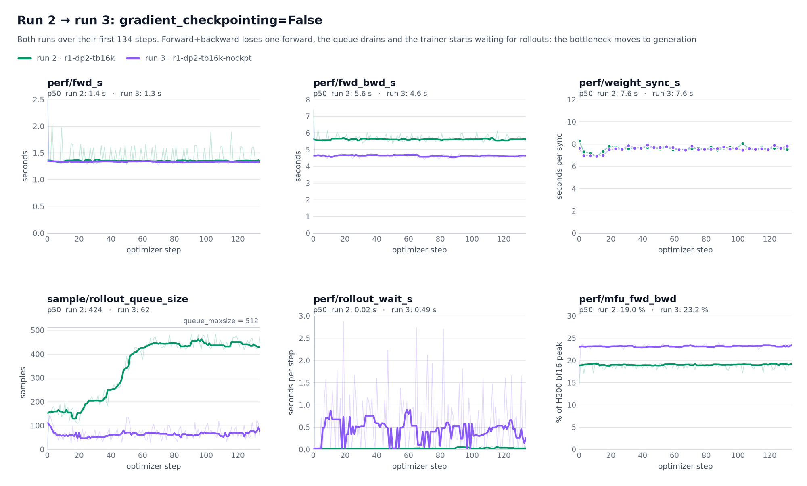
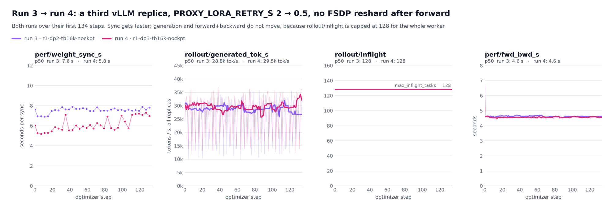
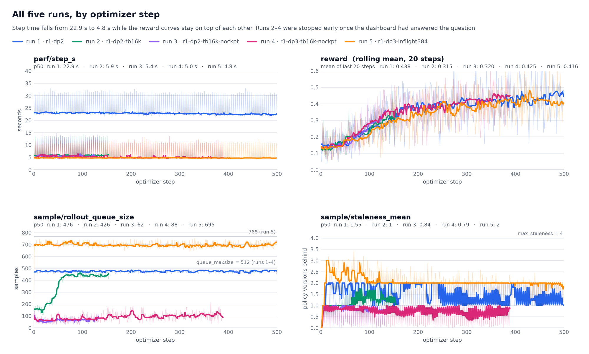
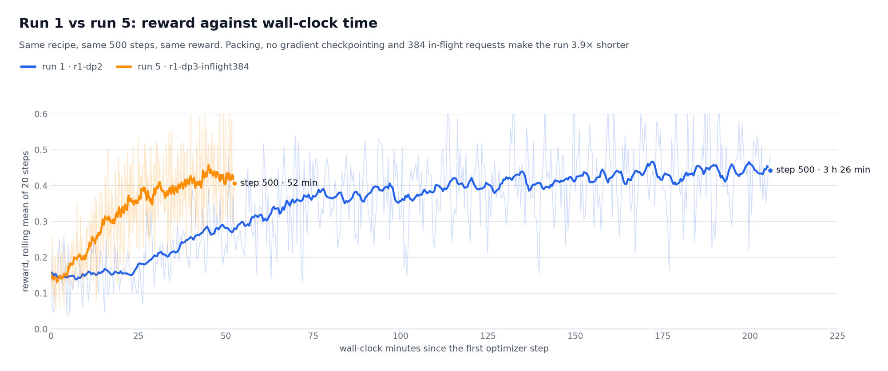

---
authors:
- aitoboxrobot
categories:
- arXiv论文
date: 2026-09-15
hide:
- navigation
tags:
- 强化学习
- GRPO
- LoRA
- Hugging Face
- vLLM
- 分布式训练
title: 基于 LoRA 与 HF Jobs 的异步 GRPO 训练：对象存储、代理与零 NCCL 实践
---
### 文章背景与核心概要

在大语言模型推理能力对齐与强化学习 (Reinforcement Learning, RL) 探索中，群体相对策略优化 (Group Relative Policy Optimization, GRPO) 已成为提升模型复杂推理能力的关键方法，但传统的分布式多节点训练往往严重依赖昂贵且配置繁琐的 NCCL 高速互联网络与跨节点共享文件系统。针对这一工程痛点，本文介绍了一种轻量优雅的分布式解耦训练方案：结合 TRL 库最新支持的 AsyncGRPOTrainer 与低秩适应 (Low-Rank Adaptation, LoRA) 技术，在相互网络隔离的 Hugging Face Jobs 容器环境中开展异步强化学习。利用仅数兆字节大小的 Rank-1 权重只需通过挂载的云端对象存储桶 (Storage Bucket) 进行同步，配合定制的反向代理服务器实现基于 KV 缓存前缀的智能路由与状态广播，彻底摆脱了复杂的跨节点 NCCL 通信依赖。通过进一步优化微批次打包、禁用梯度检查点并增大并发在飞请求上限，训练耗时从 3 小时 27 分钟大幅缩短至 53 分钟，获得了高达 3.9 倍的速度提升。

---

# 基于 LoRA 与 HF Jobs 的异步 GRPO 训练：对象存储、代理与零 NCCL 实践

> # Async GRPO with LoRA across HF Jobs: A Bucket, a Proxy, and No NCCL

## 核心概要

> ## Summary

本文探讨了如何借助 **AsyncGRPOTrainer** 与 **LoRA** (Low-Rank Adaptation) 低秩适应技术，在分布式 **Hugging Face Jobs** 之间运行异步强化学习 (Reinforcement Learning, RL) 训练，且全程无需依赖跨节点的共享网络文件系统或复杂的 NCCL 集群通信。

> This article explores how to run asynchronous Reinforcement Learning (RL) training via **AsyncGRPOTrainer** using **LoRA** (Low-Rank Adaptation) across distributed **Hugging Face Jobs** without relying on a shared network file system or NCCL. 

本文的核心亮点包括：
- **轻量级权重同步**：由于 Rank-1 的 LoRA 适配器仅有区区几兆字节大小，我们可以轻松通过各个独立 Job 间挂载的**对象存储桶 (Storage Bucket)** 进行文件同步，从而完全避开繁重的多节点网络直接通信。
- **代理路由与状态广播**：通过一个定制的代理服务器统一处理认证请求头，将生成采样任务 (Rollouts) 智能路由到匹配其 KV 缓存 (KV-cache) 前缀的副本节点，并将最新的适配器更新广播同步给所有副本。
- **显著的性能飞跃**：通过精细调优训练微批次 (Microbatches)、关闭梯度检查点 (Gradient Checkpointing) 并提高在飞请求 (In-flight) 上限，500 步的整体训练时间从 **3 小时 27 分钟锐减至 53 分钟**（取得了高达 3.9 倍的加速比）。

> Key highlights include:
> - **Lightweight Synchronization:** Because rank-1 LoRA adapters are only a few megabytes, they can easily sync via a **Storage Bucket** mounted across separate jobs, avoiding heavy multi-node communication.
> - **Proxy Routing & Broadcasting:** A custom proxy server handles authentication headers, routes rollouts to replicas matching their KV-cache prefix, and broadcasts adapter updates to all replicas.
> - **Performance Gains:** By tweaking training microbatches, disabling gradient checkpointing, and raising in-flight limits, training time for 500 steps drops from **3 hours 27 minutes down to 53 minutes** (a 3.9× speedup).

---

## 背景引言

> ## Introduction

随着 [PR #7017](https://github.com/huggingface/trl/pull/7017) 的合并（并在 TRL v1.14 版本中正式发布），TRL 库的 [`AsyncGRPOTrainer`](https://huggingface.co/docs/trl/en/async_grpo_trainer) 迎来了对 LoRA 的原生支持。现在的异步训练器可以只针对轻量级 LoRA 适配器展开训练，无需更新完整模型，并且仅需将适配器参数实时同步到 vLLM 推理引擎中。本文将详细介绍一个基于该特性搭建的真实工程项目，在该项目中，模型的训练与推理彻底解耦，不再共享同一台物理机。

> LoRA support recently landed in TRL's [`AsyncGRPOTrainer`](https://huggingface.co/docs/trl/en/async_grpo_trainer) with [PR #7017](https://github.com/huggingface/trl/pull/7017) (shipped in TRL v1.14). The asynchronous trainer can now train a LoRA adapter instead of the full model, syncing only the adapter to vLLM. This post covers a real-world project built on top of it, where training and inference no longer share a machine.

LoRA 训练在强化学习场景中表现出奇契合。正如 Thinking Machines 在其博文 [LoRA Without Regret](https://thinkingmachines.ai/blog/lora/) 中所揭示的，在基于策略梯度的强化学习中，哪怕仅使用 Rank 1 的 LoRA，其效果也能与全量微调 (Full Fine-Tuning) 旗鼓相当。背后的数学机理在于：每个回合中优势函数 (Advantage Function) 仅能提供大约 `~O(1)` 比特的信息增益，因此极低秩的 Rank-1 适配器便具备足够的容量去吸收并掌握这些信号。

> LoRA training is particularly suited for RL, as shown in Thinking Machines's blog [LoRA Without Regret](https://thinkingmachines.ai/blog/lora/). They demonstrate that LoRA can match full fine-tuning for policy-gradient RL, even with rank 1. This stems from the fact that the advantage function only gives `~O(1)` bits of information per episode, so a rank-1 adapter has enough capacity to absorb it.

从分布式系统工程的视角来看，一个 1.5B 参数量模型的 Rank-1 适配器文件仅有区区几兆字节，而完整模型权重则高达约 3 GB。我们无需在每次迭代后传输庞大的完整模型权重，仅需分发极小的适配器即可。此外，vLLM 支持同时在显存中保留多个 LoRA 适配器：旧的生成采样任务可以使用其启动时对应的旧策略从容执行完毕，而全新的采样任务则能无缝切换并使用最新的策略权重。

> From a systems perspective, a rank-1 adapter for a 1.5B model is a few megabytes, whereas the full model is ~3 GB. Instead of sending full weights after every update, we send just the adapter. Furthermore, vLLM can keep several adapters loaded at once: old rollouts finish with the policy they started with, while new rollouts use the latest one.

### 分布式训练面临的挑战

> ### The Challenge of Distributed Training

TRL 的 `AsyncGRPOTrainer` 将模型训练与样本生成解耦，使得两者能够在独立的计算节点上以不同的速率并行运转。然而，当我们尝试在 [Hugging Face Jobs](https://huggingface.co/docs/huggingface_hub/guides/jobs) 上落地这一架构时（在该平台上，每个 Job 都是运行在独立虚拟机内的单容器），意味着容器之间既没有共享本地磁盘，也无法通过本地网络 `localhost` 或预先配置好的多机通信库 NCCL 互通。

> TRL's `AsyncGRPOTrainer` separates training and generation so they can run on separate machines and speeds. However, doing this with [Hugging Face Jobs](https://huggingface.co/docs/huggingface_hub/guides/jobs)—where each Job is a single container on a single VM—means no shared local disk and no shared `localhost` or NCCL group across nodes. 

如果采用全量权重同步机制，这种无直接内网互联的环境根本无法扩展。但有了 LoRA 之后，每次需要同步的数据量变得极其轻量。HF Jobs 支持挂载由[对象存储桶 (Storage Buckets)](https://huggingface.co/docs/hub/storage-buckets) 支持的数据卷，通过 FUSE 文件系统挂载到每个 Job 的容器内。这样一来，它就扮演了跨节点共享文件系统的角色，甚至完全不需要在计算节点间建立直接的底层网络通道。

> With full-weight sync, this setup wouldn't scale. With LoRA, however, the sync data is tiny. HF Jobs provide volumes backed by [Storage Buckets](https://huggingface.co/docs/hub/storage-buckets) that can be mounted as a FUSE filesystem in every Job, serving as a shared filesystem across nodes with zero direct network path required.

我们的整体系统架构由以下几个核心部分组成：
1. 一个运行 `AsyncGRPOTrainer` 的**训练器 Job (Trainer Job)**，结合了 LoRA 与 FSDP (Fully Sharded Data Parallel) 技术。
2. **两个 vLLM 推理 Job (vLLM Jobs)**，各自对外提供基座模型及最新 LoRA 适配器的推理服务。
3. 一个统一挂载在所有三个 Job 中相同路径下的**对象存储桶 (Storage Bucket)**。
4. 一个轻量级的**反向代理服务器 (Proxy Server)**，负责将采样生成请求精准路由给 KV 缓存前缀匹配度最高的推理副本，并向所有推理副本广播最新的适配器加载指令。

> Our architecture consists of:
> 1. A **trainer Job** running `AsyncGRPOTrainer` with LoRA and FSDP.
> 2. **Two vLLM Jobs**, each serving the base model plus the latest adapter.
> 3. A **Storage Bucket** mounted in all three jobs at the same path.
> 4. A **proxy server** that routes rollouts to replicas matching their KV prefix and broadcasts adapter loads.

---

## 架构解析：深度融合 Hugging Face Jobs 与对象存储桶 🪣

> ## The Architecture: Leveraging Hugging Face Jobs and Storage Buckets 🪣

纯适配器的同步链路运行机制如下：每隔指定的优化器迭代步数，训练器就会将当前最新的 LoRA 适配器保存到 `<output_dir>/.vllm_lora/trl-policy-v{N}` 目录下，通过原子重命名操作完成安全发布，随后将其文件路径发送给 vLLM 的 `/v1/load_lora_adapter` 端点。vLLM 直接从本地挂载的磁盘读取这些文件，此后各生成采样工作节点便能指定请求 `model="trl-policy-v{N}"`。

> The adapter-only sync path works as follows: every few optimizer steps, the trainer saves the adapter under `<output_dir>/.vllm_lora/trl-policy-v{N}`, publishes it via an atomic rename, and sends its path to vLLM's `/v1/load_lora_adapter` endpoint. vLLM loads the files from disk, allowing rollout workers to request `model="trl-policy-v{N}"`.

通过借助 [`hf-mount`](https://github.com/huggingface/hf-mount) 工具，在每一个 Job 中将[对象存储桶 (Storage Bucket)](https://huggingface.co/docs/hub/storage-buckets) 作为数据卷挂载到完全相同的绝对路径下：

> By mounting a [Storage Bucket](https://huggingface.co/docs/hub/storage-buckets) as a volume using [`hf-mount`](https://github.com/huggingface/hf-mount) at the exact same path in every Job:

```sh
# every Job gets the same bucket at the same absolute path
hf jobs run ... -v hf://buckets/aminediroHF/asyncgrpo-lora-buckets:/lora ...
```

训练器直接将权重写入 `/lora/<run>/.vllm_lora/`，而各推理服务器则能从相同的本地路径直接读取，天然透明。

> The trainer writes to `/lora/<run>/.vllm_lora/` and servers read from the same path natively.

<figure class="image text-center">

<figcaption>图 1: 三个 Job 与存储桶协同架构。TRL 通过本地网络与代理交互，代理通过 HTTPS 与各副本通信，而适配器目录则直接通过挂载的存储桶流转。</figcaption>
</figure>

训练检查点 (Checkpoints) 以及最终训练产出的适配器也统一保存在该存储桶中，从而确保即便是使用低成本抢占式实例 (Spot Instances)，任务被中断打断后也能安全无缝地恢复状态继续执行。

> Checkpoints and the final adapter are also stored in the bucket, ensuring that ephemeral jobs can be safely preempted and resumed.

---

## 三大核心任务构建细节

> ## The Three Jobs

### vLLM 推理副本

> ### The vLLM Replicas

每个推理副本占用单张 GPU 并直接基于官方镜像 `vllm/vllm-openai` 运行，开启运行时动态加载 LoRA 权重功能，并预留充足的适配器显存槽位 (Adapter Slots)。

> Each replica uses a single GPU and the stock `vllm/vllm-openai` image, enabling runtime LoRA loading and reserving enough adapter slots.

所需要预留的适配器槽位数量取决于最大陈旧度参数 `max_staleness`。例如，当设置 `max_staleness=4` 时，当训练器推进到 `v7` 版本时，此前在 `trl-policy-v3` 策略下生成的样本仍可能正在用于训练计算。因此，vLLM 必须在显存中同时保留当前最新策略及其之前的 4 个历史版本，再加上热更新切换时所需预留的 1 个额外缓冲槽位，总共需要配置 `--max-loras 6`。

> The number of adapter slots depends on `max_staleness`. With `max_staleness=4`, a sample generated under `trl-policy-v3` is still used for training while the trainer is at `v7`. vLLM must serve the current policy plus the four before it, plus one extra slot during the swap, requiring `--max-loras 6`.

```sh
# --expose 8000                       reachable at https://<job_id>--8000.hf.jobs
# -v ...:/lora:ro                     read-only: the server only reads adapters
# VLLM_ALLOW_RUNTIME_LORA_UPDATING=1  enables /v1/load_lora_adapter
# VLLM_SERVER_DEV_MODE=1              enables /pause, /resume, /server_info (TRL needs all three)
# --max-loras 6                       max_staleness=4 -> 4+2 adapter slots
for replica in 1 2; do
hf jobs run --detach --flavor h200 --timeout 8h --secrets HF_TOKEN \
    --expose 8000 \
    -v "hf://buckets/${BUCKET}:/lora:ro" \
    -e VLLM_ALLOW_RUNTIME_LORA_UPDATING=1 \
    -e VLLM_SERVER_DEV_MODE=1 \
    -- vllm/vllm-openai:v0.27.1 \
    vllm serve Qwen/Qwen2.5-Math-1.5B --host 0.0.0.0 --port 8000 \
        --max-model-len 4096 --logprobs-mode processed_logprobs --generation-config vllm \
        --enable-lora --max-lora-rank 1 --max-loras 6
done
```

### 数据集选择：合理性验证集 (Sanity Set)

> ### The Dataset Choice: The Sanity Set

我们选用了来自论文《通过 FP16 消除训练与推理不匹配》(Defeating the Training-Inference Mismatch via FP16, Qi et al., 2025) 中的数据集 [`sail/Sanity-Test-R1D-1.5B`](https://huggingface.co/datasets/sail/Sanity-Test-R1D-1.5B)。该数据集收录了 1,460 道解题成功率在 20% 到 80% 之间的数学题目，能在 2 小时以内完整跑完一轮迭代，是进行快速验证测试的理想基准。

> We used [`sail/Sanity-Test-R1D-1.5B`](https://huggingface.co/datasets/sail/Sanity-Test-R1D-1.5B) from *Defeating the Training-Inference Mismatch via FP16* (Qi et al., 2025). Containing 1,460 math problems with success rates between 20% and 80%, it offers an ideal validation benchmark that can be cycled through in under two hours.

### 训练器 (Trainer)

> ### The Trainer

训练脚本配置并初始化了带有 LoRA 设置的 `AsyncGRPOTrainer`：

> The trainer script initializes `AsyncGRPOTrainer` with LoRA configuration:

```python
from peft import LoraConfig
from trl.experimental.async_grpo import AsyncGRPOConfig, AsyncGRPOTrainer

config = AsyncGRPOConfig(
    output_dir="/lora/sanity-lora-r1",       # on the bucket: adapters, checkpoints and the final adapter all land here
    vllm_server_base_url="http://localhost:8000",   # the proxy, not a vLLM Job; TRL never sees the Jobs URLs
    max_staleness=4,
    weight_sync_steps=4,                     # publish an adapter every 4 optimizer steps
    save_strategy="steps", save_steps=50,    # checkpoints go to the same bucket -> resume after preemption
    ...
)
trainer = AsyncGRPOTrainer(
    model="Qwen/Qwen2.5-Math-1.5B",
    args=config,
    peft_config=LoraConfig(r=1, lora_alpha=2, target_modules="all-linear"),  # plain LoRA vLLM can serve as-is
    ...
)
```

---

## 代理服务器 (Proxy)

> ## The Proxy

在训练器与各 vLLM 推理 Job 之间引入代理服务器是基于以下两点刚性诉求：
1. HF Jobs 暴露的对外服务端口需要附带 `Authorization: Bearer <HF token>` 身份验证头。
2. 我们希望实现多 GPU 并行生成采样，同时避免触发 vLLM 内部复杂的数据并行 (Data Parallel) 约束。

> A proxy between the trainer and the vLLM Jobs is required because:
> 1. Exposed Job ports require an `Authorization: Bearer <HF token>` header.
> 2. We want multi-GPU generation without triggering vLLM's internal data-parallel constraints.

该代理直接运行在训练器 Job 本地的 `127.0.0.1:8000`。它的核心职责包括：
- 将每个采样生成请求智能路由到最可能命中并持有其 KV 缓存的副本节点上。
- 将改变状态的操作指令（如适配器加载、暂停推理、恢复推理）广播分发到所有推理副本。

> The proxy runs locally at `127.0.0.1:8000` on the trainer Job. It:
> - Routes each rollout request to the replica most likely to hold its KV cache.
> - Broadcasts state-changing requests (adapter loads, pause, resume) to all replicas.

### 基于 KV 前缀的采样请求路由

> ### Routing Rollouts by KV Prefix

路由器通过以适配器名称为种子构建 16 个 Token 的分块哈希链。在评估采样请求时，它会比对匹配的前缀长度，兼顾通用的系统提示词 (System Prompt) 与模板，将请求分派给命中率最高的最优副本（若目标副本当前过载，则会自动溢出分流到当前负载最低的副本）。

> The router chains 16-token block hashes seeded with the adapter name. When evaluating requests, it compares matching prefix lengths, accounts for common system prompts/templates, and assigns the request to the best-suited replica (or spills it to the least-loaded one if the target replica is overwhelmed).

```python
async def load_one(u):
    while True:
        status, _, out = await send(u, "POST", "/v1/load_lora_adapter", headers, body)
        if status == 200 or "No adapter found" not in out.decode() or time.monotonic() > deadline:
            return u, status, out
        await asyncio.sleep(cfg.lora_retry_s)          # this replica's mount has not seen the directory yet

results = await asyncio.gather(*(load_one(u) for u in ups))
if any(st != 200 for _, st, _ in results):
    await asyncio.gather(*(send(u, "POST", "/v1/unload_lora_adapter", headers, unload) for u, st, _ in results if st == 200))
    return web.Response(status=504 if timed_out else st, text="rolled back on the others")
```

---

## 全流程运行实验结果

> ## Full Run Results

### 权重同步效率

> ### Weight Sync

- **完整同步耗时**：中位数 (p50) 仅为 8.5 秒
- **适配器保存至存储桶**：1.1 秒
- **推理副本加载适配器**：约 7 秒
- **同步成功率**：在累计 252 次适配器加载中达成 100% 成功率

> - **Whole sync time:** 8.5 s (p50)
> - **Adapter save to bucket:** 1.1 s
> - **Replica adapter acceptance:** ~7 s
> - **Success rate:** 100% across 252 adapter loads.

### 路由命中表现

> ### Routing Performance

- **亲和性命中率 (Affinity Hits)**：84.5%
- **过载分流率 (Spills)**：1.3%
- **未命中/冷启动 (Cold)**：14.2%

> - **Affinity Hits:** 84.5%
> - **Spills:** 1.3%
> - **Unmatched (Cold):** 14.2%

### 奖励演进趋势

> ### Reward Progression

平均奖励得分 (Mean Reward) 从前 20 步的 **0.145** 稳步攀升至最后 20 步的 **0.438**。在全部 126 次权重同步过程中，策略比率 (Policy Ratio) 始终稳定保持在 `0.9993` 到 `1.0004` 这一极小波动范围内。

> Mean reward climbed from **0.145** over the first 20 steps to **0.438** over the last 20 steps. The policy ratio remained stable between `0.9993` and `1.0004` throughout all 126 syncs.

---

## 追寻“乒乓瓶颈”：全链路渐进式调优

> ## Chasing the Bottleneck Ping-Pong

通过深入分析 `perf/rollout_wait_s`（生成等待耗时）、`rollout/backpressure_s`（生成背压耗时）以及队列占用率等系统指标，我们在 5 次循序渐进的实验迭代中逐步完成了流水线调优：

> By analyzing metrics like `perf/rollout_wait_s`, `rollout/backpressure_s`, and queue occupancy, we optimized our pipeline across 5 progressive runs:

| 指标 / 参数 | Run 1 (`r1-dp2`) | Run 5 (`r1-dp3-inflight384`) |
| :--- | :--- | :--- |
| **挂钟总时间 (500 步)** | 3 小时 27 分钟 | **53 分钟** |
| **单步耗时 (`perf/step_s`)** | 22.9 秒 | 4.8 秒 |
| **训练器 MFU (`perf/mfu_fwd_bwd`)** | 3.9% | 23.5% |
| **每步样本量 (Samples per Step)** | 128 | 168 |
| **奖励演进区间** | 0.145 → 0.438 | 0.145 → 0.416 |

> | Metric / Parameter | Run 1 (`r1-dp2`) | Run 5 (`r1-dp3-inflight384`) |
> | :--- | :--- | :--- |
> | **Wall Clock (500 steps)** | 3 h 27 min | **53 min** |
> | **Step Time (`perf/step_s`)** | 22.9 s | 4.8 s |
> | **Trainer MFU (`perf/mfu_fwd_bwd`)** | 3.9% | 23.5% |
> | **Samples per Step** | 128 | 168 |
> | **Reward Progression** | 0.145 → 0.438 | 0.145 → 0.416 |

<a href="./images/50228716b8f0.png" rel="nofollow"></a>
*图 1: trackio 运行记录 `r1-dp2`。在 500 个迭代步中，奖励从 0.15 攀升至 0.44；`ratio` 稳定保持在 0.9993 到 1.0004 之间。*

> *Figure 1. trackio run `r1-dp2`. Reward climbs from 0.15 to 0.44 over 500 steps; `ratio` stays between 0.9993 and 1.0004.*

<a href="./images/3d5f9979a75b.png" rel="nofollow"></a>
*图 2: trackio 运行记录 `r1-dp2`。系统受限于训练端瓶颈。*

> *Figure 2. trackio run `r1-dp2`. Trainer-bound bottleneck.*

<a href="./images/9025aa1c88d8.png" rel="nofollow"></a>
*图 3: 打包微批次以提高模型浮点利用率 (MFU) 与整体吞吐量。*

> *Figure 3. Packing microbatches improves MFU and throughput.*

<a href="./images/f9a64a9e394b.png" rel="nofollow"></a>
*图 4: 关闭梯度检查点后，性能瓶颈转移至样本生成阶段。*

> *Figure 4. Disabling gradient checkpointing shifts the bottleneck to generation.*

<a href="./images/30e787f2c702.png" rel="nofollow"></a>
*图 5: 增加第三个推理副本。*

> *Figure 5. Adding a third replica.*

<a href="./images/55bb339665f0.png" rel="nofollow"></a>
*图 6: 全部五次 trackio 运行记录曲线重叠对比。*

> *Figure 6. All five trackio runs overlaid.*

<a href="./images/1a71391852b3.png" rel="nofollow"></a>
*图 7: 对应实际挂钟时间的奖励演进曲线。Run 5 仅耗费 52 分钟即可达到目标，而 Run 1 则耗时 3 小时 26 分钟。*

> *Figure 7. Reward against wall-clock minutes. Run 5 reaches the goal in 52 minutes instead of 3h 26m.*

---

## 动手实践

> ## Try It

```sh
git clone https://github.com/AmineDiro/hfjobs-lora-buckets && cd hfjobs-lora-buckets
hf auth login
MAX_STEPS=20 RUN_TAG=smoke ./run_all.sh --wait        # ~15 min, three Jobs, cancels the servers when done
MAX_STEPS=500 ./run_all.sh --wait                     # run 1: the reference batch shape, ~3.5 h
TOKEN_BUDGET=16384 GRAD_ACCUM=6 GRADIENT_CHECKPOINTING=0 PROXY_LORA_RETRY_S=0.5 \
  MAX_INFLIGHT=384 QUEUE_MAXSIZE=768 MAX_STEPS=500 ./run_all.sh --wait   # run 5: same recipe, ~55 min
```

---

## 参考文献

> ## References

- John Schulman 等人，[LoRA Without Regret](https://thinkingmachines.ai/blog/lora/)，Thinking Machines Lab，2025年9月。
- TRL，[`AsyncGRPOTrainer`](https://huggingface.co/docs/trl/en/async_grpo_trainer) 官方技术文档。
- TRL [PR #7017](https://github.com/huggingface/trl/pull/7017)：`AsyncGRPOTrainer` 对 PEFT/LoRA 的支持。
- Hugging Face [Jobs](https://huggingface.co/docs/huggingface_hub/guides/jobs) 与 [Storage Buckets](https://huggingface.co/docs/hub/storage-buckets)。
- Penghui Qi 等人，[Defeating the Training-Inference Mismatch via FP16](https://huggingface.co/papers/2510.26788)，arXiv:2510.26788，2025年。

> - John Schulman et al., [LoRA Without Regret](https://thinkingmachines.ai/blog/lora/), Thinking Machines Lab, September 2025.
> - TRL, [`AsyncGRPOTrainer`](https://huggingface.co/docs/trl/en/async_grpo_trainer) documentation.
> - TRL [PR #7017](https://github.com/huggingface/trl/pull/7017): PEFT/LoRA support for `AsyncGRPOTrainer`.
> - Hugging Face [Jobs](https://huggingface.co/docs/huggingface_hub/guides/jobs) and [Storage Buckets](https://huggingface.co/docs/hub/storage-buckets).
> - Penghui Qi et al., [Defeating the Training-Inference Mismatch via FP16](https://huggingface.co/papers/2510.26788), arXiv:2510.26788, 2025.

```bibtex
@article{qi2025precisionrl,
  title={Defeating the Training-Inference Mismatch via FP16},
  author={Qi, Penghui and Liu, Zichen and Zhou, Xiangxin and Pang, Tianyu and Du, Chao and Lee, Wee Sun and Lin, Min},
  journal={arXiv preprint arXiv:2510.26788},
  year={2025}
}
```
