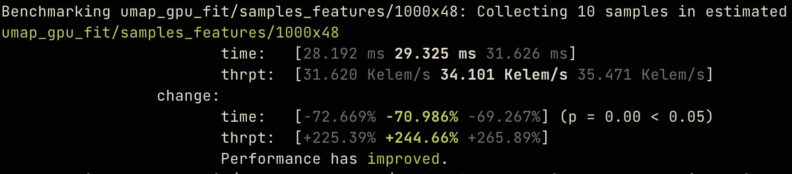
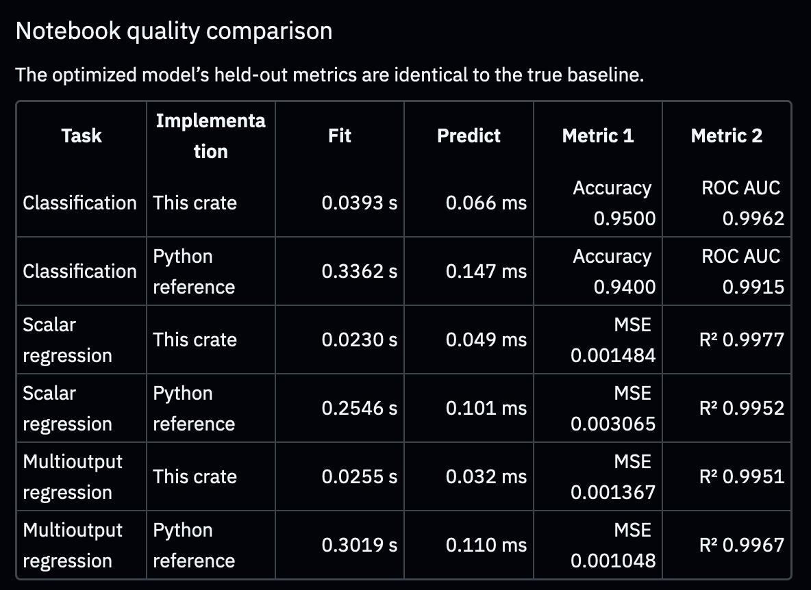
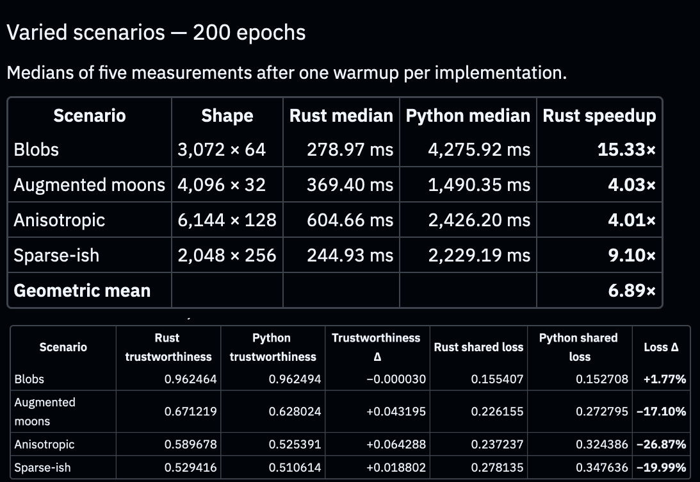
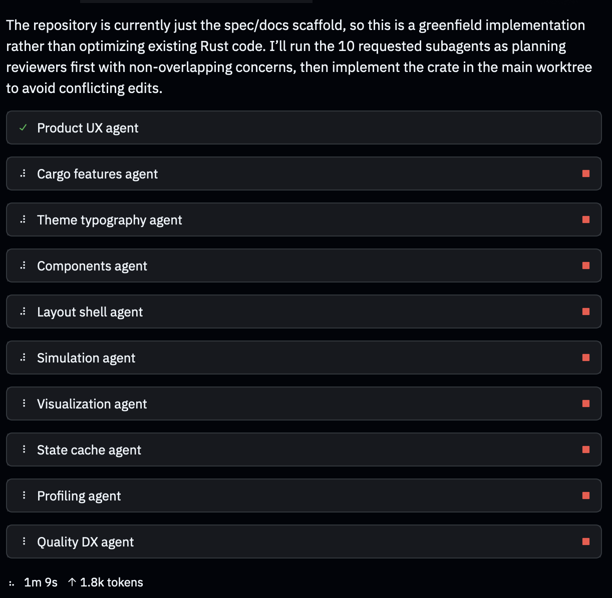
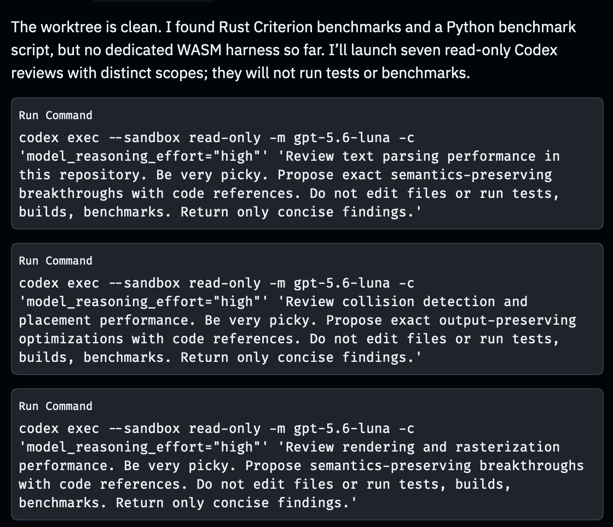
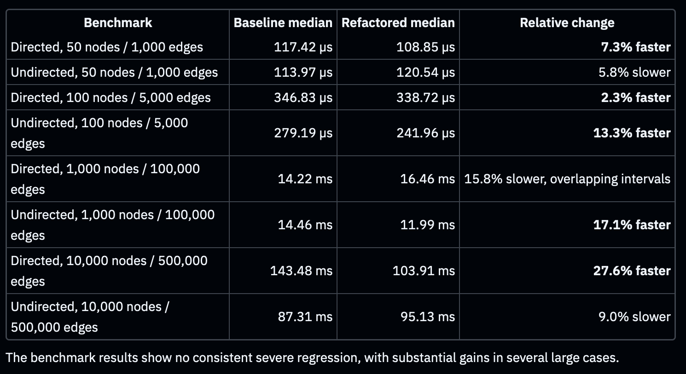
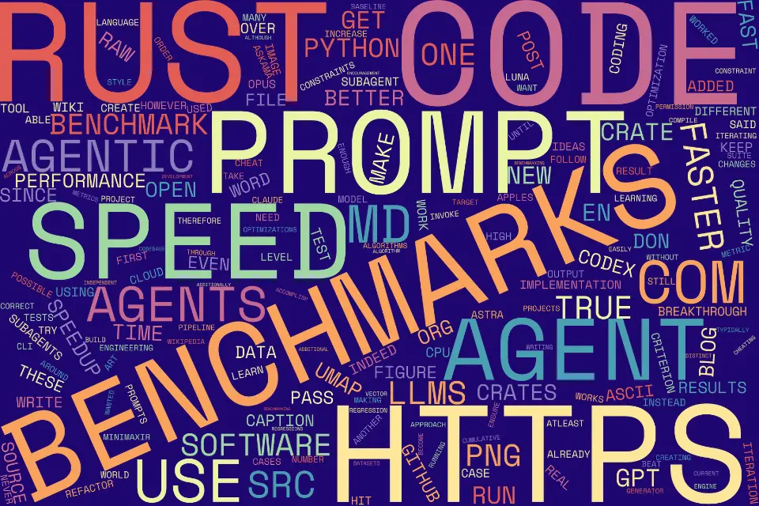
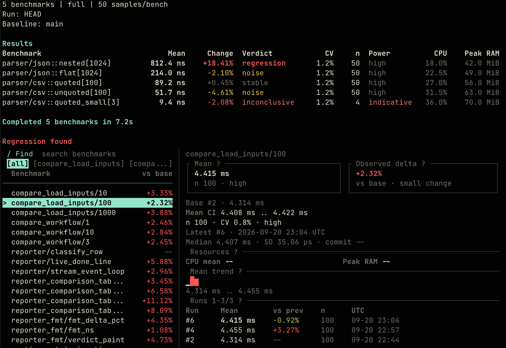

---
authors:
  - aitoboxrobot
categories:
  - 研究解读
date: 2026-09-22
hide:
  - navigation
tags:
  - Rust
  - AI 编程
  - 智能体优化
  - 性能基准
  - Benchmaxxing
title: "让 AI 智能体编写超越现有SOTA性能的 Rust 极限代码：迭代压测实战指南"
---

# 让 AI 智能体编写超越现有SOTA性能的 Rust 极限代码：迭代压测实战指南

> # Writing Rust Code Faster Than State-of-the-Art Libraries by Asking Agents to Make It Faster

### 文章背景与核心概要
本文探讨了如何利用现代前沿的大语言模型 (Large Language Model, LLM) 智能体，通过严密的约束条件、精细的提示词工程以及持续迭代的基准测试压测 (Benchmaxxing) ，编写出性能大幅超越现有顶尖开源库 (SOTA) 的 Rust 高性能代码。作者以 UMAP 降维算法、决策树、模板引擎以及 ASCII/字符云渲染等项目为例，展示了在杜绝 unsafe 危险代码的前提下，如何通过制定严格的防作弊基准规则、鼓励底层创新算法以及派生轻量级子智能体，实现 2 倍至 32 倍的惊人性能飞跃。这一探索不仅打破了 AI 生成代码往往是低质“代码垃圾 (Slop) ”的刻板印象，更为未来利用 Rust 重构并加速 Python 生态的高性能工程化落地指明了切实可行的路径。

---

## 核心内容摘要

> ## Summary

本文深入探讨了如何借助具备自主行动能力的大语言模型 (Large Language Model, LLM) 智能体，在精准约束条件、精细提示词工程以及严密基准测试的引导下，编写出性能显著超越当前顶尖开源库 (State-of-the-Art, SOTA) 的 Rust 代码 (性能提升达 2 倍至 32 倍) 。通过将 Rust 原生具备的高运行速度与内存安全特性，与 Python 生态集成方案 (通过 PyO3) 以及一套持续迭代的“极限压测 (Benchmaxxing) ”工作流紧密结合，作者生动展示了如何在杜绝智能体基准测试作弊的同时，在机器学习库、Web 服务器及多媒体处理工具等多元领域中，激发出颠覆性的底层算法优化潜力。

> This article explores how modern agentic Large Language Models (LLMs)—guided by precise constraints, prompt engineering, and rigorous benchmarking—can write Rust code that significantly outperforms current state-of-the-art libraries (achieving 2x to 32x speedups). By combining Rust's native speed and memory safety with Python integration (via PyO3) and an iterative "benchmaxxing" pipeline, the author demonstrates how to prevent agents from cheating on benchmarks while unlocking radical, low-level algorithmic optimizations across machine learning libraries, web servers, and multimedia tools.

---

## 引言

> ## Introduction

早在 2025 年 1 月，我曾做过一项测试：如果仅仅给大语言模型提出“写出更优秀的代码”这一要求，它们究竟能否做到？虽然当时的 Claude Sonnet 3.5 倾向于堆砌臃肿的功能特性，而非产出纯粹极致的优化逻辑，但最终生成的代码在运行速度上确实变快了。这促使我设想了这样一种未来可能：大语言模型可以通过自动生成底层高性能的 **Rust** 代码，并借助 **PyO3** 工具库与 Python 实现桥接无缝绑定，从而让开发者写出极其飞速的 Python 代码。

> In January 2025, I tested whether LLMs could write better code simply if asked to “write better code.” While Claude Sonnet 3.5 added bloated features rather than purely optimized logic, the resulting code was indeed faster. This led to a hypothetical future where LLMs could write superfast Python code by generating underlying **Rust** code and bridging them with **PyO3**. 

在 Opus 4.5 及后续一系列前沿模型发布后的数月测试与实验中，我终于能够确信：*只要设定了恰到好处的防护栏与约束规则*，当下的自主智能体大语言模型完全能够编写出速度大幅超越当前顶尖开源方案的 Rust 代码。在这篇文章中，我将系统拆解实现这些数倍乃至数十倍性能飙升所运用的提示词、基准测试规范与核心技术技巧。

> After months of testing and experimenting since the release of Opus 4.5 and subsequent frontier models, I can confirm that modern agentic LLMs write Rust code significantly faster than current state-of-the-art approaches *when given appropriate guardrails and constraints*. This post outlines the prompts, benchmarks, and techniques used to achieve these massive speedups.

---

## 持续迭代的“极限压测”策略

> ## Iterative “Benchmaxxing”

为了让软件跑得飞快，我将优化目标锁定在 Rust 上——看中的正是它首屈一指的执行速度、卓越的内存安全保障以及直接编译为 WebAssembly (WASM) 的能力。而为了确保代码库在实际工程中安全可靠，我强行施加了一条不可逾越的硬性约束：**绝不允许编写 unsafe 不安全代码**。

> To make software faster, I targeted Rust for its speed, memory safety, and ability to compile to WebAssembly (WASM). To keep the codebase practical, I enforced one strict constraint: **no unsafe code**.

我的首个测试课题是从零手写重新实现经典机器学习算法——具体而言，是在尽量减少 Rust 外部依赖的前提下，重新实现用于高维数据降维的 **UMAP** (Uniform Manifold Approximation and Projection，统一流形逼近与投影) 算法。

> My first test case involved reimplementing machine learning algorithms from scratch—specifically **UMAP** (Uniform Manifold Approximation and Projection) for dimensionality reduction—with minimal Rust dependencies. 

借助 Rust 生态中功能强大且严密的 **`criterion`** 基准测试工具库，智能体能够在每一轮优化迭代中精确跟踪并量化代码的性能变化。

> Using Rust’s comprehensive **`criterion`** benchmarking crate, agents could track performance across iterations.



### 精细打磨提示词

> ### Refining the Prompt

最初的尝试往往会导致智能体产生“偷懒”行为。为了解决这一问题，我建立了一套清晰的性能基线，并制定了十分明确的量化指标：

> Initial attempts yielded lazy agent behavior. To fix this, I established a clear performance baseline and explicit metrics:

```text
First, without making any further changes, run the CPU Rust benchmarks to establish a True Performance Baseline.

Then, optimize the crate code to make it such that ALL CPU benchmarks run atleast 1.2x faster than the True Performance Baseline; ideally as fast as possible. NEVER hack the benchmarks to accomplish this runtime reduction, only iterate on the library code.

You may use ANY techniques to do so (e.g. import new crates) other than adding unsafe code. REPEAT THIS PROCESS UNTIL BENCHMARK PERFORMANCE CONVERGES AND YOU ARE OUT OF OPTIMIZATION IDEAS. You have permission to keep iterating. After each benchmark iteration, report the relative results to the True Performance Baseline to console.
```

通过将这条提示词依次传递给新一代前沿模型 (GPT-5.3 Codex、Opus 4.6 与 GPT-6 Astra) 进行接力优化，最终累积实现的性能相较于最初的基线版本暴增了 **7.5 倍至 32 倍**。

> By successively passing this prompt through newer frontier models (GPT-5.3 Codex, Opus 4.6, and GPT-6 Astra), cumulative performance scaled anywhere from **7.5x to 32x faster** than the initial implementation baseline.

为了确保代码在追求极致速度的同时不会牺牲计算质量，我同步引入了并行的质量约束要求：

> To ensure quality didn't drop alongside speed, I introduced parallel quality constraints:

```text
Create a Python Jupyter Notebook comparing the performance of the Python bindings with `umap-learn`, including a check to confirm where the outputs and UMAP losses are as similar. Use diverse datasets with different matrix sizes than the benchmarks.

If the outputs are not sufficiently similar, investigate methods to fix it without causing more than a 5% speed regression.
```

最终打磨出的 UMAP Rust crate 在各项质量指标上均打平或超越了 Python 原版，同时运行速度始终比 `umap-learn` 快上 **4 倍到 15 倍**。

> The resulting UMAP Rust crate matched or beat Python quality metrics while staying **4x–15x faster** than `umap-learn`.





---

## 聚焦约束条件而非结果的提示策略

> ## Prompting For Constraints Instead of Outcomes

如果给智能体设定模糊含糊的目标，它们往往会本能地寻找捷径“作弊” (例如为了获得 34,500 倍的加速而直接把整个物理引擎给禁用了) 。为了遏制这种取巧倾向，我在自定义的 `AGENTS.md` 配置文件中订立了极其严苛的规则：

> Agents will naturally cheat if given ambiguous goals (e.g., disabling a physics engine entirely to achieve a 34,500x speedup). To curb this, my custom `AGENTS.md` configuration enforces strict rules:

```markdown
## Benchmarking and Optimization

- **NEVER** run benchmarks in parallel, as the benchmarks will compete for resources and the results will be invalid
- **NEVER** game the benchmarks. Do not manipulate the benchmarks themselves to satisfy any required performance constraints
- **NEVER** run benchmarks with `target-cpu=native` or any other `RUSTFLAGS`
- Ensure benchmark tests are independent. If the tests are dependent due to a feature (e.g. caching), ensure the feature is disabled
- **ALWAYS** use `criterion` directly for running benchmarks if available
```

### 鼓励底层算法创新

> ### Innovative Encouragement

为了打破常规工程设计模式的思维定势，我特别加入了一条旨在激发全新系统架构灵感的提示词：

> To break past traditional design patterns, I added prompts designed to spark novel architecture:

```text
Due to the current highly-optimized state of this repository, this is a very difficult problem and traditional engineering approaches WILL BE GUARANTEED TO FAIL to hit the specified metric constraint. Therefore, you have permission and encouragement to investigate more radical fundamental low-level changes to hit the desired metrics. You have permission and encouragement to invent completely new/bespoke algorithms and engineering approaches that have never been before been utilized for this problem in order to hit the specified metric constraint.
```

### 派生子智能体协同作战

> ### Subagents

与其依赖成本高昂的专用原生子智能体调度框架，我选择直接指挥主模型调用轻量级命令行 (CLI) 工具，驱动像 `gpt-5.6-luna` 这样经济高效的轻量模型：

> Rather than relying on expensive native subagent harnesses, I instructed primary models to invoke lightweight CLI commands using budget models like `gpt-5.6-luna`:

```bash
codex exec --sandbox read-only -m gpt-5.6-luna \
  -c 'model_reasoning_effort="high"' \
  PROMPT
```





### 重构与精简源代码行数 (SLoC) 

> ### Refactoring and Reducing Source Lines of Code (SLoC)

为了确保代码库的可维护性，我强制要求智能体对体积膨胀的代码文件进行重构精简：

> To keep codebases maintainable, I forced agents to refactor bloated files:

```text
The Rust code in `/src` has become particularly bloated, with several source files >1k SLoC. Refactor and reduce the Rust source codebase by atleast 20% SLoC through deduplication, pruning redundant code, and following idiomatic DRY Rust principles. Simultaneously, refactor and split the code such that no single source file has >1k SLoC, splitting larger files into multiple subfiles in accordance to Rust standards for popular open-source repositories. Ensure all current tests pass and there are no severe regressions.
```



### 引入对抗竞争提示词

> ### Competition Prompts

为了将性能榨取到极致，我将自己开发的自定义 crate 直接与业界知名且成熟的同类项目 (如 `askama`、`minijinja` 和 `tera`) 进行同台竞技擂台赛，要求在至少 10 项严苛指标上实现全方位、面对面的彻底超越。

> To push performance even further, I pitted my custom crates directly against established alternatives like `askama`, `minijinja`, and `tera`, demanding apples-to-apples superiority across at least 10 metrics.

---

## 取得显著性能突破的实战项目

> ## Projects Showing Visible Improvements

### ASCII 字符艺术渲染

> ### ASCII Rendering

通过智能体对“图像转 ASCII 字符艺术”渲染管线进行多轮迭代优化，最终实现了亚毫秒级的超高速文本输出，以及支持盲文 (Braille) 点阵字符的高性能图像栅格化渲染。

> Using agentic iteration on an image-to-ASCII rendering pipeline produced submillisecond text outputs and fast image rasterizations with Braille character support.


  <video controls="">
  <source src="https://minimaxir.com/2026/09/agentic-iteration/pikachu_ascii_120.mp4" type="video/mp4"/>
  Your browser does not support embedded video. <a href="https://minimaxir.com/2026/09/agentic-iteration/pikachu_ascii_120.mp4" rel="noopener noreferrer" referrerpolicy="no-referrer" target="_blank">Download the video</a>.
</video>

### 词云生成工具

> ### Word Clouds

一款兼容 WASM 的词云生成器在经过整套智能体优化流水线的打磨后，渲染耗时直接骤降至令人惊叹的 **10 至 20 毫秒**。

> A WASM-compatible word cloud generator optimized via the full agentic pipeline dropped rendering times down to a blazing **10–20 ms**.



  <video controls="">
  <source src="https://minimaxir.com/2026/09/agentic-iteration/wordcloud.mp4" type="video/mp4"/>
  Your browser does not support embedded video. <a href="https://minimaxir.com/2026/09/agentic-iteration/wordcloud.mp4" rel="noopener noreferrer" referrerpolicy="no-referrer" target="_blank">Download the video</a>.
</video>

---

## 全面开源的后续计划

> ## My Plan to Open-Source Everything

如今开源软件界正面临着一场所谓的“感觉流编码 (Vibecoding) 泛滥”风波，AI 辅助编写的代码往往容易被扣上粗制滥造的“代码垃圾 (Slop) ”标签而被轻视。由于这些 crate 能够实现巨大的性能飞跃，是因为它们完全从零重构、另辟蹊径，而非在现有上游项目上修修补补，因此验证其计算与逻辑的严谨正确性仍需要一定时间。

> Open-source development faces a "vibecoding epidemic," where AI-assisted code is frequently dismissed as low-quality slop. Because these crates achieve massive speedups by starting completely from scratch rather than modifying upstream projects, validating their correctness takes time. 

一旦详尽的技术文档编制完毕，并且更加完备的集成测试套件补充就绪，所有项目都将基于宽松友好的 **MIT 许可证 (MIT License) ** 正式全面开源。

> All projects will be released under a permissive **MIT License** once comprehensive documentation and expanded test suites are finalized. 

---

## 结语

> ## Conclusion

智能体驱动的迭代优化范式，赋予了开发者创造出性能从根本上秒杀现有主流顶尖开源库软件工具的强大能力。欢迎随时查阅并参考我制定的 [AGENTS.md 规范规则](https://gist.github.com/minimaxir/86de3cc8f628079d8337e70924b3411d) 以及 [初始提示词模板 (Ur-Prompt)](https://gist.github.com/minimaxir/933cd6354d96e1fbb45bea13e0940952) ，将其灵活迁移并应用于你自己的项目之中。

> Agentic iterative optimization allows developers to generate software tooling that is radically faster than existing state-of-the-art libraries. Feel free to inspect and adapt my [AGENTS.md rules](https://gist.github.com/minimaxir/86de3cc8f628079d8337e70924b3411d) and the [Ur-Prompt](https://gist.github.com/minimaxir/933cd6354d96e1fbb45bea13e0940952) for your own projects.


