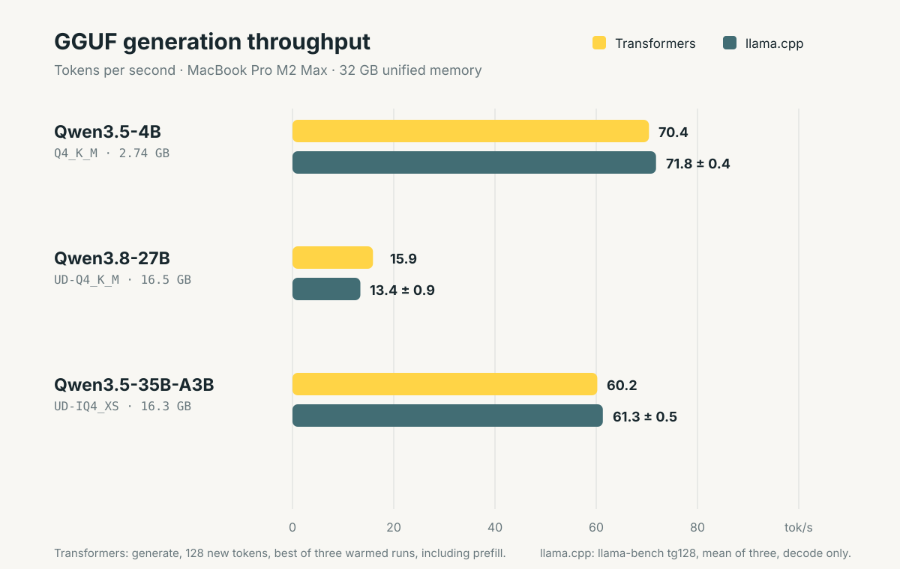
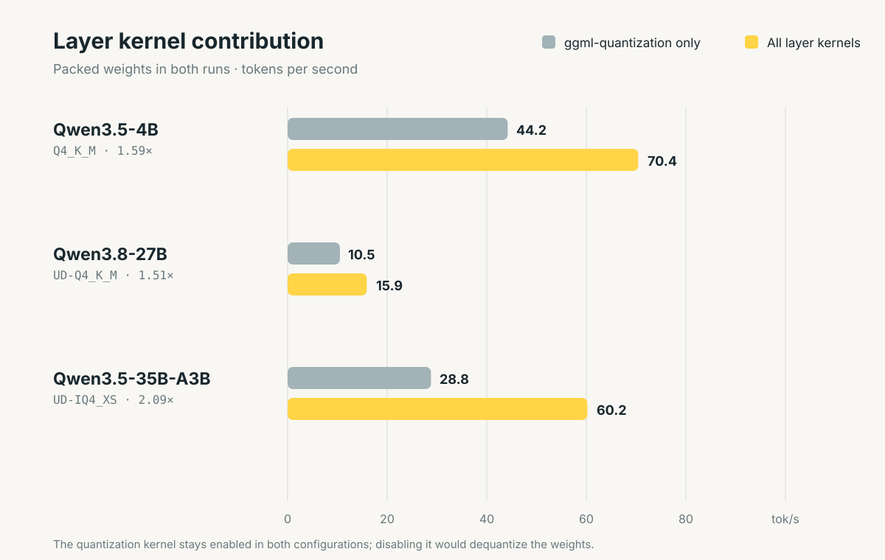
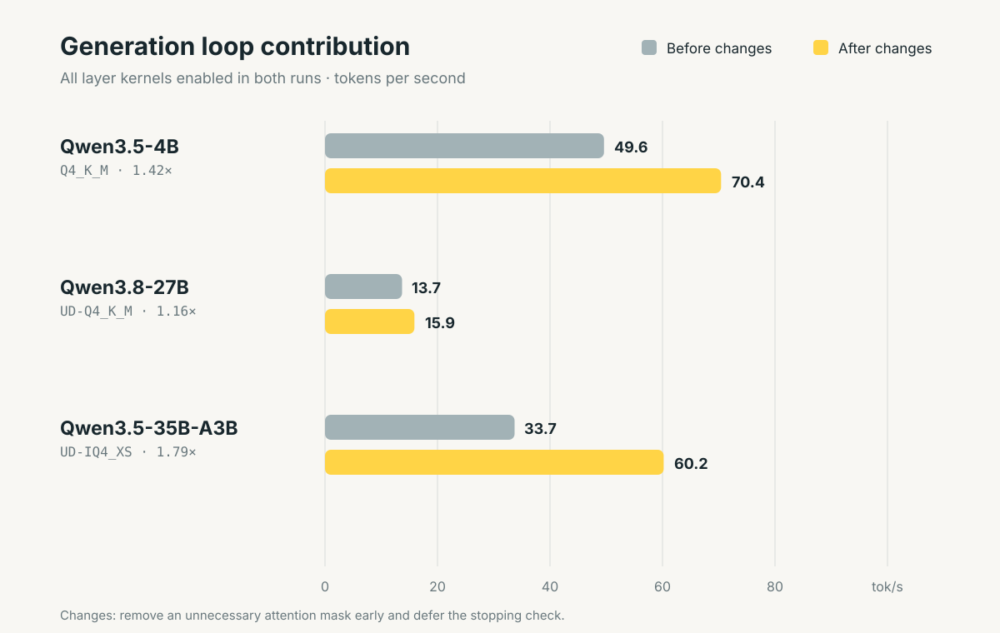

---
authors:
  - aitoboxrobot
categories:
  - 工具教程
date: 2026-09-23
hide:
  - navigation
tags:
  - Hugging Face
  - Transformers
  - llama.cpp
  - GGUF
  - 量化模型
  - 本地推理
  - Metal
title: "Transformers 原生支持运行 llama.cpp (GGUF) 量化模型：Apple Silicon 性能逼近原生"
---

# Transformers 原生支持运行 llama.cpp (GGUF) 量化模型：Apple Silicon 性能逼近原生

> # Transformers Now Runs llama.cpp Quants

### 文章背景与核心概要
长期以来，以 llama.cpp 为代表的轻量化 C/C++ 运行时凭借紧凑的 GGUF 量化格式和极高的端侧执行效率，成为了开发者在个人电脑 (尤其是 Apple Silicon Mac) 上运行大语言模型 (Large Language Model, LLM) 的首选方案；而 Hugging Face 的 Transformers 虽是学术研究、微调实验与模型定义的事实标准，但在本地量化推理方面却因 Python 运行开销和缺乏专属低比特算子支持而略显吃力。为了打破两大主流生态之间的壁垒，Transformers 官方宣布通过接入高性能算子库原生支持 GGUF 格式。该方案直接复用了针对 Apple Silicon Metal 优化的 ggml 底层计算内核，并对 Python 生成循环中的同步瓶颈进行了深度重构与优化。基准测试表明，Transformers 在运行 Qwen3.5 等前沿模型时吞吐量已极其逼近原生 llama.cpp。这一突破让开发者既能保留 PyTorch 和 Transformers 灵活易用的开发生态 (如直接挂载钩子、动态调试与全流程评估) ，又能零性能损耗地畅享轻量级 GGUF 带来的端侧推理红利。

---

**核心摘要**：Hugging Face 旗下的 `transformers` 库现已原生支持在本地高效运行 `llama.cpp` (GGUF) 量化模型。通过复用底层的 `ggml` 算子内核 (首发通过 Metal 针对 Apple Silicon 进行深度优化) ，并大幅削减 Python 生成循环中的调度开销，开发者现在无需牺牲本地推理性能，即可直接借助熟悉的 `transformers` API 无缝加载、评估、微调以及对外提供 GGUF 权重检查点服务。

> **Summary:** Hugging Face `transformers` now natively supports running efficient `llama.cpp` (GGUF) quantized models locally. By reusing underlying `ggml` kernels (initially optimized for Apple Silicon via Metal) and reducing overhead in Python's generation loops, developers can now seamlessly load, evaluate, fine-tune, and serve GGUF checkpoints using familiar `transformers` APIs without sacrificing local inference performance.

---

## 目录

> ## Table of Contents

- [项目概述](#overview)
- [什么是 GGUF 文件格式？](#what-is-the-gguf-file-format)
- [在 Transformers 中加载 GGUF 模型](#load-gguf-with-transformers)
- [通过常用接口部署 GGUF 服务](#serve-gguf-with-your-preferred-interface)
- [对比 llama.cpp 的性能基准测试](#benchmarking-against-llamacpp)
- [Transformers 与 llama.cpp：优势互补的两大生态](#transformers-and-llamacpp-complementary-roles)
- [超越 GGUF：为更多架构注入 ggml 算子加速](#beyond-gguf-ggml-kernels-for-more-models)
- [基于 Python 与 PyTorch 的本地高速推理实现](#fast-local-inference-with-python-and-pytorch)
  - [复用 ggml 的 Metal 硬件内核](#reusing-ggmls-metal-kernels)
  - [消除瓶颈：让 CPU 与 GPU 高效协同](#keeping-the-cpu-and-gpu-working-together)
- [当前局限与未来规划](#current-limitations-and-next-steps)
- [致谢](#acknowledgments)

> - [Overview](#overview)
> - [What is the GGUF File Format?](#what-is-the-gguf-file-format)
> - [Load GGUF with Transformers](#load-gguf-with-transformers)
> - [Serve GGUF with Your Preferred Interface](#serve-gguf-with-your-preferred-interface)
> - [Benchmarking Against llama.cpp](#benchmarking-against-llamacpp)
> - [Transformers and llama.cpp: Complementary Roles](#transformers-and-llamacpp-complementary-roles)
> - [Beyond GGUF: ggml Kernels for More Models](#beyond-gguf-ggml-kernels-for-more-models)
> - [Fast Local Inference with Python and PyTorch](#fast-local-inference-with-python-and-pytorch)
>   - [Reusing ggml's Metal Kernels](#reusing-ggmls-metal-kernels)
>   - [Keeping the CPU and GPU Working Together](#keeping-the-cpu-and-gpu-working-together)
> - [Current Limitations and Next Steps](#current-limitations-and-next-steps)
> - [Acknowledgments](#acknowledgments)

---

## 项目概述

> ## Overview

我们在 **transformers** 中正式加入了对 GGUF 模型的高效运行支持。现在，开发者只需借助早已烂熟于心的 transformers 常用 API，即可直接加载和运行适配个人笔记本电脑显存容量的模型检查点 (Checkpoint) 。从 Hugging Face Hub 上挑选心仪的 GGUF 模型，一行 `from_pretrained` 即可载入内存，在本地机器上立即开启模型推理与内容生成。

> We're adding support for running GGUF models efficiently in **transformers**, so you can use checkpoints sized for your laptop's memory through the familiar transformers APIs. Pick a GGUF from the Hub, load it with `from_pretrained`, and start generating on your own machine.

如今在个人笔记本电脑上流畅运行 AI 模型已经不再是奢望，而 [llama.cpp](https://github.com/ggml-org/llama.cpp) 在这场本地化浪潮中功不可没。其轻量高效的推理引擎正是诸如 Ollama、LM Studio 和 Jan 等主流桌面端 AI 客户端背后的核心驱动力。与苹果生态的 [MLX](https://github.com/ml-explore/mlx) 等项目齐头并进，它让本地离线推理真正走入了大众的日常工作流，成为了极具实用价值的生产力工具。

> Running AI models on your laptop has become much easier, and [llama.cpp](https://github.com/ggml-org/llama.cpp) has been a big part of that. Its inference engine powers local AI tools such as Ollama, LM Studio, and Jan. Alongside projects like [MLX](https://github.com/ml-explore/mlx), it has helped make local inference a practical option for everyday use.

由 llama.cpp 团队倾力打造的 **GGUF** 格式，早已成为本地端侧推理领域事实上的通用标准。该团队不仅在 Hugging Face Hub 的 [ggml-org 主页](https://huggingface.co/ggml-org) 下维护发布了海量量化模型检查点，同时诸如 [Unsloth](https://huggingface.co/unsloth)、[LM Studio Community](https://huggingface.co/lmstudio-community) 以及开源量化先锋 [bartowski](https://huggingface.co/bartowski) 等著名发布者，也提供了覆盖各种精度规格、开箱即用的 GGUF 检查点，方便用户根据自身设备的硬件配置按需取用。迄今为止，各类 GGUF 模型在社区中的累计下载量已达数百万次之多。

> **GGUF**, developed by the llama.cpp team, is a widely used format for local inference. The team also shares quantized checkpoints under [ggml-org on the Hub](https://huggingface.co/ggml-org). Publishers such as [Unsloth](https://huggingface.co/unsloth), [LM Studio Community](https://huggingface.co/lmstudio-community), and [bartowski](https://huggingface.co/bartowski) also provide ready-to-use GGUF checkpoints in a range of quantizations, so users can pick the version that fits their machine. GGUF models have been downloaded millions of times.

为了将 Transformers 的运行速度提升至足以与 `llama.cpp` 原生性能平起平坐的水平，我们通过 [`kernels`](https://huggingface.co/docs/kernels/index) 算子库直接复用了 `ggml` 底层的核心计算算子，同时深度精简了 `generate` 生成循环中的调度与同步开销。在推进的第一阶段，我们重点攻关基于 Apple Silicon 平台的本地推理加速，并首批全面适配了 Qwen3.5 架构。

> To bring performance close to `llama.cpp`, we're reusing its underlying `ggml` kernels through the [`kernels`](https://huggingface.co/docs/kernels/index) library and reducing overhead in `generate`. Our initial focus is local inference on Apple Silicon, starting with the Qwen3.5 architecture.

---

## 什么是 GGUF 文件格式？

> ## What is the GGUF File Format?

[GGUF](https://github.com/ggml-org/ggml/blob/master/docs/gguf.md) 是一种将模型权重与其全部元数据 (包括分词器 Tokenizer 信息以及可选的对话模板 Chat Template) 打包在单个独立文件中的轻量封装格式。它原生支持多种不同粒度的量化级别，允许开发者以极微小的精度折损为代价，大幅降低模型的显存占用。以 `Q4_K_M` 这一经典变体为例，它巧妙采用了混合张量精度的策略：核心权重主要压缩为 4-bit 表示，而在关键敏感层张量上则维持更高的计算精度。

> [GGUF](https://github.com/ggml-org/ggml/blob/master/docs/gguf.md) packages model weights and metadata, including tokenizer information and an optional chat template, into a single file. It supports different quantization levels, letting you trade some precision for a smaller memory footprint. Variants such as `Q4_K_M` mix tensor precisions, using mostly 4-bit weights while keeping sensitive tensors at higher precision.

以下是以 [Unsloth 维护的 Qwen3.5-4B](https://huggingface.co/unsloth/Qwen3.5-4B-GGUF/tree/main) 为例，不同量化规格对模型体积的具体影响对比：

> Here's how quantization changes the file size of [Unsloth's Qwen3.5-4B](https://huggingface.co/unsloth/Qwen3.5-4B-GGUF/tree/main):

| GGUF 变体规格 | 文件大小 | 特性权衡 (Tradeoff) |
| :--- | ---: | :--- |
| `BF16` | 8.42 GB | 未量化的基准参考版本 |
| `Q6_K` | 3.53 GB | 相比更小变体保留了更高的精度 |
| `Q5_K_M` | 3.14 GB | 体积与精度兼得的折中优选方案 |
| `Q4_K_M` | 2.74 GB | 本地推理最实用的黄金起点 |

我们建议大多数用户可以先从 `Q4_K_M` 开始上手体验；若设备的可用内存或显存较为充裕，则可以进一步尝试 `Q5_K_M` 或 `Q6_K`。如果想深入探究不同量化类型背后的技术差异，可以参阅 [Hugging Face Hub 的 GGUF 官方文档](https://huggingface.co/docs/hub/gguf#quantization-types)。

> We suggest starting with `Q4_K_M`, then trying `Q5_K_M` or `Q6_K` if you have more memory available. The [Hub's GGUF documentation](https://huggingface.co/docs/hub/gguf#quantization-types) describes the available quantization types in detail.

---

## 在 Transformers 中加载 GGUF 模型

> ## Load GGUF with Transformers

开始上手前，你的环境需要满足以下基本要求：
* **一台搭载 Apple Silicon 芯片的 Mac 电脑**；
* **与官方发布的 [ggml-quantization 算子编译版本](https://huggingface.co/kernels/ggml-org/ggml-quantization) 相兼容的 PyTorch 版本** (通常涵盖最新的两个 PyTorch 正式版本) ；
* **最新版本的 transformers 库** (当前推荐使用 main 分支代码) 以及相匹配的 `kernels` 算子库。

> To get started, you need:
> * **An Apple Silicon Mac**.
> * **A PyTorch version supported by the published [ggml-quantization kernel builds](https://huggingface.co/kernels/ggml-org/ggml-quantization)** (usually the two latest PyTorch releases).
> * **The latest version of transformers** (main branch for now) and a compatible version of `kernels`.

```bash
pip install -U "git+https://github.com/huggingface/transformers.git" kernels
```

加载 GGUF 模型非常简单，只需在调用 `from_pretrained` 时，将模型在 Hub 上的 `model_id` 以及目标文件名传入 `gguf_file` 参数即可：

> To load a GGUF model, pass its Hub `model_id` and filename as `gguf_file` to `from_pretrained`:

```python
import torch
from transformers import AutoModelForCausalLM, AutoTokenizer

model_id = "unsloth/Qwen3.5-4B-GGUF"
filename = "Qwen3.5-4B-Q4_K_M.gguf"

tokenizer = AutoTokenizer.from_pretrained(model_id, gguf_file=filename)
model = AutoModelForCausalLM.from_pretrained(
    model_id,
    gguf_file=filename
)
```

模型加载完成后，后续的所有推理与调用代码均完全沿用标准的 transformers API 接口：

> Everything after loading uses the standard transformers API:

```python
messages = [{"role": "user", "content": "Explain why the sky is blue in a few sentences."}]
inputs = tokenizer.apply_chat_template(
    messages,
    tokenize=True,
    add_generation_prompt=True,
    return_dict=True,
    return_tensors="pt",
).to(model.device)

with torch.inference_mode():
    outputs = model.generate(**inputs, max_new_tokens=256)

print(tokenizer.decode(outputs[0], skip_special_tokens=True))
```

> 💬 [原文引用 / Original Quote]:
> **警告**：如果没有安装兼容的量化算子内核，加载器将回退到对模型进行反量化 (Dequantization) 处理，这将显著增加内存消耗。
> 
> **Warning:** Without a compatible quantization kernel, the loader falls back to dequantizing the model and uses significantly more memory.

---

## 通过常用接口部署 GGUF 服务

> ## Serve GGUF with Your Preferred Interface

你可以使用 [`transformers serve`](https://huggingface.co/docs/transformers/main/en/serve-cli/serving) 命令行工具，快速对外暴露一个与 OpenAI 规范完全兼容的 API 接口服务：

> You can expose an OpenAI-compatible API using [`transformers serve`](https://huggingface.co/docs/transformers/main/en/serve-cli/serving):

```bash
pip install -U "transformers[serving] @ git+https://github.com/huggingface/transformers.git" kernels

transformers serve "unsloth/Qwen3.5-4B-GGUF:Qwen3.5-4B-Q4_K_M.gguf"
```

随后，你可以在诸如 [Jan](https://www.jan.ai/docs/desktop/remote-models/custom-endpoint) 或 [Pi](https://pi.dev) 等第三方客户端中配置如下自定义连接参数，轻松接入并使用该本地模型：

> You can connect clients like [Jan](https://www.jan.ai/docs/desktop/remote-models/custom-endpoint) or [Pi](https://pi.dev) via these custom settings:

| 配置项 (Setting) | 配置值 (Value) |
| :--- | :--- |
| Base URL | `http://localhost:8000/v1` |
| Model ID | `unsloth/Qwen3.5-4B-GGUF:Qwen3.5-4B-Q4_K_M.gguf` |

---

## 对比 llama.cpp 的性能基准测试

> ## Benchmarking against llama.cpp

在本地端侧推理性能方面，我们的核心参照基准是 `llama.cpp`。在配备 **32 GB 统一内存的 MacBook Pro M2 Max** 设备上进行的实测结果显示，Transformers 所实现的生成吞吐量已极其逼近原生 `llama.cpp` 的表现。

> Our reference for local inference performance is `llama.cpp`. Measured on a **MacBook Pro M2 Max, 32 GB unified memory**, transformers achieves throughput remarkably close to native `llama.cpp`.

[](./images/cb3f00fa2c44.svg)

---

## Transformers 与 llama.cpp：优势互补的两大生态

> ## Transformers and llama.cpp

在 [GGML 与 llama.cpp 正式加入 Hugging Face 大家庭](https://huggingface.co/blog/ggml-joins-hf) 之际，我们曾阐述过二者之间优势互补的分工定位：`llama.cpp` 为本地高效推理筑牢了坚实基石，而 `transformers` 则为大模型的结构定义与生态拓展提供了核心底座。

> When [GGML and llama.cpp joined Hugging Face](https://huggingface.co/blog/ggml-joins-hf), we described their complementary roles: `llama.cpp` provides a foundation for local inference, while `transformers` provides a foundation for model definition. 

在 PyTorch 中原生支持 GGUF，彻底解锁了许多极具生产力的高阶工作流：
* **畅享 Python 灵活实验环境**：利用熟悉的 PyTorch 工具链，通过挂载钩子 (Hooks) 检查中间层激活值、自由定制修改前向传播 (Forward Pass) 逻辑，或是快速构建自定义网络层的原型；
* **便捷评估 GGUF 模型质量**：直接复用现有的评估测试流水线，精准衡量量化检查点的输出质量；
* **基于 GGUF 权重进行微调**：只需传入 `GgufConfig(dequantize=True)` 将量化权重反量化为浮点，即可无缝衔接标准的模型训练与微调 (Fine-Tuning) 工作流：

> GGUF support unlocks powerful workflows in PyTorch:
> * **Experiment in Python:** Inspect intermediate activations with hooks, modify forward passes, or prototype custom layers using familiar PyTorch tools.
> * **Evaluate GGUF Models:** Use your existing evaluation pipelines to measure quantized checkpoint quality.
> * **Fine-tune from GGUF:** Dequantize weights and continue with standard training workflows using `GgufConfig(dequantize=True)`:

```python
import torch
from transformers import AutoModelForCausalLM, GgufConfig

model = AutoModelForCausalLM.from_pretrained(
    "unsloth/Qwen3.5-4B-GGUF",
    gguf_file="Qwen3.5-4B-Q4_K_M.gguf",
    quantization_config=GgufConfig(dequantize=True),
    dtype=torch.bfloat16,
)
```

---

## 超越 GGUF：为更多架构注入 ggml 算子加速

> ## Beyond GGUF: ggml Kernels for More Models

更为诱人的技术前景，在于将 `ggml` 的极致性能推广到目前 `llama.cpp` 尚未官方支持的更广阔模型天地中。通过在 PyTorch 中直接调用 `ggml` 算子内核与量化方案，我们可以直接为计算机视觉、音频处理以及多模态 (Multimodal) 流水线中的各类前沿研究模型、全新网络架构及自定义变体提供显著的计算加速，再也无需苦苦等待专用独立运行时的繁琐适配。

> The bigger opportunity is bringing `ggml`'s performance to models that `llama.cpp` does not support. By utilizing `ggml` kernels and quantization schemes directly in PyTorch, we can accelerate operations for research models, new architectures, and custom variants across computer vision, audio, and multimodal pipelines without waiting for dedicated runtime implementations.

---

## 基于 Python 与 PyTorch 的本地高速推理实现

> ## Fast Local Inference with Python and PyTorch

### 复用 ggml 的 Metal 硬件内核

> ### Reusing ggml's Metal Kernels

[`kernels`](https://huggingface.co/docs/kernels/index) 算子库通过 Hub 分发预编译兼容的 `ggml` Metal 计算内核，直接将硬件级的深度优化算子注入 PyTorch 模型之中：

> The `kernels` library distributes compatible builds of `ggml`'s Metal kernels on the Hub, injecting optimized operations straight into PyTorch models:

| 算子内核 (Kernel) | 核心功能与作用 (What it does) |
| :--- | :--- |
| [`ggml-quantization`](https://huggingface.co/kernels/ggml-org/ggml-quantization) | 直接读取紧凑打包的量化权重执行矩阵运算 (支持专家混合模型 MoE 中的各个专家层) 。 |
| [`ggml-norm`](https://huggingface.co/kernels/ggml-org/ggml-norm) | 算子融合归一化计算，原生支持以零为中心的 RMSNorm。 |
| [`ggml-attn`](https://huggingface.co/kernels/ggml-org/ggml-attn) | 提供 `ggml` 的 Metal 版 Flash Attention，大幅加速提示词编码与自回归解码。 |
| [`ggml-gated-delta-net`](https://huggingface.co/kernels/ggml-org/ggml-gated-delta-net) | 为混合架构中的线性注意力 (Linear Attention) 网络层提供专项加速。 |
| [`topk`](https://huggingface.co/kernels/transformers-community/topk) | 将 Softmax 与 Top-k 路由决策合二为一，专为 MoE 模型定制优化的 Metal 实现。 |

[](./images/19d84c34056b.svg)

### 消除瓶颈：让 CPU 与 GPU 高效协同

> ### Keeping the CPU and GPU Working Together

针对 `generate` 文本生成循环引入的两项重大底层升级，彻底消除了困扰已久的同步等待瓶颈：
1. **提前剔除不必要的注意力掩码 ([#48814](https://github.com/huggingface/transformers/pull/48814))**：对于未经填充 (Unpadded) 的解码器输入，立即丢弃填充掩码 (Padding Mask) ，避免后续重复进行无意义的条件检查；
2. **延迟停止判定检查 ([#47975](https://github.com/huggingface/transformers/pull/47975))**：以异步非阻塞方式复制终止判定信号，使 CPU 能够在 GPU 全速执行当前计算任务的同时，提前调度下一轮工作流水线。

> Two main updates to `generate` eliminate synchronization bottlenecks:
> 1. **Drop an unnecessary attention mask early ([#48814](https://github.com/huggingface/transformers/pull/48814)):** Unpadded decoder inputs drop padding masks instantly to prevent redundant checks.
> 2. **Defer the stopping check ([#47975](https://github.com/huggingface/transformers/pull/47975)):** Copies stopping decisions asynchronously so the CPU can schedule work while the GPU runs.

[](./images/58eabd20a6d4.svg)

---

## 当前局限与未来规划

> ## Current Limitations and Next Steps

* **紧凑量化推理暂仅限 MPS**：目前打包压缩的 GGUF 格式执行主要针对 Apple Silicon 芯片 (基于 Metal 图形 API) 进行了深度优化；
* **批处理性能尚待深挖**：相比单样本或未填充输入，带有填充标记的批处理 (Padded Batches) 推理仍有进一步调优的空间；
* **架构覆盖范围循序推进**：首发已全面支持 Qwen3.5 密集 (Dense) 架构与专家混合 (MoE) 架构 (包括 Qwen3.8) 。官方团队将以渐进迭代的方式陆续拓展支持更多主流架构。

> * **MPS-only for Packed Inference:** Packed GGUF execution is currently optimized for Apple Silicon (Metal).
> * **Batching:** Padded batches require further optimization compared to unpadded inputs.
> * **Architecture Coverage:** Currently covers Qwen3.5 dense and MoE architectures (including Qwen3.8). More architectures will be added incrementally.

---

## 致谢

> ## Acknowledgments

我们衷心感谢 [Arthur Zucker](https://huggingface.co/ArthurZ) 发起该项目并对各项 PR 进行细致审查，感谢 [Cyril Vallez](https://huggingface.co/cyrilvallez) 对 `generate` 生成循环做出的关键性能优化，同时向 [Sayak Paul](https://huggingface.co/sayakpaul)、[llama.cpp 团队](https://github.com/ggml-org/llama.cpp)、Bertrand Chevalier、[Aritra Roy Gosthipaty](https://huggingface.co/ariG23498)、[Pedro Cuenca](https://huggingface.co/pcuenq) 以及统筹把控整个项目的 [Lysandre Debut](https://huggingface.co/lysandre) 致以诚挚谢意。

> We thank [Arthur Zucker](https://huggingface.co/ArthurZ) for initiating this work and reviewing PRs, [Cyril Vallez](https://huggingface.co/cyrilvallez) for the `generate` improvements, [Sayak Paul](https://huggingface.co/sayakpaul), the [llama.cpp team](https://github.com/ggml-org/llama.cpp), Bertrand Chevalier, [Aritra Roy Gosthipaty](https://huggingface.co/ariG23498), [Pedro Cuenca](https://huggingface.co/pcuenq), and [Lysandre Debut](https://huggingface.co/lysandre) for overseeing the project.
