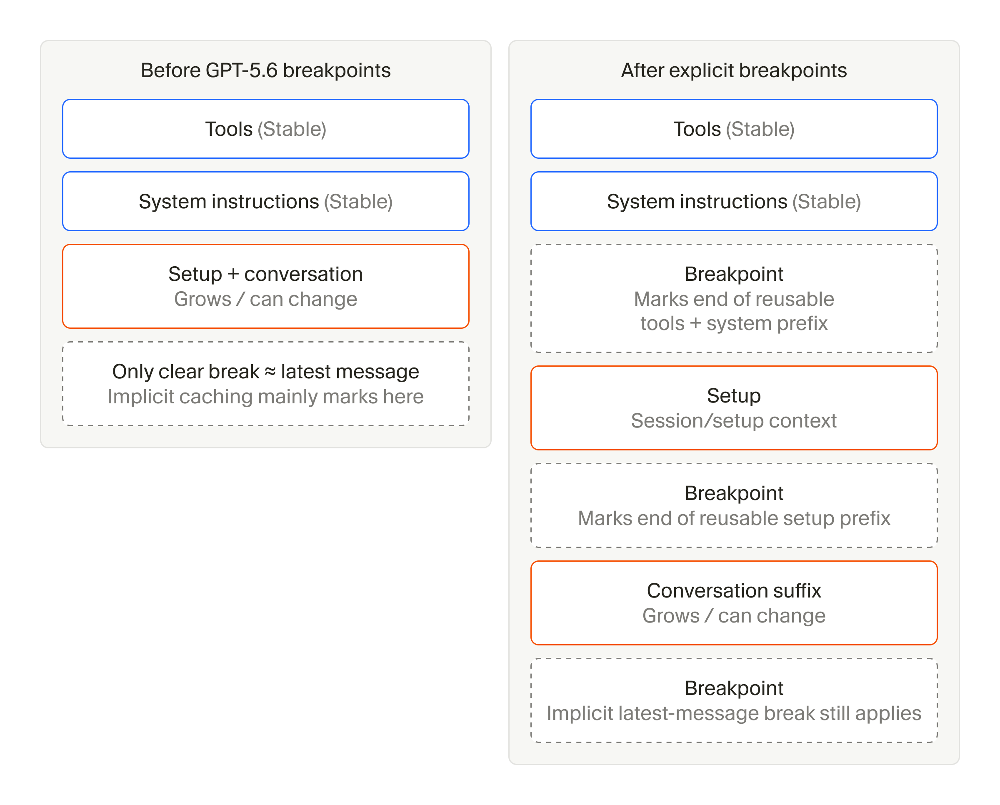
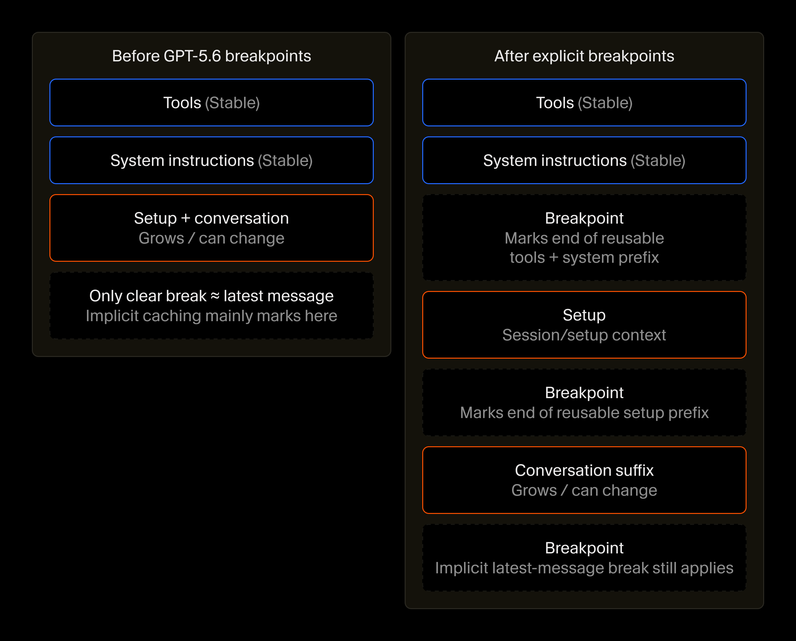

---
authors:
  - aitoboxrobot
categories:
  - 工具教程
date: 2026-09-25
hide:
  - navigation
tags:
  - Cursor
  - AI 智能体
  - Token 优化
  - Prompt 缓存
  - 上下文工程
  - Harness 架构
title: "Cursor 智能体工程实践：长程任务 Token 效率与系统 Harness 深度优化指南"
---

# Cursor 智能体工程实践：长程任务 Token 效率与系统 Harness 深度优化指南

### 文章背景与核心概要
随着 AI 智能体在真实开发场景中承担起越来越复杂、跨度更长的编程任务，如何高效组装并管理庞大的上下文，已成为决定大模型推理效率与成本的核心瓶颈。在过去数月里，Cursor 团队针对其智能体底层系统架构 (Agent Harness) 展开了全方位深度重构与多层优化，在丝毫不牺牲任务完成质量的前提下，成功将整体 Token 开销降低了 7%。这项工程涵盖了精简系统提示词、动态按需加载工具、结合 GPT-5.6 显式断点优化 Prompt 缓存、压缩文件读取行号开销，以及制定更智能的子智能体分流策略等多项突破。本文详细复盘了 Cursor 在超大规模真实流量下的上下文工程实战经验，为构建低成本、高可靠的长程 AI 智能体系统提供了极具价值的工程参考。

---

## 概述

> # Summary

随着 AI 智能体 (AI Agent) 开始接管更具挑战性、耗时更长的复杂任务，如何高效组织和管理上下文 (Context)，已成为决定大模型推理效率的核心生命线。在过去的几个月里，Cursor 团队针对其智能体底层运行架构 (Agent Harness) 展开了多层面的深度系统优化——在丝毫不降低任务输出质量的前提下，成功将全局 Token 成本削减了 7%。其中的关键优化举措包括：

> As AI agents tackle more ambitious, longer-running tasks, the way context is assembled and managed becomes critical to inference efficiency. Over the past few months, Cursor optimized its agent harness across multiple layers—reducing token costs by 7% overall without degrading quality. Key optimizations include:

* **精简系统提示词 (Trimming System Prompts)**：随着基础模型自身能力的飞速提升，移除了冗余的指令约束与防护栏，将系统提示词 (System Prompt) 大幅缩减了约 66%；
* **动态工具加载 (Dynamic Tool Loading)**：将低频使用的内置工具以及 MCP 工具从静态上下文中剥离，仅在需要调用时动态按需加载；
* **深度优化 Prompt 缓存 (Optimized Prompt Caching)**：充分利用 GPT-5.6 引入的显式缓存断点 (Cache Breakpoints)，并通过稳定请求前缀，将冷缓存未命中率降低了 20%；
* **压缩代码文件读取开销 (Compressed File Reads)**：在读取文件内容时，从过去的逐行编号改为每十行标注一次行号，在保证模型精准定位的前提下，将缓存读取 Token 减少了 1.6%；
* **智能化子智能体协作策略 (Strategic Subagent Usage)**：重新梳理了子智能体 (Subagent) 的派发时机、协作方式与模型选型逻辑，有效避免了不必要的跨智能体协同开销。

> * **Trimming System Prompts:** Removed redundant instructions and guardrails as models became natively more capable, cutting system prompts by roughly 66%.
> * **Dynamic Tool Loading:** Offloaded low-frequency built-in tools (and MCP tools) from static context, loading them only when needed.
> * **Optimized Prompt Caching:** Leveraged explicit cache breakpoints (introduced in GPT-5.6) and stabilized the request prefix to reduce cold cache misses by 20%.
> * **Compressed File Reads:** Switched from numbering every single line of code in file reads to numbering every tenth line, reducing cache-read tokens by 1.6%.
> * **Strategic Subagent Usage:** Streamlined when and how subagents are deployed and which models they use, avoiding unnecessary coordination overhead.

---

## 精简系统提示词

> ## Trimming the system prompt

在智能体与大模型的每一次交互轮次中，Cursor 都会在模型正式执行任务前注入预设的上下文。这其中包括系统提示词以及智能体可调用工具的详细定义。由于这部分固定上下文会贯穿整个会话始终，它逐渐成为了我们完全可控的成本支出中最庞大的一项。

> Every agent turn includes context supplied by Cursor before the model begins working. This includes the system prompt and definitions for the tools the agent can use. Because this context is included throughout a conversation, it had become one of the largest sources of spend that we fully control.

早先在大模型能力尚显稚嫩的时期，我们不得不巨细靡遗地在提示词中详尽交代各项规则：如何调用工具、如何规划任务步骤，以及如何执行代码修改的工作流程。不仅如此，我们还得设置层层严密的防护栏，严防各种偶发的异常行为——比如模型突然倾倒出极其冗长的哈希码、吐出不可读的二进制数据，或是滥用 Emoji 表情符号等。

> When models were less capable, we had to spell out instructions for tool usage, task management, and code-change workflows. We also had to guard against strange behaviors like extremely long hash dumps, binary output, and emojis.

而随着大模型底座能力的快速进化，许多昔日的保姆式指导已不再必要。与其用冗长清单罗列一堆诸如“严禁执行某操作”、“你必须”、“极度重要”等警告，我们如今只需清晰定义工具的具体行为特征，各类模型便能心领神会、规范遵循。这种原生理解能力的跃升在各个主流模型家族中均得到了印证，使我们得以大刀阔斧地削减了约 66% 的系统提示词篇幅。

> As models improved, much of that direction became unnecessary. Instead of long lists of "DO NOT do this," "You must," or "Important" instructions, we could simply define how a tool behaves and models would generally comply. This was true across model families, allowing us to trim roughly 66% of our system prompt.

随着新模型的迭代引入，我们始终动态增删各项指令，引导新模型发挥最佳表现，而这些实战经验后续也会反馈到下一代模型的训练流程之中。依托海量真实用户群体进行严谨的 A/B 测试，是针对真实线上流量高效优化系统 Harness 的关键法宝。离线评测基准 (Evals) 固然是一种快捷实用的参考代理，但它们往往侧重于刻意设计的“高难度”极限场景，无法准确映射现实世界中用户请求的真实分布情况。

> Over time, we continue to add and remove instructions as new models require new guidance, which then flows into the training of future models. Leveraging A/B tests on a large user base is crucial to effectively optimizing the harness for real traffic. While evals can be a fast and useful proxy, they often represent "hard" problems and don't properly reflect the true distribution of user requests.

---

## 动态按需加载工具

> ## Loading tools only when needed

系统提示词仅仅是 Cursor 在每一轮交互中向模型传递的上下文的一部分。另一个关键开销来源是工具定义。过去一年间，随着我们为 Cursor 智能体注入了越来越多强劲的新特性 (例如后台终端进程监控、云端子智能体调度，以及更稳健的网页内容抓取能力)，工具定义的体积出现了急剧膨胀。尽管这些工具在特定场景下都极为关键，但实际上绝大多数工具在不到 20% 的会话中才会被真正调用。

> The system prompt is only one part of the context Cursor supplies on every turn. Another is tool definitions, which had grown dramatically over the course of the year as we added more powerful capabilities to the Cursor agent, including background shell monitoring, cloud subagents, and more reliable access to web content. Most of these tools are important, but each is needed in fewer than 20% of conversations.

这就为我们带来了一个绝佳的效率优化契机：既能确保所有工具随时待命可用，又无需在每次向模型发送请求时都塞入冗长的完整工具定义。今年早些时候，我们通过将 MCP 工具移入动态上下文，仅在实际触发时才按需加载，成功解决了类似的技术痛点。那一项优化为调用了 MCP 工具的会话总体降低了高达 46.9% 的 Token 消耗。

> That created an opportunity to improve efficiency by keeping tools available without including their full definitions in every request. We'd solved a similar problem earlier this year when we moved MCP tools into dynamic context, loading them only when needed. This reduced total tokens by 46.9% across sessions that called an MCP tool.

如今，我们将这一成熟的设计思路全面推广到了 Cursor 自身的原生内置工具上。

> We have now applied the same technique to our own built-in tools.

为了精准权衡哪些工具应该保留在静态上下文中，我们基于工具的调用频率以及模型是否必须从一开始就看到工具定义，设计了多组配置方案展开广泛的 A/B 测试。在测试过程中，我们密切追踪了 Token 使用量、实际调用成本、响应延迟、工具调用报错率以及智能体的整体活跃度指标，严格确保在大幅压缩成本的同时，开发体验和任务完成质量没有发生丝毫滑坡。

> To decide which tools to keep in static context, we A/B tested several configurations based on how often each tool was used and whether models needed to see it from the start. We tracked token usage, cost, latency, tool-call errors, and overall agent usage to make sure the savings did not degrade quality.

最终评测的结果是：我们将代码读取、全局检索、文本编辑以及 Shell 终端执行等高频核心工具常驻在静态上下文中。此外，我们也保留了 `ask_question` (因为某些模型在看不到该工具时容易产生臆想调用的幻觉问题)，以及对特定产品交互流至关重要的工具 (例如规划模式 Plan Mode 下的 `create_plan`)。除此以外的所有剩余工具，如今全部改为在智能体明确需要时才动态加载。

> Ultimately, we kept the high-frequency tools for reading, searching, editing, and using the shell in static context. We also retained `ask_question`, which some models tended to hallucinate calls for, and tools that are crucial to specific product flows, such as `create_plan` in Plan Mode. The remaining tools now load when the agent needs them.

---

## 提升 Prompt 缓存复用率

> ## Improving cache reuse

在成功精简了单次请求中承载的静态上下文体积之后，我们的下一步重心转向了如何最大化提升跨轮次重复上下文的缓存利用效率。

> After reducing the amount of static context in each request, we improved how effectively repeated context could be cached across turns.

在智能体的每个交互回合中，客户端都会向后端发送一个体量可观的完整请求，其中打包了工具列表、系统指令、运行环境配置以及迄今为止的全部会话历史。显而易见，请求前部的大块内容在多轮对话中几乎是一成不变的，只有尾部的对话记录会随着任务推进而不断延展拉长。

> Every agent turn resends a long request containing tools, system instructions, setup, and the conversation so far. Much of the beginning stays the same from one turn to the next, while the conversation at the end continues to grow.

Prompt 缓存 (Prompt Caching) 技术允许模型服务商直接复用未发生改变的请求前缀，从而大幅节省预填充计算。然而，各大服务商在缓存的可配置粒度上差异显著。在 GPT-5.6 问世之前，缓存边界完全由服务端根据最新请求的内容自动推导截取。尽管工具和系统提示词本身极少变动，但此前并无法被显式打上独立复用的标记。

> Prompt caching allows the model provider to reuse that unchanged prefix. However, caching configurability can vary by provider. Before GPT-5.6, the cache boundary was determined automatically based on the latest request. Even though tools and system instructions rarely changed, they were not cleanly marked as reusable on their own.

自从 GPT-5.6 发布以来，OpenAI API 在其默认的隐式缓存机制之外，正式开放了让客户端自定义标记显式缓存断点 (Cache Breakpoints) 的能力。现在，我们在请求中极其稳定的前缀层之后、不断变长的会话内容之前，精准插入了缓存断点。这一改动让后续的交互轮次能够更稳、更多地命中并复用未经篡改的前置静态缓存。

> Since GPT-5.6, the OpenAI API allows clients to mark explicit cache breakpoints alongside its default implicit caching. We now place breakpoints after stable layers of the request and before the growing conversation, allowing later turns to reuse more of the unchanged prefix.

需要注意的是，只有当前缀本身保持高度稳定时，缓存断点才能真正发挥功效。为此，我们对每一次请求前部放置的内容进行了更为严格的规范与收紧：系统提示词和工具定义区域严格仅存放极少变更的基准内容；而对于经常浮动变化的配置信息，则被统统推移到缓存断点之后，集中收纳至我们专门设计的“虚拟用户消息 (Phantom User Message)”中。该消息专门承载与具体用户或单次请求强相关的动态上下文，例如自定义技能 (Skills)、子智能体配置以及即时环境变量等。

> Breakpoints only help if the prefix itself stays stable, so we also tightened what sits at the front of each request. We did this by reserving tools and system instructions for content that rarely changes, and by moving more variable setup past the cache boundaries into our "phantom user message." This holds user- and request-specific context like skills, subagents, and environment info.

这一套组合拳打下来，成功将冷缓存未命中率降低了 20%。

> These changes reduced the rate of cold cache misses by 20%.

---

## 压缩文件读取开销

> ## Compressing file reads

智能体在自主运行过程中动态追加的工作上下文，是另一处极其庞大的 Token 消耗重灾区，而其中绝大部分开销都源于对代码文件的频繁读取。

> Another large source of token spend is the context an agent adds as it works, much of which comes from reading files.

Cursor 智能体通过专门的 `Read` 工具读取文件内容。在传统实现中，该工具会为代码的每一行都打上行号。之所以这样做，是因为大语言模型自身并不擅长精准数行数，而后续向用户解释说明或执行代码替换时，又必须精确引用具体的代码行区间。

> Cursor's agent reads files through a `Read` tool, which traditionally numbered every line because models are not good at counting lines on their own and need to cite specific sections for the user.

单纯标注一行行号仅仅耗费大约 3 到 5 个 Token，看似微不足道；但当智能体在一个复杂的工程会话中一口气通读数万行代码时，每一行都加上行号所累加起来的上下文体积就相当惊人了。

> A single line number uses only around three to five tokens, but when an agent reads tens of thousands of lines during a session, numbering every one adds a meaningful amount of context.

为了减轻这一不必要的负担，我们对行号渲染进行了稀疏化改造：改为仅在每十行代码处标注一次行号。实测表明，这一采样频率已完全足够模型准确推导并引用目标代码行，同时在不产生任何质量劣化的情况下，直接将读取文件产生的缓存读取 Token 减少了 1.6%。

> We reduced that overhead by including line numbers only on every tenth line. This is still frequent enough for models to cite code properly, and the change reduced cache-read tokens by 1.6% with no reduction in quality.

---

## 科学调度子智能体

> ## Using subagents strategically

随着智能体执行长周期任务的时间不断增加，将子任务委托给子智能体 (Subagent) 协作的机会也随之增多。这本身能够显著削减 Token 开销，因为每个子智能体在被派生时，通常都会启动一个崭新而干净的上下文窗口，而无需背负父智能体漫长繁杂的历史对话包袱；当子智能体完成任务并汇报结论后，父智能体只需接收核心结果，即可继续向下执行，避免了将子智能体繁琐的中间工作轨迹全盘塞回主会话。

> Longer agent runs create more opportunities to delegate work to subagents. This can reduce token spend because each subagent typically starts with a fresh context window rather than carrying the parent agent's full conversation. Once it reports its results, the parent can continue without carrying the subagent's full working context.

然而，父子智能体之间的这种上下文隔离并非毫无代价——它不可避免地会带来“协同税 (Coordination Tax)”。由于彼此无法实时共享完整的上下文，子智能体很可能会重复执行某些已被验证过的工作，或是朝着主任务中早已废弃的方向徒劳探索。

> This kind of context isolation between agents and subagents does carry a coordination tax, though, because agents that do not share context can duplicate work or pursue tasks that are no longer necessary.

为了在充分享受子智能体带来的效率红利的同时避免过高的协同损耗，我们做出了两项关键调整。首先，我们果断删除了原本提示词中强烈鼓励智能体在探索代码库时派生子智能体的强制指令。随着子智能体范式在预训练数据中愈发普及，以及研究人员在后训练 (Post-Training) 阶段对其深度对齐，当今的模型已经原生掌握了何时应该分工。移除这些多余的催促提示词后，智能体在子智能体的调用决策上反而变得更加克制而均衡。

> We made two changes to capture the efficiency benefits without adding unnecessary coordination. First, we removed instructions that strongly encouraged agents to use subagents for codebase exploration. As subagents became more prevalent in training data and researchers incorporated them into post-training, models learned this pattern natively. Removing the extra prompting produced more balanced subagent usage.

其次，我们进一步收紧了子智能体的模型选择机制。Cursor 本身支持选用后台任意可用的大模型来孵化子智能体，这使得不同模型之间互补短板成为可能——例如将高昂的顶尖规划模型与轻量便宜的模型搭配，分别负责顶层构思与底层代码落地。我们重新规范了工具调用参数：智能体只有在收到用户明确指示或系统 Harness 统一调度时，才会切换选用不同的模型，杜绝了模型随意自我分流带来的失控与溢价。

> We also tightened how subagents select models. Cursor can spawn subagents using any of our available models, which makes it possible to shore up blind spots across models or pair an expensive planning model with a cheaper one for implementation. We updated the tool arguments so agents choose a different model only when directed by the user or the harness.

---

## 持续深耕系统 Harness 的极致能效

> ## Continuing to improve harness efficiency

未来，我们将继续密切度量上下文在超长程运行中的堆积规律，并持续探索如何在绝不折损智能体产出质量的前提下，通过系统 Harness 进一步剔除多余的重复计算。随着技术的演进，我们期待 Token 的消耗增速将远低于智能体实际完成的工作量增速。与此同时，我们已将这些宝贵的工程实战经验复用到 Grok Bot 等项目中，致力于为其量身定制最适配的 Harness 优化策略，让用户能够以最低的成本开销交付最高价值的工程成果。

> We'll continue measuring how context accumulates across longer runs and testing where the harness can reduce repeated processing without affecting agent quality. Over time, we expect this will allow token use to grow far more slowly than the amount of work agents can complete. We've also taken these learnings to Grok Bot, where we're working to optimize its unique harness so that users can accomplish the most work at the lowest cost.
