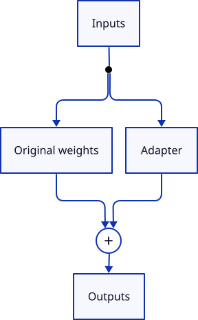

---
authors:
  - aitoboxrobot
categories:
  - 研究解读
date: 2026-10-10
hide:
  - navigation
tags:
  - LoRE
  - 矩阵分解
  - 低秩表示
  - 模型轻量化
  - 嵌入层优化
  - GPT-2
  - 研究解读
title: "低秩词表矩阵的探索之旅：LoRE 架构在削减 20% 参数的同时如何意外降低测试损失"
---

# 低秩词表矩阵的探索之旅：LoRE 架构在削减 20% 参数的同时如何意外降低测试损失

> # Fun with Low-Rank Vocab Matrices (and a Bonus Test Loss Reduction?)

### 文章背景与核心概要

在以 GPT-2 为代表的中小规模语言模型中，由于网络隐藏层维度与深度较为适中，负责处理输入和输出的词表嵌入矩阵通常会吞噬掉整个模型高达 50% 的参数配额，构成了极为沉重的内存与算力负担。受 ALBERT 嵌入分解与低秩微调 (LoRA) 思想的启发，这项工程探索提出了 LoRE (Low-Rank Embeddings) 架构，尝试将词表输入嵌入层与输出分类头矩阵分解为低秩瓶颈矩阵 ($r=128$) ，以期大幅精简参数并加速训练。在基于 8 张 A100 GPU、涵盖 11 轮训练运行的严格消融实验中，作者发现了一个出人意料的现象：仅在输入端应用 LoRE (Input-only LoRE) 时，不仅成功砍掉了约 3,200 万参数 (相当于整体参数削减近 20%) ，而且在多个随机数种子下均稳定超越了基线模型，意外降低了测试损失 (Test Loss) ；而输出分类头分解则会引入严重的表达瓶颈。这一发现颠覆了“压缩嵌入矩阵必然损害表征能力”的传统直觉，为中小规模垂直专用模型和端侧模型的极致轻量化设计提供了极具工程价值的实践范式与非对称设计启示。

---

## 执行摘要

> ## Executive Summary

受到近期关于词表嵌入矩阵分解 (Factorised Embeddings) 讨论的启发——这是一种类似于将 LoRA 思想应用于词表矩阵以削减参数总量的技巧，此前在 ALBERT 和 Maba 等模型架构中已有实践——本文深入探索了使用低秩瓶颈结构全面替换全秩 (Full-Rank) 输入嵌入层与输出分类头的可行性，并将这一改进方案命名为 **LoRE** (Low-Rank Embeddings) 。

> Inspired by a discussion on factorised embeddings (a trick similar to LoRA applied to vocabulary matrices to reduce parameter counts, as seen in ALBERT and Maba), this post explores replacing full-rank input embeddings and output heads with low-rank bottlenecks—dubbed **LoRE** (Low-Rank Embeddings). 

对于千亿、万亿参数的超大规模模型而言，词表嵌入层所占的参数比例微乎其微；然而在中小规模模型中（例如拥有 1.63 亿 / 163M 参数的 GPT-2 架构），多达 50% 的模型参数竟然仅仅耗费在负责数据的“读入与输出”上。通过将这些庞大的词表矩阵分解为秩为 $r=128$ 的两个低秩因子矩阵 ($A$ 与 $B$) ，我们能够大幅压缩参数总量，并显著加快训练迭代速度。

> While large models spend a tiny fraction of parameters on embeddings, smaller models (like 163M parameter GPT-2 architectures) spend up to 50% of their parameters just getting data in and out. By factorizing these matrices into low-rank factors ($A$ and $B$) with rank $r=128$, we can drastically reduce parameter counts and speed up training. 

在 8 张 A100 GPU 上开展了涵盖 11 轮独立训练的系统性消融实验后，研究团队得出了以下几项核心发现：

> Through rigorous ablation studies across 11 training runs using 8x A100 GPUs, the following key findings emerged:

1. **仅在输入端使用 LoRE (Input-only LoRE) ：** 在成功削减约 3,200 万 (~32M) 参数的同时，竟然意外地**改善**了最终的测试损失 (Test Loss) 。
2. **在输出分类头使用 LoRE (Output-head LoRE) ：** 始终会导致验证集测试损失不可逆地出现上升。
3. **精妙初始化策略 (Smart Initialisation) ：** 调整瓶颈投影矩阵的方差尺度会显著影响训练初期的收敛动态与起始损失；但令人称奇的是，在这些具体的实验运行中，被数学理论证明“存在偏差”的初始设置反而在下游测试损失上取得了更优的表现。

> 1. **Input-only LoRE** unexpectedly *improved* test loss while reducing the parameter count by ~32M.
> 2. **Output-head LoRE** caused a consistent increase in validation test loss.
> 3. **Smart initialisation** (scaling bottleneck projection variance) heavily impacts training dynamics and initial loss, though incorrect initialisations surprisingly led to better downstream test loss in these specific runs.

---

## 低秩因子：理论基础与工程实现

> ## Low-Rank Factors: Theory and Implementation

在传统的神经网络中，庞大的权重矩阵可以通过矩阵分解 (Matrix Factorisation) 技术进行瘦身。假设存在一个维度为 $m \times n$ 的权重矩阵 $W$，我们能够将其分解为一个 $m \times r$ 的矩阵 $A$ 与一个 $r \times n$ 的矩阵 $B$，其中 $r$ 代表分解后的**秩** (Rank) 。只要 $r$ 取得足够小，矩阵 $A$ 与 $B$ 所包含的参数总量就会远远少于原始的全秩矩阵。

> Standard neural network matrices can be downscaled using matrix factorisation. Given an $m \times n$ weight matrix $W$, we can factorise it into an $m \times r$ matrix $A$ and an $r \times n$ matrix $B$, where $r$ is the **rank** of the factorisation. If $r$ is sufficiently small, the combination of $A$ and $B$ contains far fewer parameters than the full matrix.



以 GPT-2 Small 模型为例：

> For a GPT-2 small model:

* **全秩输出分类头 (Output Head, Full) ：** $768 \times 50,257 = 38,597,376$ 个参数。
* **低秩输出分类头 (Output Head, LoRE, $r=128$) ：** $(768 \times 128) + (50,257 \times 128) = 6,531,200$ 个参数 (参数量缩减为原本的约六分之一) 。

> * **Output Head (Full):** $768 \times 50,257 = 38,597,376$ parameters.
> * **Output Head (LoRE, $r=128$):** $(768 \times 128) + (50,257 \times 128) = 6,531,200$ parameters (~6x smaller).

得益于矩阵乘法的结合律 ($Z = X(AB) = (XA)B$) ，在 PyTorch 中实现这一结构非常直接简便：

> Thanks to the associativity of matrix multiplication ($Z = X(AB) = (XA)B$), implementation in PyTorch is straightforward:

```python
out_head_A = nn.Linear(d_emb, r, bias=False)
out_head_B = nn.Linear(r, vocab_size, bias=False)
...
intermediate = out_head_A(embeddings)
logits = out_head_B(intermediate)
```

---

## 深入探索 LoRE

> ## Introducing LoRE

作者在 PyTorch 训练代码库中集成了 LoRE 的配置选项，支持对输入嵌入层和输出分类头进行独立的开关控制，同时引入了名为 `smart_initialize` 的控制标志，用于调控内部瓶颈投影矩阵的方差尺度 ($std = 1.0 / \sqrt{r}$) 。

> I implemented LoRE configurations into my PyTorch training codebase, allowing independent toggling for input embeddings and output heads, alongside a `smart_initialize` flag to control the variance of the inner projection matrices ($std = 1.0 / \sqrt{r}$).

### 第一批训练运行实验

> ### Training Runs: Batch 1

最初的测试将未做分解的基线模型与采用普通初始化及智能初始化的 LoRE 模型进行了对比：

> Initial tests compared a baseline against ordinary and smart-initialized LoRE models:

| 模型 | 参数量 | 训练耗时 (秒) | 初始训练损失 | 最终训练损失 | 测试损失 | 成本 (美元) |
| :--- | :--- | :--- | :--- | :--- | :--- | :--- |
| [`8xa100m40-lore-1-baseline-disabled`](https://huggingface.co/gpjt/8xa100m40-lore-1-baseline-disabled) | 163,009,536 | 9,339 | 10.992 | 3.579 | 3.599611 | 43.96 |
| [`8xa100m40-lore-2-both-ordinary-init`](https://huggingface.co/gpjt/8xa100m40-lore-2-both-ordinary-init) | 98,877,184 | 8,057 | 10.89 | 3.703 | 3.723328 | 38.55 |
| [`8xa100m40-lore-3-both-smart-init`](https://huggingface.co/gpjt/8xa100m40-lore-3-both-smart-init) | 98,877,184 | ~8,100 | 11.865 | 未知 (unknown) | 3.671585 | 41.44 |

| Model | Parameters | Training Time (s) | Initial Training Loss | Final Training Loss | Test Loss | Cost (US$) |
| :--- | :--- | :--- | :--- | :--- | :--- | :--- |
| [`8xa100m40-lore-1-baseline-disabled`](https://huggingface.co/gpjt/8xa100m40-lore-1-baseline-disabled) | 163,009,536 | 9,339 | 10.992 | 3.579 | 3.599611 | 43.96 |
| [`8xa100m40-lore-2-both-ordinary-init`](https://huggingface.co/gpjt/8xa100m40-lore-2-both-ordinary-init) | 98,877,184 | 8,057 | 10.89 | 3.703 | 3.723328 | 38.55 |
| [`8xa100m40-lore-3-both-smart-init`](https://huggingface.co/gpjt/8xa100m40-lore-3-both-smart-init) | 98,877,184 | ~8,100 | 11.865 | unknown | 3.671585 | 41.44 |

### 消融实验：输入层与输出层对比

> ### Ablation Runs: Input vs. Output

测试仅在单侧启用 LoRE 的配置带来了令人吃惊的发现：相较于基线模型，**仅在输入端使用 LoRE 反而降低了测试损失**。

> Testing single-side LoRE configurations yielded a startling result: **input-only LoRE improved test loss** compared to the baseline.

| 模型 | 参数量 | 训练耗时 (秒) | 初始训练损失 | 最终训练损失 | 测试损失 | 成本 (美元) |
| :--- | :--- | :--- | :--- | :--- | :--- | :--- |
| [`8xa100m40-lore-4-input-only`](https://huggingface.co/gpjt/8xa100m40-lore-4-input-only) | 130,943,360 | 9,225 | 10.978 | 3.505 | **3.526610** | 44.83 |
| [`8xa100m40-lore-5-output-only`](https://huggingface.co/gpjt/8xa100m40-lore-5-output-only) | 130,943,360 | 8,202 | 11.817 | 3.717 | 3.737128 | 41.59 |

| Model | Parameters | Training Time (s) | Initial Training Loss | Final Training Loss | Test Loss | Cost (US$) |
| :--- | :--- | :--- | :--- | :--- | :--- | :--- |
| [`8xa100m40-lore-4-input-only`](https://huggingface.co/gpjt/8xa100m40-lore-4-input-only) | 130,943,360 | 9,225 | 10.978 | 3.505 | **3.526610** | 44.83 |
| [`8xa100m40-lore-5-output-only`](https://huggingface.co/gpjt/8xa100m40-lore-5-output-only) | 130,943,360 | 8,202 | 11.817 | 3.717 | 3.737128 | 41.59 |

---

## 复现验证与随机数种子测试

> ## Replication and Seed Testing

为了核实仅在输入端使用 LoRE 带来的性能提升是否只是随机初始化带来的侥幸巧合，作者使用了一个全新的随机数种子 (`123`) 训练了第二批模型。

> To verify whether the input-only LoRE improvement was a fluke of random initialisation, a second batch of models was trained using a new random seed (`123`).

| 模型 | 参数量 | 训练耗时 (秒) | 初始训练损失 | 最终训练损失 | 测试损失 | 成本 (美元) |
| :--- | :--- | :--- | :--- | :--- | :--- | :--- |
| [`8xa100m40-lore-6-new-seed-baseline-disabled`](https://huggingface.co/gpjt/8xa100m40-lore-6-new-seed-baseline-disabled) | 163,009,536 | 9,409 | 11.006 | 3.577 | 3.597584 | 45.03 |
| [`8xa100m40-lore-7-new-seed-input-only`](https://huggingface.co/gpjt/8xa100m40-lore-7-new-seed-input-only) | 130,943,360 | 9,163 | 10.989 | 3.563 | **3.584511** | 43.03 |
| [`8xa100m40-lore-8-new-seed-both-smart-init`](https://huggingface.co/gpjt/8xa100m40-lore-8-new-seed-both-smart-init) | 98,877,184 | 8,102 | 11.829 | 3.678 | 3.698644 | 37.91 |
| [`8xa100m40-lore-9-new-seed-output-only`](https://huggingface.co/gpjt/8xa100m40-lore-9-new-seed-output-only) | 130,943,360 | 8,192 | 11.806 | 3.693 | 3.712537 | 38.32 |

| Model | Parameters | Training Time (s) | Initial Training Loss | Final Training Loss | Test Loss | Cost (US$) |
| :--- | :--- | :--- | :--- | :--- | :--- | :--- |
| [`8xa100m40-lore-6-new-seed-baseline-disabled`](https://huggingface.co/gpjt/8xa100m40-lore-6-new-seed-baseline-disabled) | 163,009,536 | 9,409 | 11.006 | 3.577 | 3.597584 | 45.03 |
| [`8xa100m40-lore-7-new-seed-input-only`](https://huggingface.co/gpjt/8xa100m40-lore-7-new-seed-input-only) | 130,943,360 | 9,163 | 10.989 | 3.563 | **3.584511** | 43.03 |
| [`8xa100m40-lore-8-new-seed-both-smart-init`](https://huggingface.co/gpjt/8xa100m40-lore-8-new-seed-both-smart-init) | 98,877,184 | 8,102 | 11.829 | 3.678 | 3.698644 | 37.91 |
| [`8xa100m40-lore-9-new-seed-output-only`](https://huggingface.co/gpjt/8xa100m40-lore-9-new-seed-output-only) | 130,943,360 | 8,192 | 11.806 | 3.693 | 3.712537 | 38.32 |

第二批实验再次证实了这一趋势：仅在输入端使用 LoRE 不仅能够大幅削减参数规模，而且在测试损失上稳定且持续地优于基线模型。

> The second batch confirmed the trend: input-only LoRE consistently outperformed the baseline model in test loss while slashing parameter requirements.

---

## 修正智能初始化的数学推导

> ## Correcting the Smart Initialisation Math

在撰写实验总结的过程中，借助 AI 的细致分析，作者在 `smart_initialize` 针对矩阵权重的初始化逻辑中发现了一个隐蔽的 Bug。对于一个分解为 $A$ 与 $B$ 的输出分类头矩阵（满足 $W' = AB$），若要通过 $std = 1.0 / \sqrt{r}$ 缩放方差，该操作必须施加在**第二个**矩阵 ($B$) 上，而非第一个矩阵 ($A$) 。

> During write-up, AI analysis revealed a subtle bug in how `smart_initialize` targeted the matrix weights. For an output head matrix factorized into $A$ and $B$ (where $W' = AB$), scaling variance via $std = 1.0 / \sqrt{r}$ must be applied to the **second** matrix ($B$), not the first.

从数学角度推导，为了确保分解后矩阵的方差与标准线性层保持严格一致，需要满足如下条件：

> Mathematically, to ensure the variance of the factorised matrix matches a standard linear layer, we require:

$$\text{Var}(W') = r \cdot \sigma_A^2 \cdot \sigma_B^2 = \sigma_A^2 \implies \sigma_B^2 = \frac{1}{r}$$

当这一数学逻辑得到修正后，初始阶段的损失激增现象确实消失了；然而令人啼笑皆非的是，与最初那个“存在错误”的初始化脚本相比，下游最终的测试损失反而出现了恶化。

> When corrected, initial loss spikes disappeared, but paradoxically, downstream test loss worsened compared to the original "incorrect" initialisation script.

---

## 完整实验结果汇总

> ## Comprehensive Results Summary

按所有训练运行的最终测试损失升序排列：

> Sorted by test loss across all runs:

| 模型 | 参数量 | 输入端 LoRE | 输出端 LoRE | 种子 | 智能初始化 | 初始训练损失 | 测试损失 |
| :--- | :--- | :--- | :--- | :--- | :--- | :--- | :--- |
| [`8xa100m40-lore-4-input-only`](https://huggingface.co/gpjt/8xa100m40-lore-4-input-only) | 130,943,360 | 是 (yes) | 否 (no) | 42 | 原始版本 (original) | 10.978 | **3.526610** |
| [`8xa100m40-lore-7-new-seed-input-only`](https://huggingface.co/gpjt/8xa100m40-lore-7-new-seed-input-only) | 130,943,360 | 是 (yes) | 否 (no) | 123 | 原始版本 (original) | 10.989 | **3.584511** |
| [`8xa100m40-lore-6-new-seed-baseline-disabled`](https://huggingface.co/gpjt/8xa100m40-lore-6-new-seed-baseline-disabled) | 163,009,536 | 否 (no) | 否 (no) | 123 | 无 (none) | 11.006 | 3.597584 |
| [`8xa100m40-lore-1-baseline-disabled`](https://huggingface.co/gpjt/8xa100m40-lore-1-baseline-disabled) | 163,009,536 | 否 (no) | 否 (no) | 42 | 无 (none) | 10.992 | 3.599611 |
| [`8xa100m40-lore-3-both-smart-init`](https://huggingface.co/gpjt/8xa100m40-lore-3-both-smart-init) | 98,877,184 | 是 (yes) | 是 (yes) | 42 | 原始版本 (original) | 11.865 | 3.671585 |
| [`8xa100m40-lore-8-new-seed-both-smart-init`](https://huggingface.co/gpjt/8xa100m40-lore-8-new-seed-both-smart-init) | 98,877,184 | 是 (yes) | 是 (yes) | 123 | 原始版本 (original) | 11.829 | 3.698644 |
| [`8xa100m40-lore-9-new-seed-output-only`](https://huggingface.co/gpjt/8xa100m40-lore-9-new-seed-output-only) | 130,943,360 | 否 (no) | 是 (yes) | 123 | 原始版本 (original) | 11.806 | 3.712537 |
| [`8xa100m40-lore-2-both-ordinary-init`](https://huggingface.co/gpjt/8xa100m40-lore-2-both-ordinary-init) | 98,877,184 | 是 (yes) | 是 (yes) | 42 | 无 (none) | 10.89 | 3.723328 |
| [`8xa100m40-lore-5-output-only`](https://huggingface.co/gpjt/8xa100m40-lore-5-output-only) | 130,943,360 | 否 (no) | 是 (yes) | 42 | 原始版本 (original) | 11.817 | 3.737128 |
| [`8xa100m40-lore-10-both-corrected-smart-init`](https://huggingface.co/gpjt/8xa100m40-lore-10-both-corrected-smart-init) | 98,877,184 | 是 (yes) | 是 (yes) | 42 | 修正版本 (corrected) | 10.987 | 3.741209 |
| [`8xa100m40-lore-11-output-only-corrected-smart-init`](https://huggingface.co/gpjt/8xa100m40-lore-11-output-only-corrected-smart-init) | 130,943,360 | 否 (no) | 是 (yes) | 42 | 修正版本 (corrected) | 10.986 | 3.785209 |

| Model | Parameters | Input LoRE | Output LoRE | Seed | Smart Init | Initial Training Loss | Test Loss |
| :--- | :--- | :--- | :--- | :--- | :--- | :--- | :--- |
| [`8xa100m40-lore-4-input-only`](https://huggingface.co/gpjt/8xa100m40-lore-4-input-only) | 130,943,360 | yes | no | 42 | original | 10.978 | **3.526610** |
| [`8xa100m40-lore-7-new-seed-input-only`](https://huggingface.co/gpjt/8xa100m40-lore-7-new-seed-input-only) | 130,943,360 | yes | no | 123 | original | 10.989 | **3.584511** |
| [`8xa100m40-lore-6-new-seed-baseline-disabled`](https://huggingface.co/gpjt/8xa100m40-lore-6-new-seed-baseline-disabled) | 163,009,536 | no | no | 123 | none | 11.006 | 3.597584 |
| [`8xa100m40-lore-1-baseline-disabled`](https://huggingface.co/gpjt/8xa100m40-lore-1-baseline-disabled) | 163,009,536 | no | no | 42 | none | 10.992 | 3.599611 |
| [`8xa100m40-lore-3-both-smart-init`](https://huggingface.co/gpjt/8xa100m40-lore-3-both-smart-init) | 98,877,184 | yes | yes | 42 | original | 11.865 | 3.671585 |
| [`8xa100m40-lore-8-new-seed-both-smart-init`](https://huggingface.co/gpjt/8xa100m40-lore-8-new-seed-both-smart-init) | 98,877,184 | yes | yes | 123 | original | 11.829 | 3.698644 |
| [`8xa100m40-lore-9-new-seed-output-only`](https://huggingface.co/gpjt/8xa100m40-lore-9-new-seed-output-only) | 130,943,360 | no | yes | 123 | original | 11.806 | 3.712537 |
| [`8xa100m40-lore-2-both-ordinary-init`](https://huggingface.co/gpjt/8xa100m40-lore-2-both-ordinary-init) | 98,877,184 | yes | yes | 42 | none | 10.89 | 3.723328 |
| [`8xa100m40-lore-5-output-only`](https://huggingface.co/gpjt/8xa100m40-lore-5-output-only) | 130,943,360 | no | yes | 42 | original | 11.817 | 3.737128 |
| [`8xa100m40-lore-10-both-corrected-smart-init`](https://huggingface.co/gpjt/8xa100m40-lore-10-both-corrected-smart-init) | 98,877,184 | yes | yes | 42 | corrected | 10.987 | 3.741209 |
| [`8xa100m40-lore-11-output-only-corrected-smart-init`](https://huggingface.co/gpjt/8xa100m40-lore-11-output-only-corrected-smart-init) | 130,943,360 | no | yes | 42 | corrected | 10.986 | 3.785209 |

---

## 结论与未来展望

> ## Conclusions & Future Work

1. **仅在输入端使用 LoRE 极具实用前景 (Input-Only LoRE is Promising) ：** 它在成功削减约 20% 参数的同时，在多个随机数种子下均能维持甚至小幅改善验证集测试损失。
2. **输出分类头瓶颈会带来性能代价 (Output Head Bottlenecks Cost Performance) ：** 对输出分类头进行低秩分解会不可避免地引入容量惩罚 (Capacity Penalty) 并劣化测试损失，这很可能是受到 Softmax 瓶颈效应 (Softmax Bottleneck) 的制约。
3. **扩展性边界 (Scaling Limits) ：** 虽然 LoRE 在词表参数占据主导地位的中小规模模型中效果拔群，但对于万亿级参数的前沿超大规模模型而言，词表参数占比甚至不足 0.1%，其实用收益会迅速边际递减。

> 1. **Input-Only LoRE is Promising:** It successfully reduced parameter counts by ~20% while maintaining or slightly improving validation test loss across multiple seeds.
> 2. **Output Head Bottlenecks Cost Performance:** Factorising the output head consistently introduces a capacity penalty that degrades test loss, likely compounded by softmax bottleneck limitations.
> 3. **Scaling Limits:** While LoRE is extremely effective for small-to-medium models where vocabularies dominate parameter counts, its utility diminishes rapidly on massive frontier models (e.g., representing <0.1% of parameters in multi-trillion parameter architectures).

未来的后续实验将重点聚焦于**等参数量** (Isoparameter) 评测（即将削减词表省下来的参数重新投资到更深的 Transformer 网络层中），并评估该架构在更大模型尺寸下的扩展特性。

> Future experiments should focus on **isoparameter** tests (reinvesting saved parameters into deeper transformer layers) and evaluating scaling behavior across larger model sizes.
