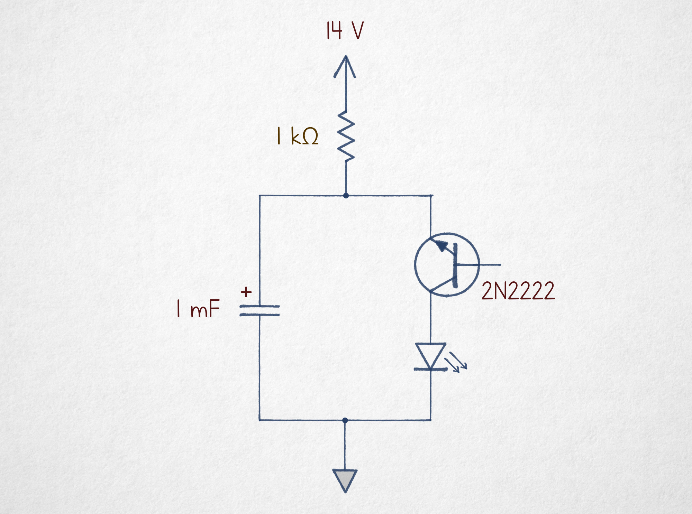
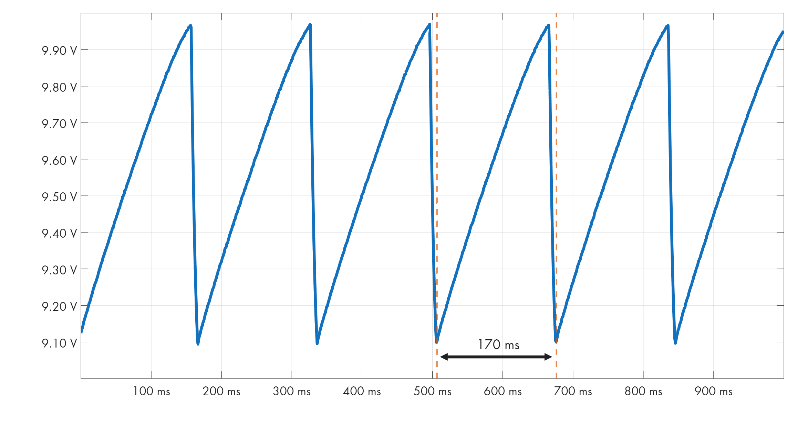
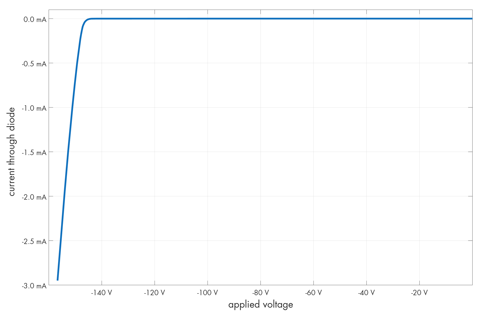
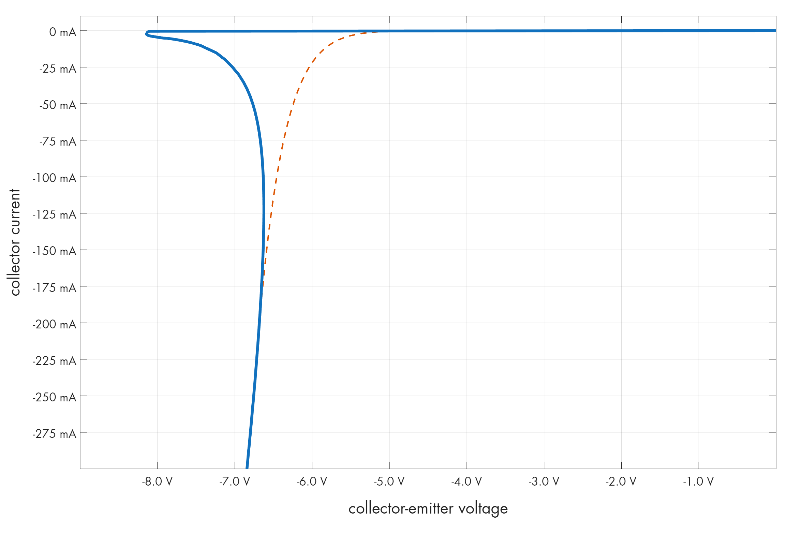

# 诅咒电路 #6：反向雪崩振荡器 (Cursed Circuits #6: Reverse Avalanche Oscillator)

### 文章背景与核心概要
本文是《诅咒电路》系列的第六期，探索了一个极其离奇的振荡器电路：使用一个基极悬空的倒置 NPN 三极管实现 LED 闪烁。该电路打破了常规电路设计逻辑，利用高浓度掺杂半导体结的反向雪崩击穿与负微分电阻特性，展示了教科书中鲜少提及的三极管隐藏物理特性。

---

## 引言 (Introduction)

去年，我发表了一篇题为《构建振荡器真难》的文章。

> Last year, I published an article titled *“It’s hard to build an oscillator.”*

文章标题暗示了一个事实：尽管互联网上不乏各种振荡器电路，但许多电路使用了罕见的元件、需要怪异的电源电压，或者根本无法正常工作（如果能工作的话）。

> The title alluded to the fact that while there’s no shortage of oscillator circuits on the internet, many use unusual parts, require weird supply voltages, or barely function (if at all).

然而，有时“糟糕”也能升华为一种艺术。以下可能是你今天用手头现成元件所能组装出的最令人困惑的“糟糕振荡器”：

> However, sometimes *bad* rises to an art form. Here is probably the most puzzling bad oscillator you can assemble today with the parts you already have at hand:

  
*反向雪崩振荡器。其他小型 NPN 三极管也应该适用。*

>   
> *Reverse avalanche oscillator. Other small NPN transistors should also work.*

---

## 工作原理 (How It Works)

乍一看，这里没有任何东西符合常理：三极管倒置接入，且基极引脚完全悬空。然而电路确实能工作：接上 14–20 V 的电源，就能看到 LED 开始闪烁。

> At first glance, *nothing here makes sense*. The transistor is upside down, and its base terminal is completely disconnected. Yet, the circuit works: hook it to a 14–20 V power supply and watch the LED blink.

在电容两端接上示波器后，可以看到一个重复的循环：电容充电至约 10 V，然后迅速放电一路跌至 9.1 V：

> Connecting an oscilloscope across the capacitor reveals a repeating cycle: the capacitor charges up to about 10 V, then rapidly dumps its charge all the way down to 9.1 V:

  
*14V 电源下的电容充电状态（5.8 Hz 振荡）。作者供图。*

>   
> *Capacitor charge state with a 14 V supply (5.8 Hz oscillation). By author.*

显而易见，电容是通过 1 kΩ 电阻从电源正极充电的，而电能则通过倒置的 NPN 三极管释放到了 LED 中。但为什么会这样？

> It is clear that the capacitor charges via the 1 kΩ resistor from the positive supply rail, and that energy is dumped into the LED through the upside-down NPN transistor. But why?

---

## 半导体结与击穿 (Semiconductor Junctions & Breakdown)

普通二极管由两种不同类型的半导体材料形成 *p-n* 结组成，并在它们的交界处创建一个不导电的**耗尽层**。

> A conventional diode consists of a *p-n* junction formed from two distinct types of semiconducting materials, creating a non-conductive **depletion layer** at their boundary.

* **正向偏置：** 给 *p* 区施加微弱的正电压会破坏耗尽层，允许载流子穿过。
* **反向偏置：** 耗尽层保持不可通行状态。但是，如果施加的反向电压足够高，静电场会猛烈加速载流子，使其通过**雪崩效应**将电子撞击到导带中，从而使结再次导电：

> * **Forward bias:** A small positive voltage applied to the *p*-side disrupts the depletion layer, allowing charge carriers to cross.
> * **Reverse bias:** The depletion region remains impassable. However, if the applied reverse voltage is high enough, the electrostatic field accelerates charges violently enough to knock electrons into the conduction band via an **avalanche effect**, making the junction conductive again:

  
*1N4148 二极管中的击穿。作者供图。*

>   
> *Breakdown in a 1N4148 diode. By author.*

NPN 三极管本质上是一个 *n-p-n* 结构，类似于两个首尾相连的二极管。无论如何放置，总有一个二极管处于反向偏置状态。

> An NPN transistor is essentially an *n-p-n* structure resembling two conjoined diodes. No matter how it is oriented, one diode is always reverse-biased.

正常放置（集电极接正极）时，2N2222 三极管的击穿电压约为 50 V。但是颠倒过来后，发射极-集电极的阈值电压会跌至仅 8 V 出头。发生这种情况是因为发射极区域掺杂浓度更高（$n^{++}$），形成了更薄、更容易被破坏的耗尽层。

> When oriented normally (collector positive), the breakdown voltage for a 2N2222 transistor is around 50 V. But flipped upside down, the emitter-collector threshold drops to just over 8 V. This occurs because the emitter area is more heavily doped ($n^{++}$), forming a thinner depletion region that is much easier to disrupt.

---

## 秘密所在：V-I 伏安特性曲线 (The Secret: The V-I Curve)

普通的反偏二极管本身不会发生振荡，因为它最终会达到充电电流等于放电电流的稳定平衡点。

> An ordinary reverse-biased diode still won't oscillate on its own, because it will eventually find a stable equilibrium where the charging current equals the discharging current.

该电路之所以能工作，是因为基极悬空的反偏 NPN 三极管具有独特的 V-I（伏安）特性：

> This circuit works because of the unique V-I characteristics of a reverse-biased NPN transistor with a floating base:

  
*2N2222 在 $I_B = 0$ 时的 V-I 曲线。虚线为普通二极管的预估曲线。*

>   
> *V-I plot for 2N2222 at $I_B = 0$. Dashed line: what we’d expect of a diode.*

1. $n^{++}-p-n$ 结构在电压达到约 8.2 V 之前保持不导通状态。
2. 一旦越过这个“驼峰”，导通道就会动态开启。在 5 mA 时需要约 8 V，但在 25 mA 时仅需要 7 V。

> 1. The $n^{++}-p-n$ structure remains non-conductive until roughly 8.2 V.
> 2. Once this "hump" is cleared, the conduction path opens up dynamically. At 5 mA we need ~8 V, but at 25 mA we only need 7 V.

这条曲线彻底排除了建立稳定平衡的可能性。电容不断充电直至触及驼峰；微弱的放电电流随后开启，但电阻提供的电流（约 6 mA）推动其越过了临界点。这迫使电容进入曲线的垂直下降部分，电流在此剧增。

> This curve completely rules out a stable equilibrium. The capacitor charges until it hits the hump; a small discharge current then begins, but the resistor (~6 mA supply) pushes past it. This forces the capacitor onto the vertical portion of the curve where current skyrockets.

最终，电容电压降得太低而无法维持电流——并且由于曲线呈负斜率率，更低的电压更无法维持较小的电流。三极管急剧截止，循环重新开始。

> Eventually, the capacitor voltage drops too low to sustain the current—and because of the negative slope of the curve, that lower voltage is *even less able* to sustain smaller currents. The transistor cuts off sharply, and the cycle repeats.

老一辈电子爱好者可能会发现这种行为模仿了**霓虹灯管（氖灯）**：需要较高的击穿电压来电离气体，但一旦点亮只需要较低的电压来维持。

> Old-timers might recognize that this behavior mimics a **neon lamp**, which requires a higher striking voltage to ionize gas, but a much lower voltage to maintain it once lit.

---

## 结论 (Conclusion)

澄清一点：**这个振荡器在各个维度上都很糟糕！** 它需要高电源电压、效率极低、需要大容量电容，且占空比和频率稳定性极差。

> To be clear: **everything about this oscillator is terrible!** It requires a high supply voltage, suffers from poor efficiency, demands a beefy capacitor, and exhibits abysmal duty cycle and frequency stability.

然而，它是一个绝佳的提醒：半导体是复杂的物理器件，它们利用了教科书中极少展示的 V-I 曲线特性。

> However, it serves as a brilliant reminder that semiconductors are complex beasts, utilizing parts of the V-I curve that textbooks rarely show.

---

*我撰写关于电子学、[数学基础](https://lcamtuf.substack.com/p/monkeys-typewriters-and-busy-beavers)、[技术史](https://lcamtuf.substack.com/p/a-brief-history-of-counting-stuff)以及其他极客感兴趣主题的文章。如果你喜欢本文，请考虑[订阅](https://lcamtuf.substack.com/subscribe?)。*

> *I write about electronics, [the foundations of mathematics](https://lcamtuf.substack.com/p/monkeys-typewriters-and-busy-beavers), [the history of technology](https://lcamtuf.substack.com/p/a-brief-history-of-counting-stuff), and other geek interests. If you enjoyed this, please [subscribe](https://lcamtuf.substack.com/subscribe?).*
