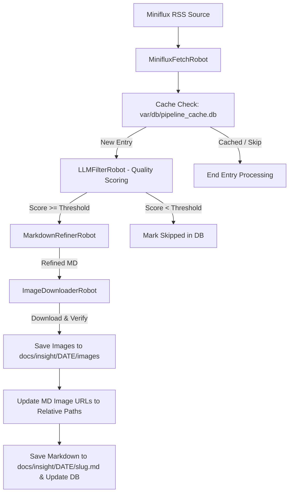

# AI Insight Pipeline & Zensical Site Generator Design Spec

## Overview
The AI Insight Pipeline automatically fetches AI document translations from a Miniflux RSS source, evaluates document quality using an LLM API, refines qualified content into clean Markdown, downloads remote images into a localized path, and updates image references. A SQLite cache stored in `var/db/` guarantees idempotency and incremental processing.

---

## System Architecture & Data Flow



---

## Directory Structure

```text
.
├── .env                              # Credentials for Miniflux & LLM API
├── etc/
│   └── ai_insight_pipeline.yaml      # Pipeline configuration file
├── var/
│   └── db/
│       └── pipeline_cache.db         # SQLite cache database
├── docs/
│   └── insight/
│       └── YYYY-MM-DD/               # Date-partitioned output folder
│           ├── article-slug-1.md
│           └── images/               # Localized image files
│               ├── hash_01.png
│               └── hash_02.jpg
└── src/
    ├── main.py                       # Pipeline runner CLI
    ├── db.py                         # SQLite cache initialization & helper functions
    ├── config.py                     # .env & YAML loader
    └── robots/                       # Pipeline steps
        ├── miniflux_robot.py         # Miniflux fetcher
        ├── llm_filter_robot.py       # Quality evaluator via LLM
        ├── markdown_refiner_robot.py # LLM MD formatting & polishing
        └── image_downloader_robot.py # Image download & link localizer
```

---

## SQLite Database Schema (`var/db/pipeline_cache.db`)

```sql
CREATE TABLE IF NOT EXISTS processed_entries (
    entry_id TEXT PRIMARY KEY,
    title TEXT,
    url TEXT,
    published_at TEXT,
    score REAL,
    status TEXT, -- 'skipped', 'processed', 'failed'
    output_path TEXT,
    created_at TIMESTAMP DEFAULT CURRENT_TIMESTAMP,
    updated_at TIMESTAMP DEFAULT CURRENT_TIMESTAMP
);

CREATE TABLE IF NOT EXISTS downloaded_images (
    original_url TEXT PRIMARY KEY,
    local_path TEXT,
    sha256 TEXT,
    created_at TIMESTAMP DEFAULT CURRENT_TIMESTAMP
);
```

---

## Components & Modules

### 1. Configuration & Credentials (`src/config.py`)
- Reads `.env` for:
  - `MINIFLUX_URL`, `MINIFLUX_USERNAME`, `MINIFLUX_PASSWORD`
  - `LLM_API_BASE`, `LLM_API_KEY`, `LLM_MODEL`
- Loads `etc/ai_insight_pipeline.yaml`.

### 2. Miniflux Fetch Robot (`src/robots/miniflux_robot.py`)
- Queries Miniflux API for unread/recent entries over the specified time range (`days`).
- Filters out entries already marked as `processed` or `skipped` in `var/db/pipeline_cache.db`.

### 3. LLM Filter Robot (`src/robots/llm_filter_robot.py`)
- Prompts LLM to rate article relevance, insight depth, and translation quality on a 0–100 scale.
- Entries with `score >= min_score` move to refinement; others are stored as `skipped`.

### 4. Markdown Refiner Robot (`src/robots/markdown_refiner_robot.py`)
- Uses LLM API to format and refine raw content into clean, elegant Markdown.
- Adds YAML frontmatter metadata (title, date, original_url, tags).

### 5. Image Downloader & Localizer Robot (`src/robots/image_downloader_robot.py`)
- Parses Markdown for both `` and ``.
- Downloads remote images to `docs/insight/YYYY-MM-DD/images/`.
- Verifies image integrity and assigns hash-based filenames.
- Replaces remote URLs with relative local paths `./images/<filename>`.
- Saves the final Markdown to `docs/insight/YYYY-MM-DD/<slug>.md`.

---

## Verification & Testing Plan

1. **DB Verification**: Check that `var/db/pipeline_cache.db` is correctly initialized.
2. **Miniflux Integration Test**: Validate login & fetch functionality from Miniflux RSS.
3. **LLM Filter Test**: Verify prompt execution and score output parsing.
4. **Image Localizer Test**: Test regex parsing, image downloading, URL replacement, and path verification.
5. **End-to-End Test**: Run pipeline and confirm `docs/insight/YYYY-MM-DD/` output.
