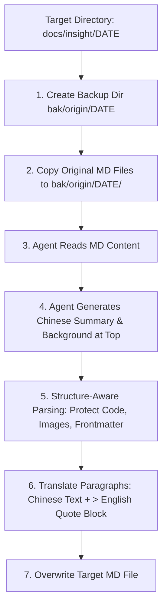

# Tech Article Translator Skill Design Spec

## Overview
The `tech-article-translator` skill guides an Agent to translate Markdown technology articles from English into crisp, accurate Chinese. The translation is conducted directly by the Agent (without external script LLM calls). Output includes a Chinese summary at the top, followed by paragraph-by-paragraph Chinese text with the original English text in quote blocks (`>`). Non-text elements like code blocks, images, and frontmatter are preserved cleanly.

---

## Directory Structure

```text
.
├── bak/
│   └── origin/
│       └── YYYY-MM-DD/             # Backup directory for original English articles
│           └── article-slug-1.md
├── docs/
│   └── insight/
│       └── YYYY-MM-DD/             # Target directory containing updated translations
│           └── article-slug-1.md
└── skills/
    └── tech-article-translator/
        └── SKILL.md                # Skill specification and workflow guide for Agent
```

---

## Workflow & Steps



### Step 1: Backup Original Files
- Ensure `bak/origin/YYYY-MM-DD/` exists.
- Copy all target `.md` files to `bak/origin/YYYY-MM-DD/` before editing.

### Step 2: Content Parsing & Structure Preservation
- Preserve YAML Frontmatter (if present).
- Keep Markdown code blocks (```` ``` ````), inline code, and images (``) untouched (no quote block wrapping).

### Step 3: Chinese Summary & Background
- Add a Chinese summary section right below the article title:
  ```markdown
  ### 文章背景与核心概要
  [3-5 句简洁明快的中文总结，概述文章的背景、核心观点和关键结论。]

  ---
  ```

### Step 4: Paragraph Translation & Quote Block Pairing
- For each text paragraph, produce:
  ```markdown
  [简洁明快准确的中文翻译]

  > [英文原文段落]
  ```

### Step 5: File Replacement & Verification
- Overwrite the original file in `docs/insight/YYYY-MM-DD/`.
- Verify file integrity and formatting.

---

## Verification & Testing Plan

1. **Skill File Verification**: Ensure `skills/tech-article-translator/SKILL.md` passes frontmatter and formatting checks.
2. **Backup Verification**: Test file backup to `bak/origin/YYYY-MM-DD/`.
3. **Format Verification**: Test Agent translation output to guarantee `>` quote block pairing, top summary, and intact code blocks.
