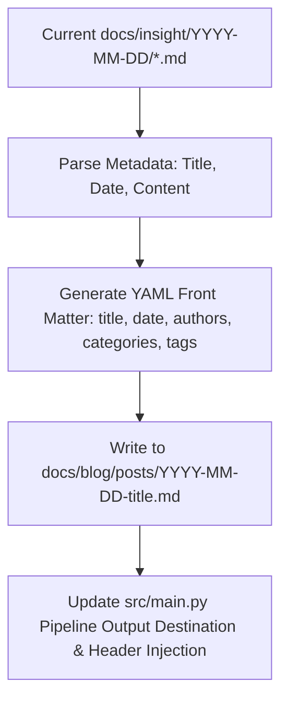

# MkDocs/Zensical Site Restructuring Design Spec

## Overview
Restructure the project to build a static technical blog site powered by Zensical / MkDocs Material for GitHub Pages deployment. 
All translated insight articles will be migrated to `docs/blog/posts/`, enriched with YAML Front Matter metadata (`title`, `date`, `authors`, `categories`, `tags`) to support category and tag cloud parsing. The main execution pipeline (`src/main.py`) will also be updated to generate future articles in this standardized format.

---

## Directory Structure

```text
ATBInsight/
├── mkdocs.yml (or zensical.toml)   # Site configuration
├── docs/
│   ├── index.md                    # Homepage
│   └── blog/
│       └── posts/                  # Dynamic blog posts directory
│           ├── 2026-08-04-累积和的渐近估计.md
│           ├── 2026-08-04-金属比例的比率.md
│           └── images/             # Localized image assets
```

---

## YAML Front Matter Format

Every article in `docs/blog/posts/` must begin with standard YAML Front Matter:

```yaml
---
title: 累积和的渐近估计
date: 2026-08-04
authors:
  - aitoboxrobot
categories:
  - 技术研报
tags:
  - 渐近分析
  - 算法
  - 数值计算
---
```

Followed immediately by the Markdown article body.

---

## Migration & Pipeline Workflow



### 1. File Migration Script
- Move images from `docs/insight/2026-08-04/images/` to `docs/blog/posts/images/`.
- Read each article from `docs/insight/2026-08-04/*.md`.
- Extract/derive title, categories, tags based on content.
- Prepend YAML Front Matter header.
- Save to `docs/blog/posts/2026-08-04-<title>.md`.
- Clean up old `docs/insight/` folder.

### 2. Main Pipeline Update (`src/main.py`)
- Update output path calculation to `docs/blog/posts/YYYY-MM-DD-<title>.md`.
- Inject YAML Front Matter header automatically upon scoring and processing.

### 3. Zensical/MkDocs Config (`mkdocs.yml`)
- Enable `blog` plugin.
- Configure site title, repository URL, theme (`material`), and Markdown extensions for math (`pymdownx.arithmatex`), code highlighting, and callouts.

---

## Verification Plan

1. **Front Matter Verification**: Check migrated `.md` files to ensure valid YAML Front Matter block syntax.
2. **Build Verification**: Run `mkdocs build` to ensure zero compilation errors and verify blog/tags generation.
3. **Pipeline Verification**: Execute unit tests (`pytest`) to confirm pipeline compatibility.
